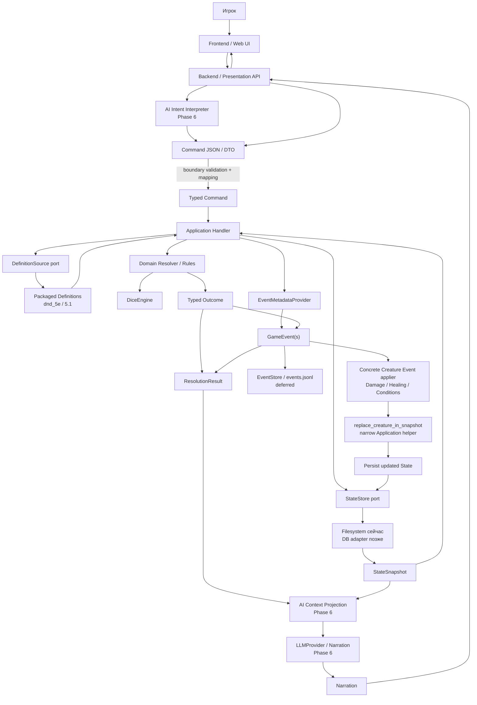
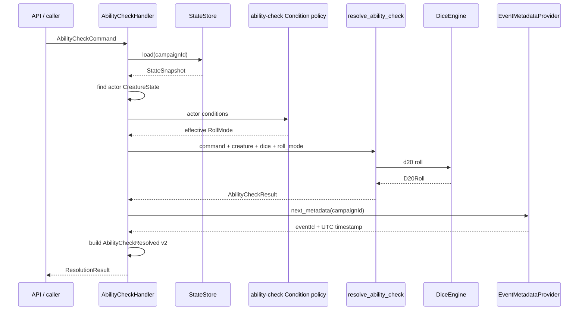
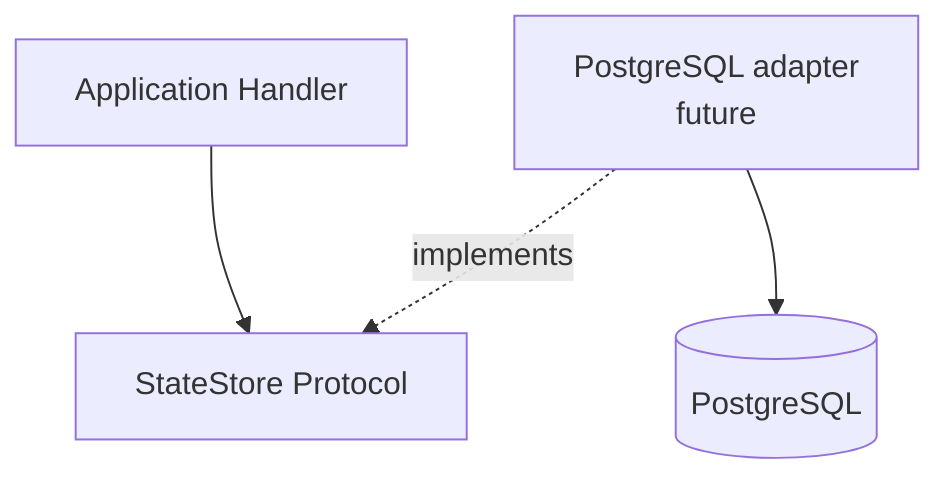

# AI D&D Master — текущая схема потока данных

> Состояние сверено с каноническим закрытием Phase 2 в foundation scope;
> текущая фаза Roadmap — Phase 3 Combat.
>
> Канонический источник контрактов проекта: `docs/ARCHITECTURE.md`.

## 1. Главное изменение относительно первоначальной идеи

Изначальную схему можно кратко представить так:

```text
Игрок
  ↓
AI
  ↓
Backend
  ↓
Database
  ↓
JSON → Engine → JSON
  ↓
Backend → Database
  ↓
AI → художественное описание
```

Общая идея сохранилась, но границы ответственности стали строже.

**Текущая архитектура не рассматривает Engine как функцию, которая получает произвольный JSON-файл состояния, изменяет его и возвращает новый JSON.** JSON теперь является форматом на внешних границах и в persistence, а внутри Engine используются типизированные Python-объекты: `Command`, `State`, `Definition`, `GameEvent`, `ResolutionResult`.

Канонический поток теперь такой:

```text
Player / AI DM
    ↓
Command
    ↓
Validation
    ↓
Application Handler
    ↓
Rule Engine / Resolver
    ↓
Result
    ↓
Events
    ↓
State Owner применяет изменения
    ↓
Persistence
    ↓
AI Context Projection
    ↓
AI Narration
```

Ключевые правила:

- **AI интерпретирует намерение и пишет повествование, но не изменяет authoritative State.**
- **Backend/API не содержит D&D-правил и не меняет State напрямую.**
- **Application Layer оркестрирует use case.**
- **Domain Rule Engine определяет, что по правилам произошло.**
- **StateStore и другие storage adapters скрывают способ хранения данных от Domain.**
- **Definitions и State — разные типы данных и имеют разный жизненный цикл.**
- **Command — намерение. Event — уже произошедший факт.**
- **Вся игровая случайность проходит через `DiceEngine`.**

---

## 2. Целевая end-to-end схема



### Что здесь важно

`Backend` остаётся важным системным слоем, но он не является владельцем D&D-логики. Он отвечает за HTTP/WebSocket, authentication, DTO, подключение зависимостей, передачу команды в Application Layer и возврат результата клиенту.

`Application Handler` является оркестратором конкретного игрового действия. Уже существующие handlers сами загружают нужный `StateSnapshot` через `StateStore`, находят нужные сущности, вызывают Domain resolver и собирают `ResolutionResult`.

Read-only handlers на этом заканчиваются. `DamageHandler`, `HealingHandler`,
`ApplyConditionHandler` и `RemoveConditionHandler` дополнительно применяют
свой concrete V1 Event к `CreatureState`. Полученный replacement Creature
передаётся в узкий Application helper
`replace_creature_in_snapshot(snapshot, replacement)`, который возвращает
replacement `StateSnapshot`; затем handler вызывает `StateStore.save()` ровно
один раз на successful path. Helper не является gameplay resolver, Event
applier, State Owner, persistence layer или generic reducer. Durable
EventStore/replay в текущем пути отсутствуют.

Поэтому более точная формулировка будущей интеграции с БД:

```text
не:
Backend читает запись из БД → формирует произвольный JSON → Engine мутирует JSON

а:
Application Handler → StateStore interface → DB adapter → typed StateSnapshot
```

И аналогично при сохранении:

```text
Events → State Owner / projection → updated StateSnapshot → StateStore.save(...)
```

Конкретный `StateStore` может быть файловым, SQLite или PostgreSQL. Domain-правила от этого не меняются.

---

## 3. Кто за что отвечает

| Компонент | Ответственность | Вход | Выход | Может менять authoritative State? |
| --- | --- | --- | --- | --- |
| Frontend | UI, ввод игрока, отображение состояния и narration | действия пользователя, API/WS updates | запросы backend | Нет |
| Backend / Presentation | HTTP, WebSocket, auth, DTO, boundary validation, composition | запрос клиента / structured AI output | typed Command / serialized response | Нет напрямую |
| AI Intent Interpreter | перевод естественного языка в структурированное намерение | сообщение игрока + разрешённый AI context | Command candidate | Нет |
| Application Handler | оркестрация конкретного use case | typed Command + injected ports | `ResolutionResult` | Только через канонический Engine/Event flow |
| Domain Resolver | правила D&D и расчёт результата | typed Command + Domain State/Definitions + ports вроде DiceEngine | typed outcome | Не сохраняет State самостоятельно |
| DiceEngine | контролируемая игровая случайность | dice expression | `DiceRoll` / d20 result | Нет |
| DefinitionSource | доступ к immutable ruleset definitions | ruleset + definition ID + expected type | typed Definition | Нет |
| StateStore | persistence boundary для snapshot | campaign ID / `StateSnapshot` | `StateSnapshot` / сохранение | Хранит результат, но не принимает rule decisions |
| GameEvent | immutable факт произошедшего | outcome + metadata | Event envelope | Сам ничего не мутирует |
| State Owner / projection | единственное разрешённое применение Event к принадлежащему State | Event + current State | new/updated State | Да |
| EventStore (deferred) | durable ordered history | Event | persisted Event stream | Нет; только хранение истории |
| ResolutionResult | результат обработки одной Command | outcome + events/errors | объект результата | Нет |
| AI Context Projection | формирует минимальный контекст для AI | Result / Events / разрешённый State | AI context | Нет |
| LLMProvider | intent interpretation / NPC behavior / narration | AI request/context | structured output или narration | Нет |

---

## 4. Основные сущности данных

### 4.1. Definition — неизменяемое правило или шаблон

Definition описывает правило/контент, а не конкретный экземпляр в кампании.

Уже есть реальные packaged Definitions:

```text
src/dnd_engine/resources/rulesets/dnd_5e/5.1/definitions/
├── dagger.json
└── goblin.json
```

Реальный `dagger.json`:

```json
{
  "type": "weapon",
  "id": "dagger",
  "version": 1,
  "name": "Dagger",
  "damageDice": "1d4",
  "damageType": "piercing",
  "properties": ["finesse", "light", "thrown"]
}
```

Реальный `goblin.json`:

```json
{
  "type": "monster",
  "id": "goblin",
  "version": 1,
  "name": "Goblin",
  "abilityScores": {
    "strength": 8,
    "dexterity": 14,
    "constitution": 10,
    "intelligence": 10,
    "wisdom": 8,
    "charisma": 8
  },
  "armorClass": 15
}
```

Доступ идёт через port:

```text
src/dnd_engine/domain/services/definitions.py
    DefinitionSource
        ↓
src/dnd_engine/infrastructure/definitions/packaged.py
    packaged Definition adapter
        ↓
src/dnd_engine/resources/rulesets/...
```

### Важное следствие для будущей БД

Core ruleset Definitions сейчас имеют **одну authoritative packaged-копию внутри Engine package**. БД сайта не должна становиться второй независимой authoritative копией `goblin`, `dagger` и других правил без отдельного архитектурного решения.

---

### 4.2. State — изменяемое состояние конкретной кампании

Сейчас реализованы:

```text
src/dnd_engine/domain/state/
├── campaign.py      → CampaignState
├── creature.py      → CreatureState
├── character.py     → CharacterState
└── snapshot.py      → StateSnapshot
```

`StateSnapshot` группирует несколько State-проекций для persistence, но не является новым gameplay owner.

Текущий JSON snapshot использует `schemaVersion: 5` (V5 добавляет top-level `combat`, §3.25).

Пример:

```json
{
  "schemaVersion": 5,
  "campaignId": "campaign_001",
  "state": {
    "campaign": {
      "id": "campaign_001",
      "rulesetId": "dnd_5e",
      "rulesetVersion": "5.1"
    },
    "creatures": [
      {
        "id": "monster_001",
        "definitionId": "goblin",
        "abilityScores": {
          "strength": 8,
          "dexterity": 14,
          "constitution": 10,
          "intelligence": 10,
          "wisdom": 8,
          "charisma": 8
        },
        "currentHp": 7,
        "maxHp": 7,
        "conditions": []
      }
    ],
    "characters": [],
    "combat": null
  }
}
```

Связь Definition и State выглядит так:

```text
goblin                         monster_001
Definition                     CreatureState
────────────                    ─────────────
id = "goblin"                  id = "monster_001"
armor_class = 15               definition_id = "goblin"
ability_scores = baseline      current_hp = 7
                               max_hp = 7
```

То есть `goblin` — описание типа существа, а `monster_001` — конкретный экземпляр в конкретной кампании.

---

### 4.3. Command — намерение совершить действие

Внешний Command имеет канонический envelope:

```json
{
  "commandId": "command_000001",
  "type": "AbilityCheckCommand",
  "campaignId": "campaign_001",
  "actorId": "monster_001",
  "payload": {
    "ability": "dexterity",
    "dc": 15
  }
}
```

На boundary этот JSON должен быть провалидирован и преобразован в concrete typed immutable Command:

```text
JSON / DTO
   ↓
validation + mapping
   ↓
AbilityCheckCommand
   ├── command_id
   ├── campaign_id
   ├── actor_id
   └── AbilityCheckPayload
       ├── ability: Ability
       └── dc: int
```

Текущие concrete Commands:

```text
src/dnd_engine/domain/commands/
├── ability_check.py
├── saving_throw.py
├── skill_check.py
├── attack.py
├── damage.py
├── healing.py
├── apply_condition.py
└── remove_condition.py
```

Command **не означает успех действия**. Он только выражает запрос выполнить действие по правилам.

---

### 4.4. Typed Outcome — непосредственный расчёт Rule Engine

Например, `resolve_ability_check(...)` возвращает `AbilityCheckResult`:

```text
AbilityCheckResult
├── ability
├── dc
├── roll: D20Roll
├── modifier
├── total
└── succeeded
```

Это ещё не Event и не State.

Resolver вычисляет:

```text
ability score
    ↓
ability modifier
    ↓
d20 roll through DiceEngine
    ↓
total = selected roll + modifier
    ↓
succeeded = total >= DC
```

---

### 4.5. Event — неизменяемый факт

Текущий generic тип:

```text
src/dnd_engine/domain/events/game_event.py
    GameEvent
```

Event envelope:

```json
{
  "eventId": "event_000124",
  "commandId": "command_000001",
  "type": "AbilityCheckResolved",
  "version": 2,
  "campaignId": "campaign_001",
  "timestamp": "2026-08-27T15:00:00Z",
  "actorId": "monster_001",
  "causedBy": null,
  "payload": {
    "ability": "dexterity",
    "dc": 15,
    "roll": {
      "mode": "normal",
      "rolls": [17],
      "selected": 17
    },
    "modifier": 2,
    "total": 19,
    "succeeded": true
  }
}
```

Event получает `eventId` и `timestamp` не от Domain resolver, а через injected `EventMetadataProvider`.

Serialization:

```text
GameEvent
   ↓
EventSerializer
   ↓
canonical JSON Event envelope
```

Файл:

```text
src/dnd_engine/infrastructure/persistence/json/event_serializer.py
```

Текущие gameplay Event types включают read-only
`AbilityCheckResolved` V2, `SavingThrowResolved` V1, `SkillCheckResolved` V1,
`AttackResolved` V1 и mutating `DamageApplied` V1 / `HealingApplied` V1 /
`ConditionApplied` V1 / `ConditionRemoved` V1.
Generic serializer умеет преобразовать `GameEvent` в JSON и обратно,
но runtime EventStore отсутствует, поэтому эти Events не
записываются в durable history.

---

### 4.6. ResolutionResult — результат обработки Command

`ResolutionResult[T]` объединяет:

```text
success
command_id
outcome
Events
Errors
```

Концептуально:

```text
ResolutionResult[AbilityCheckResult]
├── success = True
├── command_id = "command_000001"
├── outcome = AbilityCheckResult(... succeeded=True)
├── events = (AbilityCheckResolved,)
└── errors = ()
```

`success=True` означает, что Engine успешно обработал Command. Это **не то же самое**, что `outcome.succeeded=True`.

Например, персонаж может провалить проверку:

```text
ResolutionResult.success = True
AbilityCheckResult.succeeded = False
```

Это нормальный игровой результат, а не ошибка системы.

---

## 5. Реальный текущий поток Ability Check

Это уже работающий пример того, как будет выглядеть общий pipeline.



Конкретные файлы:

```text
src/dnd_engine/domain/commands/ability_check.py
    AbilityCheckCommand
    AbilityCheckPayload

src/dnd_engine/application/handlers/ability_check.py
    AbilityCheckHandler

src/dnd_engine/domain/rules/ability_check.py
    resolve_ability_check(...)
    AbilityCheckResult

src/dnd_engine/domain/rules/ability.py
    ability_modifier(...)

src/dnd_engine/domain/rules/d20.py
    resolve_d20_roll(...)

src/dnd_engine/domain/rules/condition_roll_mode.py
    ability_check_roll_mode_from_conditions(...)

src/dnd_engine/domain/services/dice.py
    DiceEngine Protocol

src/dnd_engine/infrastructure/random/dice.py
    PythonDiceEngine

src/dnd_engine/application/services/event_metadata.py
    EventMetadataProvider

src/dnd_engine/domain/events/ability_check.py
    build_ability_check_resolved_v2(...)

src/dnd_engine/domain/events/game_event.py
    GameEvent

src/dnd_engine/domain/resolution.py
    ResolutionResult
```

### Почему здесь нет сохранения State

Ability Check сейчас read-only. Она создаёт Event о результате проверки, но не изменяет HP, позицию, inventory и т. п.

Поэтому текущий handler:

```text
StateStore.load(...)
    ✓

StateStore.save(...)
    ✗ не нужен
```

Это намеренно.

---

## 6. Текущий state-mutating поток

Четыре concrete mutation handlers уже реализованы:

```mermaid
flowchart LR
    C["ApplyDamageCommand / ApplyHealingCommand /<br/>ApplyConditionCommand / RemoveConditionCommand"]
    H["DamageHandler / HealingHandler /<br/>ApplyConditionHandler / RemoveConditionHandler"]
    S["StateStore.load"]
    R["Concrete Domain resolver"]
    E["DamageApplied / HealingApplied /<br/>ConditionApplied / ConditionRemoved V1"]
    P["Concrete CreatureState<br/>Event applier"]
    RP["replacement CreatureState"]
    SH["replace_creature_in_snapshot<br/>(snapshot, replacement)"]
    RS["Replacement StateSnapshot"]
    SS["StateStore.save"]
    RR["Successful ResolutionResult"]

    C --> H
    H --> S
    S --> R
    R --> E
    E --> P
    P --> RP
    RP --> SH
    SH --> RS
    RS --> SS
    SS --> RR
```



Damage вычитает уже разрешённый amount и ограничивает
`current_hp` нулём. Healing добавляет уже разрешённый amount и
ограничивает его authoritative `max_hp`. Оба resolver'а остаются
pure, а concrete Event applier проецирует уже рассчитанный `newHp`
без повтора gameplay-формулы. Apply/Remove Condition аналогично используют
свои pure resolvers и concrete appliers для authoritative
`CreatureState.conditions`. Каждый concrete applier возвращает replacement
`CreatureState` и не выполняет persistence.

Затем narrow Application helper
`replace_creature_in_snapshot(snapshot, replacement)` заменяет ровно одного
существующего Creature по stable ID, сохраняет порядок tuple и Campaign/
Character projections и возвращает replacement `StateSnapshot`, не мутируя
loaded snapshot. Helper не решает gameplay, не применяет Event, не является
State Owner/persistence layer и не выполняет generic dispatch/reduction.

При этом Rule resolver не делает:

```python
state.current_hp -= damage
```

напрямую из API или AI.

Authoritative mutation выполняет соответствующий State Owner при применении уже рассчитанных Events.

**Важно:** concrete deterministic Event → `CreatureState` projections
реализованы для Damage, Healing, Condition Apply и Condition Remove. Generic
Event dispatch/reducer, runtime EventStore, ordered append и replay остаются
deferred. Текущий
authoritative persisted representation — snapshot в `state.json`; returned Events
остаются in-memory Domain facts и не образуют durable history.

---

## 7. Где находится JSON в новой архитектуре

JSON не исчез. Он просто перестал быть внутренней моделью Engine.

### JSON используется на границах

```text
HTTP / WebSocket request
       ↓
JSON DTO
       ↓
validation
       ↓
typed Python Command
```

```text
typed GameEvent / StateSnapshot
       ↓
Serializer
       ↓
JSON / JSONL / database representation
```

### JSON не используется как Domain API

Нежелательно:

```text
resolve_attack(command_dict, state_dict, rules_dict) -> mutated_dict
```

Текущая модель:

```text
resolve_attack(
    typed_command,
    typed_state,
    typed_definitions,
    injected_ports,
) -> typed_outcome
```

Serialization находится за пределами rule resolution.

---

## 8. Persistence сейчас и в будущем

### Сейчас

Работает filesystem `StateStore`:

```text
src/dnd_engine/domain/services/state_store.py
    StateStore Protocol

src/dnd_engine/infrastructure/filesystem/state_store.py
    FilesystemStateStore

src/dnd_engine/infrastructure/persistence/json/state_serializer.py
    StateSerializer
```

Физическая схема:

```text
campaigns/
└── campaign_001/
    ├── state.json              # появляется при runtime save
    ├── events/
    │   └── events.jsonl        # scaffold; runtime EventStore ещё не реализован
    ├── characters/
    ├── encounters/
    ├── npcs/
    ├── quests/
    ├── world/
    └── ai/
```

`FilesystemStateStore` делает:

```text
load(campaign_id)
    ↓
read state.json
    ↓
json.loads
    ↓
StateSerializer.deserialize
    ↓
StateSnapshot
```

и:

```text
StateSnapshot
    ↓
StateSerializer.serialize
    ↓
json.dumps
    ↓
atomic replace state.json
```

`DamageHandler`, `HealingHandler`, `ApplyConditionHandler` и
`RemoveConditionHandler` используют этот `save()` ровно один раз на successful
path для replacement snapshot после concrete Event application и вызова
`replace_creature_in_snapshot(...)`. Поэтому `state.json` — текущее
authoritative persisted State. Созданные `DamageApplied`, `HealingApplied`,
`ConditionApplied` и `ConditionRemoved` возвращаются в `ResolutionResult`, но
не дописываются в `events/events.jsonl`.

### Позже

Вместо файловой реализации можно подключить:

```text
StateStore
   ↑
   ├── FilesystemStateStore   # сейчас
   ├── SQLiteStateStore       # позже
   └── PostgreSQLStateStore   # позже
```

Названия будущих concrete DB-классов здесь иллюстративные; каноническим является сам `StateStore` port, а не конкретное имя адаптера.

Главное свойство:

```text
замена JSON/filesystem на PostgreSQL

НЕ должна менять

Domain Commands / Rules / Events / State contracts
```

---

## 9. Как распределить работу между твоим Engine и backend друга

Первоначальное разделение обязанностей можно сохранить, но границу лучше провести так.

### Твоя зона — Engine

```text
Domain
├── Definitions
├── State contracts
├── Commands
├── Events
├── Rules / Resolvers
├── Dice semantics
└── Domain ports

Application
├── handlers
├── use-case orchestration
└── ResolutionResult assembly
```

То есть твой код отвечает на вопрос:

> **Что по правилам D&D должно произойти с этой Command?**

### Зона backend

```text
Presentation / API
├── FastAPI routes
├── WebSocket
├── authentication
├── request / response DTO
├── command boundary validation
└── dependency wiring

Infrastructure / persistence integration
├── connection to database
├── StateStore adapter
├── future EventStore adapter
└── transactions / operational concerns
```

Backend отвечает на вопрос:

> **Как принять запрос, кому его передать, как получить данные из infrastructure и как вернуть результат клиенту?**

Но backend **не должен** сам решать:

```text
попала ли атака
какой модификатор применить
сколько урона нанесено
можно ли использовать способность
какой новый currentHp установить
```

Это остаётся Engine responsibility.

### Зона AI

AI отвечает за:

```text
Natural language → candidate Command
NPC intent
narration
story generation
```

AI не отвечает за:

```text
authoritative dice result
rule legality
HP mutation
inventory mutation
combat state mutation
quest fact mutation
```

---

## 10. Как backend будет работать с БД без нарушения архитектуры

Вместо прямого знания БД внутри Domain используется dependency inversion.



Domain/Application знает только:

```python
class StateStore(Protocol):
    def load(self, campaign_id: str) -> StateSnapshot: ...
    def save(self, snapshot: StateSnapshot) -> None: ...
```

Concrete database adapter знает SQL/PostgreSQL.

Именно поэтому друг может заменить filesystem на БД, не переписывая правила D&D.

---

## 11. Где будет находиться AI

Архитектура уже резервирует:

```text
src/dnd_engine/infrastructure/llm/
```

но сейчас там только scaffold.

Целевой abstraction:

```text
AI Service
    ↓
LLMProvider
    ├── OpenAIProvider
    ├── AnthropicProvider
    ├── LocalProvider
    └── TestProvider
```

Engine не должен знать конкретного LLM provider.

Для narration предпочтительный поток:

```text
ResolutionResult
      +
relevant Events
      +
AI Context Projection of relevant State
      ↓
LLMProvider
      ↓
Narration
      ↓
WebSocket / HTTP response
      ↓
Player
```

То есть AI должен получать **подготовленный контекст**, а не иметь свободный доступ к БД или ко всему State.

`AI Context Projection` находится в Roadmap Phase 6 и пока не реализован.

---

## 12. Реальная структура проекта, связанная с потоком данных

```text
src/dnd_engine/
│
├── api/                                      # Presentation
│   └── __init__.py                           # пока scaffold
│
├── application/
│   ├── handlers/
│   │   ├── ability_check.py
│   │   ├── saving_throw.py
│   │   ├── skill_check.py
│   │   ├── attack.py
│   │   ├── damage.py
│   │   ├── healing.py
│   │   ├── apply_condition.py
│   │   └── remove_condition.py
│   └── services/
│       ├── event_metadata.py
│       └── state_snapshot.py                 # narrow replacement helper
│
├── domain/
│   ├── commands/
│   │   ├── ability_check.py
│   │   ├── saving_throw.py
│   │   ├── skill_check.py
│   │   ├── attack.py
│   │   ├── damage.py
│   │   ├── healing.py
│   │   ├── apply_condition.py
│   │   └── remove_condition.py
│   │
│   ├── definitions/
│   │   └── ... ItemDefinition / WeaponDefinition / MonsterDefinition
│   │
│   ├── state/
│   │   ├── campaign.py
│   │   ├── creature.py
│   │   ├── character.py
│   │   └── snapshot.py
│   │
│   ├── events/
│   │   ├── game_event.py
│   │   ├── ability_check.py
│   │   ├── saving_throw.py
│   │   ├── skill_check.py
│   │   ├── attack.py
│   │   ├── damage.py
│   │   ├── healing.py
│   │   ├── apply_condition.py
│   │   └── remove_condition.py
│   │
│   ├── rules/
│   │   ├── ability.py
│   │   ├── ability_check.py
│   │   ├── armor_class.py
│   │   ├── d20.py
│   │   ├── proficiency.py
│   │   ├── saving_throw.py
│   │   ├── skill_check.py
│   │   ├── attack.py
│   │   ├── damage.py
│   │   ├── healing.py
│   │   ├── apply_condition.py
│   │   ├── remove_condition.py
│   │   └── condition_roll_mode.py
│   │
│   ├── services/
│   │   ├── state_store.py                    # StateStore port
│   │   ├── definitions.py                    # DefinitionSource port
│   │   └── dice.py                           # DiceEngine port
│   │
│   ├── dice.py                               # shared NdM parser
│   └── resolution.py                         # ResolutionResult
│
├── infrastructure/
│   ├── filesystem/
│   │   └── state_store.py                    # FilesystemStateStore
│   │
│   ├── persistence/json/
│   │   ├── state_serializer.py
│   │   └── event_serializer.py
│   │
│   ├── definitions/
│   │   └── packaged.py                       # packaged Definition adapter
│   │
│   ├── random/
│   │   └── dice.py                           # PythonDiceEngine
│   │
│   └── llm/
│       └── __init__.py                       # пока scaffold
│
└── resources/rulesets/dnd_5e/5.1/
    └── definitions/
        ├── dagger.json
        └── goblin.json
```

---

## 13. Что уже реализовано, а что пока только спроектировано

| Часть потока | Текущий статус |
| --- | --- |
| Roadmap phase | Phase 2 Basic Rules complete (foundation scope); Phase 3 Combat current |
| `Definitions / State / Commands / Events` separation | Реализовано и канонизировано |
| `CampaignState`, `CreatureState`, `CharacterState`, `CombatState`, `StateSnapshot` | Реализовано |
| Filesystem `StateStore` | Реализовано |
| JSON State serialization (`schemaVersion: 5`) | Реализовано |
| `GameEvent` | Реализовано |
| Event JSON serializer | Реализовано |
| DiceEngine + Python RNG adapter | Реализовано |
| Packaged Definition loading | Реализовано |
| `goblin` / `dagger` packaged Definitions | Реализовано |
| Ability Check read-only flow | Реализовано |
| Saving Throw read-only flow | Реализовано в коде и Architecture |
| Skill Check read-only flow | Реализовано в коде и Architecture |
| AC minimal rules | Реализовано |
| Character unarmed Attack Roll → Monster read-only flow | Реализовано; Damage/HP не применяет |
| Monster attack (Goblin Scimitar) → Character read-only flow (G8) | Реализовано: `AttackHandler` Monster-actor branch → `resolve_monster_attack` → `MonsterAttackResolved` V1; Damage/HP не применяет |
| Direct Damage → HP mutation | Реализовано: `ApplyDamageCommand → DamageApplied` V1 → concrete applier → §3.23 snapshot helper → `StateStore.save()` |
| Direct Healing → HP mutation | Реализовано: `ApplyHealingCommand → HealingApplied` V1 → concrete applier → §3.23 snapshot helper → `StateStore.save()` |
| Apply/Remove Condition membership | Реализовано: concrete Commands/Events/appliers → §3.23 snapshot helper → `StateStore.save()` |
| Poisoned read-only behavior | Ability Check, Skill Check и Attack используют disadvantage; Saving Throw не затронут и остаётся NORMAL |
| Generic `GameEngine.execute(...)` | Намеренно не реализован |
| FastAPI routes / WebSocket | Не реализовано; Phase 7 |
| LLM provider integration | Не реализовано; Phase 6 |
| Natural language → Commands | Не реализовано; Phase 6 |
| AI Context Projection | Не реализовано; Phase 6 |
| Runtime EventStore / ordered Event append | Не реализовано |
| Deterministic Event → State projection | Concrete Damage, Healing, Condition Apply/Remove projections реализованы; generic dispatch/replay deferred |
| Authoritative state-mutating Command pipeline | Четыре concrete consumers реализованы по §3.18; общий только narrow §3.23 snapshot helper, generic mutation framework не введён |
| SQLite/PostgreSQL adapters | Не реализовано |

### Phase 2 closure status

`docs/ROADMAP.md` теперь использует scope-accurate completed foundation items:
implemented Proficiency, Character Saving Throw/Skill Check, HP,
Damage/Healing, and Condition foundations отмечены `[x]`, а не смешиваются с
полным D&D scope. Для каждого ещё неполного широкого mechanic явно указано
`broader scope PARTIAL` со ссылками на `P2-*` closure note и `DEF-*`
continuations в `docs/DEFERRED.md`.

По Architecture §3.24 такая связанная broader work не переоткрывает Phase 2.
Phase 2 Basic Rules завершена в foundation scope; текущая фаза — Phase 3
Combat. Event History & Replay остаётся trigger-driven cross-cutting track, а
не Phase 3 entry gate.

---

## 14. Сравнение старой и новой схемы

### Изначальная модель

```text
AI
 ↓
Backend
 ↓
DB
 ↓
JSON blob
 ↓
Engine
 ↓
modified JSON blob
 ↓
Backend
 ↓
DB
 ↓
AI
```

### Текущая модель

```text
Player / AI
    ↓
Command JSON at boundary
    ↓
Typed Command
    ↓
Application Handler
    ├── StateStore ───────→ StateSnapshot
    ├── DefinitionSource ─→ Definitions
    └── DiceEngine ───────→ controlled randomness
              ↓
        Domain Resolver
              ↓
         Typed Outcome
              ↓
           Events
              ↓
     State Owner / Projection
              ↓
          StateStore
              ↓
       filesystem / DB

ResolutionResult + relevant State/Events
              ↓
      AI Context Projection
              ↓
          LLMProvider
              ↓
          Narration
              ↓
            Player
```

Главное отличие:

> **JSON/БД — это transport и persistence. Commands/State/Definitions/Events — это контракты игрового ядра. Rule Engine работает с этими типизированными контрактами и остаётся независимым от конкретного backend, БД и LLM.**

---

## 15. Практическая граница интеграции с сайтом

Если frontend/backend будет писать другой разработчик, наиболее естественный контракт между его кодом и Engine выглядит так:

```text
Frontend
   ↓ HTTP / WebSocket
Backend Presentation
   ↓ validated Command
Application Handler from dnd_engine
   ↓
Domain Engine
```

Backend при запуске приложения собирает зависимости:

```text
StateStore implementation
DefinitionSource implementation
DiceEngine implementation
EventMetadataProvider implementation
future EventStore
future LLMProvider
```

и передаёт их Application handlers.

Таким образом сайт можно развивать независимо от правил, а Engine — тестировать полностью без frontend, HTTP, БД и LLM.

Если backend будет написан не на Python и Engine потребуется вынести в отдельный процесс, JSON Command/Event/State contracts позволяют позднее поставить API boundary перед Application Layer. Но отдельный Engine microservice сейчас не нужен и не является частью текущего Roadmap: на фундаментальном этапе проще и безопаснее использовать `dnd_engine` как Python package внутри backend/composition процесса.

---

## 16. Итоговая формула

```text
AI понимает, что хочет игрок.
        ↓
Command фиксирует намерение.
        ↓
Application загружает нужный State и Definitions.
        ↓
Domain Engine решает, что по правилам произошло.
        ↓
DiceEngine даёт контролируемую случайность.
        ↓
Events фиксируют факты.
        ↓
State Owners применяют факты к authoritative State.
        ↓
StateStore сохраняет authoritative snapshot; durable Event history deferred.
        ↓
AI получает только результат и разрешённый контекст.
        ↓
AI превращает уже установленный игровой факт в повествование.
```

Коротко:

> **Backend управляет транспортом и интеграцией. Application управляет use case. Domain Engine управляет правилами. State Owners управляют authoritative изменениями. Storage хранит. AI интерпретирует и рассказывает.**
