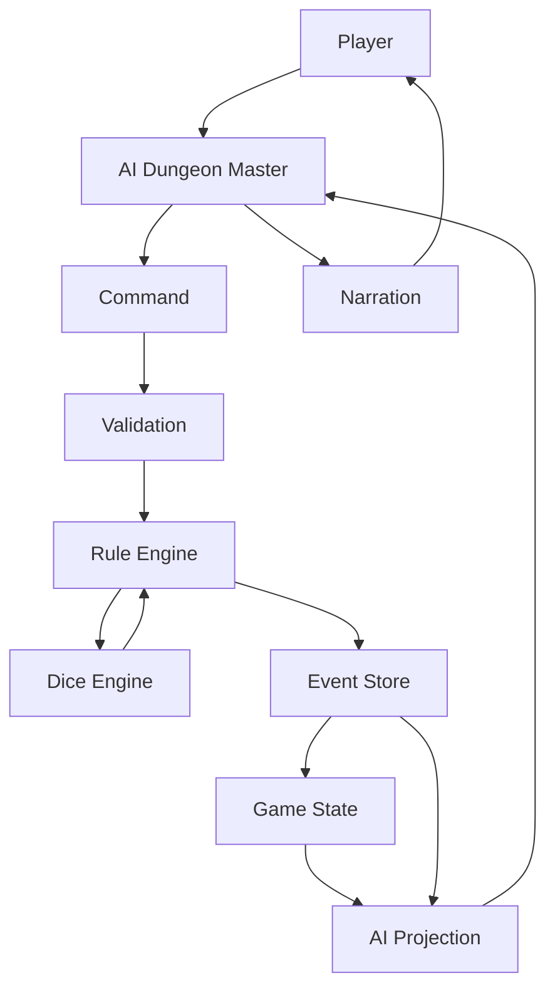
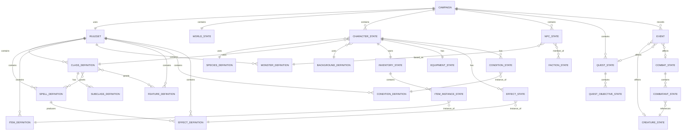
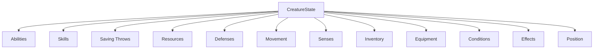
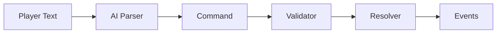
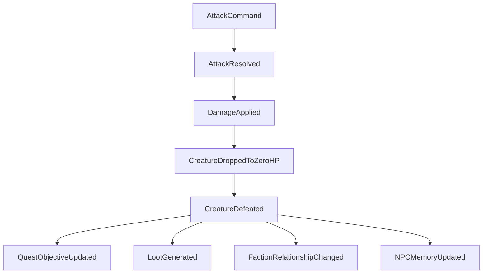
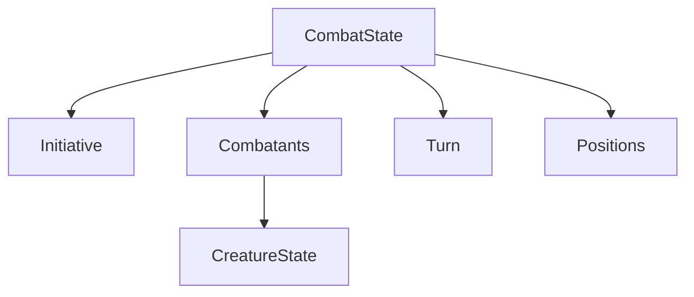
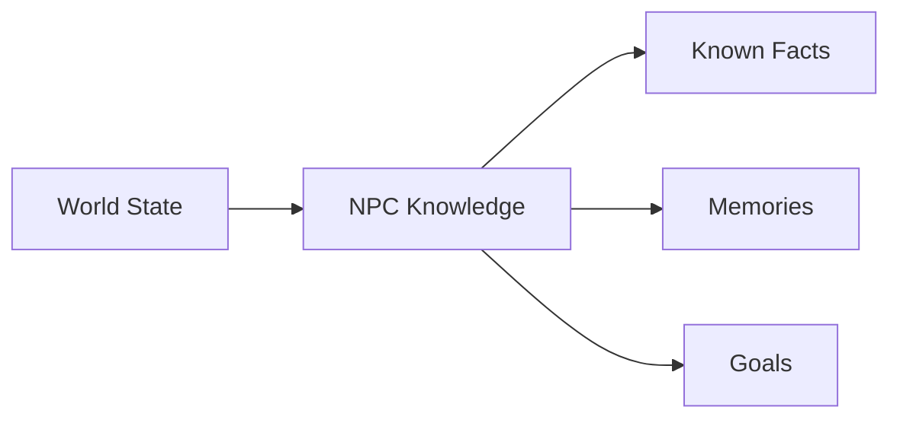
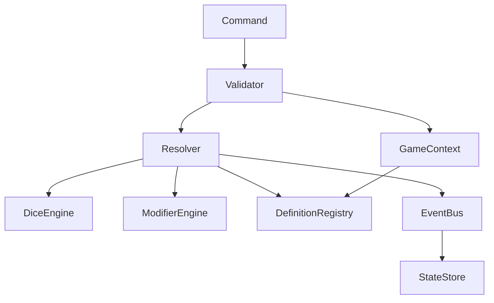
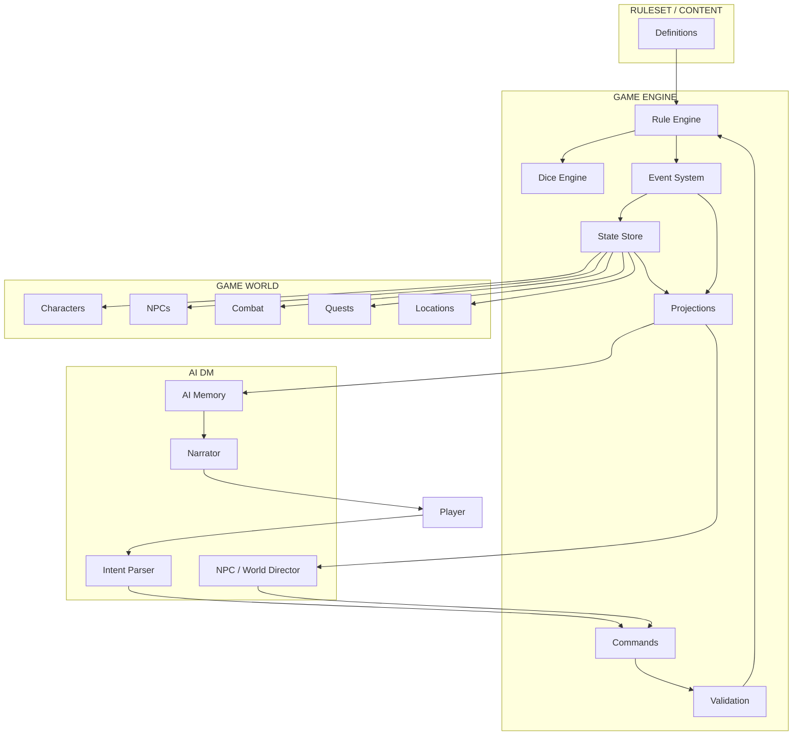

# AI D&D Engine

> Машиночитаемый игровой движок для веб-версии Dungeons & Dragons с AI Dungeon Master.

**AI D&D Engine** — проект игрового движка, который отделяет **правила D&D, состояние игры, события и искусственный интеллект** друг от друга.

Главный принцип проекта:

> **AI интерпретирует намерения и ведёт повествование. Engine определяет истину игрового мира.**

ИИ не должен самостоятельно решать, попал ли персонаж, сколько нанесено урона или можно ли совершить действие. Эти решения принимает детерминированный Rule Engine.

> **Этот файл — обзорный документ**: он описывает идею, архитектуру верхнего уровня и модель данных проекта. Детальная спецификация контрактов (Command/Event Envelope, ID System, слои приложения, правила сериализации) зафиксирована в `aboutREADME.md` и является источником истины при расхождениях.

---

## Содержание

* [Основная идея](#основная-идея)
* [Архитектурные принципы](#архитектурные-принципы)
* [Архитектура](#архитектура)
* [Модель данных](#модель-данных)
* [Definitions](#definitions)
* [Runtime State](#runtime-state)
* [Commands](#commands)
* [Events](#events)
* [Rule Engine](#rule-engine)
* [AI Dungeon Master](#ai-dungeon-master)
* [Поток игрового действия](#поток-игрового-действия)
* [Структура проекта](#структура-проекта)
* [Структура кампании](#структура-кампании)
* [Пример](#пример)
* [Технологический стек](#технологический-стек)
* [Roadmap](#roadmap)
* [Принципы разработки](#принципы-разработки)
* [Статус](#статус)

---

# Основная идея

Проект представляет D&D как систему:

```text
                  ┌─────────────────────┐
                  │      AI DM          │
                  │                     │
                  │ Intent              │
                  │ NPC behavior        │
                  │ Narration           │
                  │ Story generation    │
                  └──────────┬──────────┘
                             │
                     Commands / Context
                             │
                             ▼
                  ┌─────────────────────┐
                  │    D&D ENGINE       │
                  │                     │
                  │ Validation          │
                  │ Rules               │
                  │ Dice                │
                  │ Resolution          │
                  │ State mutation      │
                  └──────────┬──────────┘
                             │
                           Events
                             │
                             ▼
                  ┌─────────────────────┐
                  │     GAME STATE      │
                  │                     │
                  │ Characters          │
                  │ World               │
                  │ Combat              │
                  │ Quests              │
                  │ Inventory           │
                  └─────────────────────┘
```

Игрок взаимодействует с игрой естественным языком:

> «Подкрадываюсь к стражнику и пытаюсь нанести ему удар.»

AI преобразует намерение в игровую команду:

```json
{
  "commandId": "command_000001",
  "type": "AttackCommand",
  "campaignId": "campaign_001",
  "actorId": "player_001",
  "payload": {
    "targetId": "guard_001",
    "weaponId": "item_001"
  }
}
```

> Полная каноническая схема Command Envelope (`commandId`, `campaignId`, `payload` и т.д.) описана в `aboutREADME.md`, раздел «Command Envelope».

Engine проверяет возможность действия, выполняет правила, бросает кубики, изменяет состояние и создаёт события.

Только после этого AI получает результат и описывает его игроку.

---

# Архитектурные принципы

## 1. AI не является источником истины

AI может:

* интерпретировать естественный язык;
* принимать решения за NPC;
* генерировать описания;
* создавать сюжетные ситуации;
* выбирать возможные действия;
* управлять повествованием.

AI не должен самостоятельно:

* рассчитывать урон;
* изменять HP;
* игнорировать условия;
* определять AC;
* создавать предметы из ничего;
* изменять правила;
* объявлять успешным действие, которое Engine отклонил.

---

## 2. Engine является источником игровой истины

Для Engine:

```text
Rules + State + Command
          │
          ▼
       Resolution
          │
          ▼
         Events
          │
          ▼
      New State
```

---

## 3. Definitions ≠ State

Например:

```text
LongswordDefinition
```

описывает свойства длинного меча.

Но:

```text
longsword_instance_001
```

является конкретным экземпляром меча персонажа.

Аналогично:

```text
GoblinDefinition
        │
        ├── goblin_001
        ├── goblin_002
        └── goblin_003
```

Каждый экземпляр имеет собственное состояние.

---

## 4. Events являются историей изменений

Событие:

```text
DamageApplied
```

описывает факт:

> Цели был нанесён урон.

Состояние:

```text
hp = 14
```

описывает результат этого события.

---

# Архитектура

## Общая схема



---

# Модель данных

Проект разделяет данные на четыре основных слоя:

| Слой            | Назначение                      | Примеры                 |
| --------------- | ------------------------------- | ----------------------- |
| **Definitions** | Что существует по правилам      | Spell, Weapon, Class    |
| **State**       | Текущее состояние игры          | HP, Position, Inventory |
| **Commands**    | Намерение совершить действие    | AttackCommand           |
| **Events**      | Фактически произошедшие события | DamageApplied           |

Главный цикл:

```text
Definition
     │
     ▼
   State
     │
     ▼
 Command
     │
     ▼
Validation
     │
     ▼
Resolution
     │
     ▼
 Events
     │
     ▼
New State
```

---

# ER-модель



---

# Definitions

Definitions — это статические данные правил.

Они не должны изменяться во время обычной игровой сессии.

```text
rules/
└── dnd_5e/
    ├── ruleset.json
    ├── classes/
    ├── subclasses/
    ├── species/
    ├── backgrounds/
    ├── feats/
    ├── spells/
    ├── items/
    ├── monsters/
    ├── features/
    ├── conditions/
    └── effects/
```

Основные Definition-сущности:

```text
RulesetDefinition

ClassDefinition
SubclassDefinition
SpeciesDefinition
BackgroundDefinition
FeatDefinition

SpellDefinition

ItemDefinition
WeaponDefinition
ArmorDefinition
MagicItemDefinition

MonsterDefinition

FeatureDefinition
ConditionDefinition
EffectDefinition
ActionDefinition
```

---

## Пример WeaponDefinition

```json
{
  "id": "longsword",
  "version": 1,
  "name": "Longsword",
  "type": "weapon",
  "damage": {
    "dice": "1d8",
    "type": "slashing"
  },
  "properties": [
    "versatile"
  ]
}
```

> Каждый Definition обязан иметь поле `version` (см. `aboutREADME.md`, раздел «Definition Contract»). Это версия конкретного Definition, а не версия Ruleset.

Это описание оружия.

Оно не содержит:

```text
кто им владеет
где лежит
надето ли оно
прочность
текущее состояние
```

Эти данные относятся к Runtime State.

---

# Runtime State

Runtime State — конкретное состояние кампании.

Например:

```text
character_001
```

может иметь:

```text
HP = 31
position = (10, 15)
condition = Poisoned
weapon = item_001
spell_slot_3 = 1
```

> Здесь `item_001` — Runtime ID конкретного экземпляра оружия, ссылающийся на Definition через `definitionId: "longsword"`. Экземпляр не должен называться так же, как Definition (`longsword_001`). Полная конвенция ID — в `aboutREADME.md`, раздел «ID System».

Основные State-сущности:

```text
CampaignState

WorldState

CreatureState
CharacterState
NPCState
MonsterState

InventoryState
ItemInstanceState
EquipmentState

EffectState
ConditionState
ResourceState

CombatState
CombatantState
TurnState

QuestState
QuestObjectiveState

RelationshipState
FactionState
```

---

# Creature State

`CreatureState` — центральная сущность Runtime Model.



Персонаж игрока, NPC и монстр используют общую модель существа.

```text
CharacterState ─┐
NPCState ────────┼──► CreatureState
MonsterState ────┘
```

Это позволяет одной системой реализовать:

* HP;
* AC;
* movement;
* attacks;
* conditions;
* effects;
* saves;
* skills;
* spells;
* resources.

---

# Commands

Command — это намерение выполнить действие.

Команда ещё не означает, что действие произошло.

Примеры:

```text
MoveCommand
AttackCommand
CastSpellCommand
UseItemCommand
EquipItemCommand
RestCommand
InteractCommand
TalkCommand
SearchCommand
HideCommand
HelpCommand
```

Пример:

```json
{
  "commandId": "command_000042",
  "type": "AttackCommand",
  "campaignId": "campaign_001",
  "actorId": "fighter_001",
  "payload": {
    "targetId": "goblin_001",
    "weaponId": "item_001"
  }
}
```

---

# Command Pipeline



Важно:

```text
Command = намерение
Event = факт
```

Например:

```text
AttackCommand
```

может закончиться:

```text
AttackHit
```

или:

```text
AttackMissed
```

---

# Events

Events — неизменяемая история произошедшего.

Основные группы:

## Character Events

```text
CharacterCreated
CharacterLeveledUp
AbilityChanged
ExperienceGranted
```

## Combat Events

```text
CombatStarted
CombatEnded
TurnStarted
TurnEnded
InitiativeRolled

AttackResolved
AttackHit
AttackMissed
CriticalHit

DamageApplied
HealingApplied

CreatureDroppedToZeroHP
CreatureDefeated
```

## Spell Events

```text
SpellCast
SpellFailed
SpellSlotConsumed
ConcentrationStarted
ConcentrationBroken
```

## Effect Events

```text
EffectApplied
EffectExpired
EffectRemoved

ConditionApplied
ConditionRemoved
```

## Inventory Events

```text
ItemAdded
ItemRemoved
ItemEquipped
ItemUnequipped
ItemConsumed
```

## World Events

```text
LocationDiscovered
DoorOpened
DoorClosed
WorldTimeAdvanced
NPCRelationshipChanged
FactionRelationshipChanged
```

## Quest Events

```text
QuestStarted
QuestObjectiveUpdated
QuestCompleted
QuestFailed
RewardGranted
```

---

# Event Chain

Одно игровое действие может породить целую цепочку событий:



Resolver не должен напрямую знать обо всех этих системах.

Он создаёт факт:

```text
CreatureDefeated
```

а другие системы реагируют на него.

---

# Rule Engine

Rule Engine — детерминированный слой, который реализует игровые правила.

```text
domain/
└── rules/
    ├── checks.py
    ├── saves.py
    ├── attacks.py
    ├── damage.py
    ├── healing.py
    ├── movement.py
    ├── targeting.py
    ├── visibility.py
    ├── modifiers.py
    ├── conditions.py
    ├── effects.py
    ├── resources.py
    ├── spells.py
    ├── concentration.py
    ├── resting.py
    └── death.py
```

---

## Основные Resolver'ы

### CheckResolver

```text
d20
+
ability modifier
+
proficiency
+
modifiers
```

### SaveResolver

```text
d20
+
ability modifier
+
proficiency (если есть)
+
modifiers
```

### AttackResolver

```text
AttackCommand
        │
        ▼
Validation
        │
        ▼
Attack Roll
        │
        ▼
Target AC
        │
        ├── Miss
        │
        └── Hit
             │
             ▼
        DamageResolver
```

### DamageResolver

```text
Raw Damage
    │
    ▼
Resistance
    │
    ▼
Vulnerability
    │
    ▼
Immunity
    │
    ▼
Final Damage
```

---

# Dice Engine

Для всех случайных операций используется отдельный Dice Engine.

Поддерживаемые выражения:

```text
1d20
1d20+5
2d20kh1
2d20kl1
8d6
4d8+3
```

Пример результата:

```json
{
  "expression": "1d20+5",
  "rolls": [14],
  "modifier": 5,
  "total": 19,
  "critical": false
}
```

Dice Engine должен возвращать подробный результат броска.

Это необходимо для:

* UI;
* replay;
* debugging;
* AI narration;
* истории событий.

---

# Modifier Engine

Многие игровые правила сводятся к модификаторам:

```text
base
+
bonus
-
penalty
× multiplier
```

Источником модификатора может быть:

```text
Ability
Proficiency
Item
Feature
Spell
Condition
Effect
Environment
Cover
Equipment
```

Например:

```json
{
  "sourceId": "bless_001",
  "target": "attack_roll",
  "operation": "add",
  "value": 1
}
```

---

# Effects и Conditions

Effect описывает изменение поведения.

Condition — стандартизированное состояние.

```text
Spell / Feature / Item
          │
          ▼
        Effect
          │
          ▼
 Creature State
```

Пример:

```text
Bless
   │
   ▼
EffectState
   │
   ├── sourceId
   ├── targetId
   ├── duration
   └── modifiers
```

---

# Combat Engine

Combat является отдельным агрегатом.



Combat хранит:

```text
round
initiative order
active combatant
combatants
positions
turn resources
```

---

# Turn State

Пример:

```json
{
  "combatantId": "fighter_001",

  "action": {
    "available": true,
    "used": false
  },

  "bonusAction": {
    "available": true,
    "used": false
  },

  "reaction": {
    "available": true,
    "used": false
  },

  "movement": {
    "maximum": 30,
    "remaining": 18
  }
}
```

---

# World Engine

World Engine отвечает за:

```text
locations
movement between locations
world time
NPCs
factions
relationships
quests
environment
visibility
```

---

# Quest Engine

Quest состоит из машиночитаемых objectives.

Пример:

```json
{
  "id": "quest_goblin_01",
  "title": "Goblin Threat",
  "objectives": [
    {
      "id": "objective_1",
      "type": "kill",
      "targetId": "goblin_chief",
      "required": 1,
      "current": 0
    }
  ]
}
```

Quest Engine слушает Events:

```text
CreatureDefeated
        │
        ▼
QuestObjectiveResolver
        │
        ▼
QuestObjectiveUpdated
        │
        ▼
QuestCompleted
```

---

# AI Dungeon Master

AI DM находится над Engine.

Его задача:

```text
Natural Language
       │
       ▼
Intent Recognition
       │
       ▼
Command
       │
       ▼
Engine
       │
       ▼
Game Result
       │
       ▼
AI Context
       │
       ▼
Narration
```

---

## AI имеет доступ не ко всему State

Полный `state.json` не должен бездумно отправляться в LLM.

Используется специальная проекция:

```text
AIProjection
```

Она собирает только необходимую информацию:

```json
{
  "scene": {
    "location": "Ruined Gate",
    "time": "18:42",
    "weather": "rain"
  },

  "visibleCharacters": [],

  "combat": {},

  "relevantQuests": [],

  "recentEvents": [],

  "knownFacts": [],

  "possibleActions": []
}
```

Это позволяет контролировать:

* стоимость контекста;
* скрытую информацию;
* знания NPC;
* туман войны;
* мета-информацию;
* секреты мастера.

---

# NPC Knowledge

NPC не должен автоматически знать весь мир.



Например:

```json
{
  "subject": "dragon_001",
  "fact": "dragon_is_in_the_mountains",
  "confidence": 0.7,
  "source": "merchant_001"
}
```

Это позволяет реализовать NPC с ограниченной информацией.

---

# State и Event Store

Проект использует модель:

```text
Event Log
    +
Materialized State
```

То есть:

```text
events/
    000001.json
    000002.json
    000003.json
           │
           ▼
    State Projection
           │
           ▼
      state.json
```

`state.json` является быстрым snapshot текущего состояния.

`events/` хранит историю.

Отдельные файлы на событие (`000001.json`, ...) допускаются как MVP-вариант. Каноническим потоковым форматом является единый `events/events.jsonl` (см. `aboutREADME.md`, раздел «Event Serialization»).

---

# Структура проекта

Проект построен на четырёх слоях: **Presentation → Application → Domain ← Infrastructure**. Domain — центральный слой и ни от чего не зависит; Presentation и Infrastructure зависят от него, а не наоборот. Подробный разбор каждого слоя и правила зависимостей — в `aboutREADME.md`, раздел «Слои приложения».

```text
dnd-engine/
│
├── README.md
├── pyproject.toml
│
├── src/
│   └── dnd_engine/
│       │
│       ├── api/                 # Presentation: HTTP, WebSocket, DTO
│       │   ├── routes.py
│       │   ├── schemas.py
│       │   └── websocket.py
│       │
│       ├── application/         # Application: use cases, оркестрация
│       │   ├── commands/
│       │   ├── handlers/
│       │   └── services/
│       │
│       ├── domain/              # Domain: правила, состояние, события
│       │   ├── definitions/
│       │   ├── state/
│       │   ├── commands/
│       │   ├── events/
│       │   ├── rules/
│       │   └── value_objects/
│       │
│       └── infrastructure/      # Infrastructure: хранение, LLM, RNG
│           ├── persistence/
│           ├── llm/
│           └── random/
│
├── rules/
│   └── dnd_5e/
│       ├── ruleset.json
│       ├── classes/
│       ├── subclasses/
│       ├── species/
│       ├── backgrounds/
│       ├── feats/
│       ├── spells/
│       ├── monsters/
│       ├── items/
│       ├── features/
│       ├── conditions/
│       └── effects/
│
├── campaigns/
│   └── campaign_001/
│       ├── config.json
│       ├── state.json
│       ├── world/
│       ├── characters/
│       ├── npcs/
│       ├── quests/
│       ├── encounters/
│       ├── ai/
│       └── events/
│
└── tests/
    ├── rules/
    ├── combat/
    ├── spells/
    ├── movement/
    └── scenarios/
```

> Это обзорная схема верхнего уровня. Полное описание слоёв, запрещённых зависимостей и содержимого каждого модуля — в `aboutREADME.md`.

---

# Структура кампании

```text
campaigns/
└── campaign_001/
    │
    ├── config.json
    ├── state.json
    │
    ├── world/
    │   ├── world.json
    │   ├── locations.json
    │   ├── factions.json
    │   └── environment.json
    │
    ├── characters/
    │   ├── player_001.json
    │   └── player_002.json
    │
    ├── npcs/
    │   ├── npc_001.json
    │   └── npc_002.json
    │
    ├── quests/
    │   ├── quest_001.json
    │   └── quest_002.json
    │
    ├── encounters/
    │   └── encounter_001.json
    │
    ├── ai/
    │   ├── dm_memory.json
    │   ├── npc_memory.json
    │   └── narrative_state.json
    │
    └── events/
        ├── 000001.json
        ├── 000002.json
        └── 000003.json
```

---

# `state.json`

Snapshot текущего состояния:

```json
{
  "campaignId": "campaign_001",

  "time": {
    "day": 14,
    "hour": 18,
    "minute": 42
  },

  "locationId": "ancient_ruins",

  "activeEncounterId": "encounter_007",

  "combat": {
    "active": true,
    "combatId": "combat_031"
  },

  "party": [
    "player_001",
    "player_002"
  ],

  "worldFlags": {
    "ruins_door_open": true,
    "goblin_chief_dead": true
  }
}
```

---

# `config.json`

Конфигурация кампании:

```json
{
  "id": "campaign_001",
  "name": "Ashes of Aerona",

  "ruleset": {
    "id": "dnd_5e",
    "version": "5.2.1"
  },

  "game": {
    "grid": "square",
    "gridSize": 5
  }
}
```

---

# Пример: атака

Игрок пишет:

> Я атакую гоблина мечом.

## 1. AI

```text
Natural Language
       │
       ▼
AttackCommand
```

```json
{
  "commandId": "command_000123",
  "type": "AttackCommand",
  "campaignId": "campaign_001",
  "actorId": "fighter_001",
  "payload": {
    "targetId": "goblin_001",
    "weaponId": "item_001"
  }
}
```

## 2. Validation

Engine проверяет:

```text
✓ actor exists
✓ target exists
✓ current turn belongs to actor
✓ action available
✓ weapon exists
✓ weapon equipped
✓ target is valid
✓ target is in range
✓ target can be attacked
```

## 3. Attack Roll

```text
1d20 + attack modifier
```

Например:

```text
14 + 7 = 21
```

Target:

```text
AC = 16
```

Результат:

```text
HIT
```

## 4. Damage

```text
1d8 + STR modifier
```

Например:

```text
6 + 4 = 10 slashing
```

## 5. Events

```text
AttackResolved
        ↓
AttackHit
        ↓
DamageApplied
        ↓
TurnResourceSpent
```

Если HP стало 0:

```text
CreatureDroppedToZeroHP
        ↓
CreatureDefeated
```

## 6. State

```text
Goblin HP: 20 → 10
```

## 7. AI

AI получает:

```text
AttackHit
DamageApplied
```

и создаёт повествование:

> Меч прорезает кольчугу гоблина. Тот отшатывается, прижимая руку к кровоточащему боку.

---

# Python-модель

Минимальный пример:

```python
from dataclasses import dataclass, field


@dataclass
class AbilityScores:
    strength: int
    dexterity: int
    constitution: int
    intelligence: int
    wisdom: int
    charisma: int


@dataclass
class Position:
    x: int
    y: int
    z: int = 0


@dataclass
class CreatureState:
    id: str
    name: str
    definition_id: str

    abilities: AbilityScores

    hp: int
    max_hp: int
    temp_hp: int = 0

    position: Position | None = None

    conditions: list[str] = field(default_factory=list)
    effects: list[str] = field(default_factory=list)

    inventory_id: str | None = None
    equipment_id: str | None = None
```

Definition:

```python
from dataclasses import dataclass


@dataclass(frozen=True)
class WeaponDefinition:
    id: str
    version: int
    name: str
    damage_dice: str
    damage_type: str
    properties: list[str]
```

Command (упрощённая доменная модель; канонический транспортный формат — Command Envelope, см. `aboutREADME.md`):

```python
@dataclass
class AttackCommand:
    command_id: str
    campaign_id: str
    actor_id: str
    target_id: str
    weapon_id: str
```

Result:

```python
@dataclass
class AttackResult:
    attack_roll: int
    attack_bonus: int
    target_ac: int
    hit: bool
    critical: bool
    damage: int | None
```

Event:

```python
@dataclass
class GameEvent:
    event_id: str
    type: str
    version: int
    campaign_id: str
    timestamp: str
    actor_id: str | None
    payload: dict
    caused_by: str | None = None
```

---

# Engine API

Главный интерфейс Engine должен быть простым:

```python
result = game_engine.execute(command)
```

Например:

```python
command = AttackCommand(
    command_id="command_000123",
    campaign_id="campaign_001",
    actor_id="fighter_001",
    target_id="goblin_001",
    weapon_id="item_001",
)

result = engine.execute(command)
```

Результат содержит:

```text
validation
resolution
dice rolls
events
state changes
```

---

# Внутренняя архитектура Engine



---

# Основные компоненты

## `GameEngine`

Оркестрирует выполнение команд.

```python
class GameEngine:

    def execute(self, command):
        ...
```

---

## `DefinitionRegistry`

Доступ к Definitions:

```python
class DefinitionRegistry:

    def get_spell(self, id: str):
        ...

    def get_item(self, id: str):
        ...

    def get_monster(self, id: str):
        ...

    def get_feature(self, id: str):
        ...
```

---

## `StateStore`

Отвечает только за состояние:

```python
class StateStore:

    def load(self):
        ...

    def save(self, state):
        ...

    def snapshot(self):
        ...
```

---

## `DiceEngine`

```python
class DiceEngine:

    def roll(self, expression: str):
        ...
```

---

## `EventBus`

```python
class EventBus:

    def publish(self, event):
        ...

    def subscribe(self, event_type, handler):
        ...
```

---

# Тестируемость

Большая часть Rule Engine должна быть детерминированной и тестируемой без LLM.

Например:

```python
def test_attack_hits():
    ...
```

```python
def test_fire_resistance_halves_damage():
    ...
```

```python
def test_advantage_uses_highest_roll():
    ...
```

```python
def test_spell_breaks_on_failed_concentration_save():
    ...
```

Для тестов Dice Engine должен позволять использовать контролируемый RNG.

---

# Почему Event-driven архитектура

Event-driven модель позволяет нескольким подсистемам реагировать на один факт.

Например:

```text
CreatureDefeated
      │
      ├── QuestEngine
      │
      ├── LootEngine
      │
      ├── FactionEngine
      │
      ├── NPCMemory
      │
      ├── AchievementSystem
      │
      └── AIContext
```

При этом `CombatEngine` не должен напрямую импортировать все эти системы.

---

# Версионирование Ruleset

Правила должны иметь собственную версию.

```json
{
  "id": "dnd_5e",
  "version": "5.2.1"
}
```

Это необходимо, потому что разные версии D&D не являются полностью совместимыми.

Кампания должна всегда знать:

```text
какой Ruleset использовался
```

чтобы старые сохранения оставались воспроизводимыми.

---

# Determinism

Одна из целей проекта:

```text
same state
+
same command
+
same ruleset
+
same dice seed
=
same result
```

Это позволяет:

* воспроизводить ошибки;
* делать replay;
* отлаживать кампании;
* тестировать правила;
* сравнивать версии Engine;
* восстанавливать состояние.

---

# Security Boundary

AI никогда не должен иметь прямого доступа к:

```text
state.hp = ...
state.inventory = ...
state.quest.completed = ...
```

AI должен отправлять Commands:

```text
AttackCommand
CastSpellCommand
MoveCommand
InteractCommand
```

Engine уже решает, что произошло.

---

# Технологический стек

Кратко:

```text
Python 3.12+
FastAPI          — HTTP + WebSocket API
Pydantic v2      — валидация на границах системы
pytest           — тесты Rule Engine
JSON / JSONL     — хранилище на этапе MVP
```

Storage на этапе MVP — файлы (JSON/JSONL), в перспективе — замена на SQLite/PostgreSQL за интерфейсом Repository, без изменения Domain-слоя.

LLM-провайдер (OpenAI / Anthropic / локальная модель) подключается через абстрактный `LLMProvider`, чтобы Engine не зависел от конкретного поставщика.

> Это краткий обзор. Полное обоснование выбора стека, разбор слоёв приложения, границы зависимостей и правила сериализации — в `aboutREADME.md`.

---

# Roadmap

## Phase 1 — Core

* [ ] `CampaignState`
* [ ] `CreatureState`
* [ ] `AbilityScores`
* [ ] `ItemDefinition`
* [ ] `WeaponDefinition`
* [ ] `MonsterDefinition`
* [ ] Dice Engine
* [ ] Event model
* [ ] State Store

## Phase 2 — Basic Rules

* [ ] Ability checks
* [ ] Saving throws
* [ ] Skills
* [ ] Proficiency
* [ ] Attack rolls
* [ ] Damage
* [ ] Healing
* [ ] AC
* [ ] HP
* [ ] Conditions

## Phase 3 — Combat

* [ ] Initiative
* [ ] Turns
* [ ] Movement
* [ ] Reactions
* [ ] Opportunity attacks
* [ ] Targeting
* [ ] Cover
* [ ] Visibility

## Phase 4 — Magic

* [ ] Spell definitions
* [ ] Spell slots
* [ ] Spell targeting
* [ ] AoE
* [ ] Saving throw spells
* [ ] Spell attacks
* [ ] Effects
* [ ] Concentration

## Phase 5 — World

* [ ] Locations
* [ ] Maps
* [ ] NPCs
* [ ] Factions
* [ ] Relationships
* [ ] Quests
* [ ] World time
* [ ] Knowledge system

## Phase 6 — AI DM

* [ ] Natural language → Commands
* [ ] AI Context Projection
* [ ] NPC AI
* [ ] Memory
* [ ] Scene narration
* [ ] World generation
* [ ] Encounter generation
* [ ] AI tool calling

## Phase 7 — Web Application

* [ ] Backend API
* [ ] Authentication
* [ ] Campaign management
* [ ] Character sheet
* [ ] Combat UI
* [ ] Tactical map
* [ ] Inventory UI
* [ ] Quest UI
* [ ] AI chat
* [ ] Multiplayer

---

# Принципы разработки

### Rules are code/data, not prompts

Правила игры должны находиться в Engine/Definitions, а не в системном промпте LLM.

### State is authoritative

UI и AI только отображают/запрашивают состояние.

### Commands are intentions

Команда не означает успех.

### Events are facts

Event описывает то, что уже произошло.

### Definitions are immutable

Definition не должен изменяться в рамках игровой сессии.

### Calculated values should be calculated

Не хранить производные значения без необходимости.

Например вместо:

```text
attackBonus = 7
```

предпочтительно:

```text
ability
+
proficiency
+
equipment
+
effects
```

и вычислять итог через Rule Engine.

### AI should be replaceable

Замена одной LLM на другую не должна менять игровую механику.

---

# Целевая архитектура

В конечном виде система должна выглядеть так:



---

# Философия проекта

Проект строится вокруг простой модели:

> **AI рассказывает историю. Engine решает, что в этой истории действительно произошло.**

Игрок может сказать:

> «Прыгаю через пропасть.»

AI может понять намерение.

Engine решит:

```text
есть ли возможность прыжка
↓
какое расстояние
↓
какая проверка
↓
какой DC
↓
результат броска
↓
успех / провал
↓
урон / падение / изменение позиции
```

И только затем AI расскажет:

> «Ты разбегаешься и прыгаешь в темноту...»

---

# License

Проект находится на стадии разработки.

Лицензия, используемые игровые данные и источники контента должны быть определены отдельно перед публикацией полноценного набора правил/контента.

---

# Status

🚧 **Early Development**

Проект находится на стадии проектирования архитектуры и создания базового Rule Engine.

Текущий приоритет:

```text
Data Model
    ↓
State Model
    ↓
Command Model
    ↓
Event Model
    ↓
Core Engine
    ↓
Combat
    ↓
Magic
    ↓
World
    ↓
AI DM
    ↓
Web UI
```

---

## Конечная цель

Создать веб-платформу, в которой AI Dungeon Master способен вести полноценную длительную D&D-кампанию, сохраняя при этом:

* детерминированные игровые правила;
* постоянное состояние мира;
* историю всех значимых событий;
* память NPC;
* квесты и последствия действий;
* тактические бои;
* расширяемую систему контента;
* возможность заменить AI без переписывания игрового движка.

```text
                 PLAYER
                   │
                   ▼
             Natural Language
                   │
                   ▼
                AI DM
                   │
                Command
                   │
                   ▼
              D&D ENGINE
                   │
          Rules + Dice + State
                   │
                   ▼
                Events
                   │
                   ▼
              WORLD STATE
                   │
                   ▼
                AI DM
                   │
                   ▼
               Narration
                   │
                   ▼
                 PLAYER
```

**The AI is the Dungeon Master.
The Engine is the Rules.
The State is the World.
The Events are its History.**