# Architecture Foundation

> `ARCHITECTURE.md = current canonical contract`; [`DECISIONS.md`](DECISIONS.md) = append-only rationale/history.

> **Источник истины проекта.** При расхождении с любым другим документом приоритет у этого файла.

Этот документ фиксирует фундаментальные технические решения проекта.

Все дальнейшие модули, классы, JSON-схемы и API должны соответствовать этим правилам. Изменение этих решений считается **архитектурным изменением проекта** и должно быть осознанным, а не происходить случайно по мере разработки.

Другие документы: [`../README.md`](../README.md) — обзор проекта · [`ROADMAP.md`](ROADMAP.md) — фазы разработки · [`../CLAUDE.md`](../CLAUDE.md) — выжимка правил для AI-агента.

---

## Навигация

Разделы пронумерованы сквозным образом. Ссылайся на них по номеру:
в issue, PR или коммите пиши «см. §8.2», и раздел находится одним поиском.

### Быстрый поиск / Quick lookup

| Нужно найти | Раздел |
| --- | --- |
| Обязательные поля Definition | §3.1 |
| Контракт AbilityScores | §1.2.1 |
| Минимальные Phase 1 Definitions | §3.1.1 |
| Минимальный CreatureState | §3.2.1 |
| Минимальный CampaignState | §3.2.2 |
| Минимальный Dice Engine | §1.7.1 |
| Схема Command Envelope | §9.1 |
| Поля Command Envelope | §9.2 |
| Python Command boundary | §3.3 |
| Схема Event Envelope | §8.1 |
| Поля Event Envelope | §8.2 |
| Формат ID любой сущности | §4.13 |
| Почему `item_001`, а не `longsword_001` | §4.3 |
| Кто имеет право менять State | §10.13 |
| Что запрещено импортировать в Domain | §2.5 |
| Где разрешена сериализация | §12.1 |
| Формат лога событий (JSONL) | §12.10 |
| Правила именования событий | §8.13 |
| Разница Command и Event | §9.8 |
| Порядок применения событий | §12.11 |
| Коды ошибок | §3.9 |
| Семантика ResolutionResult | §3.5 |
| Подготовительный контракт Ability Check | §3.10 |
| Версионирование схем | §12.13 |

### Оглавление / Table of contents

<details>
<summary>Развернуть полное оглавление</summary>

* [1. Технологический стек / Technology Stack](#1-технологический-стек--technology-stack)
  * [1.1. Backend](#11-backend)
  * [1.2. Domain Model](#12-domain-model)
    * [1.2.1. AbilityScores Value Object](#121-abilityscores-value-object)
  * [1.3. API](#13-api)
  * [1.4. Storage](#14-storage)
  * [1.5. Tests](#15-tests)
  * [1.6. AI Layer](#16-ai-layer)
  * [1.7. Random Number Generation](#17-random-number-generation)
    * [1.7.1. Minimal Phase 1 Dice Engine Contract](#171-minimal-phase-1-dice-engine-contract)
* [2. Слои приложения / Application Layers](#2-слои-приложения--application-layers)
  * [2.1. Presentation Layer](#21-presentation-layer)
  * [2.2. Application Layer](#22-application-layer)
  * [2.3. Domain Layer](#23-domain-layer)
  * [2.4. Infrastructure Layer](#24-infrastructure-layer)
  * [2.5. Запрещённые зависимости / Forbidden Dependencies](#25-запрещённые-зависимости--forbidden-dependencies)
  * [2.6. Полная схема / Full Layer Diagram](#26-полная-схема--full-layer-diagram)
* [3. Контракты / Contracts](#3-контракты--contracts)
  * [3.1. Definition Contract](#31-definition-contract)
    * [3.1.1. Minimal Phase 1 Definition Contracts](#311-minimal-phase-1-definition-contracts)
  * [3.2. State Contract](#32-state-contract)
    * [3.2.1. Minimal Phase 1 CreatureState Contract](#321-minimal-phase-1-creaturestate-contract)
    * [3.2.2. Minimal Phase 1 CampaignState Contract](#322-minimal-phase-1-campaignstate-contract)
  * [3.3. Command Contract](#33-command-contract)
  * [3.4. Event Contract](#34-event-contract)
  * [3.5. ResolutionResult Contract](#35-resolutionresult-contract)
  * [3.6. Shared orchestration abstractions are deferred](#36-shared-orchestration-abstractions-are-deferred)
  * [3.7. Общий жизненный цикл игрового действия / Action Lifecycle](#37-общий-жизненный-цикл-игрового-действия--action-lifecycle)
  * [3.8. Atomicity](#38-atomicity)
  * [3.9. Error Contract](#39-error-contract)
  * [3.10. Minimal Phase 2 Ability Check preparation](#310-minimal-phase-2-ability-check-preparation)
* [4. ID System](#4-id-system)
  * [4.1. Definition IDs](#41-definition-ids)
  * [4.2. Instance / State IDs](#42-instance--state-ids)
  * [4.3. Почему State ID не должен повторять Definition ID / State ID vs Definition ID](#43-почему-state-id-не-должен-повторять-definition-id--state-id-vs-definition-id)
  * [4.4. Event IDs](#44-event-ids)
  * [4.5. Command IDs](#45-command-ids)
  * [4.6. Ruleset ID](#46-ruleset-id)
  * [4.7. Version IDs](#47-version-ids)
  * [4.8. ID никогда не переиспользуется / ID Reuse](#48-id-никогда-не-переиспользуется--id-reuse)
  * [4.9. ID не изменяется / ID Immutability](#49-id-не-изменяется--id-immutability)
  * [4.10. Scope](#410-scope)
  * [4.11. Политика генерации новых ID / ID Generation Policy](#411-политика-генерации-новых-id--id-generation-policy)
  * [4.12. Canonical ID registry](#412-canonical-id-registry)
  * [4.13. Сводная таблица ID / ID Reference Table](#413-сводная-таблица-id--id-reference-table)
* [5. Контроль архитектуры / Architecture Control](#5-контроль-архитектуры--architecture-control)
* [6. Канонический жизненный цикл / Canonical Lifecycle](#6-канонический-жизненный-цикл--canonical-lifecycle)
* [7. Архитектурная формула / Architecture Formula](#7-архитектурная-формула--architecture-formula)
* [8. Event Envelope](#8-event-envelope)
  * [8.1. Каноническая схема Event / Canonical Event Schema](#81-каноническая-схема-event--canonical-event-schema)
  * [8.2. Поля Event Envelope / Event Envelope Fields](#82-поля-event-envelope--event-envelope-fields)
  * [8.3. `eventId`](#83-eventid)
  * [8.4. `type`](#84-type)
  * [8.5. `version`](#85-version)
  * [8.6. `campaignId`](#86-campaignid)
  * [8.7. `timestamp`](#87-timestamp)
  * [8.8. `actorId`](#88-actorid)
  * [8.9. `causedBy`](#89-causedby)
  * [8.10. `payload`](#810-payload)
  * [8.11. Event lifecycle](#811-event-lifecycle)
  * [8.12. Immutable Event Rule](#812-immutable-event-rule)
  * [8.13. Event naming convention](#813-event-naming-convention)
  * [8.14. Event должен быть domain fact / Domain Fact Rule](#814-event-должен-быть-domain-fact--domain-fact-rule)
* [9. Command Envelope](#9-command-envelope)
  * [9.1. Каноническая схема Command / Canonical Command Schema](#91-каноническая-схема-command--canonical-command-schema)
  * [9.2. Поля Command Envelope / Command Envelope Fields](#92-поля-command-envelope--command-envelope-fields)
  * [9.3. `commandId`](#93-commandid)
  * [9.4. `type`](#94-type)
  * [9.5. `actorId`](#95-actorid)
  * [9.6. `payload`](#96-payload)
  * [9.7. Command lifecycle](#97-command-lifecycle)
  * [9.8. Command ≠ Event](#98-command--event)
  * [9.9. Command не изменяет State напрямую / No Direct State Mutation](#99-command-не-изменяет-state-напрямую--no-direct-state-mutation)
  * [9.10. Idempotency](#910-idempotency)
  * [9.11. Command → Event correlation](#911-command--event-correlation)
  * [9.12. Full Command/Event chain](#912-full-commandevent-chain)
* [10. State Ownership](#10-state-ownership)
  * [10.1. Почему нужен State Ownership / Why State Ownership](#101-почему-нужен-state-ownership--why-state-ownership)
  * [10.2. Ownership Model](#102-ownership-model)
  * [10.3. Campaign State Owner](#103-campaign-state-owner)
  * [10.4. Creature State Owner](#104-creature-state-owner)
  * [10.5. Inventory State Owner](#105-inventory-state-owner)
  * [10.6. Equipment State Owner](#106-equipment-state-owner)
  * [10.7. Combat State Owner](#107-combat-state-owner)
  * [10.8. Quest State Owner](#108-quest-state-owner)
  * [10.9. World State Owner](#109-world-state-owner)
  * [10.10. Faction State Owner](#1010-faction-state-owner)
  * [10.11. Relationship State Owner](#1011-relationship-state-owner)
  * [10.12. AI State Owner](#1012-ai-state-owner)
  * [10.13. Owner Matrix](#1013-owner-matrix)
  * [10.14. Read vs Write](#1014-read-vs-write)
  * [10.15. Example: Damage](#1015-example-damage)
  * [10.16. Example: Quest Update](#1016-example-quest-update)
  * [10.17. Example: NPC Relationship](#1017-example-npc-relationship)
  * [10.18. State Ownership Rule](#1018-state-ownership-rule)
  * [10.19. Полная схема Ownership](#1019-полная-схема-ownership)
  * [10.20. Главный принцип Ownership / Core Ownership Principle](#1020-главный-принцип-ownership--core-ownership-principle)
* [11. Канонический Command → Event → State цикл / Canonical Cycle](#11-канонический-command--event--state-цикл--canonical-cycle)
* [12. Serialization Rules](#12-serialization-rules)
  * [12.1. Где разрешена сериализация / Where Serialization Is Allowed](#121-где-разрешена-сериализация--where-serialization-is-allowed)
  * [12.2. Канонические форматы / Canonical Formats](#122-канонические-форматы--canonical-formats)
  * [12.3. YAML](#123-yaml)
  * [12.4. Canonical JSON](#124-canonical-json)
  * [12.5. Имена полей / Field Naming](#125-имена-полей--field-naming)
  * [12.6. Python ↔ JSON](#126-python--json)
  * [12.7. Pydantic как boundary validation](#127-pydantic-как-boundary-validation)
  * [12.8. Definition Serialization](#128-definition-serialization)
  * [12.9. State Serialization](#129-state-serialization)
  * [12.10. Event Serialization](#1210-event-serialization)
  * [12.11. Event Ordering](#1211-event-ordering)
  * [12.12. State Snapshot Version](#1212-state-snapshot-version)
  * [12.13. Принцип версионирования / Versioning Principle](#1213-принцип-версионирования--versioning-principle)
  * [12.14. Optional Fields](#1214-optional-fields)
  * [12.15. Default Values](#1215-default-values)
  * [12.16. Enum Serialization](#1216-enum-serialization)
  * [12.17. Datetime Serialization](#1217-datetime-serialization)
  * [12.18. Decimal / Floating Point](#1218-decimal--floating-point)
  * [12.19. Random State](#1219-random-state)
  * [12.20. Serialization Boundary](#1220-serialization-boundary)
  * [12.21. Запрещённые практики / Forbidden Practices](#1221-запрещённые-практики--forbidden-practices)
  * [12.22. Serialization Responsibility Matrix](#1222-serialization-responsibility-matrix)
  * [12.23. Канонический Serialization Pipeline](#1223-канонический-serialization-pipeline)
  * [12.24. Главный принцип сериализации / Core Serialization Principle](#1224-главный-принцип-сериализации--core-serialization-principle)

</details>

---

## 1. Технологический стек / Technology Stack

### 1.1. Backend

Основной backend:

```text
Python 3.12+
FastAPI
Pydantic v2
```

#### Почему Python

Python используется как основной язык Engine благодаря:

* простой реализации игровых правил;
* удобной сериализации;
* развитой экосистеме для AI;
* удобной работе с JSON;
* хорошей тестируемости;
* возможности легко подключать LLM-провайдеров;
* низкому порогу изменения игровых правил.

---

### 1.2. Domain Model

Для Domain Model используются:

```text
Python dataclasses
frozen dataclasses for Definitions and immutable Value Objects
Enums
Value Objects
```

Pydantic is used only at system boundaries (API, storage I/O validation,
configuration, external JSON, and LLM structured output). Domain rule
resolution uses dataclasses, Enums, Value Objects, and type hints only.

Правила не должны зависеть от:

```text
FastAPI
HTTP
JSON-файлов
SQL
конкретного LLM-провайдера
```

Domain rules и concrete resolvers должны работать как обычный Python-код:

```text
Application handler
        ↓
concrete Domain resolver
```

Общий `GameEngine.execute(...)` API не является prerequisite для Phase 2 и пока
не реализован (§3.6).

#### 1.2.1. AbilityScores Value Object

`AbilityScores` — immutable Domain Value Object, используемый базовыми Phase 1
Definition- и State-моделями.

Каноническая Python-семантика:

```python
@dataclass(frozen=True)
class AbilityScores:
    strength: int
    dexterity: int
    constitution: int
    intelligence: int
    wisdom: int
    charisma: int
```

Все шесть полей обязательны. Для каждого поля действует invariant:

```text
1 <= ability score <= 30
```

`AbilityScores`:

* не является State owner;
* не имеет собственного runtime ID;
* не содержит modifiers, proficiency, skills или saving throw bonuses;
* не содержит temporary modifiers;
* не выполняет rule calculations.

Если abilities существа изменяются во время игры, Creature Domain создаёт новое
значение `AbilityScores` и помещает его в принадлежащий ему `CreatureState`.
Производные значения вроде `strength_modifier` относятся к rule calculation и
не входят в Phase 1 contract. При JSON-сериализации используется обычное правило
camelCase; все шесть canonical имён уже однословные.

---

### 1.3. API

Внешний API:

```text
FastAPI
```

Использование:

```text
HTTP REST
WebSocket
```

REST используется для:

* загрузки кампаний;
* создания персонажей;
* сохранения;
* получения состояния;
* управления ресурсами.

WebSocket используется для:

* live-команд;
* боевых событий;
* AI narration;
* multiplayer state updates.

---

### 1.4. Storage

#### MVP

На первом этапе используется:

```text
JSON
JSONL
filesystem
```

Это позволяет быстро разрабатывать Engine без раннего усложнения инфраструктуры.

Пример:

```text
campaign/
├── state.json
├── characters/
├── world/
└── events/
    ├── 000001.json
    ├── 000002.json
    └── 000003.json
```

#### Production

После стабилизации Domain Model Storage может быть заменён на:

```text
SQLite
        ↓
PostgreSQL
```

При этом Domain Engine не должен зависеть от конкретной БД.

```text
Domain
   │
   ▼
Repository Interface
   │
   ├── JsonRepository
   ├── SQLiteRepository
   └── PostgreSQLRepository
```

---

### 1.5. Tests

Основной framework:

```text
pytest
```

Тестируются в первую очередь:

```text
Rule Engine
Resolvers
Dice Engine
State transitions
Event handlers
Serialization
```

LLM не используется в тестах игрового ядра.

---

### 1.6. AI Layer

AI подключается через абстрактный интерфейс.

Engine не должен знать:

```text
OpenAI
Anthropic
Google
локальная модель
```

Вместо этого используется:

```python
class LLMProvider:
    def generate(self, request):
        ...
```

Архитектурно:

```text
AI Service
    │
    ▼
LLMProvider
    │
    ├── OpenAIProvider
    ├── AnthropicProvider
    ├── LocalProvider
    └── TestProvider
```

Таким образом замена модели не требует изменения игрового Engine.

---

### 1.7. Random Number Generation

Все игровые случайности проходят через:

```text
DiceEngine
```

Запрещено использовать случайность непосредственно внутри Rule Engine:

```python
random.randint(...)
random.choice(...)
```

вместо этого:

```python
dice.roll("1d20")
```

Это необходимо для:

* тестирования;
* replay;
* debugging;
* deterministic simulations.

#### 1.7.1. Minimal Phase 1 Dice Engine Contract

`DiceEngine` — Domain `Protocol`. Rule resolvers зависят только от него:

```python
from typing import Protocol


class DiceEngine(Protocol):
    def roll(self, expression: str) -> DiceRoll:
        ...
```

Результат одного dice expression — минимальный immutable Domain Value Object:

```python
@dataclass(frozen=True)
class DiceRoll:
    expression: str
    rolls: tuple[int, ...]
    total: int
```

`expression` — exact `str` и хранит точное принятое canonical expression.
`rolls` — непустой tuple с каждым индивидуальным положительным exact `int` (не
`bool`) в порядке бросков. `total` — exact `int` (не `bool`) и в Phase 1 равен
`sum(rolls)`. `DiceRoll` проверяет только собственные intrinsic invariants и не
выполняет проверку результата относительно размера кубика.

Phase 1 принимает только strict lowercase notation `NdM`, эквивалентную grammar
`[1-9][0-9]*d[1-9][0-9]*`, с invariants `count >= 1` и `sides >= 2`.
Количество всегда указывается явно. Modifiers, arithmetic expressions,
advantage/disadvantage, keep/drop, rerolls, exploding dice и полный dice DSL не
входят в Phase 1.

Простой parser остаётся private implementation detail Infrastructure adapter:

```text
Domain DiceEngine Protocol
          ↑
Infrastructure PythonDiceEngine
          ↑
injected random.Random
```

`PythonDiceEngine` находится в Infrastructure и получает явный injected
`random.Random`. Все individual rolls создаются только этим instance; вызовы
module-global `random.randint`, `random.choice`, `random.seed` и другая
uncontrolled gameplay randomness запрещены. Domain не импортирует stdlib
`random` и не зависит от Infrastructure RNG implementation.

Внутреннее состояние RNG не является authoritative Campaign, Creature или
World State. Dice Engine не является State owner, не мутирует State, не
обращается к State Store, не создаёт Events и не сохраняет RNG state. Seed и
возможный будущий replay относятся к Infrastructure/composition concerns, а не
к `DiceEngine.roll()`.

---

## 2. Слои приложения / Application Layers

Приложение разделено на четыре архитектурных слоя.

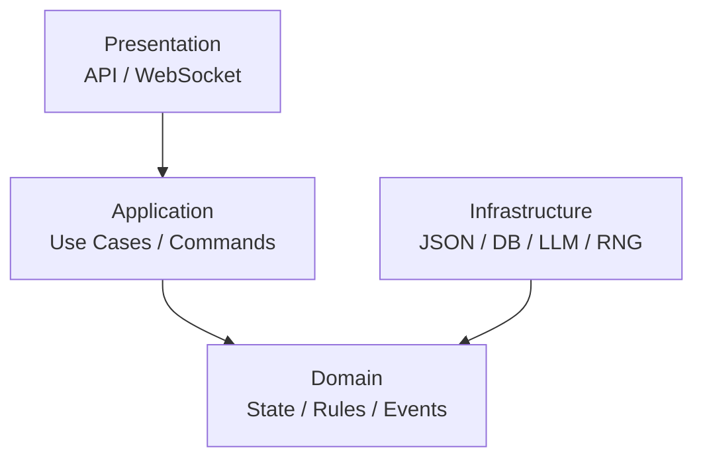

---

### 2.1. Presentation Layer

Отвечает за внешний интерфейс.

```text
src/dnd_engine/api/
├── routes.py
├── schemas.py
├── websocket.py
└── dependencies.py
```

Задачи:

```text
HTTP
WebSocket
DTO
Authentication
Request validation
Response serialization
```

Presentation Layer **не содержит D&D правил**.

Запрещено:

```python
# route
if attack_roll >= target.ac:
    target.current_hp -= damage
```

Правильно:

```python
result = game_service.execute(command)
```

---

### 2.2. Application Layer

Application Layer оркестрирует use cases.

```text
src/dnd_engine/application/
├── commands/
├── handlers/
├── services/
└── dto/
```

Пример:

```text
HTTP Request
     │
     ▼
AttackCommandDTO
     │
     ▼
AttackCommand
     │
     ▼
AttackCommandHandler
     │
     ▼
Domain resolver
```

Application Layer отвечает на вопрос:

> **Что нужно вызвать?**

Domain отвечает:

> **Что по правилам должно произойти?**

Concrete Application handler/use case отвечает за загрузку нужного State,
поиск actor/target, вызов stateless Domain resolver, создание Event envelope
metadata и сборку `ResolutionResult`. Только state-mutating use case сохраняет
обновлённый snapshot через `StateStore`; read-only resolution save не вызывает.

---

### 2.3. Domain Layer

Главный слой проекта.

```text
src/dnd_engine/domain/
├── definitions/
├── state/
├── commands/
├── events/
├── rules/
├── value_objects/
└── services/
```

Domain содержит:

```text
Definitions
State
Commands
Events
Rules
Resolvers
Value Objects
Domain Services
```

Domain не знает о:

```text
HTTP
FastAPI
PostgreSQL
JSON files
LLM APIs
```

Domain resolver принимает уже валидированную concrete typed Command и нужные
Domain objects/ports. Он не загружает и не сохраняет State, не создаёт Event ID,
не читает clock, не сериализует и не импортирует Application или
Infrastructure.

---

### 2.4. Infrastructure Layer

```text
src/dnd_engine/infrastructure/
├── persistence/
│   ├── json/
│   ├── sqlite/
│   └── postgres/
│
├── llm/
│   ├── openai.py
│   ├── anthropic.py
│   └── local.py
│
├── random/
│   └── dice.py
│
└── filesystem/
```

Infrastructure предоставляет технические реализации интерфейсов Domain/Application.

---

### 2.5. Запрещённые зависимости / Forbidden Dependencies

Правило зависимостей:

```text
Presentation
      ↓
Application
      ↓
Domain
      ↑
Infrastructure
```

Domain не импортирует:

```text
FastAPI
SQLAlchemy
OpenAI SDK
filesystem implementation
```

Infrastructure может импортировать Domain interfaces.

---

### 2.6. Полная схема / Full Layer Diagram

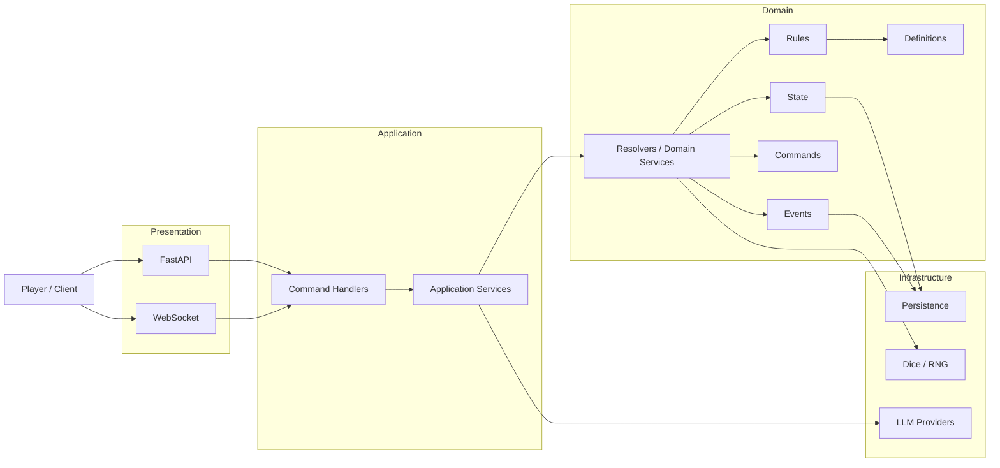

---

## 3. Контракты / Contracts

В проекте существуют пять основных контрактов:

```text
Definition
State
Command
Event
ResolutionResult
```

Контракты определяют не только формат данных, но и **жизненный цикл**.

---

### 3.1. Definition Contract

Definition описывает объект правил.

Пример:

```python
@dataclass(frozen=True)
class Definition:
    id: str
    version: int
```

Основные поля:

```text
id
version
```

Дополнительные поля определяются конкретным Definition. `name` не является
обязательным полем абсолютно всех будущих Definitions.

#### 3.1.1. Minimal Phase 1 Definition Contracts

Phase 1 начинает Core с минимальных immutable data contracts без полей будущих
Roadmap phases.

##### `ItemDefinition`

```python
@dataclass(frozen=True)
class ItemDefinition:
    id: str
    version: int
    name: str
```

`ItemDefinition` — immutable rules/content definition. Он не содержит item
instance ID, owner ID, quantity, equipped state, durability, container state или
campaign-specific fields.

##### `WeaponDefinition`

`WeaponDefinition IS-A ItemDefinition`.

`DamageType` — закрытый Domain `StrEnum`:

```python
from enum import StrEnum


class DamageType(StrEnum):
    ACID = "acid"
    BLUDGEONING = "bludgeoning"
    COLD = "cold"
    FIRE = "fire"
    FORCE = "force"
    LIGHTNING = "lightning"
    NECROTIC = "necrotic"
    PIERCING = "piercing"
    POISON = "poison"
    PSYCHIC = "psychic"
    RADIANT = "radiant"
    SLASHING = "slashing"
    THUNDER = "thunder"
```

Канонический Phase 1 closed set и его lowercase domain/serialized values:

```text
acid
bludgeoning
cold
fire
force
lightning
necrotic
piercing
poison
psychic
radiant
slashing
thunder
```

```python
@dataclass(frozen=True)
class WeaponDefinition(ItemDefinition):
    damage_dice: str
    damage_type: DamageType
    properties: tuple[str, ...]
```

В Phase 1 `damage_dice` хранит простое dice expression вида `NdM`, например
`1d8`; сложный dice parser сейчас не проектируется. `damage_type` использует
только `DamageType`. На будущей serialization boundary `DamageType`
сериализуется через его lowercase string value. `properties` имеют immutable
semantics; serializer представляет tuple обычным JSON array.

`WeaponDefinition` не содержит attack bonus, current wielder, equipped slot,
ammunition count, current condition, magic bonuses или runtime item identity.

##### `MonsterDefinition`

```python
@dataclass(frozen=True)
class MonsterDefinition:
    id: str
    version: int
    name: str
    ability_scores: AbilityScores
```

`MonsterDefinition` — immutable template/rules definition. Он не содержит
current HP, current conditions/effects, position, combat turn data, monster
runtime ID или inventory/equipment state. AC, speed, CR, senses, actions,
spellcasting и другие поля будущих phases добавляются только тогда, когда их
потребует Roadmap.

---

#### Правила Definition

Definition:

```text
CREATE
   ↓
LOAD
   ↓
READ
```

Не допускается:

```text
Definition
   ↓
UPDATE
```

во время игровой сессии.

То есть:

```text
Definition = immutable
```

Если изменилось правило, создаётся новая версия Definition/Ruleset.

---

#### Definition lifecycle

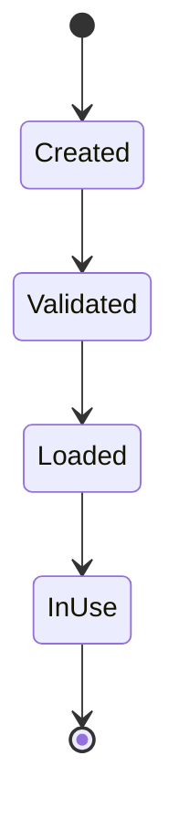

Изменение:

```text
old definition
      ≠
new definition
```

а не:

```text
old definition → mutation
```

---

### 3.2. State Contract

State описывает конкретный экземпляр в конкретной кампании.

#### 3.2.1. Minimal Phase 1 CreatureState Contract

Каноническая Python-семантика:

```python
@dataclass
class CreatureState:
    id: str
    definition_id: str
    ability_scores: AbilityScores
    current_hp: int
    max_hp: int
```

Канонические имена HP:

```text
Python: current_hp, max_hp
JSON:   currentHp, maxHp
```

Invariants:

```text
max_hp >= 1
0 <= current_hp <= max_hp
```

`CreatureState` — mutable campaign-scoped State; owner — Creature Domain. `id`
является runtime instance ID, а `definition_id` — отдельной ссылкой на immutable
Definition. Runtime ID никогда не выводится из Definition ID. Вложенный
`AbilityScores` сохраняет immutable Value Object semantics.

Combat Engine, AI, API и другие подсистемы не мутируют `CreatureState` напрямую.
Все изменения проходят через canonical Command → Resolver → Event → Creature
State Owner flow.

В Phase 1 `CreatureState` не содержит skills, saving throw results, proficiency,
conditions, effects, movement, position, initiative, turn resources, equipment
или inventory. Зафиксированный ownership этих понятий не требует преждевременно
добавлять их в минимальную модель.

State:

```text
mutable
campaign-scoped
versioned
persisted
```

В отличие от Definition:

```text
Definition → immutable
State      → mutable
```

---

#### 3.2.2. Minimal Phase 1 CampaignState Contract

Каноническая Python-семантика:

```python
@dataclass
class CampaignState:
    id: str
    ruleset_id: str
    ruleset_version: str
```

`CampaignState` — mutable campaign-scoped State; owner — Campaign Engine /
CampaignStateManager. `id` является runtime Campaign ID. `ruleset_id` и
`ruleset_version` являются отдельными строковыми полями и вместе образуют
минимальную ссылку на Ruleset identity и его версию.

Минимальная Phase 1 модель не содержит другие State domains. В частности,
`CreatureState`, `WorldState`, `CombatState`, `QuestState`, `InventoryState` и
`EquipmentState` не становятся полями или вложенными коллекциями
`CampaignState`. `WorldState`
остаётся единственным authoritative owner world/game time.

Global campaign metadata, session state и campaign lifecycle концептуально
относятся к Campaign ownership, но их concrete fields отложены до появления
соответствующих use cases и канонических контрактов. Persistence snapshot может
агрегировать несколько State domains отдельно; snapshot containment не меняет
State Ownership и не превращает `CampaignState` в aggregate или God Object.

---

#### 3.2.3. Minimal Phase 1 StateSnapshot Contract

Каноническая Python-семантика:

```python
@dataclass(frozen=True)
class StateSnapshot:
    campaign: CampaignState
    creatures: tuple[CreatureState, ...]
```

`StateSnapshot` — persistence grouping текущих State Owner objects для одного
snapshot, а не новый gameplay State Owner. `CampaignState` сохраняет только
Campaign ownership, а каждый `CreatureState` — Creature ownership; containment
в snapshot не разрешает cross-domain mutation и не передаёт Creature ownership
кампании.

Phase 1 snapshot допускает ноль, один или несколько `CreatureState`. Runtime
ID существ внутри одного snapshot уникальны. Snapshot не имеет собственного
runtime ID, revision или optimistic-concurrency version и не содержит Event
Log, Commands, AI context либо State из будущих фаз.

---

#### State lifecycle

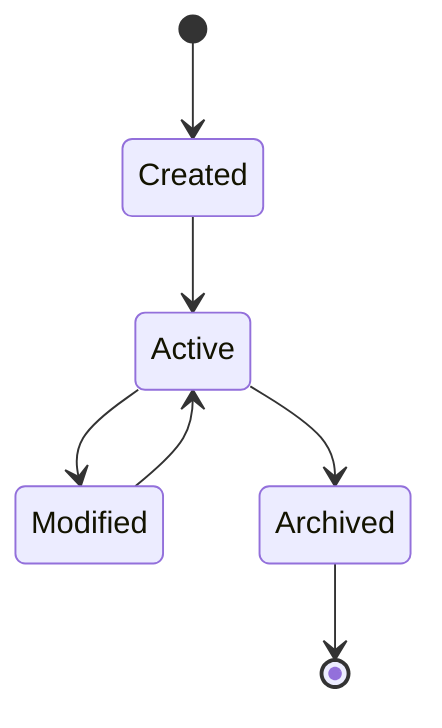

State изменяется **только через Domain операции / обработчики событий**.

Не допускается прямое изменение из:

```text
AI
UI
API route
LLM
```

Например запрещено:

```python
character.current_hp -= 10
```

в API.

Должно происходить:

```text
AttackCommand
      ↓
AttackResolver
      ↓
DamageApplied
      ↓
State mutation
```

---

### 3.3. Command Contract

Command — намерение выполнить игровое действие.

Канонический внешний/логический формат остаётся Command Envelope из §9:

```json
{
  "commandId": "command_000001",
  "type": "AttackCommand",
  "campaignId": "campaign_001",
  "actorId": "character_001",
  "payload": {
    "targetId": "monster_001",
    "weaponId": "item_001"
  }
}
```

Этот JSON/boundary contract и валидированное Python-представление описывают
разные стороны одной команды:

```text
serialized / boundary representation
        ↓ validation and mapping
canonical Command Envelope
        ↓
validated application/domain representation
        ↓
concrete typed immutable Command
```

Gameplay Python Commands являются concrete frozen dataclasses с typed payload и
фиксированным `type`. Generic Python `Command` base class с
`payload: dict[str, Any]` не является gameplay contract. Generic inheritance
hierarchy на этом этапе не вводится.

Первый planned concrete contract:

```python
@dataclass(frozen=True)
class AbilityCheckPayload:
    ability: Ability
    dc: int


@dataclass(frozen=True)
class AbilityCheckCommand:
    command_id: str
    campaign_id: str
    actor_id: str
    payload: AbilityCheckPayload
    type: Literal["AbilityCheckCommand"] = field(
        init=False,
        default="AbilityCheckCommand",
    )
```

`actor_id` обязателен. `payload` не содержит arbitrary dictionary внутри
rule-resolution boundary. Эти классы являются Phase 2 preparation contract и
ещё не реализованы.

---

#### Command lifecycle

Канонический жизненный цикл Command описан ровно в одном разделе —
[§9.7 Command lifecycle](#97-command-lifecycle). Здесь он намеренно не
дублируется: два независимых описания одного жизненного цикла уже разошлись
(DEC-0015).

Главное правило:

> Command не является фактом.

Например:

```text
AttackCommand
```

не означает:

```text
AttackHit
```

Он лишь просит Engine попытаться выполнить атаку.

---

### 3.4. Event Contract

Event описывает уже произошедший факт.

Базовая схема:

```python
@dataclass(frozen=True)
class GameEvent:
    event_id: str
    command_id: str
    type: str
    version: int

    campaign_id: str

    timestamp: datetime

    actor_id: str | None

    caused_by: str | None

    payload: Mapping[str, JSONValue]
```

В Phase 1 используется один generic immutable Domain-тип `GameEvent`, который
соответствует каноническому Event Envelope. Отдельный Python-тип
`EventEnvelope` не вводится. `timestamp` и `event_id` передаются при создании
явно; `GameEvent` не читает системные часы и не выделяет ID.

`payload` содержит только JSON-совместимые значения и при создании Event
рекурсивно копируется в неизменяемое представление: mappings становятся
неизменяемыми mappings, а list/tuple — tuple. Поэтому исходные mutable
коллекции и сохранённый payload не могут изменить опубликованный Event.

Пример:

```json
{
  "eventId": "event_000124",
  "commandId": "command_000001",
  "type": "DamageApplied",
  "version": 1,
  "campaignId": "campaign_001",
  "timestamp": "2026-08-20T18:42:10Z",
  "actorId": "character_001",
  "causedBy": "event_000123",
  "payload": {
    "targetId": "monster_001",
    "amount": 10,
    "damageType": "slashing"
  }
}
```

---

#### Event lifecycle

Event нельзя редактировать после публикации.

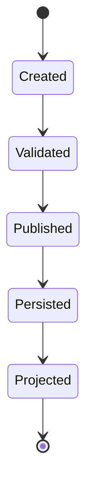

После:

```text
Published
```

Event становится immutable.

Если была ошибка:

```text
НЕ исправлять старый Event
```

а создать новый корректирующий Event.

Например:

```text
DamageApplied(10)
        ↓
DamageCorrected(-3)
```

---

### 3.5. ResolutionResult Contract

`ResolutionResult[T]` — immutable typed результат обработки одной Command.

Он не является State и не является Event.

```python
T = TypeVar("T")


@dataclass(frozen=True)
class ResolutionResult(Generic[T]):
    success: bool
    command_id: str
    outcome: T | None
    rolls: tuple[DiceRoll, ...]
    events: tuple[GameEvent, ...]
    errors: tuple[EngineError, ...]
```

`success` означает, что command/application processing и rule resolution
успешно завершены. Это **не** gameplay outcome. Например, будущая проваленная
Ability Check представляется так:

```text
ResolutionResult.success is True
outcome.succeeded is False
errors == ()
```

Command успешно обработана, хотя персонаж провалил проверку. Ожидаемая
application/domain processing failure имеет другую форму:

```text
ResolutionResult.success is False
outcome is None
events == ()
errors != ()
```

Отдельного concrete `StateChange` contract пока нет, поэтому
`state_changes` не является полем `ResolutionResult`. Authoritative State
mutation pipeline остаётся Event-driven: Events применяются владельцами State.
Необходимость отдельного representation рассматривается при первом concrete
state-mutating Phase 2 mechanic, а не вводится placeholder abstraction заранее.

Modifiers в будущих rules применяются на уровне rule resolution. Они не
расширяют strict Phase 1 `DiceEngine` parser и не входят в `DiceRoll.total`.

---

### 3.6. Shared orchestration abstractions are deferred

Для начала Phase 2 не требуются concrete `GameEngine` или `GameContext`.
Первый vertical slice использует explicit Application handler/use case и
прямой вызов concrete Domain resolver.

Не вводятся заранее:

```text
GameEngine.execute(...)
CommandBus
EventBus
generic resolver registry
generic handler registry
dispatcher
transaction coordinator
GameContext implementation
```

Общая Engine orchestration abstraction появляется только тогда, когда несколько
concrete Commands выявят реально повторяющееся поведение. Engine остаётся
системой слоёв и модулей, а не одним монолитным классом или framework,
спроектированным по одному use case.

---

### 3.7. Общий жизненный цикл игрового действия / Action Lifecycle

Все игровые действия должны проходить через один базовый pipeline:

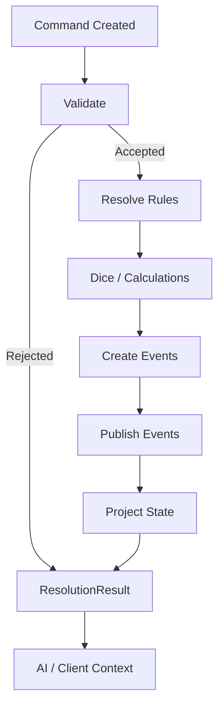

Для read-only Command этап State projection является no-op: Event всё ещё может
фиксировать domain fact, но `StateStore.save()` не вызывается.

---

### 3.8. Atomicity

Одна Command является одной логической транзакцией.

Например:

```text
AttackCommand
```

может породить:

```text
AttackResolved
AttackHit
DamageApplied
CreatureDefeated
QuestObjectiveUpdated
```

Но Engine должен либо успешно применить всю допустимую последовательность, либо вернуть failure без частично применённого результата.

Концептуально:

```text
Command
   │
   ├── validation
   ├── resolution
   └── event creation
         │
         ▼
      COMMIT
         │
         ▼
     State Update
```

---

### 3.9. Error Contract

Ожидаемые command/application/domain failures имеют минимальное structured
Domain representation:

```python
class ErrorCode(StrEnum):
    INVALID_COMMAND = "INVALID_COMMAND"
    ENTITY_NOT_FOUND = "ENTITY_NOT_FOUND"
    DEFINITION_NOT_FOUND = "DEFINITION_NOT_FOUND"
    ACTION_NOT_AVAILABLE = "ACTION_NOT_AVAILABLE"
    INVALID_TARGET = "INVALID_TARGET"
    OUT_OF_RANGE = "OUT_OF_RANGE"
    NOT_VISIBLE = "NOT_VISIBLE"
    RESOURCE_NOT_AVAILABLE = "RESOURCE_NOT_AVAILABLE"
    INVALID_STATE = "INVALID_STATE"
    RULE_VIOLATION = "RULE_VIOLATION"


@dataclass(frozen=True)
class EngineError:
    code: ErrorCode
    message: str
    entity_id: str | None = None
    field: str | None = None
```

`EngineError` описывает ожидаемую structured processing failure и входит в
`ResolutionResult.errors`. Большая exception hierarchy не создаётся.
Intrinsic invalid construction Python object может использовать `TypeError` и
`ValueError`. Infrastructure и programming failures не преобразуются
автоматически в gameplay errors. `ErrorCode` и `EngineError` пока являются
Phase 2 preparation contract и ещё не реализованы.

Пример:

```json
{
  "code": "ACTION_NOT_AVAILABLE",
  "message": "Creature has already used its action.",
  "entityId": "character_001",
  "field": null
}
```

Базовые категории:

```text
INVALID_COMMAND
ENTITY_NOT_FOUND
DEFINITION_NOT_FOUND
ACTION_NOT_AVAILABLE
INVALID_TARGET
OUT_OF_RANGE
NOT_VISIBLE
RESOURCE_NOT_AVAILABLE
INVALID_STATE
RULE_VIOLATION
```

AI должен получать `code`, а не пытаться парсить произвольный текст ошибки.

---

### 3.10. Minimal Phase 2 Ability Check preparation

Первый рекомендуемый Phase 2 vertical slice, ещё не реализованный:

```text
AbilityCheckCommand
        ↓
Application validation / State lookup
        ↓
CreatureState
        ↓
resolve_ability_check(...)
        ↓
AbilityCheckResult
        ↓
AbilityCheckResolved
        ↓
ResolutionResult[AbilityCheckResult]
```

Canonical closed ability identifier:

```python
class Ability(StrEnum):
    STRENGTH = "strength"
    DEXTERITY = "dexterity"
    CONSTITUTION = "constitution"
    INTELLIGENCE = "intelligence"
    WISDOM = "wisdom"
    CHARISMA = "charisma"
```

`Ability` переиспользуется будущими Ability Checks, Saving Throws и Skills и
безопаснее arbitrary `str`. Enum пока не реализован.

Ability modifier является pure derived Domain rule:

```text
ability_modifier(score) = (score - 10) // 2
```

Canonical `AbilityScores` range остаётся `1..30`. Modifier не хранится в
`AbilityScores` или State; `AbilityScores` остаётся Phase 1 Value Object, а
derived calculation принадлежит Rule Engine rules.

`dc` является exact `int` на concrete validated Command boundary (`bool` не
является integer DC). Arbitrary hard range вроде `5..30` не вводится: значения
вне common recommended DCs сами по себе не являются основанием для rejection.

Future resolver boundary:

```python
def resolve_ability_check(
    command: AbilityCheckCommand,
    creature: CreatureState,
    dice: DiceEngine,
) -> AbilityCheckResult:
    ...
```

Resolver выполняет только rule resolution, не мутирует `CreatureState` и делает
ровно один `dice.roll("1d20")`. Он не загружает State, не знает `StateStore`, не
сохраняет State, не создаёт Event ID, не читает clock, не сериализует и не
импортирует Infrastructure/Application. Application загружает snapshot, находит
actor, вызывает resolver, добавляет Event envelope metadata и собирает
`ResolutionResult`.

Future result:

```python
@dataclass(frozen=True)
class AbilityCheckResult:
    ability: Ability
    dc: int
    roll: DiceRoll
    modifier: int
    total: int
    succeeded: bool
```

`roll.total` — raw dice result. `AbilityCheckResult.total` равен
`roll.total + modifier`; `succeeded` равен `total >= dc`. Контракт Phase 1
`DiceRoll` не меняется, а dice notation не расширяется modifiers,
advantage/disadvantage или keep/drop syntax.

Ability Check не мутирует State. Обычный handler вызывает
`StateStore.load(...)`, но не `StateStore.save(...)`. После successful rule
resolution Application создаёт один `AbilityCheckResolved` через существующий
generic `GameEvent` envelope; resolver Event не создаёт. Отдельные
`AbilityCheckSucceeded` и `AbilityCheckFailed` не вводятся — gameplay outcome
находится в `payload.succeeded`.

Future payload v1:

```json
{
  "ability": "strength",
  "dc": 15,
  "roll": {
    "expression": "1d20",
    "rolls": [7],
    "total": 7
  },
  "modifier": -1,
  "total": 6,
  "succeeded": false
}
```

Envelope уже содержит `eventId`, `commandId`, `type`, `version`, `campaignId`,
`timestamp`, `actorId` и `causedBy`; payload их не дублирует. EventStore,
runtime Event persistence, replay, GameEngine и dispatcher остаются deferred.

---

## 4. ID System

ID являются частью архитектурного контракта.

Основное правило:

> **ID идентифицирует объект, но не содержит игровую логику.**

ID не должен использоваться как:

```text
class identifier
type identifier
business rule
state
status
```

---

### 4.1. Definition IDs

Definition ID — постоянный, семантический, читаемый человеком.

Формат:

```text
<lowercase_snake_case>
```

Примеры:

```text
fighter
wizard
goblin
human
longsword
chain_mail
fireball
bless
poisoned
extra_attack
```

Запрещено:

```text
Fighter
Longsword01
fighter-1
FireBall
```

Правильно:

```text
fighter
longsword
fireball
```

---

### 4.2. Instance / State IDs

Runtime ID используется для конкретного экземпляра.

Формат MVP:

```text
<entity_type>_<numeric_sequence>
```

Примеры:

```text
character_001
npc_001
monster_001
item_001
combat_001
quest_001
location_001
effect_001
condition_001
```

Для player:

```text
player_001
player_002
```

---

### 4.3. Почему State ID не должен повторять Definition ID / State ID vs Definition ID

Нельзя:

```text
character.id = "fighter"
```

Потому что:

```text
fighter
```

— Definition.

Конкретный персонаж:

```text
character_001
```

и:

```json
{
  "id": "character_001",
  "definitionId": "fighter"
}
```

---

### 4.4. Event IDs

Формат:

```text
event_<6 digits>
```

Примеры:

```text
event_000001
event_000002
event_000003
```

Номер монотонно увеличивается в рамках Event Store кампании.

Event ID никогда не переиспользуется.

---

### 4.5. Command IDs

Формат:

```text
command_<6 digits>
```

Примеры:

```text
command_000001
command_000002
command_000003
```

Command ID используется для:

* idempotency;
* debugging;
* tracing;
* связи Command → Events.

---

### 4.6. Ruleset ID

Ruleset использует:

```text
<system>_<edition>
```

Например:

```text
dnd_5e
```

Версия находится отдельно:

```json
{
  "id": "dnd_5e",
  "version": "5.2.1"
}
```

---

### 4.7. Version IDs

Версия не кодируется в обычный Definition ID.

Неправильно:

```text
fireball_5_2_1
```

Правильно:

```json
{
  "id": "fireball",
  "version": 1
}
```

А версия Ruleset определяется сверху:

```json
{
  "ruleset": {
    "id": "dnd_5e",
    "version": "5.2.1"
  }
}
```

---

### 4.8. ID никогда не переиспользуется / ID Reuse

Если:

```text
npc_001
```

был удалён из мира, новый NPC не должен получать:

```text
npc_001
```

Должен появиться:

```text
npc_002
```

Это необходимо для Event History и Replay.

---

### 4.9. ID не изменяется / ID Immutability

Запрещено:

```text
character_001
    ↓
character_005
```

Если имя персонажа изменилось:

```text
id = character_001
name = "Aragorn"
```

остается тем же.

---

### 4.10. Scope

ID имеют область уникальности.

#### Definition

Уникален внутри Ruleset:

```text
ruleset + definition_id
```

#### State

Уникален внутри Campaign:

```text
campaign + state_id
```

#### Event

Уникален внутри Campaign Event Store:

```text
campaign + event_id
```

#### Command

Уникален в рамках Campaign/session command stream.

---

### 4.11. Политика генерации новых ID / ID Generation Policy

Новые ID генерируются только соответствующим сервисом.

```text
DefinitionRegistry
    → Definition IDs

EntityFactory
    → Entity IDs

CommandFactory
    → Command IDs

EventStore
    → Event IDs
```

UI и AI не должны самостоятельно генерировать ID.

Например AI не должен отправлять:

```json
{
  "targetId": "monster_777"
}
```

если такого объекта нет.

AI выбирает существующий ID из предоставленного ему Context.

---

### 4.12. Canonical ID registry

На текущем этапе проекта зафиксированы следующие ID.

#### Ruleset

```text
dnd_5e
```

#### Definition IDs

```text
fighter
wizard
human
goblin

longsword
chain_mail

fireball
bless

poisoned
extra_attack
```

Эти ID использовались в архитектурных примерах и являются **зарезервированными демонстрационными Definition ID**.

---

#### Campaign IDs

```text
campaign_001
```

---

#### Player Identity / Character State IDs

```text
player_001
player_002

character_001
character_002
```

`player_*` используется только для `PlayerIdentity` — идентичности игрока в UI/API-контексте.

`character_*` используется для `CharacterState` — runtime-состояния игрового персонажа.

Эти понятия не смешиваются:

```text
PlayerIdentity (player_001)
   ↓
CharacterState (character_001)
```

являются различными сущностями.

---

#### NPC IDs

```text
npc_001
npc_002
```

---

#### Monster IDs

```text
monster_001
monster_002
monster_003
```

Each runtime monster keeps its Definition separately: `monster_001` has
`definitionId: goblin`.

---

#### Item Instance IDs

```text
item_001
item_002
```

В runtime используется:

```json
{
  "id": "item_001",
  "definitionId": "longsword"
}
```

Не используйте `longsword_001` как runtime ID; `longsword` остаётся
semantic Definition ID.

---

#### Combat IDs

```text
combat_001
```

---

#### Quest IDs

```text
quest_001
quest_goblin_01
```

Для Definition/Content quest допускается semantic ID.

Для runtime QuestState рекомендуется:

```text
quest_001
```

---

#### Quest Objective IDs

```text
objective_001
```

---

#### Location IDs

```text
location_001
ancient_ruins
```

Для уникального сюжетного content разрешены semantic IDs:

```text
ancient_ruins
red_city
mountain_pass
```

Для runtime instances:

```text
location_001
location_002
```

---

#### Effect IDs

```text
effect_001
```

Definition:

```text
bless
```

State:

```text
effect_001
```

---

#### Condition IDs

Definition:

```text
poisoned
blinded
frightened
```

State:

```text
condition_001
condition_002
```

---

#### Event IDs

```text
event_000001
event_000002
event_000003
```

---

#### Command IDs

```text
command_000001
command_000002
command_000003
```

---

### 4.13. Сводная таблица ID / ID Reference Table

| Сущность          | Формат           | Пример           |
| ----------------- | ---------------- | ---------------- |
| Ruleset           | `snake_case`     | `dnd_5e`         |
| Definition        | `snake_case`     | `longsword`      |
| Character         | `character_NNN`  | `character_001`  |
| Player Identity   | `player_NNN`     | `player_001`     |
| NPC               | `npc_NNN`        | `npc_001`        |
| Monster Instance  | `monster_NNN`    | `monster_001`    |
| Item Instance     | `item_NNN`       | `item_001`       |
| Combat            | `combat_NNN`     | `combat_001`     |
| Quest State       | `quest_NNN`      | `quest_001`      |
| Objective         | `objective_NNN`  | `objective_001`  |
| Location Instance | `location_NNN`   | `location_001`   |
| Effect State      | `effect_NNN`     | `effect_001`     |
| Condition State   | `condition_NNN`  | `condition_001`  |
| Command           | `command_NNNNNN` | `command_000001` |
| Event             | `event_NNNNNN`   | `event_000001`   |

---

## 5. Контроль архитектуры / Architecture Control

До добавления новой сущности в проект необходимо определить:

```text
1. Это Definition или State?
2. Какой у неё ID?
3. Кто владеет её жизненным циклом?
4. Какие Commands могут её изменить?
5. Какие Events она создаёт?
6. На какие Events она реагирует?
7. Где она хранится?
8. Как она сериализуется?
9. Может ли AI видеть её?
10. Что является источником истины?
```

---

## 6. Канонический жизненный цикл / Canonical Lifecycle

Вся игра должна в конечном итоге сводиться к:

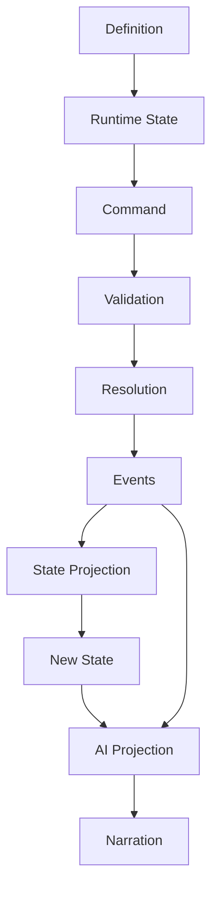

---

## 7. Архитектурная формула / Architecture Formula

Фундамент проекта:

```text
                    RULESET
                       │
                       ▼
                 DEFINITIONS
                       │
                       ▼
                    STATE
                       │
                       ▼
                   COMMAND
                       │
                       ▼
                  VALIDATION
                       │
                       ▼
                   RESOLVER
                       │
              ┌────────┼────────┐
              ▼        ▼        ▼
            RULES     DICE   MODIFIERS
              │        │        │
              └────────┼────────┘
                       ▼
                    EVENTS
                       │
                       ▼
                 STATE UPDATE
                       │
                       ▼
                  AI CONTEXT
                       │
                       ▼
                     AI DM
                       │
                       ▼
                  NARRATION
```

Это является базовым техническим контрактом проекта.

Все последующие модули — Combat, Magic, World, Quest, NPC AI и Web UI — должны встраиваться в этот pipeline, а не создавать альтернативный путь изменения игрового состояния.

## 8. Event Envelope

Event Envelope — единый транспортный формат для **всех фактов**, произошедших в игре.

Event не является командой, запросом или намерением.

> **Event = неизменяемый факт, который уже произошёл.**

Например:

```text
AttackCommand
      │
      ▼
AttackResolved
      │
      ▼
AttackHit
      │
      ▼
DamageApplied
```

Каждый Event должен иметь одинаковый внешний envelope, независимо от того, относится он к Combat, World, Quest, Inventory или AI.

---

### 8.1. Каноническая схема Event / Canonical Event Schema

```json
{
  "eventId": "event_000124",
  "commandId": "command_000001",
  "type": "DamageApplied",
  "version": 1,

  "campaignId": "campaign_001",

  "timestamp": "2026-08-20T18:42:10Z",

  "actorId": "character_001",

  "causedBy": "event_000123",

  "payload": {
    "targetId": "monster_001",
    "amount": 10,
    "damageType": "slashing"
  }
}
```

---

### 8.2. Поля Event Envelope / Event Envelope Fields

| Поле         | Тип              | Обязательное | Назначение                            |
| ------------ | ---------------- | -----------: | ------------------------------------- |
| `eventId`    | `string`         |           Да | Уникальный ID события                 |
| `commandId`  | `string`         |           Да | ID Command, породившей событие        |
| `type`       | `string`         |           Да | Тип события                           |
| `version`    | `integer`        |           Да | Версия схемы конкретного типа Event   |
| `campaignId` | `string`         |           Да | Кампания, в которой произошло событие |
| `timestamp`  | `datetime`       |           Да | Время создания события в системе      |
| `actorId`    | `string \| null` |          Нет | Сущность, инициировавшая действие     |
| `causedBy`   | `string \| null` |          Нет | Event, породивший это событие         |
| `payload`    | `object`         |           Да | Специфические данные события          |

---

### 8.3. `eventId`

Формат:

```text
event_000001
event_000002
event_000003
```

`eventId`:

* уникален;
* никогда не переиспользуется;
* не изменяется;
* не содержит игрового смысла;
* используется для трассировки и связи событий.

---

### 8.4. `type`

`type` определяет конкретный тип Event.

Например:

```text
AttackResolved
AttackHit
AttackMissed
DamageApplied
HealingApplied

SpellCast
ConcentrationBroken

ItemAdded
ItemRemoved

QuestStarted
QuestCompleted

CreatureDefeated
WorldTimeAdvanced
```

`type` должен быть стабильным API/domain-контрактом.

Не следует использовать произвольные текстовые значения вроде:

```text
"goblin got hurt"
"something happened"
```

Используется строго типизированное событие:

```text
DamageApplied
```

---

### 8.5. `version`

`version` относится к **схеме конкретного Event**, а не к Ruleset.

Например:

```json
{
  "type": "DamageApplied",
  "version": 1
}
```

Если структура payload изменяется несовместимым образом:

```text
DamageApplied v1
        ↓
DamageApplied v2
```

Старые события не переписываются.

Это позволяет:

* читать старую историю;
* мигрировать события;
* воспроизводить старые кампании;
* поддерживать несколько версий сериализации.

---

### 8.6. `campaignId`

Каждый Event принадлежит ровно одной кампании.

```text
campaignId
     │
     ▼
Event Store
```

Event из другой кампании не может изменить State текущей кампании.

---

### 8.7. `timestamp`

`timestamp` описывает момент создания Event в системе.

В Domain это явно переданный timezone-aware UTC `datetime`. `GameEvent` не
вызывает системные часы; naive и non-UTC значения не принимаются. При
сериализации timestamp представляется как ISO 8601 UTC с каноническим суффиксом
`Z`.

Формат:

```text
ISO 8601 / UTC
```

Например:

```text
2026-08-19T16:42:10Z
```

Игровое время и системное время — разные понятия.

Например:

```json
{
  "timestamp": "2026-08-19T16:42:10Z",
  "payload": {
    "worldTime": {
      "day": 14,
      "hour": 18,
      "minute": 42
    }
  }
}
```

`timestamp` не заменяет `GameTime`.

Это wall-clock время создания Event, независимое от игрового/world time. Оно
также не является ключом порядка Event: порядок задаётся Event Store sequence
и монотонными Event ID согласно §12.11.

---

### 8.8. `actorId`

`actorId` — сущность, непосредственно инициировавшая действие.

Например:

```text
character_001
npc_003
monster_002
system
```

Если Event является автоматическим:

```json
{
  "actorId": null
}
```

или используется специальный системный actor, если это требуется конкретной подсистеме.

Канонический serializer всегда выводит `actorId`, используя JSON `null` для
Domain `None`. При десериализации отсутствующее поле и явный `null` означают
`None` только для этого nullable поля Event Envelope.

---

### 8.9. `causedBy`

`causedBy` хранит причинную связь между событиями.

Например:

```text
AttackResolved
        │
        ▼
AttackHit
        │
        ▼
DamageApplied
        │
        ▼
CreatureDroppedToZeroHP
        │
        ▼
CreatureDefeated
```

Конкретно:

```text
event_101 AttackResolved
       │
       └── causedBy: null

event_102 AttackHit
       │
       └── causedBy: event_101

event_103 DamageApplied
       │
       └── causedBy: event_102

event_104 CreatureDefeated
       │
       └── causedBy: event_103
```

Это позволяет восстановить цепочку причин.

Канонический serializer всегда выводит `causedBy`, используя JSON `null` для
Domain `None`. При десериализации отсутствующее поле и явный `null` означают
`None` только для этого nullable поля Event Envelope.

---

### 8.10. `payload`

`payload` содержит только данные, специфичные для конкретного Event.

Например:

```json
{
  "type": "DamageApplied",
  "version": 1,

  "payload": {
    "targetId": "monster_001",
    "amount": 10,
    "damageType": "slashing"
  }
}
```

Не следует помещать в payload общие поля Envelope:

```text
eventId
commandId
campaignId
timestamp
actorId
```

Они принадлежат Envelope.

Phase 1 сохраняет payload generic и не вводит типы payload для конкретных
gameplay Events. Domain payload имеет defensive recursively immutable
JSON-like semantics; преобразование неизменяемых mappings/tuples обратно в
обычные JSON objects/arrays выполняется только на serialization boundary.

---

### 8.11. Event lifecycle

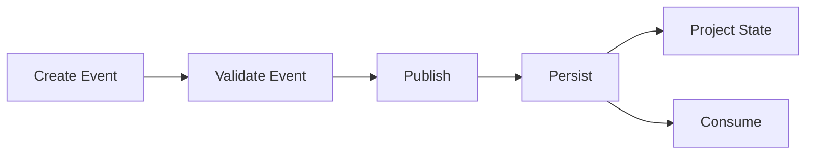

Событие проходит этапы:

```text
Create
   ↓
Validate
   ↓
Publish
   ↓
Persist
   ↓
Project
```

После `Publish` Event считается фактом и не должен редактироваться.

---

### 8.12. Immutable Event Rule

После публикации запрещено:

```text
UPDATE Event
DELETE Event
CHANGE Event
```

Если обнаружена ошибка, создаётся новое событие.

Например:

```text
DamageApplied
amount = 12
        │
        ▼
DamageCorrected
amount = -2
```

История сохраняется полностью.

---

### 8.13. Event naming convention

Используется:

```text
PascalCase + past tense
```

Хорошо:

```text
AttackResolved
AttackHit
AttackMissed
DamageApplied
ItemAdded
SpellCast
QuestCompleted
```

Плохо:

```text
attack
doDamage
apply_damage
playerDidSomething
```

Название должно отвечать на вопрос:

> **Что произошло?**

---

### 8.14. Event должен быть domain fact / Domain Fact Rule

Event:

```text
DamageApplied
```

правильно.

Event:

```text
ApplyDamage
```

неправильно.

Первое — факт.

Второе — команда.

---

## 9. Command Envelope

Command Envelope — единый формат для всех **намерений выполнить действие**.

> **Command = просьба Engine выполнить действие.**

Command ещё не означает, что действие произойдёт.

---

### 9.1. Каноническая схема Command / Canonical Command Schema

```json
{
  "commandId": "command_000001",
  "type": "AttackCommand",

  "campaignId": "campaign_001",

  "actorId": "character_001",

  "payload": {
    "targetId": "monster_001",
    "weaponId": "item_001"
  }
}
```

---

### 9.2. Поля Command Envelope / Command Envelope Fields

| Поле         | Тип      | Обязательное | Назначение                |
| ------------ | -------- | -----------: | ------------------------- |
| `commandId`  | `string` |           Да | Уникальный ID команды     |
| `type`       | `string` |           Да | Тип команды               |
| `campaignId` | `string` |           Да | Кампания                  |
| `actorId`    | `string` |           Да | Инициатор действия        |
| `payload`    | `object` |           Да | Данные конкретной команды |

---

### 9.3. `commandId`

Формат:

```text
command_000001
command_000002
command_000003
```

`commandId`:

* уникален;
* никогда не переиспользуется;
* не меняется;
* используется для idempotency;
* используется для debugging;
* используется для связывания Command и созданных Events.

---

### 9.4. `type`

Примеры:

```text
MoveCommand
AttackCommand
CastSpellCommand
UseItemCommand
EquipItemCommand
UnequipItemCommand

RestCommand
InteractCommand
TalkCommand
SearchCommand

HideCommand
HelpCommand
ReadyCommand
DashCommand
DisengageCommand
DodgeCommand
```

Команда называется как **намерение**, обычно в форме действия.

---

### 9.5. `actorId`

`actorId` определяет, кто пытается совершить действие.

Например:

```json
{
  "actorId": "character_001"
}
```

Engine использует `actorId` для получения State:

```text
actorId
   │
   ▼
CreatureState
   │
   ├── HP
   ├── abilities
   ├── conditions
   ├── resources
   ├── equipment
   └── position
```

---

### 9.6. `payload`

`payload` содержит только параметры конкретной команды.

На serialized boundary это JSON object. После validation он маппится в
concrete typed immutable payload соответствующей Python Command (§3.3), а не
передаётся в rule resolver как arbitrary `dict[str, Any]`.

Например:

```json
{
  "type": "MoveCommand",
  "actorId": "character_001",
  "payload": {
    "destination": {
      "x": 10,
      "y": 14
    }
  }
}
```

Для атаки:

```json
{
  "type": "AttackCommand",
  "actorId": "character_001",
  "payload": {
    "targetId": "monster_001",
    "weaponId": "item_001"
  }
}
```

---

### 9.7. Command lifecycle

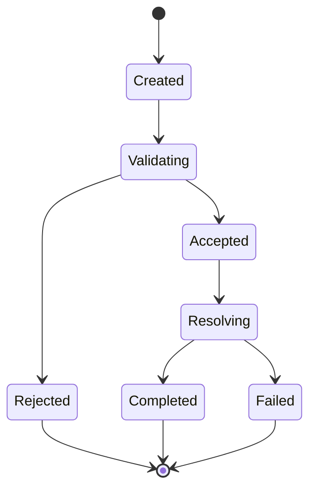

Смысл состояний:

#### `Created`

Команда сформирована AI, UI или другой системой.

#### `Validating`

Engine проверяет:

* существует ли actor;
* существует ли target;
* доступно ли действие;
* находится ли actor в правильном состоянии;
* соблюдаются ли prerequisites.

#### `Rejected`

Команда не может быть выполнена.

Например:

```text
ACTION_NOT_AVAILABLE
OUT_OF_RANGE
INVALID_TARGET
NOT_VISIBLE
RESOURCE_NOT_AVAILABLE
```

#### `Accepted`

Команда прошла initial validation.

#### `Resolving`

Engine вычисляет результат.

#### `Completed`

Команда успешно завершена и породила Events.

#### `Failed`

Команда была принята, но resolution завершился ошибкой доменного уровня.

---

### 9.8. Command ≠ Event

Это фундаментальное правило.

```text
Command:
"Я хочу атаковать."

Event:
"Атака попала."

```

Например:

```text
AttackCommand
       │
       ▼
AttackResolver
       │
       ├──────────────► AttackMissed
       │
       └──────────────► AttackHit
                              │
                              ▼
                        DamageApplied
```

Одна Command может создать:

```text
0
1
2
N
```

Events.

---

### 9.9. Command не изменяет State напрямую / No Direct State Mutation

Запрещено:

```text
Command
   ↓
State mutation
```

Правильно:

```text
Command
   ↓
Validation
   ↓
Resolution
   ↓
Events
   ↓
State projection
```

Это сохраняет единый путь изменения состояния.

---

### 9.10. Idempotency

`commandId` используется как idempotency key.

Если одна и та же команда пришла дважды:

```text
command_000123
```

Engine не должен повторно выполнить действие.

Система должна определить:

```text
command_000123 already processed
```

и вернуть ранее сохранённый `ResolutionResult`.

Это особенно важно для:

* WebSocket reconnect;
* повторных HTTP requests;
* network retries;
* multiplayer;
* AI retries.

---

### 9.11. Command → Event correlation

Все Events, созданные одной Command, должны быть связаны с ней.

`commandId` — обязательное поле Event Envelope: оно сохраняется для всех
cascading Events, связывает их с одной logical Command transaction и
используется для tracing, replay и audit. Системные действия входят в тот же
authoritative pipeline через system/internal Command; бесхозные Events вне
Command lifecycle запрещены.

Канонический Event example:

```json
{
  "eventId": "event_000124",
  "commandId": "command_000001",
  "type": "DamageApplied",
  "version": 1,
  "campaignId": "campaign_001",
  "timestamp": "2026-08-20T18:42:10Z",
  "actorId": "character_001",
  "causedBy": "event_000123",
  "payload": {
    "targetId": "monster_001",
    "amount": 10,
    "damageType": "slashing"
  }
}
```

Таким образом:

```text
Command
   │
   ├── Event
   ├── Event
   └── Event
```

можно восстановить напрямую.

Все Events одной Command имеют одинаковый `commandId`. `causedBy` сохраняет
отдельную Event → Event causality и не заменяется `commandId`.

---

### 9.12. Full Command/Event chain

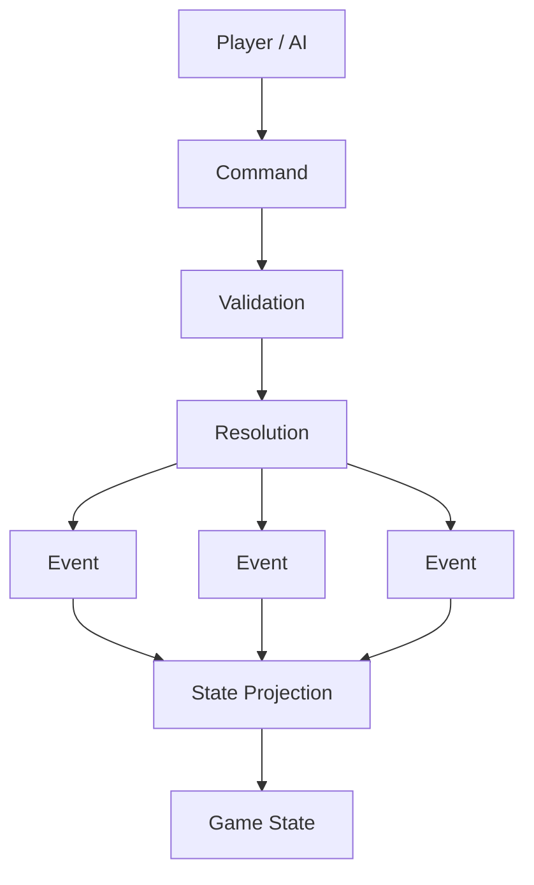

---

## 10. State Ownership

State Ownership определяет, **какая подсистема является владельцем конкретного состояния и кто имеет право его изменять**.

Главное правило:

> **У каждого изменяемого State должен быть один логический владелец.**

Другие подсистемы могут запрашивать данные, создавать Commands или реагировать на Events, но не должны напрямую менять чужой State.

---

### 10.1. Почему нужен State Ownership / Why State Ownership

Без ownership быстро возникает:

```text
CombatEngine ──► character.current_hp
QuestEngine  ──► character.current_hp
AI            ──► character.current_hp
API           ──► character.current_hp
NPC system   ──► character.current_hp
```

В итоге невозможно определить:

* кто изменил значение;
* почему оно изменилось;
* какое правило было применено;
* какое событие должно быть создано.

Вместо этого:

```text
DamageResolver
      │
      ▼
DamageApplied
      │
      ▼
Creature State Owner
      │
      ▼
HP updated
```

---

### 10.2. Ownership Model

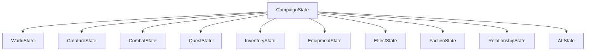

---

### 10.3. Campaign State Owner

**Owner: `CampaignEngine / CampaignStateManager`**

Отвечает за:

```text
campaign identity
ruleset reference
global campaign metadata
session state
campaign lifecycle
```

Другие системы могут изменять отдельные доменные агрегаты только через соответствующие механизмы.

---

### 10.4. Creature State Owner

**Owner: `Creature / CreatureDomain`**

Отвечает за:

```text
HP
abilities
skills
saving throws
resources
conditions
effects
movement
senses
position
life state
```

Но важно разделить **ownership** и **resolution**.

Например `DamageResolver` рассчитывает:

```text
10 damage
```

но не должен самовольно менять:

```text
creature.current_hp -= 10
```

Он создаёт:

```text
DamageApplied
```

После применения Event:

```text
CreatureState.current_hp
```

изменяется владельцем State.

---

### 10.5. Inventory State Owner

**Owner: `InventoryEngine`**

Отвечает за:

```text
items
quantities
containers
item ownership
item transfer
item creation/destruction
```

Примеры Commands:

```text
AddItemCommand
RemoveItemCommand
MoveItemCommand
SplitItemCommand
MergeItemCommand
```

Примеры Events:

```text
ItemAdded
ItemRemoved
ItemTransferred
ItemConsumed
```

---

### 10.6. Equipment State Owner

**Owner: `EquipmentEngine`**

Отвечает за:

```text
equipped weapon
equipped armor
shield
equipment slots
```

Например:

```text
EquipItemCommand
       ↓
EquipmentEngine
       ↓
ItemEquipped
       ↓
EquipmentState
```

Inventory Engine не должен самостоятельно решать, находится ли предмет в `mainHand`.

---

### 10.7. Combat State Owner

**Owner: `CombatEngine`**

Отвечает за:

```text
combat lifecycle
participants
initiative
round
turn
active combatant
turn resources
combat positions
combat-specific state
```

Например:

```text
CombatStarted
TurnStarted
TurnEnded
CombatEnded
```

Combat Engine может читать:

```text
CreatureState
```

но не должен напрямую владеть всем CreatureState.

---

### 10.8. Quest State Owner

**Owner: `QuestEngine`**

Отвечает за:

```text
quest status
objectives
objective progress
quest rewards
quest prerequisites
```

Quest Engine реагирует на события:

```text
CreatureDefeated
ItemCollected
LocationDiscovered
NPCInteractionCompleted
```

и создаёт:

```text
QuestObjectiveUpdated
QuestCompleted
```

---

### 10.9. World State Owner

**Owner: `WorldEngine`**

Отвечает за:

```text
locations
location state
doors
world flags
world/game time (the sole authoritative owner)
environment
discovery
world transitions
```

Например:

```text
DoorOpened
LocationDiscovered
WorldTimeAdvanced
```

---

### 10.10. Faction State Owner

**Owner: `FactionEngine`**

Отвечает за:

```text
faction state
territories
relations
reputation
resources
membership
```

Например:

```text
FactionRelationshipChanged
ReputationChanged
FactionMemberAdded
FactionMemberRemoved
```

---

### 10.11. Relationship State Owner

**Owner: `RelationshipEngine`**

Отвечает за отношения между сущностями:

```text
NPC → Character
NPC → NPC
Faction → Faction
Faction → Character
```

Например:

```json
{
  "sourceId": "npc_001",
  "targetId": "character_001",
  "trust": 70,
  "fear": 10,
  "respect": 50
}
```

Другие системы могут инициировать изменение через событие:

```text
NPCRelationshipChanged
```

---

### 10.12. AI State Owner

**Owner: `AI / Memory subsystem`**

AI State не является игровым источником истины.

Он содержит:

```text
NPC memories
known facts
narrative context
conversation context
AI summaries
planning data
```

Например:

```text
dm_memory.json
npc_memory.json
narrative_state.json
```

AI State может быть перестроен из игровых Events и State.

Это принципиально отличает его от Game State.

---

### 10.13. Owner Matrix

| State               | Owner               | Другие системы           |
| ------------------- | ------------------- | ------------------------ |
| `CampaignState`     | Campaign Engine     | read                     |
| `WorldState`        | World Engine        | read / commands / events |
| `CreatureState`     | Creature Domain     | read / commands / events |
| `InventoryState`    | Inventory Engine    | read / commands          |
| `EquipmentState`    | Equipment Engine    | read / commands          |
| `CombatState`       | Combat Engine       | read / commands          |
| `QuestState`        | Quest Engine        | read / events            |
| `FactionState`      | Faction Engine      | read / events            |
| `RelationshipState` | Relationship Engine | read / events            |
| `EffectState`       | Effect Engine       | read / events            |
| `AIState`           | AI subsystem        | read / rebuild           |

---

### 10.14. Read vs Write

Главное правило:

```text
                   OWNER
                     │
             ┌───────┴────────┐
             │                │
           READ              WRITE
             │                │
             ▼                ▼
     Other systems      Owner / Event
```

Другие системы могут читать состояние.

Но изменение должно идти через:

```text
Command
   ↓
Resolver
   ↓
Event
   ↓
Owner
```

---

### 10.15. Example: Damage

Неправильно:

```text
CombatEngine
    ↓
fighter.current_hp -= 10
```

Правильно:

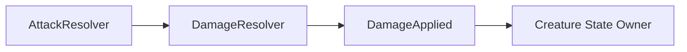

То есть:

```text
DamageResolver
```

отвечает:

> Сколько урона должно быть применено?

А:

```text
Creature State Owner
```

отвечает:

> Как это событие изменяет состояние существа?

---

### 10.16. Example: Quest Update

Неправильно:

```text
CombatEngine
    ↓
quest.objectives[0].current += 1
```

Правильно:

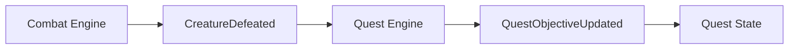

Combat не знает, какие именно квесты существуют.

---

### 10.17. Example: NPC Relationship

Неправильно:

```text
AI
   ↓
npc.relationship.trust += 10
```

Правильно:

```text
NPC interaction
      ↓
Domain Event
      ↓
Relationship Engine
      ↓
RelationshipChanged
      ↓
RelationshipState
```

AI может **предложить** действие или интерпретацию, но не изменяет состояние напрямую.

---

### 10.18. State Ownership Rule

Каждый State-объект должен отвечать на три вопроса:

```text
1. Кто им владеет?
2. Какие Commands могут его изменить?
3. Какие Events фиксируют его изменение?
```

Например:

```text
CreatureState
    │
    ├── Owner:
    │      Creature Domain
    │
    ├── Commands:
    │      Damage
    │      Heal
    │      Move
    │      ApplyEffect
    │
    └── Events:
           DamageApplied
           HealingApplied
           CreatureMoved
           EffectApplied
```

---

### 10.19. Полная схема Ownership

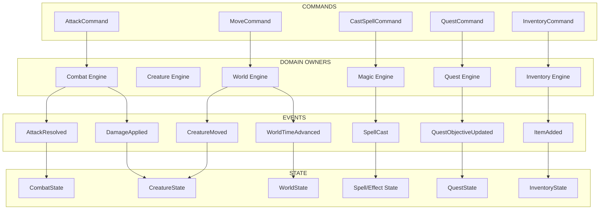

---

### 10.20. Главный принцип Ownership / Core Ownership Principle

В системе запрещён прямой cross-domain mutation:

```text
Domain A
   ✕
   └──► State Domain B
```

Вместо этого:

```text
Domain A
   │
   ▼
Event
   │
   ▼
Domain B
   │
   ▼
State B
```

Таким образом:

```text
Combat
Quest
World
Inventory
Faction
Relationship
AI
```

остаются слабо связанными между собой и взаимодействуют через **Commands, Events и строго определённые State boundaries**.

---

## 11. Канонический Command → Event → State цикл / Canonical Cycle

Все предыдущие контракты объединяются в единый pipeline:

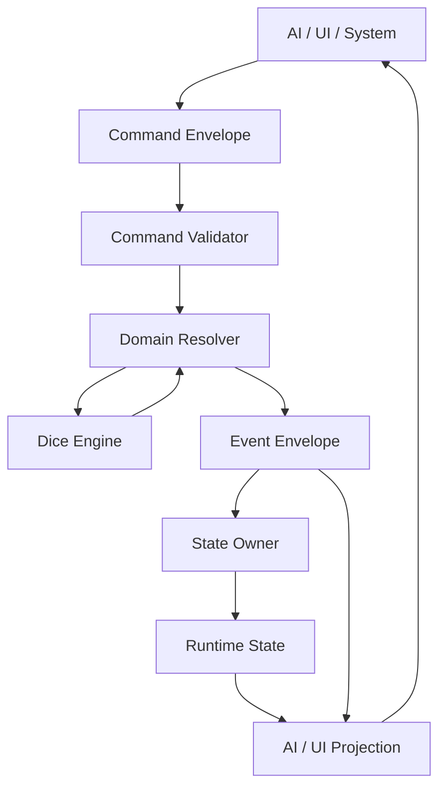

Канонический принцип:

```text
Command
   ↓
Validation
   ↓
Resolution
   ↓
Event
   ↓
State Owner
   ↓
State
   ↓
Projection
   ↓
AI / UI
```

**Ни AI, ни UI, ни случайная подсистема не могут обходить этот цикл и напрямую изменять игровой State.**

## 12. Serialization Rules

Serialization Rules определяют, как Domain Model превращается в JSON/JSONL и обратно.

Это важная часть Foundation, потому что:

```text
Python Object
     │
     ▼
Serialization
     │
     ▼
JSON / JSONL
     │
     ▼
Storage / API / Event Log
```

и обратно:

```text
JSON / JSONL
     │
     ▼
Deserialization
     │
     ▼
Validated Domain Object
```

Основной принцип:

> **JSON является форматом хранения и передачи данных. Domain Model остаётся источником семантики.**

---

### 12.1. Где разрешена сериализация / Where Serialization Is Allowed

Сериализация не должна находиться внутри Rule Engine.

Запрещено:

```python
class AttackResolver:

    def resolve(self):
        with open("state.json") as f:
            ...
```

Правильно:

```text
Infrastructure
      │
      ▼
Serializer / Repository
      │
      ▼
Domain Model
```

Архитектура:

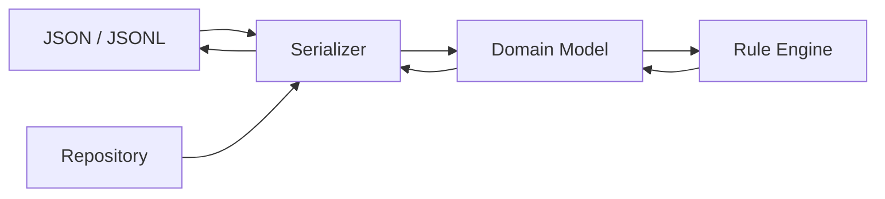

---

### 12.2. Канонические форматы / Canonical Formats

В проекте используются три основных формата.

#### JSON

Используется для:

```text
Definitions
State snapshots
Configuration
AI context
API DTO
```

Примеры:

```text
rules/dnd_5e/spells/fireball.json
campaigns/campaign_001/state.json
campaigns/campaign_001/config.json
```

---

#### JSONL

Используется для:

```text
Event Log
Command Log
длинных append-only потоков
```

Одна строка = один JSON object.

Пример:

```text
events/events.jsonl
```

```json
{"eventId":"event_000001","commandId":"command_000001","type":"CombatStarted",...}
{"eventId":"event_000002","commandId":"command_000001","type":"TurnStarted",...}
{"eventId":"event_000003","commandId":"command_000002","type":"AttackResolved",...}
{"eventId":"event_000004","commandId":"command_000002","type":"DamageApplied",...}
```

Преимущество JSONL:

* append-only;
* удобно читать потоково;
* не нужно переписывать весь файл;
* удобно восстанавливать историю.

---

### 12.3. YAML

YAML не является каноническим форматом Domain State.

Не использовать YAML для:

```text
State
Event Log
Command Log
Definitions
```

На текущем этапе основным форматом остаётся JSON.

---

### 12.4. Canonical JSON

JSON-файлы должны использовать UTF-8.

```text
Encoding:
UTF-8

Format:
JSON

Object keys:
camelCase
```

Пример:

```json
{
  "characterId": "character_001",
  "definitionId": "fighter",
  "currentHp": 24,
  "maxHp": 32
}
```

Python-имена:

```python
character_id
definition_id
current_hp
max_hp
```

JSON:

```json
characterId
definitionId
currentHp
maxHp
```

---

### 12.5. Имена полей / Field Naming

Используется:

```text
camelCase
```

для JSON.

Не использовать одновременно:

```text
character_id
characterId
characterID
```

В рамках одного контракта должна существовать только одна форма.

---

### 12.6. Python ↔ JSON

Domain Model:

```python
@dataclass
class CreatureState:
    id: str
    definition_id: str
    ability_scores: AbilityScores
    current_hp: int
    max_hp: int
```

JSON:

```json
{
  "id": "monster_001",
  "definitionId": "goblin",
  "abilityScores": {
    "strength": 8,
    "dexterity": 14,
    "constitution": 10,
    "intelligence": 10,
    "wisdom": 8,
    "charisma": 8
  },
  "currentHp": 12,
  "maxHp": 20
}
```

Преобразование выполняется Serializer.

```text
Python naming
snake_case
      │
      ▼
Serializer
      │
      ▼
JSON naming
camelCase
```

---

### 12.7. Pydantic как boundary validation

Pydantic используется на границах системы:

```text
API
Storage
JSON
Configuration
LLM structured output
```

Например:

```python
class AttackCommandDTO(BaseModel):
    commandId: str
    type: Literal["AttackCommand"]
    campaignId: str
    actorId: str
    payload: AttackPayload
```

После валидации DTO преобразуется в Domain Command:

```text
JSON
 ↓
Pydantic DTO
 ↓
Domain Command
```

Domain Engine не должен зависеть от HTTP request model.

---

### 12.8. Definition Serialization

Definition должен полностью восстанавливаться из JSON.

Пример:

```json
{
  "id": "longsword",
  "version": 1,
  "name": "Longsword",
  "damage": {
    "dice": "1d8",
    "type": "slashing"
  },
  "properties": [
    "versatile"
  ]
}
```

Правило:

```text
Definition JSON
      ↓
Validation
      ↓
Definition Object
```

Если Definition невалиден, он не должен попадать в DefinitionRegistry.

---

### 12.9. State Serialization

State snapshot должен быть достаточным для восстановления текущего состояния кампании без необходимости читать UI/API историю.

```text
state.json
     │
     ▼
StateSerializer
     │
     ▼
StateSnapshot
```

Phase 1 `StateStore` — snapshot-only Domain port:

```python
class StateStore(Protocol):
    def load(self, campaign_id: str) -> StateSnapshot: ...
    def save(self, snapshot: StateSnapshot) -> None: ...
```

Минимальная стабильная boundary error hierarchy:

```text
StateStoreError
├── StateNotFoundError
└── InvalidStateSnapshotError
```

`StateSerializer` является чистой Infrastructure-границей между
`StateSnapshot` и каноническим JSON-compatible mapping и не выполняет
filesystem I/O. Каноническая Phase 1 schema:

```json
{
  "schemaVersion": 1,
  "campaignId": "campaign_001",
  "state": {
    "campaign": {
      "id": "campaign_001",
      "rulesetId": "dnd_5e",
      "rulesetVersion": "5.2.1"
    },
    "creatures": [
      {
        "id": "monster_001",
        "definitionId": "goblin",
        "abilityScores": {
          "strength": 8,
          "dexterity": 14,
          "constitution": 10,
          "intelligence": 10,
          "wisdom": 8,
          "charisma": 8
        },
        "currentHp": 12,
        "maxHp": 20
      }
    ]
  }
}
```

JSON использует camelCase. Deserialization требует exact `schemaVersion: 1`,
все required fields и точные JSON primitive/container types; unknown fields,
defaults, type coercion, несовпадение outer `campaignId` с
`state.campaign.id`, невалидные Domain values и duplicate creature IDs
запрещены. Serialization всегда сортирует creatures по runtime ID.

Phase 1 `FilesystemStateStore` хранит snapshot в:

```text
<campaigns-root>/<campaign_id>/state.json
```

Adapter получает campaigns root как `Path`, использует UTF-8 и deterministic
JSON formatting с final newline. Save сначала полностью сериализует snapshot,
затем пишет temporary file в той же campaign directory, закрывает его и
атомарно заменяет `state.json` через `os.replace`; при ошибке temporary file
удаляется best-effort. Это single-file replacement, а не гарантия durability
для нескольких файлов или после любого crash.

Phase 1 использует single-writer assumption. `schemaVersion` описывает storage
schema и не является State revision; optimistic locking, revision fields и
file/process/distributed locks отсутствуют.

`StateStore` не читает и не пишет `events/events.jsonl`, не использует
`EventSerializer`, не генерирует и не применяет Events и не выполняет replay.
EventStore, replay и transaction ordering между Event persistence и State
projection отложены до отдельного будущего решения.

Текущая Phase 1 schema содержит только уже реализованные `CampaignState` и
collection `CreatureState`. По мере появления следующих State domains snapshot
schema должна расширяться отдельным версионируемым контрактом, не превращая
`CampaignState` в God Object.

Snapshot не содержит:

```text
полную историю событий
LLM prompts или AI context
transient HTTP data
debug logs
```

---

### 12.10. Event Serialization

Phase 1 `EventSerializer` является чистой границей между `GameEvent` и
каноническим JSON-совместимым Event Envelope: он не выполняет filesystem I/O,
не добавляет Event в лог и не применяет Event к State. Domain timestamp
сериализуется в ISO 8601 UTC с `Z`; nullable `actorId` и `causedBy` всегда
присутствуют в output и имеют значение `null` для Domain `None`.

EventStore, выделение Event ID/sequence, JSONL append, replay, применение Event
к State и concrete gameplay Event types находятся вне Phase 1 Event model и
реализуются отдельными будущими slices.

Event Log является append-only.

Формат:

```text
event_000001
event_000002
event_000003
...
```

События не перезаписываются.

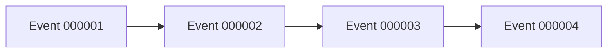

В MVP допускаются отдельные файлы:

```text
events/
├── 000001.json
├── 000002.json
└── 000003.json
```

Но каноническим потоковым форматом является:

```text
events/events.jsonl
```

---

### 12.11. Event Ordering

События в одной Campaign имеют строгий порядок.

Основным порядком считается:

```text
event sequence
```

то есть:

```text
event_000001
<
event_000002
<
event_000003
```

`timestamp` не используется как единственный источник ordering.

Причина:

```text
two events
same timestamp
```

могут иметь разные причинные отношения.

Поэтому:

```text
Sequence > Timestamp
```

для воспроизведения игрового состояния.

---

### 12.12. State Snapshot Version

Каждый State snapshot должен содержать свою версию schema.

Например:

```json
{
  "schemaVersion": 1,
  "campaignId": "campaign_001",
  "state": {
    ...
  }
}
```

Это отличается от:

```text
Ruleset version
```

и:

```text
Event version
```

Итого:

```text
Ruleset Version
State Schema Version
Event Schema Version
Command Schema Version
```

— четыре независимых механизма версионирования.

В Phase 1 поддерживается только exact integer `schemaVersion = 1`; `bool` не
считается integer version. Это версия storage schema, а не revision текущего
State и не механизм concurrency control.

---

### 12.13. Принцип версионирования / Versioning Principle

Нельзя:

```text
state.json
```

менять структуру молча.

Если структура несовместимо изменяется:

```text
schemaVersion = 1
        ↓
schemaVersion = 2
```

Появляется migration:

```text
State v1
   ↓
Migration
   ↓
State v2
```

---

### 12.14. Optional Fields

Поле считается optional только тогда, когда оно действительно может отсутствовать.

Например:

```json
{
  "position": null
}
```

и:

```json
{}
```

не должны автоматически означать одно и то же.

Правило:

```text
missing field
≠
null
```

если конкретная схема явно не определяет обратное.

---

### 12.15. Default Values

Default значения применяются только Domain Model / Schema Layer.

Например:

```python
temp_hp: int = 0
```

Но serializer не должен молча придумывать игровые значения.

Например нельзя:

```text
missing maxHp
      ↓
serializer
      ↓
maxHp = 100
```

Если обязательное игровое поле отсутствует:

```text
ValidationError
```

---

### 12.16. Enum Serialization

Enums сериализуются строками.

Python:

```python
from dnd_engine.domain.value_objects.damage_type import DamageType


damage_type = DamageType.FIRE
serialized_value = damage_type.value  # "fire"
```

Канонический closed set `DamageType` определён в §3.1.1.

JSON:

```json
{
  "damageType": "fire"
}
```

Не использовать:

```json
{
  "damageType": 3
}
```

Это делает JSON читаемым и устойчивым.

---

### 12.17. Datetime Serialization

Все системные timestamps:

```text
ISO 8601
UTC
canonical Z suffix
```

Пример:

```text
2026-08-19T16:42:10Z
```

Игровое время хранится отдельно:

```json
{
  "timestamp": "2026-08-19T16:42:10Z",
  "worldTime": {
    "day": 14,
    "hour": 18,
    "minute": 42
  }
}
```

---

### 12.18. Decimal / Floating Point

Для игровых расчётов нельзя использовать floating point там, где требуется точность.

Основные игровые величины должны использовать:

```text
int
```

Например:

```text
HP
damage
ability score
gold
movement points
experience
```

Если понадобится дробное значение, его формат должен быть определён отдельно.

Не допускается случайное появление:

```text
12.0000000001
```

в State.

---

### 12.19. Random State

Состояние RNG не является обычным Domain State.

Если понадобится deterministic replay, отдельный RNG state может храниться в:

```text
session metadata
```

или:

```text
replay metadata
```

Но `DiceEngine` должен оставаться единственной точкой генерации случайности.

---

### 12.20. Serialization Boundary

Каноническая архитектура:

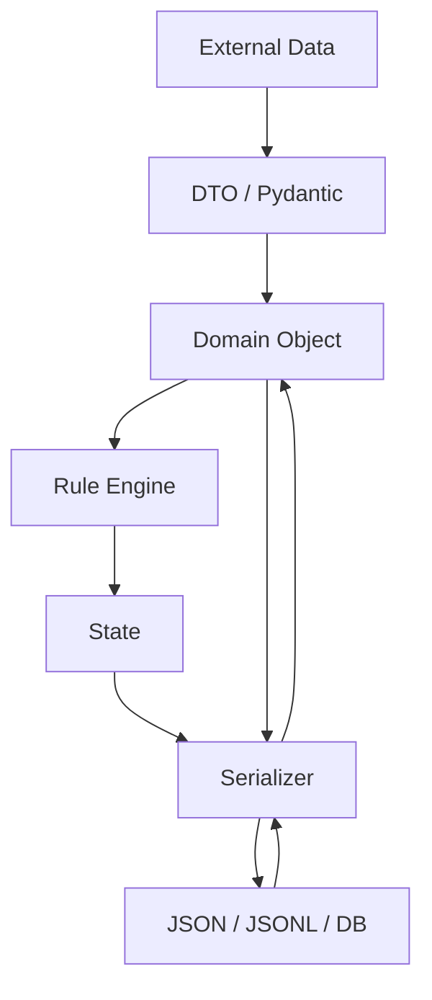

---

### 12.21. Запрещённые практики / Forbidden Practices

#### Direct JSON manipulation inside rules

Нельзя:

```python
state["characters"][id]["currentHp"] -= 10
```

в Rule Engine.

Используется:

```python
CreatureState
```

---

#### Arbitrary JSON fields

Нельзя:

```json
{
  "currentHp": 10,
  "randomCustomField": "hello"
}
```

если поле не входит в контракт.

---

#### Silent schema conversion

Нельзя незаметно преобразовывать неправильные данные:

```text
"10abc" → 10
```

Если значение невалидно:

```text
ValidationError
```

---

#### Missing required data

Не допускается автоматически создавать игровые данные:

```text
missing armor
    ↓
assume armor = none
```

только если конкретная schema явно предусматривает default.

---

### 12.22. Serialization Responsibility Matrix

| Объект     | Формат       | Serializer             |
| ---------- | ------------ | ---------------------- |
| Definition | JSON         | `DefinitionSerializer` |
| State      | JSON         | `StateSerializer`      |
| Command    | JSON         | `CommandSerializer`    |
| Event      | JSON / JSONL | `EventSerializer`      |
| API DTO    | JSON         | Pydantic               |
| AI Context | JSON         | `AIContextSerializer`  |
| Config     | JSON         | `ConfigSerializer`     |

---

### 12.23. Канонический Serialization Pipeline

Для входящих данных:

```text
JSON
 ↓
Parse
 ↓
Schema Validation
 ↓
Domain Object
 ↓
Rule Engine
```

Для исходящих данных:

```text
Domain Object
 ↓
Domain Validation
 ↓
Serializer
 ↓
JSON
```

Для Events:

```text
Domain Event
 ↓
Event Validation
 ↓
Serialize
 ↓
Append to Event Store
```

---

### 12.24. Главный принцип сериализации / Core Serialization Principle

```text
              EXTERNAL WORLD
                    │
                    ▼
              JSON / HTTP
                    │
                    ▼
              VALIDATION
                    │
                    ▼
              DOMAIN MODEL
                    │
                    ▼
                ENGINE
                    │
                    ▼
              DOMAIN MODEL
                    │
                    ▼
              SERIALIZATION
                    │
                    ▼
              JSON / STORAGE
```

**JSON не определяет игровые правила. JSON только представляет Domain Model в переносимом виде.**
