# Architecture Foundation

> `ARCHITECTURE.md = current canonical contract`; [`DECISIONS.md`](DECISIONS.md) = append-only rationale/history.

> **Источник истины проекта.** При расхождении с любым другим документом приоритет у этого файла.

Этот документ фиксирует фундаментальные технические решения проекта.

Все дальнейшие модули, классы, JSON-схемы и API должны соответствовать этим правилам. Изменение этих решений считается **архитектурным изменением проекта** и должно быть осознанным, а не происходить случайно по мере разработки.

Другие документы: [`../README.md`](../README.md) — обзор проекта · [`ROADMAP.md`](ROADMAP.md) — фазы разработки · [`../CLAUDE.md`](../CLAUDE.md) — выжимка правил для AI-агента.

---

## Навигация

Разделы пронумерованы сквозным образом. Ссылайся на них по номеру:
в issue, PR или коммите пиши «см. §8.2», и раздел находится одним поиском.

### Быстрый поиск / Quick lookup

| Нужно найти | Раздел |
| --- | --- |
| Обязательные поля Definition | §3.1 |
| Контракт AbilityScores | §1.2.1 |
| Контракт Skill | §1.2.2 |
| Минимальные Phase 1 Definitions | §3.1.1 |
| Минимальный CreatureState | §3.2.1 |
| Минимальный CampaignState | §3.2.2 |
| Минимальный CharacterState | §3.2.4 |
| Минимальный Dice Engine | §1.7.1 |
| Схема Command Envelope | §9.1 |
| Поля Command Envelope | §9.2 |
| Python Command boundary | §3.3 |
| Схема Event Envelope | §8.1 |
| Поля Event Envelope | §8.2 |
| Формат ID любой сущности | §4.13 |
| Почему `item_001`, а не `longsword_001` | §4.3 |
| Кто имеет право менять State | §10.13 |
| Что запрещено импортировать в Domain | §2.5 |
| Где разрешена сериализация | §12.1 |
| Формат лога событий (JSONL) | §12.10 |
| Правила именования событий | §8.13 |
| Разница Command и Event | §9.8 |
| Порядок применения событий | §12.11 |
| Коды ошибок | §3.9 |
| Семантика ResolutionResult | §3.5 |
| Ability Check vertical slice | §3.10 |
| Proficiency bonus персонажа | §3.11 |
| Минимальная d20 semantics | §3.12 |
| Character Saving Throw vertical slice | §3.13 |
| Character Skill Check vertical slice | §3.14 |
| Armor Class (minimal implementation) | §3.15 |
| Definition access port (G4a, DefinitionSource) | §3.16 |
| Character unarmed Attack Roll → Monster vertical slice | §3.17 |
| State Mutation Foundation (G5, mutating Command contract) | §3.18 |
| Minimal Damage → HP mutation slice (G6A, `ApplyDamage`) | §3.19 |
| Minimal Healing → HP mutation slice (G6B, `ApplyHealing`) | §3.20 |
| Condition State foundation, persisted `CreatureState.conditions` (G6C1) | §3.21 |
| Minimal Poisoned behavior for checks and attacks (G6C2) | §3.22 |
| Post-G6C abstraction review and snapshot replacement helper | §3.23 |
| Phase 2 closure rule and deferred-scope boundary | §3.24 |
| Combat Initiative/Turn Order vertical slice, actor eligibility (G7) | §3.25 |
| Monster attack → Character vertical slice, `MonsterAttackDefinition` (G8) | §3.26 |
| Monster Attack consequence → Damage → HP vertical slice (G9, partial) | §3.27 |
| Canonical ruleset identity/version (`dnd_5e` = SRD 5.1) | §4.6 |
| Версионирование схем | §12.13 |
| Runtime validation policy | §12.25 |
| Packaged ruleset resources / Definition loading boundary | §12.26 |

### Оглавление / Table of contents

<details>
<summary>Развернуть полное оглавление</summary>

* [1. Технологический стек / Technology Stack](#1-технологический-стек--technology-stack)
  * [1.1. Backend](#11-backend)
  * [1.2. Domain Model](#12-domain-model)
    * [1.2.1. AbilityScores Value Object](#121-abilityscores-value-object)
    * [1.2.2. Skill Value Object](#122-skill-value-object)
  * [1.3. API](#13-api)
  * [1.4. Storage](#14-storage)
  * [1.5. Tests](#15-tests)
  * [1.6. AI Layer](#16-ai-layer)
  * [1.7. Random Number Generation](#17-random-number-generation)
    * [1.7.1. Minimal Phase 1 Dice Engine Contract](#171-minimal-phase-1-dice-engine-contract)
* [2. Слои приложения / Application Layers](#2-слои-приложения--application-layers)
  * [2.1. Presentation Layer](#21-presentation-layer)
  * [2.2. Application Layer](#22-application-layer)
  * [2.3. Domain Layer](#23-domain-layer)
  * [2.4. Infrastructure Layer](#24-infrastructure-layer)
  * [2.5. Запрещённые зависимости / Forbidden Dependencies](#25-запрещённые-зависимости--forbidden-dependencies)
  * [2.6. Полная схема / Full Layer Diagram](#26-полная-схема--full-layer-diagram)
* [3. Контракты / Contracts](#3-контракты--contracts)
  * [3.1. Definition Contract](#31-definition-contract)
    * [3.1.1. Minimal Phase 1 Definition Contracts](#311-minimal-phase-1-definition-contracts)
  * [3.2. State Contract](#32-state-contract)
    * [3.2.1. Minimal Phase 1 CreatureState Contract](#321-minimal-phase-1-creaturestate-contract)
    * [3.2.2. Minimal Phase 1 CampaignState Contract](#322-minimal-phase-1-campaignstate-contract)
    * [3.2.3. Minimal Phase 2 StateSnapshot Contract](#323-minimal-phase-2-statesnapshot-contract)
    * [3.2.4. Minimal Phase 2 CharacterState Contract](#324-minimal-phase-2-characterstate-contract)
  * [3.3. Command Contract](#33-command-contract)
  * [3.4. Event Contract](#34-event-contract)
  * [3.5. ResolutionResult Contract](#35-resolutionresult-contract)
  * [3.6. Shared orchestration abstractions are deferred](#36-shared-orchestration-abstractions-are-deferred)
  * [3.7. Общий жизненный цикл игрового действия / Action Lifecycle](#37-общий-жизненный-цикл-игрового-действия--action-lifecycle)
  * [3.8. Atomicity](#38-atomicity)
  * [3.9. Error Contract](#39-error-contract)
  * [3.10. Minimal Phase 2 Ability Check vertical slice](#310-minimal-phase-2-ability-check-vertical-slice)
  * [3.11. Minimal Phase 2 Proficiency foundation](#311-minimal-phase-2-proficiency-foundation)
  * [3.12. Minimal Phase 2 d20 semantics](#312-minimal-phase-2-d20-semantics)
  * [3.13. Minimal Phase 2 Character Saving Throw vertical slice](#313-minimal-phase-2-character-saving-throw-vertical-slice)
  * [3.14. Minimal Phase 2 Character Skill Check vertical slice](#314-minimal-phase-2-character-skill-check-vertical-slice)
  * [3.15. Minimal Phase 2 Armor Class design](#315-minimal-phase-2-armor-class-design)
  * [3.16. Minimal Phase 2 Definition Access vertical slice (G4a)](#316-minimal-phase-2-definition-access-vertical-slice-g4a)
  * [3.17. Minimal Phase 2 Character unarmed Attack Roll → Monster vertical slice](#317-minimal-phase-2-character-unarmed-attack-roll--monster-vertical-slice)
  * [3.18. State Mutation Foundation (G5)](#318-state-mutation-foundation-g5)
  * [3.19. Minimal Damage → HP mutation vertical slice (G6A)](#319-minimal-damage--hp-mutation-vertical-slice-g6a)
  * [3.20. Minimal Healing → HP mutation vertical slice (G6B)](#320-minimal-healing--hp-mutation-vertical-slice-g6b)
  * [3.21. Condition State foundation (G6C1)](#321-condition-state-foundation-g6c1)
  * [3.22. Minimal Poisoned behavior (G6C2)](#322-minimal-poisoned-behavior-g6c2)
  * [3.23. Post-G6C abstraction review](#323-post-g6c-abstraction-review)
  * [3.24. Phase 2 Closure Contract](#324-phase-2-closure-contract)
  * [3.25. Minimal Phase 3 Combat Initiative and Turn Order vertical slice (G7)](#325-minimal-phase-3-combat-initiative-and-turn-order-vertical-slice-g7)
  * [3.26. Minimal Phase 3 Monster attack → Character vertical slice (G8)](#326-minimal-phase-3-monster-attack--character-vertical-slice-g8)
  * [3.27. Minimal Phase 3 Monster Attack consequence → Damage → HP vertical slice (G9, partial)](#327-minimal-phase-3-monster-attack-consequence--damage--hp-vertical-slice-g9-partial)
* [4. ID System](#4-id-system)
  * [4.1. Definition IDs](#41-definition-ids)
  * [4.2. Instance / State IDs](#42-instance--state-ids)
  * [4.3. Почему State ID не должен повторять Definition ID / State ID vs Definition ID](#43-почему-state-id-не-должен-повторять-definition-id--state-id-vs-definition-id)
  * [4.4. Event IDs](#44-event-ids)
  * [4.5. Command IDs](#45-command-ids)
  * [4.6. Ruleset ID](#46-ruleset-id)
  * [4.7. Version IDs](#47-version-ids)
  * [4.8. ID никогда не переиспользуется / ID Reuse](#48-id-никогда-не-переиспользуется--id-reuse)
  * [4.9. ID не изменяется / ID Immutability](#49-id-не-изменяется--id-immutability)
  * [4.10. Scope](#410-scope)
  * [4.11. Политика генерации новых ID / ID Generation Policy](#411-политика-генерации-новых-id--id-generation-policy)
  * [4.12. Canonical ID registry](#412-canonical-id-registry)
  * [4.13. Сводная таблица ID / ID Reference Table](#413-сводная-таблица-id--id-reference-table)
* [5. Контроль архитектуры / Architecture Control](#5-контроль-архитектуры--architecture-control)
* [6. Канонический жизненный цикл / Canonical Lifecycle](#6-канонический-жизненный-цикл--canonical-lifecycle)
* [7. Архитектурная формула / Architecture Formula](#7-архитектурная-формула--architecture-formula)
* [8. Event Envelope](#8-event-envelope)
  * [8.1. Каноническая схема Event / Canonical Event Schema](#81-каноническая-схема-event--canonical-event-schema)
  * [8.2. Поля Event Envelope / Event Envelope Fields](#82-поля-event-envelope--event-envelope-fields)
  * [8.3. `eventId`](#83-eventid)
  * [8.4. `type`](#84-type)
  * [8.5. `version`](#85-version)
  * [8.6. `campaignId`](#86-campaignid)
  * [8.7. `timestamp`](#87-timestamp)
  * [8.8. `actorId`](#88-actorid)
  * [8.9. `causedBy`](#89-causedby)
  * [8.10. `payload`](#810-payload)
  * [8.11. Event lifecycle](#811-event-lifecycle)
  * [8.12. Immutable Event Rule](#812-immutable-event-rule)
  * [8.13. Event naming convention](#813-event-naming-convention)
  * [8.14. Event должен быть domain fact / Domain Fact Rule](#814-event-должен-быть-domain-fact--domain-fact-rule)
* [9. Command Envelope](#9-command-envelope)
  * [9.1. Каноническая схема Command / Canonical Command Schema](#91-каноническая-схема-command--canonical-command-schema)
  * [9.2. Поля Command Envelope / Command Envelope Fields](#92-поля-command-envelope--command-envelope-fields)
  * [9.3. `commandId`](#93-commandid)
  * [9.4. `type`](#94-type)
  * [9.5. `actorId`](#95-actorid)
  * [9.6. `payload`](#96-payload)
  * [9.7. Command lifecycle](#97-command-lifecycle)
  * [9.8. Command ≠ Event](#98-command--event)
  * [9.9. Command не изменяет State напрямую / No Direct State Mutation](#99-command-не-изменяет-state-напрямую--no-direct-state-mutation)
  * [9.10. Idempotency](#910-idempotency)
  * [9.11. Command → Event correlation](#911-command--event-correlation)
  * [9.12. Full Command/Event chain](#912-full-commandevent-chain)
* [10. State Ownership](#10-state-ownership)
  * [10.1. Почему нужен State Ownership / Why State Ownership](#101-почему-нужен-state-ownership--why-state-ownership)
  * [10.2. Ownership Model](#102-ownership-model)
  * [10.3. Campaign State Owner](#103-campaign-state-owner)
  * [10.4. Creature State Owner](#104-creature-state-owner)
  * [10.5. Inventory State Owner](#105-inventory-state-owner)
  * [10.6. Equipment State Owner](#106-equipment-state-owner)
  * [10.7. Combat State Owner](#107-combat-state-owner)
  * [10.8. Quest State Owner](#108-quest-state-owner)
  * [10.9. World State Owner](#109-world-state-owner)
  * [10.10. Faction State Owner](#1010-faction-state-owner)
  * [10.11. Relationship State Owner](#1011-relationship-state-owner)
  * [10.12. AI State Owner](#1012-ai-state-owner)
  * [10.13. Owner Matrix](#1013-owner-matrix)
  * [10.14. Read vs Write](#1014-read-vs-write)
  * [10.15. Example: Damage](#1015-example-damage)
  * [10.16. Example: Quest Update](#1016-example-quest-update)
  * [10.17. Example: NPC Relationship](#1017-example-npc-relationship)
  * [10.18. State Ownership Rule](#1018-state-ownership-rule)
  * [10.19. Полная схема Ownership](#1019-полная-схема-ownership)
  * [10.20. Главный принцип Ownership / Core Ownership Principle](#1020-главный-принцип-ownership--core-ownership-principle)
* [11. Канонический Command → Event → State цикл / Canonical Cycle](#11-канонический-command--event--state-цикл--canonical-cycle)
* [12. Serialization Rules](#12-serialization-rules)
  * [12.1. Где разрешена сериализация / Where Serialization Is Allowed](#121-где-разрешена-сериализация--where-serialization-is-allowed)
  * [12.2. Канонические форматы / Canonical Formats](#122-канонические-форматы--canonical-formats)
  * [12.3. YAML](#123-yaml)
  * [12.4. Canonical JSON](#124-canonical-json)
  * [12.5. Имена полей / Field Naming](#125-имена-полей--field-naming)
  * [12.6. Python ↔ JSON](#126-python--json)
  * [12.7. Pydantic как boundary validation](#127-pydantic-как-boundary-validation)
  * [12.8. Definition Serialization](#128-definition-serialization)
  * [12.9. State Serialization](#129-state-serialization)
  * [12.10. Event Serialization](#1210-event-serialization)
  * [12.11. Event Ordering](#1211-event-ordering)
  * [12.12. State Snapshot Version](#1212-state-snapshot-version)
  * [12.13. Принцип версионирования / Versioning Principle](#1213-принцип-версионирования--versioning-principle)
  * [12.14. Optional Fields](#1214-optional-fields)
  * [12.15. Default Values](#1215-default-values)
  * [12.16. Enum Serialization](#1216-enum-serialization)
  * [12.17. Datetime Serialization](#1217-datetime-serialization)
  * [12.18. Decimal / Floating Point](#1218-decimal--floating-point)
  * [12.19. Random State](#1219-random-state)
  * [12.20. Serialization Boundary](#1220-serialization-boundary)
  * [12.21. Запрещённые практики / Forbidden Practices](#1221-запрещённые-практики--forbidden-practices)
  * [12.22. Serialization Responsibility Matrix](#1222-serialization-responsibility-matrix)
  * [12.23. Канонический Serialization Pipeline](#1223-канонический-serialization-pipeline)
  * [12.24. Главный принцип сериализации / Core Serialization Principle](#1224-главный-принцип-сериализации--core-serialization-principle)
  * [12.25. Runtime Validation Policy](#1225-runtime-validation-policy)
  * [12.26. Packaged Ruleset Resources](#1226-packaged-ruleset-resources)

</details>

---

## 1. Технологический стек / Technology Stack

### 1.1. Backend

Основной backend:

```text
Python 3.12+
FastAPI
Pydantic v2
```

#### Почему Python

Python используется как основной язык Engine благодаря:

* простой реализации игровых правил;
* удобной сериализации;
* развитой экосистеме для AI;
* удобной работе с JSON;
* хорошей тестируемости;
* возможности легко подключать LLM-провайдеров;
* низкому порогу изменения игровых правил.

---

### 1.2. Domain Model

Для Domain Model используются:

```text
Python dataclasses
frozen dataclasses for Definitions and immutable Value Objects
Enums
Value Objects
```

Pydantic is used only at system boundaries (API, storage I/O validation,
configuration, external JSON, and LLM structured output). Domain rule
resolution uses dataclasses, Enums, Value Objects, and type hints only.

Правила не должны зависеть от:

```text
FastAPI
HTTP
JSON-файлов
SQL
конкретного LLM-провайдера
```

Domain rules и concrete resolvers должны работать как обычный Python-код:

```text
Application handler
        ↓
concrete Domain resolver
```

Общий `GameEngine.execute(...)` API не является prerequisite для Phase 2 и пока
не реализован (§3.6).

#### 1.2.1. AbilityScores Value Object

`AbilityScores` — immutable Domain Value Object, используемый базовыми Phase 1
Definition- и State-моделями.

Каноническая Python-семантика:

```python
@dataclass(frozen=True)
class AbilityScores:
    strength: int
    dexterity: int
    constitution: int
    intelligence: int
    wisdom: int
    charisma: int
```

Все шесть полей обязательны. Для каждого поля действует invariant:

```text
1 <= ability score <= 30
```

`AbilityScores`:

* не является State owner;
* не имеет собственного runtime ID;
* не содержит modifiers, proficiency, skills или saving throw bonuses;
* не содержит temporary modifiers;
* не выполняет rule calculations.

Если abilities существа изменяются во время игры, Creature Domain создаёт новое
значение `AbilityScores` и помещает его в принадлежащий ему `CreatureState`.
Производные значения вроде `strength_modifier` относятся к rule calculation и
не входят в Phase 1 contract. При JSON-сериализации используется обычное правило
camelCase; все шесть canonical имён уже однословные.

---

#### 1.2.2. Skill Value Object

`Skill` — canonical closed Domain `StrEnum`, отвечающий только за identity
навыка:

```python
class Skill(StrEnum):
    ACROBATICS = "acrobatics"
    ANIMAL_HANDLING = "animal_handling"
    ARCANA = "arcana"
    ATHLETICS = "athletics"
    DECEPTION = "deception"
    HISTORY = "history"
    INSIGHT = "insight"
    INTIMIDATION = "intimidation"
    INVESTIGATION = "investigation"
    MEDICINE = "medicine"
    NATURE = "nature"
    PERCEPTION = "perception"
    PERFORMANCE = "performance"
    PERSUASION = "persuasion"
    RELIGION = "religion"
    SLEIGHT_OF_HAND = "sleight_of_hand"
    STEALTH = "stealth"
    SURVIVAL = "survival"
```

Closed set содержит ровно 18 значений. `Skill` не хранит associated Ability,
proficiency state, modifier, DC, Expertise или rules logic. Fixed mapping
Skill → Ability не является частью identity-контракта: будущий Skill Check
должен допускать alternative ability checks, например Strength
(Intimidation).

---

### 1.3. API

Внешний API:

```text
FastAPI
```

Использование:

```text
HTTP REST
WebSocket
```

REST используется для:

* загрузки кампаний;
* создания персонажей;
* сохранения;
* получения состояния;
* управления ресурсами.

WebSocket используется для:

* live-команд;
* боевых событий;
* AI narration;
* multiplayer state updates.

---

### 1.4. Storage

#### MVP

На первом этапе используется:

```text
JSON
JSONL
filesystem
```

Это позволяет быстро разрабатывать Engine без раннего усложнения инфраструктуры.

Пример:

```text
campaign/
├── state.json
├── characters/
├── world/
└── events/
    ├── 000001.json
    ├── 000002.json
    └── 000003.json
```

#### Production

После стабилизации Domain Model Storage может быть заменён на:

```text
SQLite
        ↓
PostgreSQL
```

При этом Domain Engine не должен зависеть от конкретной БД.

```text
Domain
   │
   ▼
Repository Interface
   │
   ├── JsonRepository
   ├── SQLiteRepository
   └── PostgreSQLRepository
```

---

### 1.5. Tests

Основной framework:

```text
pytest
```

Тестируются в первую очередь:

```text
Rule Engine
Resolvers
Dice Engine
State transitions
Event handlers
Serialization
```

LLM не используется в тестах игрового ядра.

---

### 1.6. AI Layer

AI подключается через абстрактный интерфейс.

Engine не должен знать:

```text
OpenAI
Anthropic
Google
локальная модель
```

Вместо этого используется:

```python
class LLMProvider:
    def generate(self, request):
        ...
```

Архитектурно:

```text
AI Service
    │
    ▼
LLMProvider
    │
    ├── OpenAIProvider
    ├── AnthropicProvider
    ├── LocalProvider
    └── TestProvider
```

Таким образом замена модели не требует изменения игрового Engine.

---

### 1.7. Random Number Generation

Все игровые случайности проходят через:

```text
DiceEngine
```

Запрещено использовать случайность непосредственно внутри Rule Engine:

```python
random.randint(...)
random.choice(...)
```

вместо этого:

```python
dice.roll("1d20")
```

Это необходимо для:

* тестирования;
* replay;
* debugging;
* deterministic simulations.

#### 1.7.1. Minimal Phase 1 Dice Engine Contract

`DiceEngine` — Domain `Protocol`. Rule resolvers зависят только от него:

```python
from typing import Protocol


class DiceEngine(Protocol):
    def roll(self, expression: str) -> DiceRoll:
        ...
```

Результат одного dice expression — минимальный immutable Domain Value Object:

```python
@dataclass(frozen=True)
class DiceRoll:
    expression: str
    rolls: tuple[int, ...]
    total: int
```

`expression` — exact `str` и хранит точное принятое canonical expression.
`rolls` — непустой tuple с каждым индивидуальным положительным exact `int` (не
`bool`) в порядке бросков. `total` — exact `int` (не `bool`) и в Phase 1 равен
`sum(rolls)`. `DiceRoll` проверяет только собственные intrinsic invariants и не
выполняет проверку результата относительно размера кубика.

Phase 1 принимает только strict lowercase notation `NdM`, эквивалентную grammar
`[1-9][0-9]*d[1-9][0-9]*`, с invariants `count >= 1` и `sides >= 2`.
Количество всегда указывается явно. Modifiers, arithmetic expressions,
advantage/disadvantage, keep/drop, rerolls, exploding dice и полный dice DSL не
входят в Phase 1.

Начиная с G4b (DEC-0030) strict grammar `NdM` extraction/validation
живёт в одном pure Domain primitive, а не как private implementation detail
Infrastructure adapter:

```python
def parse_ndm(expression: str) -> tuple[int, int]:
    ...
```

`src/dnd_engine/domain/dice.py` реализует эту функцию. Она принимает только
exact `str`, syntactic grammar и invariants (`count >= 1`, `sides >= 2`)
идентичны Phase 1 контракту выше, и не знает про RNG, `random.Random` или
`DiceRoll`:

```text
Domain DiceEngine Protocol      Domain parse_ndm()
          ↑                        ↑          ↑
Infrastructure PythonDiceEngine ────┘          │
          ↑                                    │
injected random.Random          WeaponDefinition.damage_dice (§3.1.1)
```

`PythonDiceEngine` находится в Infrastructure, получает явный injected
`random.Random` и вызывает shared `parse_ndm(expression)` вместо собственного
regex/parser. Все individual rolls создаются только этим instance; вызовы
module-global `random.randint`, `random.choice`, `random.seed` и другая
uncontrolled gameplay randomness запрещены. Domain не импортирует stdlib
`random` и не зависит от Infrastructure RNG implementation; `parse_ndm` сам по
себе не зависит ни от чего кроме stdlib `re`.

`WeaponDefinition.damage_dice` (§3.1.1) использует тот же `parse_ndm` как
`__post_init__` intrinsic invariant: это второй consumer одного и того же
accepted-language правила, а не отдельная copy grammar. Grammar остаётся
неизменной strict lowercase `NdM`; DiceExpression Value Object, AST или полный
DSL не вводятся.

Внутреннее состояние RNG не является authoritative Campaign, Creature или
World State. Dice Engine не является State owner, не мутирует State, не
обращается к State Store, не создаёт Events и не сохраняет RNG state. Seed и
возможный будущий replay относятся к Infrastructure/composition concerns, а не
к `DiceEngine.roll()`.

---

## 2. Слои приложения / Application Layers

Приложение разделено на четыре архитектурных слоя.

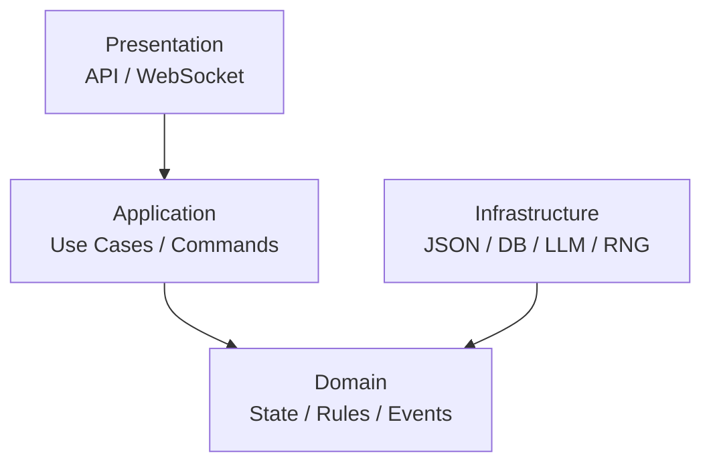

---

### 2.1. Presentation Layer

Отвечает за внешний интерфейс.

```text
src/dnd_engine/api/
├── routes.py
├── schemas.py
├── websocket.py
└── dependencies.py
```

Задачи:

```text
HTTP
WebSocket
DTO
Authentication
Request validation
Response serialization
```

Presentation Layer **не содержит D&D правил**.

Запрещено:

```python
# route
if attack_roll >= target.ac:
    target.current_hp -= damage
```

Правильно:

```python
result = game_service.execute(command)
```

---

### 2.2. Application Layer

Application Layer оркестрирует use cases.

```text
src/dnd_engine/application/
├── commands/
├── handlers/
├── services/
└── dto/
```

Пример:

```text
HTTP Request
     │
     ▼
AttackCommandDTO
     │
     ▼
AttackCommand
     │
     ▼
AttackCommandHandler
     │
     ▼
Domain resolver
```

Application Layer отвечает на вопрос:

> **Что нужно вызвать?**

Domain отвечает:

> **Что по правилам должно произойти?**

Concrete Application handler/use case отвечает за загрузку нужного State,
поиск actor/target и вызов stateless Domain resolver. После successful
resolution handler получает Event metadata через injected
`EventMetadataProvider`, строит generic `GameEvent` envelope и собирает
`ResolutionResult`; он не выделяет Event ID самостоятельно и не читает
system clock напрямую. Только state-mutating use case сохраняет обновлённый
snapshot через `StateStore`; read-only resolution save не вызывает.

---

### 2.3. Domain Layer

Главный слой проекта.

```text
src/dnd_engine/domain/
├── definitions/
├── state/
├── commands/
├── events/
├── rules/
├── value_objects/
└── services/
```

Domain содержит:

```text
Definitions
State
Commands
Events
Rules
Resolvers
Value Objects
Domain Services
```

Domain не знает о:

```text
HTTP
FastAPI
PostgreSQL
JSON files
LLM APIs
```

Domain resolver принимает уже валидированную concrete typed Command и нужные
Domain objects/ports. Он не загружает и не сохраняет State, не создаёт Event ID,
не читает clock, не сериализует и не импортирует Application или
Infrastructure.

---

### 2.4. Infrastructure Layer

```text
src/dnd_engine/infrastructure/
├── persistence/
│   ├── json/
│   ├── sqlite/
│   └── postgres/
│
├── llm/
│   ├── openai.py
│   ├── anthropic.py
│   └── local.py
│
├── random/
│   └── dice.py
│
└── filesystem/
```

Infrastructure предоставляет технические реализации интерфейсов Domain/Application.

---

### 2.5. Запрещённые зависимости / Forbidden Dependencies

Правило зависимостей:

```text
Presentation
      ↓
Application
      ↓
Domain
      ↑
Infrastructure
```

Domain не импортирует:

```text
FastAPI
SQLAlchemy
OpenAI SDK
filesystem implementation
```

Infrastructure может импортировать Domain interfaces.

---

### 2.6. Полная схема / Full Layer Diagram

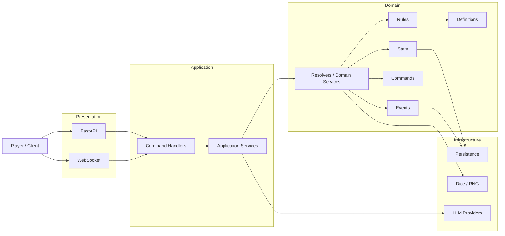

---

## 3. Контракты / Contracts

В проекте существуют пять основных контрактов:

```text
Definition
State
Command
Event
ResolutionResult
```

Контракты определяют не только формат данных, но и **жизненный цикл**.

---

### 3.1. Definition Contract

Definition описывает объект правил.

Пример:

```python
@dataclass(frozen=True)
class Definition:
    id: str
    version: int
```

Основные поля:

```text
id
version
```

Дополнительные поля определяются конкретным Definition. `name` не является
обязательным полем абсолютно всех будущих Definitions.

#### 3.1.1. Minimal Phase 1 Definition Contracts

Phase 1 начинает Core с минимальных immutable data contracts без полей будущих
Roadmap phases.

##### `ItemDefinition`

```python
@dataclass(frozen=True)
class ItemDefinition:
    id: str
    version: int
    name: str
```

`ItemDefinition` — immutable rules/content definition. Он не содержит item
instance ID, owner ID, quantity, equipped state, durability, container state или
campaign-specific fields.

##### `WeaponDefinition`

`WeaponDefinition IS-A ItemDefinition`.

`DamageType` — закрытый Domain `StrEnum`:

```python
from enum import StrEnum


class DamageType(StrEnum):
    ACID = "acid"
    BLUDGEONING = "bludgeoning"
    COLD = "cold"
    FIRE = "fire"
    FORCE = "force"
    LIGHTNING = "lightning"
    NECROTIC = "necrotic"
    PIERCING = "piercing"
    POISON = "poison"
    PSYCHIC = "psychic"
    RADIANT = "radiant"
    SLASHING = "slashing"
    THUNDER = "thunder"
```

Канонический Phase 1 closed set и его lowercase domain/serialized values:

```text
acid
bludgeoning
cold
fire
force
lightning
necrotic
piercing
poison
psychic
radiant
slashing
thunder
```

```python
@dataclass(frozen=True)
class WeaponDefinition(ItemDefinition):
    damage_dice: str
    damage_type: DamageType
    properties: tuple[str, ...]
```

`damage_dice` хранит простое dice expression вида `NdM`, например `1d8`, как
plain `str` — parsed representation (`count`/`sides`) в самом Definition не
хранится. Начиная с G4b (§1.7.1, DEC-0030) `damage_dice` — intrinsic Domain
invariant: `WeaponDefinition.__post_init__` вызывает shared `parse_ndm()` и
отклоняет любое значение, которое runtime `DiceEngine.roll()` тоже отклонил
бы, включая direct Domain construction в обход Infrastructure loader.
Invalid type (не exact `str`) — `TypeError`; invalid notation (включая
`sides < 2`, например `1d1`) — `ValueError`. Сложный dice parser/DSL сейчас
не проектируется. `damage_type` использует только `DamageType`. На будущей
serialization boundary `DamageType` сериализуется через его lowercase string
value. `properties` имеют immutable semantics; serializer представляет tuple
обычным JSON array.

`WeaponDefinition` не содержит attack bonus, current wielder, equipped slot,
ammunition count, current condition, magic bonuses или runtime item identity.

##### `MonsterDefinition`

```python
@dataclass(frozen=True)
class MonsterDefinition:
    id: str
    version: int
    name: str
    ability_scores: AbilityScores
    armor_class: int
    attacks: tuple[MonsterAttackDefinition, ...] = ()
```

`MonsterDefinition` — immutable template/rules definition. `armor_class` —
baseline Armor Class из monster stat block (exact `int`, `bool` отклоняется);
это immutable Definition fact, а не effective/derived AC (§3.15) и не runtime
State. Поле добавлено вместе с G4a (§3.16) как согласованный prerequisite
из DEC-0028. `attacks` добавлено вместе с G8 (§3.26): узкий attack-specific
subset stat block'а — tuple вложенных `MonsterAttackDefinition` (`action_id,
name, attack_bonus, damage_dice, damage_modifier, damage_type`), default
`()`. Это **не** generic Monster actions/abilities field и не MonsterAction
hierarchy — только attack roll + damage source facts. `MonsterDefinition`
не содержит current HP, current conditions/effects, position, combat turn
data, monster runtime ID или inventory/equipment state. Реализовано сейчас:
narrow `attacks`/`MonsterAttackDefinition` (G8, §3.26). Остаются future
scope и не добавляются заранее: generic Monster actions field, action
selection среди нескольких supported attacks, range/reach, Multiattack,
recharge actions, saving-throw/AoE actions, spellcasting и другие non-attack
action kinds, а также Speed, CR, senses и прочие поля будущих phases —
добавляются только тогда, когда их потребует Roadmap и конкретный consumer.

---

#### Правила Definition

Definition:

```text
CREATE
   ↓
LOAD
   ↓
READ
```

Не допускается:

```text
Definition
   ↓
UPDATE
```

во время игровой сессии.

То есть:

```text
Definition = immutable
```

Если изменилось правило, создаётся новая версия Definition/Ruleset.

---

#### Definition lifecycle

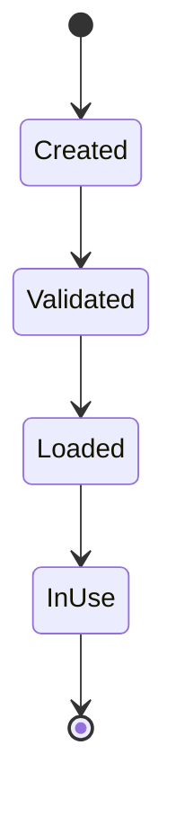

Изменение:

```text
old definition
      ≠
new definition
```

а не:

```text
old definition → mutation
```

---

### 3.2. State Contract

State описывает конкретный экземпляр в конкретной кампании.

#### 3.2.1. Minimal Phase 1 CreatureState Contract

Каноническая Python-семантика:

```python
@dataclass
class CreatureState:
    id: str
    definition_id: str
    ability_scores: AbilityScores
    current_hp: int
    max_hp: int
    conditions: frozenset[Condition] = frozenset()
```

`conditions` — G6C1 addition (§3.21); полный contract, invariants и schema
migration policy описаны там, а не здесь.

Канонические имена HP:

```text
Python: current_hp, max_hp
JSON:   currentHp, maxHp
```

Invariants:

```text
max_hp >= 1
0 <= current_hp <= max_hp
```

`CreatureState` — mutable campaign-scoped State; owner — Creature Domain. `id`
является runtime instance ID, а `definition_id` — отдельной ссылкой на immutable
Definition. Runtime ID никогда не выводится из Definition ID. Вложенный
`AbilityScores` сохраняет immutable Value Object semantics.

Combat Engine, AI, API и другие подсистемы не мутируют `CreatureState` напрямую.
Все изменения проходят через canonical Command → Resolver → Event → Creature
State Owner flow.

В Phase 1 `CreatureState` не содержит skills, saving throw results, proficiency,
effects, movement, position, initiative, turn resources, equipment или
inventory. Зафиксированный ownership этих понятий не требует преждевременно
добавлять их в минимальную модель. `conditions` — единственное исключение,
добавленное отдельным G6C1 slice (§3.21) как authoritative effective Condition
membership; это не runtime Condition-instance entity и не Effect framework.

State:

```text
mutable
campaign-scoped
versioned
persisted
```

В отличие от Definition:

```text
Definition → immutable
State      → mutable
```

---

#### 3.2.2. Minimal Phase 1 CampaignState Contract

Каноническая Python-семантика:

```python
@dataclass
class CampaignState:
    id: str
    ruleset_id: str
    ruleset_version: str
```

`CampaignState` — mutable campaign-scoped State; owner — Campaign Engine /
CampaignStateManager. `id` является runtime Campaign ID. `ruleset_id` и
`ruleset_version` являются отдельными строковыми полями и вместе образуют
минимальную ссылку на Ruleset identity и его версию.

Минимальная Phase 1 модель не содержит другие State domains. В частности,
`CreatureState`, `WorldState`, `CombatState`, `QuestState`, `InventoryState` и
`EquipmentState` не становятся полями или вложенными коллекциями
`CampaignState`. `WorldState`
остаётся единственным authoritative owner world/game time.

Global campaign metadata, session state и campaign lifecycle концептуально
относятся к Campaign ownership, но их concrete fields отложены до появления
соответствующих use cases и канонических контрактов. Persistence snapshot может
агрегировать несколько State domains отдельно; snapshot containment не меняет
State Ownership и не превращает `CampaignState` в aggregate или God Object.

---

#### 3.2.3. Minimal Phase 2 StateSnapshot Contract

Каноническая Python-семантика:

```python
@dataclass(frozen=True)
class StateSnapshot:
    campaign: CampaignState
    creatures: tuple[CreatureState, ...]
    characters: tuple[CharacterState, ...] = ()
    combat: CombatState | None = None
```

`StateSnapshot` — persistence grouping текущих State Owner objects для одного
snapshot, а не новый gameplay State Owner. `CampaignState` сохраняет только
Campaign ownership, каждый `CreatureState` — Creature ownership, а `combat` —
Combat Engine ownership (§10.7); containment в snapshot не разрешает
cross-domain mutation и не передаёт Creature/Combat ownership кампании.
`combat` — G7 addition (§3.25); полный contract, invariants и schema
migration policy описаны там, а не здесь.

Snapshot допускает ноль, один или несколько `CreatureState` и ноль, один или
несколько `CharacterState`. Runtime ID существ внутри одного snapshot
уникальны; runtime ID character-specific проекций также уникальны. Каждый
`CharacterState.id` обязан совпадать с ID существующего `CreatureState` в том
же snapshot. Обратное не требуется: не каждый Creature является Character, а
`characters=()` валиден. `combat` по умолчанию `None` ("нет активного боя");
когда присутствует, каждый ID в `combat.order` обязан совпадать с ID
существующего `CreatureState` в том же snapshot.

Snapshot не имеет собственного runtime ID, revision или
optimistic-concurrency version и не содержит Event Log, Commands, AI context
либо State из будущих фаз.

---

#### 3.2.4. Minimal Phase 2 CharacterState Contract

`CharacterState` хранит character-specific authoritative State facts,
необходимые текущим Phase 2 mechanics:

```python
@dataclass
class CharacterState:
    id: str
    total_level: int
    saving_throw_proficiencies: frozenset[Ability]
    skill_proficiencies: frozenset[Skill]
```

`total_level` — authoritative current total character level. Это exact `int`
(`bool` запрещён) в intrinsic range `1..20`. Proficiency bonus не хранится и
остаётся derived через `character_proficiency_bonus(character.total_level)`.

`saving_throw_proficiencies` — effective current membership: набор Ability,
для которых персонаж proficient в Saving Throws. Поле является actual
`frozenset`, содержит только actual `Ability`, может быть пустым и не обязано
содержать ровно два значения. Mutable collections, strings и другие значения
не коэрсятся.

`skill_proficiencies` — authoritative effective current membership навыков, в
которых character proficient. Поле является actual `frozenset`, содержит
только actual `Skill`, может быть пустым и не ограничивает количество
membership. Поле обязательно при обычном canonical construction и не имеет
default. Mutable collections, canonical strings и другие значения не
коэрсятся. Proficiency bonus по-прежнему derived и не хранится.

`CharacterState.id` совпадает с ID существующего `CreatureState` в том же
`StateSnapshot`: это две State-проекции одной runtime character entity, а не
inheritance. `CharacterState` не дублирует `definition_id`, `ability_scores`,
`current_hp` или `max_hp`.

Обе проекции принадлежат существующему owner `Creature / CreatureDomain`; новый
State Owner не вводится. Class levels, XP, proficiency provenance, monster
proficiency и другие proficiency categories остаются deferred.

---

#### State lifecycle

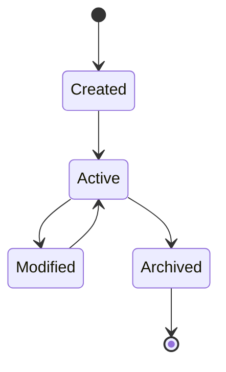

State изменяется **только через Domain операции / обработчики событий**.

Не допускается прямое изменение из:

```text
AI
UI
API route
LLM
```

Например запрещено:

```python
character.current_hp -= 10
```

в API.

Для state-mutating use case должно происходить:

```text
Command → Rule resolution → Event → State mutation
```

Текущий read-only Attack slice (§3.17) заканчивается на `AttackResolved` V1 и
не является примером State mutation.

---

### 3.3. Command Contract

Command — намерение выполнить игровое действие.

Канонический внешний/логический формат остаётся Command Envelope из §9:

```json
{
  "commandId": "command_000001",
  "type": "AttackCommand",
  "campaignId": "campaign_001",
  "actorId": "character_001",
  "payload": {
    "targetId": "monster_001"
  }
}
```

Этот JSON/boundary contract и валидированное Python-представление описывают
разные стороны одной команды:

```text
serialized / boundary representation
        ↓ validation and mapping
canonical Command Envelope
        ↓
validated application/domain representation
        ↓
concrete typed immutable Command
```

Gameplay Python Commands являются concrete frozen dataclasses с typed payload и
фиксированным `type`. Generic Python `Command` base class с
`payload: dict[str, Any]` не является gameplay contract. Generic inheritance
hierarchy на этом этапе не вводится.

Первый concrete contract:

```python
@dataclass(frozen=True)
class AbilityCheckPayload:
    ability: Ability
    dc: int


@dataclass(frozen=True)
class AbilityCheckCommand:
    command_id: str
    campaign_id: str
    actor_id: str
    payload: AbilityCheckPayload
    type: Literal["AbilityCheckCommand"] = field(
        init=False,
        default="AbilityCheckCommand",
    )
```

`actor_id` обязателен. `payload` не содержит arbitrary dictionary внутри
rule-resolution boundary. Эти классы реализованы в
`domain.commands.ability_check`.

---

#### Command lifecycle

Канонический жизненный цикл Command описан ровно в одном разделе —
[§9.7 Command lifecycle](#97-command-lifecycle). Здесь он намеренно не
дублируется: два независимых описания одного жизненного цикла уже разошлись
(DEC-0015).

Главное правило:

> Command не является фактом.

Например:

```text
AttackCommand
```

не означает:

```text
hit = true
```

Он лишь просит Engine попытаться выполнить атаку; hit/miss фиксируется одним
`AttackResolved` V1 (§3.17), а не отдельными Event types.

---

### 3.4. Event Contract

Event описывает уже произошедший факт.

Implementation status: **Implemented** для immutable `GameEvent`, его
serialization boundary и concrete `AbilityCheckResolved` /
`SavingThrowResolved`; runtime publication, persistence и State projection —
**Planned / Deferred**.

Базовая схема:

```python
@dataclass(frozen=True)
class GameEvent:
    event_id: str
    command_id: str
    type: str
    version: int

    campaign_id: str

    timestamp: datetime

    actor_id: str | None

    caused_by: str | None

    payload: Mapping[str, JSONValue]
```

В Phase 1 используется один generic immutable Domain-тип `GameEvent`, который
соответствует каноническому Event Envelope. Отдельный Python-тип
`EventEnvelope` не вводится. `timestamp` и `event_id` передаются при создании
явно; `GameEvent` не читает системные часы и не выделяет ID.

`payload` содержит только JSON-совместимые значения и при создании Event
рекурсивно копируется в неизменяемое представление: mappings становятся
неизменяемыми mappings, а list/tuple — tuple. Поэтому исходные mutable
коллекции и сохранённый payload не могут изменить опубликованный Event.

Пример:

```json
{
  "eventId": "event_000124",
  "commandId": "command_000001",
  "type": "DamageApplied",
  "version": 1,
  "campaignId": "campaign_001",
  "timestamp": "2026-08-20T18:42:10Z",
  "actorId": "character_001",
  "causedBy": "event_000123",
  "payload": {
    "targetId": "monster_001",
    "amount": 10,
    "damageType": "slashing"
  }
}
```

---

#### Event lifecycle

Event нельзя редактировать после публикации.

Implementation status: **Planned / Deferred** для полного
publish → persist → project lifecycle. Текущий код создаёт и валидирует Events,
но runtime Event publication/persistence и authoritative Event → State
application ещё не реализованы.

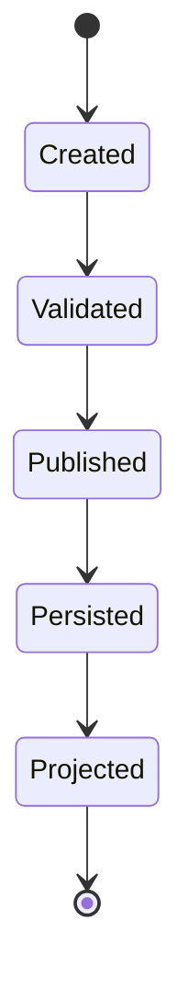

После:

```text
Published
```

Event становится immutable.

Если была ошибка:

```text
НЕ исправлять старый Event
```

а создать новый корректирующий Event.

Например:

```text
DamageApplied(10)
        ↓
DamageCorrected(-3)
```

---

### 3.5. ResolutionResult Contract

`ResolutionResult[T]` — immutable typed результат обработки одной Command.

Он не является State и не является Event.

```python
T = TypeVar("T")


@dataclass(frozen=True)
class ResolutionResult(Generic[T]):
    success: bool
    command_id: str
    outcome: T | None
    events: tuple[GameEvent, ...]
    errors: tuple[EngineError, ...]
```

`success` означает, что command/application processing и rule resolution
успешно завершены. Это **не** gameplay outcome. Например, будущая проваленная
Ability Check представляется так:

```text
ResolutionResult.success is True
outcome is not None
outcome.succeeded is False
errors == ()
```

Command успешно обработана, хотя персонаж провалил проверку. Ожидаемая
application/domain processing failure имеет другую форму:

```text
ResolutionResult.success is False
outcome is None
events == ()
errors != ()
```

Canonical invariants имеют общий вид:

```text
success is True
→ outcome is not None
→ errors == ()

success is False
→ outcome is None
→ events == ()
→ errors != ()

for every event in events:
    event.command_id == ResolutionResult.command_id
```

Successful result не обязан иметь непустой `events`: будущий successful use
case может не публиковать Event. Generic top-level `rolls` отсутствует. Для
Ability Check один и тот же `D20Roll` представлен в typed immediate
`AbilityCheckResult` и current V2 Event payload, но оба представления строятся
из одного результата resolution, а не вычисляются независимо.

Отдельного concrete `StateChange` contract пока нет, поэтому
`state_changes` не является полем `ResolutionResult`. Authoritative State
mutation pipeline остаётся Event-driven: Events применяются владельцами State.
Необходимость отдельного representation рассматривается при первом concrete
state-mutating Phase 2 mechanic, а не вводится placeholder abstraction заранее.

Modifiers в будущих rules применяются на уровне rule resolution. Они не
расширяют strict Phase 1 `DiceEngine` parser и не входят в `DiceRoll.total`.

---

### 3.6. Shared orchestration abstractions are deferred

Для начала Phase 2 не требуются concrete `GameEngine` или `GameContext`.
Первый vertical slice использует explicit Application handler/use case и
прямой вызов concrete Domain resolver.

Не вводятся заранее:

```text
GameEngine.execute(...)
CommandBus
EventBus
generic resolver registry
generic handler registry
dispatcher
transaction coordinator
GameContext implementation
```

Общая Engine orchestration abstraction появляется только тогда, когда несколько
concrete Commands выявят реально повторяющееся поведение. Engine остаётся
системой слоёв и модулей, а не одним монолитным классом или framework,
спроектированным по одному use case.

---

### 3.7. Общий жизненный цикл игрового действия / Action Lifecycle

Все игровые действия должны проходить через один базовый pipeline:

Implementation status: **Implemented** для read-only Ability Check, Character
Saving Throw, Character Skill Check и minimal Character unarmed Attack Roll →
Monster до Event и `ResolutionResult`; runtime Event persistence и mutating
State projection — **Planned / Deferred**.

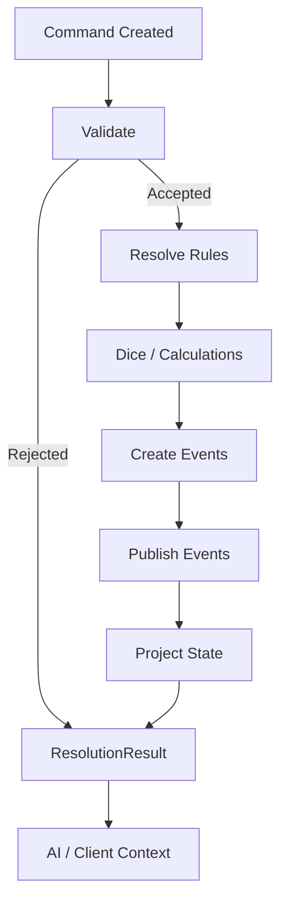

Для read-only Command этап State projection является no-op: Event всё ещё может
фиксировать domain fact, но `StateStore.save()` не вызывается.

---

### 3.8. Atomicity

Одна Command является одной логической транзакцией.

Implementation status: **Implemented for the current authoritative mutation
consumers.** §3.18 State Mutation Foundation (G5) фиксирует канонический
mutating-command lifecycle, persistence ordering и exact MVP atomicity
boundary. Damage (§3.19), Healing (§3.20), Apply Condition и Remove Condition
(§3.21), а также Start Combat и Advance Turn (§3.25) реализуют этот контракт
end to end; это больше не Planned/Deferred contract. Гарантии остаются
ограничены single-snapshot MVP boundary из §3.18 и не подразумевают
EventStore, replay или generic transaction framework.

Authoritative state-mutating Command может породить несколько Events:

```text
Command
    ↓
Resolved Event
    ↓
State-changing Event(s)
```

Но Engine должен либо успешно применить всю допустимую последовательность, либо вернуть failure без частично применённого результата.

Текущий Attack slice (§3.17) не является таким use case: он создаёт только
`AttackResolved` V1 и не применяет damage или State mutation.

Концептуально:

```text
Command
   │
   ├── validation
   ├── resolution
   └── event creation
         │
         ▼
      COMMIT
         │
         ▼
     State Update
```

---

### 3.9. Error Contract

Ожидаемые command/application/domain failures имеют минимальное structured
Domain representation:

```python
class ErrorCode(StrEnum):
    INVALID_COMMAND = "INVALID_COMMAND"
    ENTITY_NOT_FOUND = "ENTITY_NOT_FOUND"
    DEFINITION_NOT_FOUND = "DEFINITION_NOT_FOUND"
    ACTION_NOT_AVAILABLE = "ACTION_NOT_AVAILABLE"
    INVALID_TARGET = "INVALID_TARGET"
    OUT_OF_RANGE = "OUT_OF_RANGE"
    NOT_VISIBLE = "NOT_VISIBLE"
    RESOURCE_NOT_AVAILABLE = "RESOURCE_NOT_AVAILABLE"
    INVALID_STATE = "INVALID_STATE"
    RULE_VIOLATION = "RULE_VIOLATION"


@dataclass(frozen=True)
class EngineError:
    code: ErrorCode
    message: str
    entity_id: str | None = None
    field: str | None = None
```

`EngineError` описывает ожидаемую structured processing failure и входит в
`ResolutionResult.errors`. Большая exception hierarchy не создаётся.
Intrinsic invalid construction Python object может использовать `TypeError` и
`ValueError`. Infrastructure и programming failures не преобразуются
автоматически в gameplay errors. `ErrorCode` и `EngineError` реализованы как
минимальные Domain contracts без exception hierarchy.

Пример:

```json
{
  "code": "ACTION_NOT_AVAILABLE",
  "message": "Creature has already used its action.",
  "entityId": "character_001",
  "field": null
}
```

Базовые категории:

```text
INVALID_COMMAND
ENTITY_NOT_FOUND
DEFINITION_NOT_FOUND
ACTION_NOT_AVAILABLE
INVALID_TARGET
OUT_OF_RANGE
NOT_VISIBLE
RESOURCE_NOT_AVAILABLE
INVALID_STATE
RULE_VIOLATION
```

AI должен получать `code`, а не пытаться парсить произвольный текст ошибки.

---

### 3.10. Minimal Phase 2 Ability Check vertical slice

Первый read-only Phase 2 vertical slice реализован полностью:

```text
AbilityCheckCommand
        ↓
AbilityCheckHandler / State lookup
        ↓
CreatureState
        ↓
resolve_ability_check(...)
        ↓
AbilityCheckResult
        ↓
AbilityCheckResolved
        ↓
ResolutionResult[AbilityCheckResult]
```

Canonical closed ability identifier:

```python
class Ability(StrEnum):
    STRENGTH = "strength"
    DEXTERITY = "dexterity"
    CONSTITUTION = "constitution"
    INTELLIGENCE = "intelligence"
    WISDOM = "wisdom"
    CHARISMA = "charisma"
```

`Ability` переиспользуется будущими Ability Checks, Saving Throws и Skills и
безопаснее arbitrary `str`. Enum реализован в Domain value objects.

Ability modifier является pure derived Domain rule:

```text
ability_modifier(score) = (score - 10) // 2
```

Canonical `AbilityScores` range остаётся `1..30`. Modifier не хранится в
`AbilityScores` или State; `AbilityScores` остаётся Phase 1 Value Object, а
derived calculation принадлежит Rule Engine rules.

`dc` является exact `int` на concrete validated Command boundary (`bool` не
является integer DC). Arbitrary hard range вроде `5..30` не вводится: значения
вне common recommended DCs сами по себе не являются основанием для rejection.

Domain resolver boundary:

```python
def resolve_ability_check(
    command: AbilityCheckCommand,
    creature: CreatureState,
    dice: DiceEngine,
    *,
    roll_mode: RollMode = RollMode.NORMAL,
) -> AbilityCheckResult:
    ...
```

`roll_mode` — keyword-only effective rule result и не входит в
`AbilityCheckPayload`, `AbilityCheckCommand`, Command Envelope, API DTO или AI
input. G6C2 (§3.22) adds the first production source: Application reads the
already-loaded actor's authoritative Condition membership, asks the pure
ability-check Condition policy for effective mode, and passes that result to
the resolver. Without `Condition.POISONED`, that policy returns
`RollMode.NORMAL`.

Resolver выполняет только rule resolution, не мутирует `CreatureState` и
получает physical d20 result через `resolve_d20_roll(dice, roll_mode)` (§3.12).
Он не загружает State, не знает `StateStore`, не сохраняет State, не создаёт
Event ID, не читает clock, не сериализует и не импортирует
Infrastructure/Application. Реализованный Application handler загружает
snapshot, находит actor и вызывает resolver.

Immutable Domain result:

```python
@dataclass(frozen=True)
class AbilityCheckResult:
    ability: Ability
    dc: int
    roll: D20Roll
    modifier: int
    total: int
    succeeded: bool
```

`roll.selected` — effective raw d20 value. `AbilityCheckResult.total` равен
`roll.selected + modifier`; `succeeded` равен `total >= dc`. Контракт Phase 1
`DiceRoll.total = sum(rolls)` не меняется, а dice notation не расширяется
modifiers, advantage/disadvantage или keep/drop syntax.

Для Event metadata Application использует один минимальный injected seam:

```python
@dataclass(frozen=True)
class EventMetadata:
    event_id: str
    timestamp: datetime


class EventMetadataProvider(Protocol):
    def next_metadata(self, campaign_id: str) -> EventMetadata:
        ...
```

Application handler не генерирует Event ID самостоятельно и не читает system
clock напрямую. UI, AI и API не являются authoritative metadata source.
`EventMetadataProvider` является application-facing injection seam, а не
`EventStore`, и не обещает durability. Future `EventStore` остаётся
authoritative durable allocator Event sequence/ID; его production implementation
в этом slice не вводится. `EventMetadata` и `EventMetadataProvider` реализованы
в `application.services.event_metadata`; concrete production allocator не
реализован.

Когда durable `EventStore` будет реализован, production source для `EventMetadataProvider.event_id` должен использовать authoritative EventStore/его allocator и не создавать конкурирующую схему Event ID allocation.

Ability Check не мутирует State. Обычный handler вызывает
`StateStore.load(...)`, но не `StateStore.save(...)`. После successful rule
resolution Application получает injected Event metadata и создаёт один
`AbilityCheckResolved` через существующий generic `GameEvent` envelope;
resolver Event не создаёт. Отдельные
`AbilityCheckSucceeded` и `AbilityCheckFailed` не вводятся — gameplay outcome
находится в `payload.succeeded`. Explicit `AbilityCheckHandler` реализован в
`application.handlers.ability_check` и собирает
`ResolutionResult[AbilityCheckResult]` без working copy или Event application.

Реализованные компоненты slice: typed `AbilityCheckCommand`, deterministic
resolver, immutable `AbilityCheckResult`, typed Event payload builder, explicit
Application handler и injected metadata port.

`AbilityCheckResolved` version 1 остаётся immutable legacy NORMAL-only schema:

```python
@dataclass(frozen=True)
class AbilityCheckResolvedPayloadV1:
    ability: Ability
    dc: int
    roll: DiceRoll
    modifier: int
    total: int
    succeeded: bool
```

Domain builder:

```python
def build_ability_check_resolved_v1(
    *,
    event_id: str,
    timestamp: datetime,
    command: AbilityCheckCommand,
    outcome: AbilityCheckResult,
) -> GameEvent:
    ...
```

Builder фиксирует `type="AbilityCheckResolved"` и `version=1`, берёт
`command_id`, `campaign_id` и `actor_id` из Command, использует
`caused_by=None` для этого slice и строит generic JSON-compatible payload из
`AbilityCheckResult` через `AbilityCheckResolvedPayloadV1`. После перехода
result на `D20Roll` builder разрешён только для `RollMode.NORMAL`: он создаёт
точное legacy `DiceRoll(expression="1d20", rolls=(selected,), total=selected)`
представление. Для `ADVANTAGE` и `DISADVANTAGE` builder выбрасывает `ValueError`,
поскольку lossy V1 representation запрещено. Он не читает clock, не генерирует
ID и не обращается к persistence.

Canonical payload v1:

```json
{
  "ability": "strength",
  "dc": 15,
  "roll": {
    "expression": "1d20",
    "rolls": [7],
    "total": 7
  },
  "modifier": -1,
  "total": 6,
  "succeeded": false
}
```

Current canonical writer использует `AbilityCheckResolved` version 2:

```python
@dataclass(frozen=True)
class AbilityCheckResolvedPayloadV2:
    ability: Ability
    dc: int
    roll: D20Roll
    modifier: int
    total: int
    succeeded: bool


def build_ability_check_resolved_v2(
    *,
    event_id: str,
    timestamp: datetime,
    command: AbilityCheckCommand,
    outcome: AbilityCheckResult,
) -> GameEvent:
    ...
```

Canonical payload v2:

```json
{
  "ability": "strength",
  "dc": 15,
  "roll": {
    "mode": "advantage",
    "rolls": [7, 16],
    "selected": 16
  },
  "modifier": 3,
  "total": 19,
  "succeeded": true
}
```

`AbilityCheckHandler` пишет только V2. Один resolver outcome остаётся источником
typed immediate result и Event payload; generic `GameEvent` и
`EventSerializer` не меняются.

Envelope уже содержит `eventId`, `commandId`, `type`, `version`, `campaignId`,
`timestamp`, `actorId` и `causedBy`; payload их не дублирует. EventStore,
runtime Event persistence, State mutation/application, replay, transaction/UoW,
buses, dispatcher и GameEngine остаются deferred.

---

### 3.11. Minimal Phase 2 Proficiency foundation

Первый минимальный Proficiency slice реализует одно pure derived Domain rule:

```python
def character_proficiency_bonus(level: int) -> int:
    ...
```

Функция вычисляет proficiency bonus персонажа из его total character level.
Input — exact `int` (`bool` не является допустимым integer level) в intrinsic
character range `1..20`. Неверный runtime type даёт `TypeError`, а значение вне
range — `ValueError`. Output — exact `int` в range `2..6`.

Canonical progression:

```text
levels  1..4  → +2
levels  5..8  → +3
levels  9..12 → +4
levels 13..16 → +5
levels 17..20 → +6
```

Proficiency bonus не является State, Definition или State owner. Это pure
derived Domain rule: функция не мутирует State, не использует randomness и не
зависит от Application или Infrastructure. Authoritative character-level input
теперь хранится в `CharacterState.total_level`; потребитель явно вызывает
`character_proficiency_bonus(character.total_level)`.

Concrete consumers этих authoritative progression facts реализованы в
Character Saving Throw (§3.13) и Character Skill Check (§3.14). Saving Throw
resolver проверяет membership выбранной Ability в
`CharacterState.saving_throw_proficiencies`; Skill Check resolver проверяет
membership явно выбранного Skill в `CharacterState.skill_proficiencies`.
Только при наличии соответствующей proficiency они добавляют derived bonus из
`total_level`. Это не означает завершение broader Proficiency system.

Character и monster proficiency имеют разные authoritative inputs:

```text
character proficiency bonus
    derives from total character level

monster proficiency bonus
    follows monster/CR rules
    and is outside this slice
```

`character_proficiency_bonus()` не является универсальной Creature formula и
не применяется к monster progression по Challenge Rating.

`proficiency_bonus` не добавляется ни в `CreatureState`, ни в
`CharacterState`: bonus остаётся derived value. Effective current Saving Throw
proficiency membership хранится в
`CharacterState.saving_throw_proficiencies` как `frozenset[Ability]`; источник
или provenance каждого proficiency в текущем контракте не моделируется. Raw
Ability Check contract остаётся неизменным.

Effective current Skill proficiency membership хранится отдельно в
`CharacterState.skill_proficiencies` как `frozenset[Skill]`. Character Skill
Check (§3.14) использует это authoritative membership, но associated Ability
не кодируется в `Skill`: concrete Command передаёт Skill и Ability отдельно.

Attack/tool/weapon proficiency, Expertise, half/double proficiency, stacking
rules, monster proficiency и class progression model остаются deferred. Эти
контракты добавляются только вместе с соответствующими concrete mechanics.

---

### 3.12. Minimal Phase 2 d20 semantics

Общий concrete d20 primitive отделяет physical dice-expression result от
effective selection для advantage/disadvantage:

```python
class RollMode(StrEnum):
    NORMAL = "normal"
    ADVANTAGE = "advantage"
    DISADVANTAGE = "disadvantage"


@dataclass(frozen=True)
class D20Roll:
    mode: RollMode
    rolls: tuple[int, ...]
    selected: int


def resolve_d20_roll(dice: DiceEngine, mode: RollMode) -> D20Roll:
    ...
```

`RollMode` — effective roll mode, уже определённый authoritative игровыми
правилами. Он не является причиной advantage/disadvantage, Condition, Effect,
State, Command intent или generic modifier collection. UI, API и AI не являются
authoritative source режима.

Canonical resolution semantics:

```text
NORMAL       → один independent dice.roll("1d20"), selected = raw
ADVANTAGE    → два independent dice.roll("1d20"), selected = max(raw rolls)
DISADVANTAGE → два independent dice.roll("1d20"), selected = min(raw rolls)
```

`dice.roll("2d20")` для advantage/disadvantage не используется. Каждый ответ
`DiceEngine` обязан быть actual `DiceRoll` для expression `"1d20"` ровно с
одним individual roll; нарушение является programming/infrastructure contract
failure, а не gameplay `EngineError`. `DiceEngine` Protocol и Phase 1
`DiceRoll` не меняются: `DiceRoll.total` по-прежнему равен `sum(rolls)`.

`D20Roll` хранит только `mode`, ordered raw `rolls` и effective `selected`.
Значения natural 1 и natural 20 здесь не интерпретируются как automatic
failure, automatic success или critical result; такую семантику при
необходимости определяет конкретная mechanic. Primitive теперь используется
четырьмя implemented consumers: Ability Check (§3.10), Character Saving Throw
(§3.13), Character Skill Check (§3.14) и Character unarmed Attack Roll
(§3.17). Только Attack из этих mechanics интерпретирует natural 1/20 как
automatic miss/hit и critical result.

The first production source, Poisoned disadvantage for Ability/Skill Checks
and Attack Rolls, is specified in §3.22. Representation and cancellation of
multiple independent advantage/disadvantage sources, other Condition/Effect
sources, monster Saving Throws, monster Skill Checks, broader Attack Roll
paths, and generic modifier/check frameworks remain deferred.

---

### 3.13. Minimal Phase 2 Character Saving Throw vertical slice

Первый Saving Throw slice реализует только read-only character resolution:

```text
SavingThrowCommand
        ↓
SavingThrowHandler / State lookup
        ↓
CreatureState(actor_id) + CharacterState(actor_id)
        ↓
resolve_character_saving_throw(...)
        ↓
SavingThrowResult
        ↓
SavingThrowResolved V1
        ↓
ResolutionResult[SavingThrowResult]
```

Mechanic-level Command остаётся generic по имени, хотя первый concrete resolver
является character-specific:

```python
@dataclass(frozen=True)
class SavingThrowPayload:
    ability: Ability
    dc: int


@dataclass(frozen=True)
class SavingThrowCommand:
    command_id: str
    campaign_id: str
    actor_id: str
    payload: SavingThrowPayload
    type: Literal["SavingThrowCommand"] = field(
        init=False,
        default="SavingThrowCommand",
    )
```

Command выражает intent и не содержит level, proficiency membership/bonus,
ability modifier, roll, selected value или `roll_mode`. Authoritative inputs
берутся из State, а effective roll mode остаётся rule input.

Domain resolver boundary:

```python
def resolve_character_saving_throw(
    command: SavingThrowCommand,
    creature: CreatureState,
    character: CharacterState,
    dice: DiceEngine,
    *,
    roll_mode: RollMode = RollMode.NORMAL,
) -> SavingThrowResult:
    ...
```

`command.actor_id`, `creature.id` и `character.id` обязаны совпадать; mismatch
является programming/domain invocation failure (`ValueError`). Handler до
resolver находит обе проекции по одному actor ID. Legacy V1 snapshot с
`characters=()` не получает invented Character defaults.

Canonical formula:

```text
ability_modifier = ability_modifier(selected Ability score)

proficiency_bonus =
    character_proficiency_bonus(CharacterState.total_level)
    if ability in CharacterState.saving_throw_proficiencies
    else 0

total = D20Roll.selected + ability_modifier + proficiency_bonus
succeeded = total >= dc
```

`ability_modifier()` является shared pure rule в `domain.rules.ability` и
переиспользуется Ability Check. Proficiency bonus не хранится в State.
Resolver использует `resolve_d20_roll(dice, roll_mode)` и не реализует вторую
d20-selection logic. Natural 1 не является automatic failure, natural 20 не
является automatic success: для этого slice всегда действует `total >= dc`.

Immutable result хранит audit contributions раздельно:

```python
@dataclass(frozen=True)
class SavingThrowResult:
    ability: Ability
    dc: int
    roll: D20Roll
    ability_modifier: int
    proficiency_bonus: int
    total: int
    succeeded: bool
```

Application создаёт `SavingThrowResolved` V1 через generic `GameEvent`:

```json
{
  "ability": "constitution",
  "dc": 15,
  "roll": {
    "mode": "normal",
    "rolls": [10],
    "selected": 10
  },
  "abilityModifier": 2,
  "proficiencyBonus": 3,
  "total": 15,
  "succeeded": true
}
```

Event builder получает `event_id` и UTC `timestamp` от Application, фиксирует
`type="SavingThrowResolved"`, `version=1`, correlation/scope/actor из Command и
`caused_by=None`. Он не читает clock, не выделяет ID, не загружает и не
сохраняет State.

`SavingThrowHandler` использует explicit `StateStore`, `DiceEngine` и
`EventMetadataProvider`. Missing `CreatureState` возвращает
`ENTITY_NOT_FOUND`; существующий Creature без matching `CharacterState`
возвращает `INVALID_STATE` с `field="characters"`. На обоих processing failure
paths dice и metadata не вызываются. Проваленный gameplay save остаётся
successful `ResolutionResult` с `outcome.succeeded is False` и одним Event.

Slice read-only: `StateStore.save()` не вызывается, Event не применяется к
State и runtime Event persistence не выполняется.

Poisoned explicitly does not affect this Saving Throw slice (§3.22):
`SavingThrowHandler` invokes no Condition roll-mode policy and retains the
resolver's NORMAL default. Monster Saving Throws and their proficiency source,
Death Saving Throws, other Condition/Effect sources, aggregation/cancellation
of advantage sources, generic modifier/check abstractions, resolver registry,
EventStore, replay, and State mutation remain deferred.

---

### 3.14. Minimal Phase 2 Character Skill Check vertical slice

Первый Skill Check slice реализует read-only проверку персонажа поверх
canonical Skill identity и persisted proficiency membership:

```text
SkillCheckCommand
        ↓
SkillCheckHandler / State lookup
        ↓
CreatureState(actor_id) + CharacterState(actor_id)
        ↓
resolve_character_skill_check(...)
        ↓
SkillCheckResult
        ↓
SkillCheckResolved V1
        ↓
ResolutionResult[SkillCheckResult]
```

Command содержит Skill и Ability как два независимых explicit inputs:

```python
@dataclass(frozen=True)
class SkillCheckPayload:
    skill: Skill
    ability: Ability
    dc: int


@dataclass(frozen=True)
class SkillCheckCommand:
    command_id: str
    campaign_id: str
    actor_id: str
    payload: SkillCheckPayload
    type: Literal["SkillCheckCommand"] = field(
        init=False,
        default="SkillCheckCommand",
    )
```

`Skill` определяет proficiency membership, а `Ability` определяет выбранный
ability score и modifier. Resolver не выводит Ability из Skill и не применяет
fixed mapping. Поэтому, например, `Skill.INTIMIDATION + Ability.STRENGTH`
является canonical combination и проходит без normalization к Charisma.
Default Skill-to-Ability association может появиться только в будущем
adjudication/presentation layer и не является Domain invariant этого slice.

Domain resolver boundary:

```python
def resolve_character_skill_check(
    command: SkillCheckCommand,
    creature: CreatureState,
    character: CharacterState,
    dice: DiceEngine,
    *,
    roll_mode: RollMode = RollMode.NORMAL,
) -> SkillCheckResult:
    ...
```

`command.actor_id`, `creature.id` и `character.id` обязаны совпадать; mismatch
является programming/domain invocation failure (`ValueError`). Formula:

```text
ability_modifier = ability_modifier(explicit Ability score)

proficiency_bonus =
    character_proficiency_bonus(CharacterState.total_level)
    if explicit Skill in CharacterState.skill_proficiencies
    else 0

total = D20Roll.selected + ability_modifier + proficiency_bonus
succeeded = total >= dc
```

Resolver переиспользует `ability_modifier()`,
`character_proficiency_bonus()` и `resolve_d20_roll()`. Natural 1 не является
automatic failure, natural 20 не является automatic success.

G6C2 (§3.22) makes the current Character Skill Check a positive Poisoned
consumer by reusing the ability-check Condition policy in Application. The
resolver contract is unchanged: it receives the resulting effective
`roll_mode` and does not look up Condition membership itself.

Immutable result сохраняет и Skill, и фактически использованную Ability:

```python
@dataclass(frozen=True)
class SkillCheckResult:
    skill: Skill
    ability: Ability
    dc: int
    roll: D20Roll
    ability_modifier: int
    proficiency_bonus: int
    total: int
    succeeded: bool
```

Application создаёт один generic `GameEvent` типа `SkillCheckResolved`, version
1, с externally supplied `event_id` и UTC `timestamp`. Canonical V1 payload:

```json
{
  "skill": "intimidation",
  "ability": "strength",
  "dc": 15,
  "roll": {
    "mode": "normal",
    "rolls": [12],
    "selected": 12
  },
  "abilityModifier": 3,
  "proficiencyBonus": 3,
  "total": 18,
  "succeeded": true
}
```

Builder проверяет соответствие `skill`, `ability` и `dc` между Command и
outcome; он не генерирует metadata, не читает persistence и не выполняет RNG.
Gameplay failure представлен тем же `SkillCheckResolved` с
`succeeded=false`, а не отдельным Event type.

`SkillCheckHandler` явно зависит от `StateStore`, `DiceEngine` и
`EventMetadataProvider`. Он сначала ищет `CreatureState` по `actor_id`, затем
matching `CharacterState`. Missing Creature возвращает `ENTITY_NOT_FOUND`;
existing Creature без Character projection возвращает `INVALID_STATE` с
`field="characters"`. На lookup failures dice и metadata не вызываются.
Infrastructure/programming failures от load, dice и metadata проходят наружу
по существующей boundary semantics.

Slice read-only: handler никогда не вызывает `StateStore.save()`, не мутирует
загруженные projections, не применяет Event к State и не создаёт persistence
artifacts. Expertise, half proficiency, monster Skill Checks, proficiency
provenance/source lists и generic check/resolver/handler abstractions остаются
deferred. После третьего concrete handler duplication может быть отдельно
оценена, но этот slice не вводит shared orchestration framework.

---

### 3.15. Minimal Phase 2 Armor Class design

Implementation status: **Implemented (minimal scope).** G4a prerequisite
(§3.16), unarmored Character AC, baseline Monster AC, and the first concrete
Attack consumer of baseline Monster AC (§3.17) are implemented. Equipment and
runtime AC modifiers remain deferred.

Этот раздел фиксирует реализованную minimal effective Armor Class (AC)
boundary как canonical source of truth. Production implementation сохраняет
derived Character calculation отдельно от immutable Monster Definition fact.

#### Effective AC — derived, не persisted

```text
Effective Armor Class
    = derived Domain rule result
```

Effective AC:

```text
не является State
не является Definition
не является отдельным State Owner
не хранится как materialized поле CreatureState
не хранится как materialized поле CharacterState
```

Authoritative State/Definition хранит только источники (inputs), из которых
AC вычисляется на каждый запрос. Это тот же принцип, что уже применён к
`ability_modifier(score)` (§3.10) и `character_proficiency_bonus(level)`
(§3.11): дешёвый derived result не становится вторым source of truth.

Не вводятся:

```text
CreatureState.armor_class
CharacterState.armor_class
ArmorClassState
ACState
```

#### State Ownership сохраняется без изменений

AC не получает нового Owner. Источники AC продолжают принадлежать
существующим владельцам из §10.13:

```text
CreatureState abilities
    → Creature / CreatureDomain

equipped armor / shield
    → EquipmentEngine / future EquipmentState  (§10.6)

future Conditions / Effects AC inputs
    → ownership and composition remain outside this AC slice

Monster baseline rules data
    → immutable MonsterDefinition  (§3.1.1)
```

Сам результат — effective Armor Class — является rule calculation / read
model, а не authoritative mutable State. В частности, этот design explicitly
не переносит equipped armor, shield или equipment slots в `CreatureState`:
Equipment Owner (§10.6) остаётся прежним.

This AC design does not resolve or change the existing Conditions/Effects
ownership boundaries (§10.4 assigns conditions/effects to Creature Domain,
while §10.13 separately lists `EffectState` / Effect Engine). Their
contribution to effective AC remains deferred until the corresponding
mechanic is designed.

#### Initial Character AC scope: unarmored

Первый поддерживаемый Character case — unarmored Character:

```text
AC = 10 + Dexterity modifier
```

Реализованная pure Domain rule:

```python
def unarmored_character_armor_class(creature: CreatureState) -> int:
    return 10 + ability_modifier(creature.ability_scores.dexterity)
```

Источник:

```text
CreatureState.ability_scores.dexterity
        ↓
ability_modifier(...)   (§3.10)
        ↓
10 + modifier
```

Зафиксировано:

```text
CharacterState для этой формулы не требуется
proficiency не участвует
DiceEngine не участвует
результат не записывается обратно в State
```

Не проектируются в этом slice: armor, shield, class-specific AC formulas,
Unarmored Defense variants, magic items, spell bonuses, temporary AC
modifiers, Conditions/Effects AC aggregation, generic modifier pipeline.

#### Initial Monster AC scope: baseline Definition fact

Первый Monster case — baseline Monster AC. Источник:

```text
CreatureState.definition_id
        ↓
typed MonsterDefinition dereference
        ↓
MonsterDefinition.armor_class
```

`MonsterDefinition.armor_class` — immutable baseline AC из monster rules/stat
block. После successful typed lookup production consumer читает поле напрямую:

```python
monster_definition = definition_source.get_definition(
    ruleset_id=campaign.ruleset_id,
    ruleset_version=campaign.ruleset_version,
    definition_id=creature.definition_id,
    expected_type=MonsterDefinition,
)
armor_class = monster_definition.armor_class
```

Отдельная `baseline_monster_armor_class()` или другая pass-through Monster AC
rule намеренно не вводится: у прямого чтения immutable Definition fact нет
отдельной вычислительной policy. Зафиксировано:

```text
Monster AC не выводится из Dexterity
внутреннее происхождение stat-block AC (natural armor / equipped armor /
    shield / special rules) пока не раскладывается на составляющие
runtime monster AC modifiers пока deferred
```

#### Граница: §3.1.1 MonsterDefinition изменён только в G4a

На этапе AC design (DEC-0028) реализованный Phase 1 `MonsterDefinition`
(§3.1.1) оставался закрытым минимальным контрактом ровно с полями `id`,
`version`, `name`, `ability_scores`; `armor_class` не добавлялся, а
production-класс `src/dnd_engine/domain/definitions/monster.py` не менялся.

`MonsterDefinition.armor_class` являлся согласованным prerequisite будущего
AC implementation и был добавлен вместе с G4a (§3.16) — первым реальным
Definition-loading slice, вместе с тестами. Причина: нельзя было объявить
существующий реализованный Phase 1 contract расширенным задним числом до
реализации и тестов; после G4a это расширение сделано явно и только в
объёме поля `armor_class`.

#### G4a — обязательный pipeline gate перед AC IMPLEMENTATION

**Status: G4a prerequisite и AC IMPLEMENTATION (unarmored Character AC и
baseline Monster AC) implemented; minimal Character unarmed Attack → Monster
consumer реализован отдельно в §3.17.** Roadmap AC отмечен выполненным только
после production rule и regression proof обеих веток; broad Attack rolls
теперь зафиксирован как complete foundation с `broader scope PARTIAL`
(`docs/ROADMAP.md`, §3.24).

Согласованный pipeline фиксирован как:

```text
AC design → docs
    ↓
G4a
    ↓
AC IMPLEMENTATION
    ├─ unarmored Character AC
    └─ baseline Monster AC
```

G4a был обязательным prerequisite перед началом всего AC IMPLEMENTATION slice
целиком, а не только перед Monster AC веткой. Обе ветки реализованы после
завершения G4a.

Технически только Monster AC напрямую зависит от typed Definition access:
unarmored Character AC (`10 + Dexterity modifier`) сам по себе не выполняет
Definition lookup и не требует Definition access port по своей формуле.
Character unarmored AC от этой technical asymmetry ничего не выигрывает: обе
ветки прошли один и тот же G4a pipeline gate. Monster ветка использует typed
lookup; Character rule не импортирует и не вызывает Definition access.

G4a установил минимальную семантику typed Definition lookup:

```text
ruleset_id + ruleset_version
+ definition_id
+ expected definition type
        ↓
typed Definition
```

Точная Python signature, port/API и его реализация зафиксированы в §3.16.
G4a реализовал:

```text
Definition access port           → §3.16 (DefinitionSource)
typed lookup                     → §3.16 (DefinitionSource.get_definition)
MonsterDefinition.armor_class    → §3.1.1
minimal real MonsterDefinition data → §12.26 (packaged goblin)
lazy referential validation      → §3.16, §12.26
DEFINITION_NOT_FOUND             → §3.16 (DefinitionNotFoundError policy)
wrong-type failure policy        → §3.16 (DefinitionTypeMismatchError policy)
packaged ruleset resources       → §12.26
installed-wheel test             → §12.26
```

#### Referential validation остаётся lazy

Для будущего Definition lookup зафиксирован только agreed principle:

```text
reference
    ↓
dereference
    ├─ definition missing
    └─ wrong definition type
```

Referential validation lazy: ссылка проверяется тогда, когда concrete
mechanic реально dereference'ит Definition. Eager/global validation вида
"load State → walk every definition_id → validate entire campaign graph" не
вводится.

Missing Definition использует уже существующий `ErrorCode.DEFINITION_NOT_FOUND`
(§3.9); новый error code для этого случая не создаётся. На Domain/port
boundary это выражено как `DefinitionNotFoundError` (§3.16); маппинг в
`EngineError` выполнит конкретный будущий Application consumer (§3.16).

Wrong-type dereference (например `definition_id` указывает на существующий,
но не-`MonsterDefinition` объект) — controlled processing failure. G4a
зафиксировал точную policy: Domain/port boundary выражает это как
`DefinitionTypeMismatchError` (§3.16), а канонический будущий Application
mapping — `ErrorCode.INVALID_STATE` с `field="definition_id"` (§3.16), а не
`DEFINITION_NOT_FOUND` и не новый `ErrorCode`.

#### Packaging requirement для G4a

Первый настоящий ruleset Definition loader не может работать только из
repository checkout — он должен работать после обычной установки
package/wheel. G4a решил packaged ruleset resources и добавил
installed-wheel test (§12.26): производственные данные пакуются как
`importlib.resources` package data внутри `src/dnd_engine/resources/`, и
Definition loading не зависит от наличия git checkout или repository-relative
path.

#### AC не является Command

Armor Class calculation сама по себе является read-only Domain
calculation/query. Не вводятся:

```text
ArmorClassCommand
ArmorClassPayload
ArmorClassResult envelope
ArmorClassResolved
ArmorClassHandler
ResolutionResult[ArmorClassResult]
```

только ради получения значения AC. AC calculation не мутирует State, не
использует `StateStore.save()`, не создаёт `GameEvent`, не использует
`EventMetadataProvider` и не использует `DiceEngine`. Application-level query
для UI может появиться позже при concrete use case, но это не gameplay
Command.

#### Attack boundary

```text
AC mechanic
    ↓
effective target AC

Attack mechanic
    ↓
consumes effective target AC
```

Attack не владеет AC, не сохраняет AC и не должен самостоятельно становиться
owner AC sources. Реализованный `AttackResolved` V1 (§3.17) сохраняет
effective target AC, реально использованный при resolution, как audit fact,
а не persisted target State.

Первый минимальный Attack slice реализован как `Character unarmed attack →
Monster target` (§3.17): он использует `Strength` ability modifier, character
proficiency bonus (§3.11), `D20Roll` / `resolve_d20_roll` (§3.12) и Monster
baseline AC без `EquipmentState`, equipped weapon, weapon proficiency, weapon
ability selection, Finesse, range, ammunition, weapon mastery или full
inventory system.

#### Никаких новых abstractions

Наличие Character AC и Monster AC — повод сохранить concrete policies, а не
автоматически объединять их общей abstraction, в соответствии с DEC-0027. Не
вводятся и не предлагаются как canonical production contract:

```text
ArmorClassProvider
ArmorClassSource
ArmorClassStrategy
ArmorClassProfile
ArmorClassFormula object hierarchy
DefenseProfile
ModifierPipeline
ACModifierPipeline
generic modifier framework
generic Definition registry/plugin framework
```

---

### 3.16. Minimal Phase 2 Definition Access vertical slice (G4a)

Implementation status: **Implemented.** This is the G4a prerequisite required
by §3.15/DEC-0028 before AC IMPLEMENTATION. G4a itself did not implement AC,
Attack, or any State-mutating mechanic; the first concrete Application
consumer of this port is now the separate Attack slice in §3.17.

#### Goal

Production code obtains a typed, immutable Definition from a Creature's
`definition_id` and a Campaign's ruleset identity, without `cast()` at each
call site:

```text
CampaignState.ruleset_id
+ CampaignState.ruleset_version
+ CreatureState.definition_id
+ expected concrete Definition type
        ↓
typed read-only Definition access port
        ↓
Infrastructure packaged-ruleset adapter
        ↓
installed package resources
        ↓
strict JSON decode
        ↓
typed immutable Definition
```

#### `DefinitionSource` — Domain port

`src/dnd_engine/domain/services/definitions.py` declares one generic
read-only Domain `Protocol`, following the same port-in-Domain pattern as
`StateStore` (§12.9):

```python
from typing import Protocol, TypeVar

from dnd_engine.domain.definitions.base import Definition


TDefinition = TypeVar("TDefinition", bound=Definition)


class DefinitionSource(Protocol):
    def get_definition(
        self,
        *,
        ruleset_id: str,
        ruleset_version: str,
        definition_id: str,
        expected_type: type[TDefinition],
    ) -> TDefinition: ...
```

The boundary uses the existing plain `str` `ruleset_id` / `ruleset_version`
fields already on `CampaignState` (§3.2.2); no new `Ruleset` Value Object is
introduced. The full `CampaignState` is never passed to the port — only the
two identity strings. `expected_type` makes the static return type the
concrete requested subtype (e.g. `MonsterDefinition`), so callers do not
`cast()`. The lookup never returns `None`; a missing or wrong-type Definition
is a raised exception (below), and there is no untyped `dict` result. The
port is synchronous only. Category methods such as `get_monster()` /
`get_weapon()` / `get_item()` are not introduced while the single generic
method is sufficient.

#### Lookup boundary errors

Same module:

```text
DefinitionSourceError            (base)
├── DefinitionNotFoundError
└── DefinitionTypeMismatchError
```

* `DefinitionNotFoundError` — the ruleset/version resolved correctly and no
  Definition exists for `definition_id`. This also covers a non-canonical,
  non-resolvable lookup identity: `ruleset_id`, `ruleset_version`, or
  `definition_id` that is not one canonical resource path segment (e.g.
  containing `..`, `/`, `\`, or otherwise not matching the existing §4.1/§4.6
  ID contract) cannot resolve to any packaged Definition, so it fails the
  same way as an ordinary miss rather than introducing a new exception
  type; §12.26 documents that this check runs before any dynamic value is
  joined into a resource path. Canonical future Application mapping:
  `EngineError(code=ErrorCode.DEFINITION_NOT_FOUND, ...)` (§3.9). No new
  `ErrorCode` is introduced.
* `DefinitionTypeMismatchError` — a Definition exists for `definition_id` but
  `isinstance(definition, expected_type)` is `False` (e.g. actual
  `WeaponDefinition`, expected `MonsterDefinition`). This uses `isinstance`,
  not exact type equality, so an expected `ItemDefinition` accepts an actual
  `WeaponDefinition` (`WeaponDefinition IS-A ItemDefinition`). Canonical
  future Application mapping: `EngineError(code=ErrorCode.INVALID_STATE,
  field="definition_id", ...)`. Wrong type is never treated as
  `DEFINITION_NOT_FOUND`, `RULE_VIOLATION`, a new `ErrorCode`, a silent
  fallback, or a return of the wrong object.

G4a introduced no concrete Application consumer and no generic exception →
`EngineError` mapping function. `AttackHandler` (§3.17) is the first concrete
consumer and maps `DefinitionNotFoundError` to `DEFINITION_NOT_FOUND`, and
`DefinitionTypeMismatchError` to `INVALID_STATE` with
`field="definition_id"`, while keeping the mapping local. Infrastructure/content
corruption (malformed JSON, unknown packaged Definition `type`, missing
required packaged field, wrong primitive type, payload `id` mismatch, and
similar) is a distinct Infrastructure-level `InvalidPackagedDefinitionError`
(§12.26) and is never silently turned into `DefinitionNotFoundError`.

#### Lazy referential validation

`definition_id` remains an unvalidated reference until a concrete mechanic
actually dereferences it, matching §3.15. `StateStore.load()`,
`StateSerializer.deserialize`, `StateSnapshot.__post_init__`, and campaign
startup do not call `DefinitionSource.get_definition(...)`; there is no
eager/global campaign-graph validator. A `StateSnapshot` whose
`CreatureState.definition_id` names a nonexistent Definition still loads and
deserializes successfully; the failure appears only at the point some future
mechanic (e.g. AC) performs the typed dereference.

#### Infrastructure adapter

`src/dnd_engine/infrastructure/definitions/packaged.py` implements
`PackagedDefinitionSource`, a stateless production `DefinitionSource` reading
packaged resources via `importlib.resources` (§12.26). It performs resource
lookup, UTF-8 read, JSON parse, strict boundary validation (§12.25), actual
`type`-based Definition-kind discrimination, Domain object construction, and
`expected_type` validation. It does not perform State loading, build
`ResolutionResult`, compute AC, create Events, cache, or access the network.

#### Not introduced

Consistent with §3.6 and DEC-0027, this slice adds no `DefinitionRegistry`,
repository/unit-of-work framework, service locator, DI container, plugin
system, entry points, global singleton, or mutable catalog. `ArmorClassCommand`
/ `Result` / `Event` / `Handler` and HP calculation remain out of scope for
G4a. Current Attack contracts live separately in §3.17.

---

### 3.17. Minimal Phase 2 Character unarmed Attack Roll → Monster vertical slice

Implementation status: **Implemented (intentionally narrow, read-only
scope).** This section defines only `Character unarmed attack → Monster
target`. It does not declare the broad Roadmap Attack Roll mechanic complete.

#### Canonical lifecycle and supported path

```text
AttackCommand
      ↓
AttackHandler
      ↓
actor CreatureState + CharacterState lookup
      ↓
target CreatureState lookup
      ↓
Campaign ruleset identity
      ↓
DefinitionSource(expected_type=MonsterDefinition)
      ↓
MonsterDefinition.armor_class
      ↓
resolve_character_unarmed_attack(...)
      ↓
AttackResult
      ↓
AttackResolved V1
      ↓
ResolutionResult[AttackResult]
```

`AttackCommand` is the intent-level mechanic name. Its typed payload contains
only the target runtime identity:

```python
@dataclass(frozen=True)
class AttackPayload:
    target_id: str


@dataclass(frozen=True)
class AttackCommand:
    command_id: str
    campaign_id: str
    actor_id: str
    payload: AttackPayload
    type: Literal["AttackCommand"] = field(
        init=False,
        default="AttackCommand",
    )
```

`AttackCommand` does not contain attack bonus, proficiency bonus, target AC,
roll mode, weapon identity, or an ability choice. Player/API/AI intent
currently supplies none of those values. Attack bonus, proficiency, AC, weapon,
and ability selection are authoritative rule/State/Definition outputs;
`roll_mode` remains a valid keyword-only effective resolver input described
below.

#### Actor attack calculation

The implemented resolver is concrete and character-specific:

```python
def resolve_character_unarmed_attack(
    command: AttackCommand,
    creature: CreatureState,
    character: CharacterState,
    dice: DiceEngine,
    *,
    target_armor_class: int,
    roll_mode: RollMode = RollMode.NORMAL,
) -> AttackResult:
    ...
```

`command.actor_id`, `creature.id`, and `character.id` must identify the same
runtime entity. The calculation is fixed for this slice:

```text
ability = Ability.STRENGTH
ability_modifier = ability_modifier(actor Strength)
proficiency_bonus = character_proficiency_bonus(CharacterState.total_level)
total = D20Roll.selected + ability_modifier + proficiency_bonus
```

The unarmed Character attack in this slice always receives Character
proficiency. The bonus is derived from `CharacterState.total_level`; it is not
a persisted State field. Weapon proficiency, proficiency source/provenance,
and non-character proficiency policies are not inferred from this rule.

#### d20 selection and Attack-owned natural semantics

Attack reuses the existing `RollMode`, `D20Roll`, and `resolve_d20_roll()`
contracts from §3.12. G6C2 (§3.22) makes the production handler derive
effective mode from the attacker's authoritative Condition membership through
the pure attack-roll Condition policy after the existing lookup sequence, then
pass it to the resolver. The target's Conditions do not affect this mode.
Without `Condition.POISONED`, the policy returns `RollMode.NORMAL`.
`roll_mode` is not part of `AttackCommand`, and player/API/AI intent does not
supply it; it remains a keyword-only effective input at the resolver boundary.

`resolve_d20_roll()` only selects an effective d20 value. Interpretation of
natural 1/20 belongs to the Attack mechanic and uses `D20Roll.selected`:

```text
D20Roll.selected == 1
    → automatic miss
    → critical_hit = false

D20Roll.selected == 20
    → automatic hit
    → critical_hit = true

otherwise
    → hit = total >= target_armor_class
    → critical_hit = false
```

The automatic result is based on `selected`, including future effective
advantage/disadvantage selection, not on `DiceRoll.total` or on any discarded
raw roll. `critical_hit` records the natural-20 Attack outcome only; critical
damage is not implemented.

#### Target Armor Class and typed Definition access

The target must be an existing `CreatureState`. `AttackHandler` then uses:

```text
target CreatureState.definition_id
+ CampaignState.ruleset_id
+ CampaignState.ruleset_version
        ↓
DefinitionSource.get_definition(
    expected_type=MonsterDefinition,
)
        ↓
MonsterDefinition.armor_class
```

The baseline target AC is the immutable
`MonsterDefinition.armor_class` fact defined by §3.15. Attack consumes that
value; it does not own, calculate, or persist AC. The actual AC used for the
resolution is recorded in `AttackResult` and `AttackResolved` V1 as an audit
fact, not as target State.

#### Result and Event V1

The exact immutable result fields are:

```python
@dataclass(frozen=True)
class AttackResult:
    target_id: str
    roll: D20Roll
    ability: Ability
    ability_modifier: int
    proficiency_bonus: int
    total: int
    target_armor_class: int
    hit: bool
    critical_hit: bool
```

After successful processing, Application creates exactly one generic
`GameEvent` with `type="AttackResolved"`, `version=1`, externally supplied
event metadata, and this exact payload shape:

```json
{
  "targetId": "monster_001",
  "roll": {
    "mode": "normal",
    "rolls": [12],
    "selected": 12
  },
  "ability": "strength",
  "abilityModifier": 3,
  "proficiencyBonus": 2,
  "total": 17,
  "targetArmorClass": 15,
  "hit": true,
  "criticalHit": false
}
```

Hit, miss, and natural-20 critical outcomes all use the same
`AttackResolved` V1 Event. No separate `AttackHit`, `AttackMissed`, or
`CriticalHit` Event types are introduced. `ResolutionResult.success` still
means processing/rule-resolution success; a resolved miss therefore returns
`success=True`, an `AttackResult(hit=False, ...)`, and one `AttackResolved`
Event.

#### Read-only boundary

This slice resolves and audits an Attack Roll but applies no consequences:

```text
no State mutation
no StateStore.save()
no damage resolution
no current_hp / max_hp mutation
no Event application
no Event persistence
```

`AttackHandler` loads the snapshot, reads projections and Definition data,
uses `DiceEngine`, requests Event metadata, and returns
`ResolutionResult[AttackResult]`. It does not project the Event into State or
persist either Event or State.

#### Expected failures

Application maps only the concrete expected lookup failures:

| Failure | ErrorCode | `entity_id` | `field` |
| --- | --- | --- | --- |
| actor `CreatureState` missing | `ENTITY_NOT_FOUND` | `command.actor_id` | `None` |
| actor exists without matching `CharacterState` | `INVALID_STATE` | `command.actor_id` | `"characters"` |
| target `CreatureState` missing | `ENTITY_NOT_FOUND` | `command.payload.target_id` | `"target_id"` |
| target Definition missing | `DEFINITION_NOT_FOUND` | `target.definition_id` | `"definition_id"` |
| target Definition is not a `MonsterDefinition` | `INVALID_STATE` | `target.id` | `"definition_id"` |

State-store, DiceEngine, metadata-provider, packaged-content, programming, and
other Infrastructure failures are not automatically converted into gameplay
`EngineError` values. Intrinsic invalid construction and mismatched resolver
arguments retain their existing `TypeError`/`ValueError` boundary.

#### Explicitly deferred scope

This slice does not implement:

```text
damage or critical damage
HP/current_hp mutation
dagger or other weapon attacks
equipment or inventory
weapon proficiency
Finesse
range, reach, or ammunition
Character targets
Monster attacks
spell attacks
broader targeting, visibility, or cover
```

For that reason `docs/ROADMAP.md` intentionally keeps `[ ] Attack rolls`:
the implemented `Character unarmed → Monster` path is a first vertical slice,
not the broad Attack Roll Definition of Done.

#### Post-Attack abstraction review: KEEP CONCRETE

The checkpoint required by DEC-0027 was performed after the first concrete
Attack Roll. Consumer count triggered the review; it did not require an
abstraction. Verdict: **KEEP CONCRETE**. Existing shared primitives remain
sufficient, and no new production abstraction is introduced.

1. **Generic d20/check resolver — rejected.** Attack adds a target, target AC
   comparison, and mechanic-owned natural 1/20 and critical semantics that
   Ability Check, Saving Throw, and Skill Check do not share.
2. **Character projection helper — rejected after threshold re-evaluation.**
   Attack is the third character-specific consumer needing both
   `CreatureState` and `CharacterState`, but `StateSnapshot` already owns the
   projection identity invariant. Extraction would mainly shorten local
   lookup/error code and would require a new wrapper/error abstraction without
   adding policy.
3. **Actor/target lookup helper — rejected.** Actor and target have different
   lookup/error roles, and target lookup policy has only one concrete Attack
   consumer.
4. **Generic Definition-exception → EngineError mapper — rejected.** Attack is
   the first concrete Application consumer of G4a semantic exceptions; one
   consumer is insufficient evidence for a shared mapping boundary.
5. **Handler success-tail helper — rejected.** Similar metadata/Event/result
   construction is syntactic duplication. The first future mutating action
   will have materially different Event application and persistence
   orchestration semantics.
6. **Proficiency abstraction — rejected.** Attack, Saving Throw, and Skill
   proficiency memberships and authoritative sources differ materially;
   Expertise, monster proficiency, and weapon proficiency cases remain absent.
7. **`ModifierPipeline` / generic modifier framework — rejected.** Current
   concrete calculations do not establish a stable composition policy or
   ordering contract.

This reaffirms DEC-0027: a consumer count is a review trigger, not an
abstraction rule. Existing Ability Check, Character Saving Throw, and
Character Skill Check production contracts remain unchanged.

---

### 3.18. State Mutation Foundation (G5)

Implementation status: **Canonical foundation contract; seven concrete
consumers implemented in §§3.19–3.21, §3.25, and §3.27.** This section itself
introduced no concrete Command, Event applier, or Application handler and
changed no Python contract — it fixes the general contract that every
authoritative state-mutating Command must follow. §3.19 documents Damage →
HP, §3.20 documents Healing → HP, §3.21 documents Apply Condition and Remove
Condition, §3.25 documents Start Combat and Advance Turn as the first Phase 3
consumers, and §3.27 adds the positive-damage Monster Attack path. All seven
use State Owner-specific Event application and a replacement `StateSnapshot`
before `StateStore.save()`, and none introduces a generic mutation abstraction.

This section is the "separate State Mutation Foundation decision" that §3.8
Atomicity deferred to. It fixes the mutating-command lifecycle, mutation
scope, Event → State contract, persistence ordering, and exact MVP atomicity
boundary; §3.8 keeps the general Atomicity statement.

#### Mutating Command lifecycle

The canonical `Command → Validation → Rule Engine → Result → Events → State
update → Persistence → Narration` flow (README, CLAUDE.md, §11) is unchanged.
For an authoritative state-mutating Command it resolves to exactly this
ordered flow:

```text
load authoritative StateSnapshot
        ↓
validate Command / resolve references
        ↓
resolve gameplay rules without State mutation
        ↓
produce concrete gameplay outcome
        ↓
construct complete ordered Event batch
        ↓
apply resolved Events to an isolated replacement State projection
        ↓
construct and validate replacement StateSnapshot
        ↓
StateStore.save(new_snapshot)
        ↓
expose successful ResolutionResult
```

"Rule resolution" produces the concrete Domain outcome only (the implemented
`DamageResult`, §3.19, for example): the resolver does not construct Events, does
not receive `EventMetadataProvider`, and does not read Event metadata.
Application then constructs the complete ordered Event batch from that
outcome together with authoritative Event metadata obtained through the
existing `EventMetadataProvider` seam (§2.2, §3.10) — the same division
already used by the implemented Ability Check, Character Saving Throw,
Character Skill Check, and Character unarmed Attack Roll handlers. The
application-level `ResolutionResult` wraps the outcome and the Events only
after the replacement snapshot has been successfully persisted through
`StateStore.save()` (see Persistence ordering below). Resolver, Event
construction, and the final `ResolutionResult` are three separate steps with
three separate owners.

Existing read-only Commands — Ability Check (§3.10), Character Saving Throw
(§3.13), Character Skill Check (§3.14), and Character unarmed Attack Roll
(§3.17) — keep their current semantics unchanged: an Event may be created,
State projection is a no-op, and `StateStore.save()` is never called.

#### Loaded snapshot is read-only input

Application must treat every State object obtained through `StateStore.load()`
as read-only authoritative input for the current Command transaction.
In-place mutation of the loaded object graph is forbidden — including calling
a setter or assigning a field on a loaded `CreatureState`/`CharacterState` —
even though both remain Python-mutable dataclasses.

Authoritative mutation is expressed through replacement / copy-on-write
construction, not in-place mutation:

```text
loaded CreatureState
        ↓
replacement CreatureState (new instance, only the changed field(s) differ)
        ↓
replacement creatures tuple
        ↓
replacement StateSnapshot
```

`deepcopy()` is not part of this contract: a replacement object is built
directly (for example via `dataclasses.replace(...)` or an equivalent
explicit constructor call) from the fields the Event actually changes, not by
cloning the loaded graph and mutating the clone. No `WorkingState` wrapper
type is introduced, and existing State dataclasses do not become frozen.

#### State Owner + transition-specific write scope

Python mutability of a State object is not a license for every transition to
change every field. Each concrete State Owner transition has its own explicit
mutation scope, reviewed alongside its Event contract (§10.4, §10.15).

For both implemented HP consumers (§§3.19–3.20), the transition-specific
write scope is:

```text
may change:
    CreatureState.current_hp

must be preserved:
    CreatureState.id
    CreatureState.definition_id
    CreatureState.ability_scores
    CreatureState.max_hp
```

Healing additionally reads authoritative `max_hp`, records it as `maxHp`, and
checks it during Event application, but still changes only `current_hp`.
This fixes only the implemented Damage/Healing → HP scopes. `max_hp`,
`ability_scores`, and other
`CreatureState`/`CharacterState` fields are not declared globally immutable:
a different future Creature transition (for example levelling, or a future
`max_hp` change) may be granted its own write scope through its own design,
documented and reviewed alongside that transition's concrete Event contract.
A new Decision Log entry is required only when that design actually
introduces or changes a substantial architectural contract, per the existing
`AGENTS.md` change-authorisation process — not automatically for every future
transition.

#### Event → State contract

General contract: a resolved concrete Event is applied by a State
Owner-specific deterministic function that returns a replacement State
object.

```text
resolved concrete Event → State Owner-specific deterministic application → replacement State
```

Event application:

```text
does not roll dice
does not call DiceEngine
does not load Definitions
does not call the AI layer
does not perform persistence I/O
does not read the clock
does not create Event IDs
does not generate new authoritative Events
does not re-make a gameplay decision
applies exactly the transition the resolved Event already expresses
```

This foundation itself introduces no production `EventApplierRegistry`, a
generic reducer, a dispatcher, or a generic `EventApplier` Protocol solely to
anticipate Damage. The exact Python shape of the first concrete applier was
decided by the Damage → HP implementation slice: `apply_damage_applied_v1`
(§3.19) is a plain function, not a generic interface or registry.

#### Resolver ≠ State application

A resolver is responsible for the gameplay decision; State application is
responsible for the deterministic projection of an already-resolved Event.

The implemented Damage resolver (`resolve_damage`, §3.19), for example,
determines previous HP and new HP — the full gameplay decision, via
`DamageResult`. Because the resolved Event already carries that decided
result (for example the new
`current_hp` value), State application does not recompute clamping or any
other rule; it only projects the value the Event already carries. State
application may perform application-side integrity validation of whether an
Event is applicable to the loaded State (for example, that the Event's target
Creature ID matches the State object being updated), but it does not repeat
rule resolution.

#### Persistence ordering

Canonical mutating ordering:

```text
outcome → Events → replacement State → invariants → replacement StateSnapshot → StateStore.save → successful ResolutionResult
```

A successful mutating Command's result must not become externally observable
before `StateStore.save()` has returned successfully. The "return success,
save later" model is forbidden: Application does not return
`ResolutionResult(success=True, ...)` and perform `save()` afterward, and does
not expose the outcome or Events to a caller before `save()` succeeds.
`StateStore`'s `load()`/`save()` API (§12.9) is not extended with a
transaction method for this contract.

#### Save failure semantics

If `StateStore.save(new_snapshot)` raises `StateStoreError` or another
Infrastructure failure:

```text
the original loaded State graph remains unchanged
no successful ResolutionResult is returned
the in-memory Events that were constructed are not durable Event history
the Infrastructure failure is not automatically converted into a gameplay EngineError
no rollback framework is introduced
```

If Event metadata (an Event ID, a timestamp) was already allocated through
`EventMetadataProvider` before the save failure, that allocation is not
reused and no rollback/reuse mechanism is designed for it. ID gaps are an
accepted consequence of this MVP; ID reuse is never introduced to close them.

#### Snapshot-authoritative MVP

For this MVP, the persisted `StateSnapshot` is accepted as the authoritative
persisted representation of current campaign State. Events produced by
current `ResolutionResult`s are:

```text
immutable Domain facts
not durable runtime history until a future EventStore exists
not described as recoverable or replayable history
```

`FilesystemStateStore` is not described as fully crash-durable. §12.9 already
states that its atomic same-directory temporary-file replacement via
`os.replace` is single-file replacement, not a durability guarantee across
multiple files or across an arbitrary crash; this contract adds no fsync
semantics, power-loss durability, or crash recovery on top of that. The
persisted snapshot is described as an `authoritative persisted snapshot`, not
with an expanded durability guarantee.

#### EventStore remains deferred

EventStore is not implemented as part of this foundation. Pairing
`EventStore.append(events)` with `StateStore.save(snapshot)` without a shared
transaction design would create an inconsistency window — Events durably
appended with no matching State save, or a State save with no matching
durable Events — that this MVP does not attempt to close. A durable
EventStore, replay, and recovery are designed separately, evidence-driven,
once a concrete consumer needs them (§12.10).

#### Serialized Event dispatch remains deferred

Reading a persisted Event back and dispatching on its `type`/`version` to
reconstruct or apply it remains deferred until a concrete EventStore/replay/
serialized-Event-reader consumer exists. This foundation does not introduce
an Event registry, a schema registry, or a deserializer dispatcher for that
purpose.

#### `state_changes` remains absent

`ResolutionResult` (§3.5) stays exactly `success`, `command_id`, `outcome`,
`events`, `errors`. A resolved Event is the authoritative Domain fact for a
transition; a generic `state_changes` field would be a second, competing
representation of the same transition and is not introduced. If a structured
diff is ever needed for UI or debugging, it is designed later as a derived
projection with a concrete consumer, not introduced ahead of one. This section
changes no field of the production `ResolutionResult`.

#### No generic transaction framework

Explicitly deferred, in addition to the existing §3.6 list:

```text
UnitOfWork
TransactionManager
WorkingState
MutationContext
StateChange
EventApplierRegistry
generic reducer
generic State Owner repository
generic transaction coordinator
```

`DamageHandler`/`apply_damage_applied_v1` (§3.19) and
`HealingHandler`/`apply_healing_applied_v1` (§3.20) were the first two
production state-mutating gameplay consumers at the post-G6B review. That
comparison reviewed their actual shared and differing responsibilities and
retained the verdict `KEEP CONCRETE`. G6C later added
`ApplyConditionHandler`/`RemoveConditionHandler`; §3.23 supersedes only the
snapshot-replacement-helper verdict. G7 (§3.25) later added
`StartCombatHandler`/`AdvanceTurnHandler` as the first Phase 3 consumers of
this same foundation; its own review (§3.25 "Abstraction verdict") found
their `StateSnapshot.combat` attachment simpler than the four Creature
consumers and needing no helper at all. None of the other deferred
abstractions above gained a production implementation.

#### Exact MVP atomicity boundary

This clarifies §3.8 Atomicity for the current single-snapshot, single-writer
MVP. Guaranteed:

```text
loaded authoritative State is not mutated
the replacement is built in isolation from the loaded State
persisted authoritative State does not change before save()
the replacement snapshot is saved by exactly one StateStore.save() call
a successful ResolutionResult is returned only after a successful save
```

Not guaranteed:

```text
atomic EventStore + StateStore transaction
distributed transaction
multi-store transaction
concurrency control
optimistic locking
State revision / compare-and-swap
replay
rollback after a successful save
exactly-once Command execution
retry deduplication
post-crash recovery
power-loss / fsync durability
```

#### Acceptance obligations for the first Damage → HP consumer

This subsection fixes the executable acceptance obligations that the first
concrete Damage → HP mutation slice must demonstrate before the guarantees
above stop being conceptual; §3.19 records that the implemented
`DamageHandler`/`apply_damage_applied_v1` slice satisfies them. It
concretizes the decision already recorded in DEC-0032; it is not a new
architectural decision. This subsection itself did not fix the exact
`ApplyDamageCommand`/`DamageApplied` Event payload schema — that schema is
fixed by §3.19/DEC-0033 — and it does not decide broader Damage mechanics;
see the G6a boundary below.

**A. Domain — concrete State transition.** The first concrete Damage → HP
Event application must demonstrate:

```text
the same resolved Event applied to the same input CreatureState produces the same replacement CreatureState
no DiceEngine call happens during State application
no DefinitionSource call happens during State application
no persistence I/O happens during State application
no new authoritative Event is produced during State application
no gameplay rule decision is re-made during State application
only CreatureState.current_hp changes
CreatureState.id, definition_id, ability_scores, and max_hp are preserved unchanged
the resulting CreatureState satisfies its existing invariants (§3.2.1)
```

This does not require a generic `EventApplier` interface, Protocol, or
registry; the exact Python shape of the first concrete application step is
decided at implementation time, per "Event → State contract" above.

**B. Application orchestration.** The mutating Application handler
(`DamageHandler`, §3.19) must demonstrate:

```text
the object graph returned by StateStore.load() is not mutated
a complete Event exists before State projection/application begins
the affected CreatureState is replaced by a new object, never mutated in place
a replacement StateSnapshot is constructed
unrelated projections in the replacement snapshot remain semantically unchanged
StateStore.save() is called exactly once on the successful mutating path
StateStore.save() receives the replacement snapshot, not the originally loaded snapshot
a processing/validation/rule-resolution failure occurring before Event construction does not call StateStore.save()
an Event-application/invariant failure does not call StateStore.save()
a StateStore.save() failure propagates outward per existing StateStoreError boundary semantics (§12.9)
a StateStore.save() failure never results in a successful ResolutionResult
a successful ResolutionResult only becomes observable after a successful StateStore.save() call
```

These are observable obligations on inputs, outputs, and call sequence —
comparable to the existing spy-`StateStore`/call-order assertion style already
used by `tests/application/test_attack_handler.py` — not a requirement on the
internal statement order of the handler implementation.

**C. Regression / architecture boundary.** The first mutation slice must also
reconfirm, alongside its own Damage → HP-specific tests:

```text
existing read-only handlers (Ability Check, Character Saving Throw, Character Skill Check, Character unarmed Attack Roll) still never call StateStore.save()
ResolutionResult has not gained a state_changes field
no EventStore has been introduced
no runtime Event persistence has been introduced
no generic Event applier registry or generic reducer has been introduced
no UnitOfWork, TransactionManager, or MutationContext has been introduced
no new production dependency has been added
StateStore's Protocol still exposes exactly load()/save()
StateSnapshot's schema is not extended solely to support the mutation framework
```

**G6A/G6B boundary.** The first consumer after this foundation is the minimal
`Damage → current_hp` evidence slice implemented in §3.19 (tracked in
`docs/ROADMAP.md` as `Damage`/`HP`). §3.19/DEC-0033 fix the exact
`ApplyDamageCommand`/`ApplyDamagePayload` schema and the exact `DamageApplied`
V1 Event payload. The second consumer is the minimal Healing → `current_hp`
slice implemented in §3.20; §3.20/DEC-0034 fix its exact contracts and record
the post-G6B abstraction review. These two slices still do not fix or imply a
decision on:

```text
resistances
vulnerabilities
immunities
temporary HP
unconscious/death
critical damage
equipment
Attack → Damage orchestration
generic Effects
generic modifier pipeline
```

These stay open, evidence-driven, per the existing §3.6 rule against
introducing future-phase abstractions ahead of a concrete consumer.

---

### 3.19. Minimal Damage → HP mutation vertical slice (G6A)

Implementation status: **Implemented.** This section documents the first
concrete instance of the §3.18 State Mutation Foundation contract: a direct,
already-resolved Damage amount applied to one existing `CreatureState`'s
`current_hp`, persisted through `StateStore.save()`. It supersedes no
guarantee in §3.18; it records which of §3.18's obligations this slice
actually discharges and which remain conceptual for future consumers.

#### Scope

```text
direct, already-resolved positive Damage amount (int >= 1)
one existing CreatureState target
CreatureState.current_hp only
floor at zero
exactly one DamageApplied V1 Event
replacement State (CreatureState, creatures tuple, StateSnapshot)
exactly one StateStore.save() call on the successful path
```

#### Explicit exclusions

This slice does not implement, and does not imply a decision on:

```text
Attack → Damage orchestration
weapon damage roll
critical damage
DamageType mechanics
resistance / immunity / vulnerability
temporary HP
death / unconscious state
healing
conditions
EventStore
Event replay
```

These stay open for a later, separately evidenced slice, per §3.6/§3.18's
rule against introducing future-phase behaviour ahead of a concrete consumer.

#### Command contract

```text
ApplyDamageCommand(command_id, campaign_id, actor_id, payload)
ApplyDamagePayload(target_id: str, amount: int)
```

`amount` is an exact `int >= 1`; there is no `new_hp`, `damage_type`,
`weapon_id`, `attack_id`, `critical`, `source`, or `rolls` field. `amount` is
already the fully resolved damage amount to apply — this Command carries no
weapon roll, no modifier calculation, and no `DamageType`.

This is the same Command Envelope shape used by every other Phase 2 Command
(§3.3, §9.1): a boundary-validated, typed, immutable dataclass. It is
currently only an internal/Application-level intent consumed directly by
`DamageHandler` (§2.2) — it is not, by virtue of existing, a promise of an
external API surface, a public HTTP endpoint, or an AI-facing tool call.
Those remain separate, evidence-driven decisions for a later phase.

#### `DamageResult`

```text
DamageResult(target_id: str, amount: int, previous_hp: int, new_hp: int)
```

`DamageResult` independently enforces the field types, `amount >= 1`,
`previous_hp >= 0`, and the canonical formula invariant:

```text
new_hp == max(0, previous_hp - amount)
```

`resolve_damage(command, target) -> DamageResult` is a pure function: it does
not mutate `target`, does not call `DiceEngine`, does not load a Definition,
and performs no I/O. Target/actor lookup is an Application-handler concern
(`DamageHandler`), not a resolver concern, per §3.18's "Resolver ≠ State
application" split.

#### `DamageApplied` V1

Canonical payload, written exactly as:

```text
targetId
amount
previousHp
newHp
```

No `damageType`, `weaponId`, `attackId`, `critical`, `overkill`,
`effectiveHpLoss`, `condition`, or `stateChanges` field exists on this
payload. The Event carries the complete already-resolved transition —
`previousHp` and `newHp` both — so that State application (below) never has
to recompute the clamp; the builder (`build_damage_applied_v1`) copies these
fields verbatim from the already-validated `DamageResult` and does not
re-derive the `max(0, previous_hp - amount)` formula itself. That formula
invariant is owned exclusively by `DamageResult`.

#### State application

Concrete boundary, per §3.18's "Event → State contract":

```text
CreatureState + DamageApplied V1 → replacement CreatureState
```

`apply_damage_applied_v1(creature, event) -> CreatureState` requires
`event.type == "DamageApplied"`, `event.version == 1`, the exact four-key
payload shape, `payload.targetId == creature.id`, and
`payload.previousHp == creature.current_hp`; it then returns
`dataclasses.replace(creature, current_hp=payload.newHp)`. It takes the
already-resolved `newHp` verbatim — it does not recompute the clamp, does not
call `DiceEngine`, does not call `DefinitionSource`, performs no persistence
I/O, reads no clock, allocates no Event ID, and produces no new authoritative
Event.

Application (`DamageHandler`) passes the replacement `CreatureState` returned
by the concrete Event applier to the narrow §3.23 Application helper:

```text
apply_damage_applied_v1
    → replacement CreatureState
    → replace_creature_in_snapshot(snapshot, replacement)
    → replacement StateSnapshot
    → StateStore.save exactly once
```

The helper substitutes exactly one Creature by stable ID, preserves the
`creatures` tuple order, and reuses the loaded `CampaignState` and
`characters` tuple unchanged. It does not own or repeat Damage gameplay or
Event-application policy. Only `CreatureState.current_hp` changes for this
transition; `id`, `definition_id`, `ability_scores`, and `max_hp` are
preserved, per §3.18's declared Damage → HP write scope.

#### Errors

```text
missing actor CreatureState  → EngineError(code=ENTITY_NOT_FOUND, entity_id=actor_id)
missing target CreatureState → EngineError(code=ENTITY_NOT_FOUND, entity_id=target_id, field="target_id")
intrinsic malformed Command/Result (wrong type, amount < 1, formula mismatch) → TypeError / ValueError at construction
Event/State integrity mismatch (wrong target, previousHp mismatch, wrong type/version, malformed payload) → propagating TypeError / ValueError, not a gameplay EngineError
StateStore.save() failure → propagates unmodified through the existing StateStoreError boundary (§12.9)
```

No new `ErrorCode` value was introduced. An Event/State integrity mismatch is
an application-integrity/programming-state failure, not a gameplay outcome,
so this concrete slice lets the `TypeError`/`ValueError` propagate instead of
converting it to `ResolutionResult(success=False, ...)`. This is a separate
concern from `StateStore` failures: a `StateStore.save()` failure is an
Infrastructure boundary failure governed by §3.18's "Save failure semantics"
and §12.9, not an Event/State integrity mismatch.

#### Zero HP and the replay limitation

A target already at `current_hp = 0` receiving a positive `amount` resolves
to a successful `0 → 0` transition: `DamageResult(previous_hp=0, new_hp=0)`
and a `DamageApplied` Event with `previousHp = 0, newHp = 0` are produced and
persisted normally. No death/unconscious semantics exist yet, so this is
ordinary accepted input.

`previousHp` protects **state-changing** transitions from stale/repeated
application: re-applying a `DamageApplied` Event whose `previousHp` no longer
matches the target's current `current_hp` (for example, a already-applied
`7 → 4` Event re-applied to a Creature that is already at `4`) is rejected by
`apply_damage_applied_v1` with a `ValueError`. But a **no-op** `0 → 0`
transition cannot be distinguished this way: applying the same `0 → 0` Event
twice succeeds twice, because `previousHp == 0 == creature.current_hp` holds
both times. This is a documented, narrow limitation, not a bug: duplicate/
replay detection for a no-op transition needs a deferred revision/idempotency/
replay mechanism (§3.18 "Exact MVP atomicity boundary" already excludes
replay, State revision/CAS, and exactly-once execution). This slice does not
describe itself as providing an exactly-once guarantee.

#### Persistence

The persisted `StateSnapshot` remains the sole authoritative persisted
representation of campaign State, per §3.18's "Snapshot-authoritative MVP".
The in-memory `DamageApplied` Event returned on `ResolutionResult.events` is
a non-durable runtime Domain fact: it is not appended to any file, there is
no `events.jsonl` write, and no `EventStore` exists. `StateStore` remains
exactly `load()`/`save()` (§12.9); `DamageHandler` calls `save()` exactly once
on the successful path, after `DamageApplied` has already been built and
applied and §3.23's helper has returned the replacement snapshot, and only
then returns a successful `ResolutionResult` — matching §3.18's canonical
persistence ordering and its "return success, save later" prohibition.

#### Abstraction verdict (post-implementation)

Reviewed after Groups 1–3 landed this slice's production code
(`ApplyDamageCommand`, `DamageResult`/`resolve_damage`, `DamageApplied` V1,
`apply_damage_applied_v1`, `DamageHandler`): **KEEP CONCRETE.** This
post-G6A abstraction review found no stable shared mutation responsibility
that justifies a generic Event applier, `WorkingState`, a Creature
replacement helper, `UnitOfWork`, a transaction coordinator, `state_changes`,
or generic handler orchestration, so they remain deferred — the existing
§3.6/§3.18 deferred-abstraction lists stand unchanged, and none of them
gained a production implementation. A repeated shape across `DamageHandler`
and the four existing read-only handlers (load snapshot, look up
actor/target, resolve, build Event, return `ResolutionResult`) is surface
similarity, not evidence: the mutating handler's Event-application and
persistence steps have no counterpart in any read-only handler. Healing was
therefore selected as the next evidence checkpoint. That consumer now exists
in §3.20, whose post-G6B review compares both concrete implementations and
retains `KEEP CONCRETE` without revising the G6A contracts above.

---

### 3.20. Minimal Healing → HP mutation vertical slice (G6B)

Implementation status: **Implemented.** This section documents the second
concrete instance of §3.18: a direct, already-resolved, source-agnostic
Healing amount applied to one existing `CreatureState.current_hp`, persisted
through `StateStore.save()`. It does not broaden Healing into spells, items,
resources, conditions, or any other source mechanic.

#### Scope

```text
direct, already-resolved positive Healing amount (int >= 1)
one existing CreatureState target
CreatureState.current_hp only
cap at authoritative CreatureState.max_hp
zero-HP Healing allowed
full-HP Healing is a successful no-op
exactly one HealingApplied V1 Event
replacement State (CreatureState, creatures tuple, StateSnapshot)
exactly one StateStore.save() call on the successful path
```

The Command's `actor_id` and `payload.target_id` are both resolved as
`CreatureState` values from `StateSnapshot.creatures`, matching the G6A
Damage actor/target policy. Actor and target may be the same Creature. A
separate `CharacterState` projection is not required by this slice.

#### Explicit exclusions

This slice does not introduce or decide:

```text
spell, item, feature, or rest source semantics
healing dice or modifiers
resource consumption
temporary HP
death / unconscious recovery rules
conditions or effects
maximum-HP mutation
Definition lookup
EventStore or Event replay
UnitOfWork / transaction coordination
generic mutation or Event-application framework
```

#### Command and result contracts

```text
ApplyHealingCommand(command_id, campaign_id, actor_id, payload)
ApplyHealingPayload(target_id: str, amount: int)

HealingResult(
    target_id: str,
    amount: int,
    previous_hp: int,
    max_hp: int,
    new_hp: int,
)
```

`amount` is an exact `int >= 1` and is already the source-agnostic Healing
amount to resolve. The Command has no `spell_id`, `item_id`, `source`,
`resource`, `dice`, `applied_amount`, or caller-supplied HP endpoint.

`HealingResult` owns the intrinsic gameplay invariant:

```text
new_hp == min(max_hp, previous_hp + amount)
```

It also requires `max_hp >= 1` and `0 <= previous_hp <= max_hp`.
`resolve_healing(command, target) -> HealingResult` is pure: it reads
`target.current_hp` and `target.max_hp`, does not mutate the target, rolls no
dice, loads no Definition, constructs no Event, and performs no I/O. Healing
from zero HP is valid; broader life-state consequences are outside this
slice.

#### `HealingApplied` V1

Canonical payload, written with exactly these fields:

```text
targetId
amount
previousHp
maxHp
newHp
```

`amount` records the already-resolved positive Healing input, while the two
HP endpoints record the actual transition after the cap. There is no
`appliedAmount`: for this contract the effective HP change is already
derivable as `newHp - previousHp`, and storing another authoritative number
would duplicate the same fact. `maxHp` is recorded because it is mutable
authoritative State used by the Healing decision and is required to verify
that the resolved Event is still applicable to the supplied Creature.

`build_healing_applied_v1` checks Command/outcome correlation and copies the
validated `HealingResult` values verbatim. It does not repeat
`min(max_hp, previous_hp + amount)` and does not decide gameplay rules.

#### State application

Concrete State Owner boundary:

```text
CreatureState + HealingApplied V1 → replacement CreatureState
```

`apply_healing_applied_v1(creature, event)` requires Event type
`HealingApplied`, version `1`, the exact five-key payload, matching
`targetId`, matching `previousHp`, and matching `maxHp`. It then projects the
already-resolved `newHp` through `dataclasses.replace`. It neither recomputes
the Healing formula nor performs persistence or metadata work.

Only `CreatureState.current_hp` may change. `id`, `definition_id`,
`ability_scores`, and `max_hp` are preserved. Checking `maxHp` is an
application-integrity guard, not a second owner of the Healing rule.

#### Application lifecycle, errors, and persistence

`HealingHandler` follows the canonical §3.18 lifecycle:

```text
StateStore.load
    → actor Creature lookup
    → target Creature lookup
    → resolve_healing
    → EventMetadataProvider
    → HealingApplied V1
    → apply_healing_applied_v1
    → replacement CreatureState
    → §3.23 replace_creature_in_snapshot(snapshot, replacement)
    → replacement StateSnapshot
    → StateStore.save exactly once
    → successful ResolutionResult
```

The loaded snapshot and target remain unchanged; §3.23's helper preserves tuple
ordering and reuses the Campaign and Character projections unchanged. The
helper receives the already-applied replacement Creature and owns no Healing
gameplay/Event policy. Missing actor or target uses the same `ENTITY_NOT_FOUND`
policy as `DamageHandler` (the target error has `field="target_id"`). Metadata,
Event-application/invariant, and `StateStore.save()` failures propagate and
prevent a successful result.
Success is returned only after `save()` completes. No retry, rollback,
metadata-ID reuse, Event persistence, or schema-version change is introduced.

The persisted `StateSnapshot` remains authoritative current State. The
returned `HealingApplied` Event is an in-memory Domain fact, not durable Event
history. `HealingHandler` neither creates nor appends the canonical
`events/events.jsonl`; a pre-existing empty scaffold file is permitted by
DEC-0006 and does not make the Event durable or constitute an `EventStore`.
No production `EventStore` implementation exists.

#### Full-HP no-op and replay limitation

A positive Healing amount applied at `current_hp == max_hp` resolves
successfully with `previousHp == newHp == maxHp`. The complete lifecycle is
still executed: a `HealingApplied` Event, replacement Creature, replacement
snapshot, and exactly one `StateStore.save()` call are all required before
success is returned. Skipping Event creation or persistence for this no-op is
not permitted.

As with G6A's `0 → 0` Damage, `previousHp` cannot detect duplicate application
of a no-op `maxHp → maxHp` Event, and matching `maxHp` does not distinguish it
either. Replay/idempotency, State revision/CAS, and exactly-once Command
execution remain outside the §3.18 MVP boundary.

#### Post-G6B Damage/Healing abstraction review

Consumer count is a review trigger, not a reason to abstract. The two actual
implementations were compared after both production paths and their tests
existed. Damage owns `max(0, previous_hp - amount)`; Healing owns
`min(max_hp, previous_hp + amount)`, reads mutable authoritative `max_hp`, and
correlates `maxHp` during Event application. Gameplay math remains concrete
and separate.

| Candidate | Apparently shared behavior | Policy vs syntax and concrete differences | Removed complexity vs new coupling / evidence | Verdict |
| --- | --- | --- | --- | --- |
| Creature `current_hp` transition primitive | Project an Event-selected HP endpoint while preserving every other Creature fact. | Preservation is State Owner policy, but Damage supplies an endpoint derived with a zero floor and validates target/previous HP; Healing supplies an endpoint capped by mutable `max_hp` and also validates `maxHp`. Gameplay math cannot enter the primitive. | The narrow candidate would replace one `dataclasses.replace` line per applier with one helper call while coupling both Event paths to a new contract. There is no third mutation consumer; concrete code is cheaper. | `KEEP CONCRETE` |
| Replacement-Creature helper | Construct a new Creature differing only in `current_hp`. | The construction itself is identical syntax; Damage/Healing decisions and correlation checks occur before it and remain different. No gameplay invariant would move into the helper. | It removes no decision and only wraps two existing direct calls. The extra name/import/call boundary is more indirection than the one-line syntax it hides; there is no third consumer. | `KEEP CONCRETE` |
| Snapshot replacement helper | Preserve tuple order, replace one Creature by stable ID, and reuse Campaign/Character projections. | Today this orchestration syntax is the same in both handlers; the Damage and Healing outcomes/Events are different, but snapshot construction does not use their types. | It would remove roughly one small tuple/snapshot block per handler but must newly own missing, duplicate, replacement-ID, and future aggregate-shape semantics. With no third mutation consumer, local explicit code is clearer and less coupled. | `KEEP CONCRETE` |
| Stale-state/application-integrity helper | Reject mismatched target/loaded State before projection. | Damage checks `targetId` and `previousHp`; Healing checks both plus authoritative `maxHp`. Event type/version, exact payload shape, decoded payload type, and error text remain Event-specific policy rather than one common invariant. | At most a few comparisons disappear; generic field extraction, callbacks, or a shared error contract appear. No third Event has the same integrity shape, so concrete checks are cheaper. | `KEEP CONCRETE` |
| Generic Event applier | Validate a resolved Event and return replacement State. | Only the lifecycle is common. `DamageApplied` has four payload fields and no max-HP correlation; `HealingApplied` has five and requires it. Each applier has a different concrete Event contract even though both return `CreatureState`. | A Protocol/base function removes none of the decoding or integrity code and adds interface/dispatch coupling. No serialized/replay caller or third applier needs a generic boundary; direct typed functions are clearer. | `KEEP CONCRETE` |
| Generic mutation handler | Load, look up actor/target, resolve, build/apply Event, replace snapshot, save, return. | Sequencing and actor/target policy are shared; resolver/result types, Event builders/payloads, appliers, error messages, and Damage/Healing math differ. | It could hide visible handler lines only by adding type parameters, resolver/builder/applier callbacks, error factories, and mutation-scope hooks. That framework makes save ordering harder to inspect and test. There is no third mutation handler; concrete orchestration is cheaper. | `KEEP CONCRETE` |
| `WorkingState` | Represent isolated State before persistence. | Neither Damage nor Healing mutates a working graph; both build direct replacements from read-only input. There is no differing behavior for a wrapper to reconcile. | It removes zero current code or policy and adds a new State type/lifecycle plus conversion rules. No multi-step or third consumer needs it. | `KEEP CONCRETE` |
| `UnitOfWork` / `TransactionManager` | Coordinate mutation and persistence/failure. | Damage and Healing each make one `StateStore.save()` call after Event application; neither has an EventStore or second transactional resource. Their save-failure policy is already the same §3.18 boundary. | A coordinator removes no store operation and introduces begin/commit/failure lifecycle and ownership questions. There is no multi-store or third transactional consumer. | `KEEP CONCRETE` |
| `ResolutionResult.state_changes` | Expose the HP transition beside outcome and Event. | Damage already records its four-field transition Event; Healing records its five-field transition including `maxHp`. A generic diff would have to represent both and stay consistent with each concrete Event. | It removes nothing and creates a competing authoritative representation plus consistency/serialization rules. No UI or other consumer requires it. | `KEEP CONCRETE` |
| `EventApplierRegistry` / generic reducer | Dispatch Event type/version to the applicable State transition. | Damage and Healing handlers already know and call their concrete V1 appliers; their payload decoding and integrity policies remain distinct. | A registry adds registration, lookup, unknown-type/version, and target-routing policy without removing applier logic. No persisted serialized-Event reader, replay path, or third dispatch consumer exists; direct calls are cheaper. | `KEEP CONCRETE` |

Overall verdict: **KEEP CONCRETE.** The only plausible narrow owner-specific
primitive — “expected `current_hp` → replacement `current_hp`, preserve every
other Creature fact” — is currently identical to a single explicit
`dataclasses.replace` call and does not justify its coupling. All deferred
abstractions in §§3.6 and 3.18 remain deferred; no production refactor follows
from this review. This was the evidence available after G6B; §3.23 supersedes
only the snapshot-helper verdict after two further production mutation
handlers established the same aggregate-replacement policy. Every gameplay,
Event-applier, generic-handler, registry, and transaction verdict remains in
force.

---

### 3.21. Condition State foundation (G6C1)

Implementation status: **Implemented (State foundation, Domain mutation
contract, Application handlers, and persistence).** This section documents
the persisted representation of Conditions — a closed `Condition` identity,
the `CreatureState.conditions` membership field, and State schema V4 —
together with the full authoritative mutation path that produces and
persists new Condition membership: `ApplyConditionCommand`/
`RemoveConditionCommand`, their resolvers, `ConditionApplied`/
`ConditionRemoved` V1 Events, concrete Creature appliers, and the
`ApplyConditionHandler`/`RemoveConditionHandler` Application handlers that
orchestrate `StateStore.load`/`StateStore.save` around them. It does not
implement gameplay effects itself. The first such behavior, Poisoned
disadvantage for Ability Checks and Attack Rolls, is a separate G6C2 contract
in §3.22.

#### Scope

```text
closed single-value Condition identity (POISONED)
CreatureState.conditions: frozenset[Condition], default frozenset()
State schema V4 (Creature-only change; Character schema unaffected)
strict V4 encode/decode, deterministic write ordering
backward-compatible V1/V2/V3 read (conditions = frozenset())
ApplyConditionCommand / RemoveConditionCommand
pure resolve_condition_application / resolve_condition_removal
ConditionApplied V1 / ConditionRemoved V1 Events
concrete Creature appliers (Event + CreatureState -> replacement CreatureState)
ApplyConditionHandler / RemoveConditionHandler (Application layer)
StateStore.save orchestration for Condition mutation, exactly once on success
```

#### Explicit exclusions

This G6C1 foundation does not implement, and does not imply a decision on:

```text
Condition gameplay effects beyond the separately implemented G6C2 behavior (§3.22)
ModifierPipeline
runtime ConditionState instance entity
ConditionDefinition hierarchy
condition source, duration, expiry, stacking, provenance
Effect framework
runtime allocation of condition_NNN IDs
generic Event applier / generic mutation handler
shared snapshot-replacement / replace_creature helper
EventStore, UnitOfWork, WorkingState, state_changes
```

These stay open for later G6C groups, per §3.6's rule against introducing
future-phase behaviour ahead of a concrete consumer.

#### `Condition` identity

```python
class Condition(StrEnum):
    POISONED = "poisoned"
```

`Condition` (`src/dnd_engine/domain/value_objects/condition.py`) is a closed,
identity-only Domain `StrEnum`, following the same pattern as `DamageType`
(§3.1.1) and `Skill` (§1.2.2). It carries no Ability mapping, no mechanical
effect, and no numeric data; §3.12's d20 semantics and every existing resolver
remain untouched by this slice. Only `POISONED` is defined — the other 5e
Conditions are not added ahead of a concrete consumer.

#### `CreatureState.conditions`

```text
conditions: frozenset[Condition] = frozenset()
```

`conditions` is **authoritative effective Condition membership** for the
current supported Condition set — the same kind of fact as
`saving_throw_proficiencies`/`skill_proficiencies` on `CharacterState`
(§3.2.4), not a collection of runtime Condition-instance objects. It belongs
to `CreatureState`, not `CharacterState`, because Condition membership applies
to any Creature (Character or Monster), matching the existing Creature/
Character State Owner split (§10.4).

Intrinsic `__post_init__` validation is strict and matches the existing
`saving_throw_proficiencies`/`skill_proficiencies` pattern: `type(conditions)
is frozenset`, and every member must be an actual `Condition`. `list`, `set`,
`tuple`, `frozenset[str]`, and raw string values are rejected with
`TypeError`, not coerced. The empty default preserves every existing
`CreatureState(...)` call site across the Ability Check, Saving Throw, Skill
Check, Attack, Damage, and Healing slices without modification. `current_hp`/
`max_hp` invariants (§3.2.1) are unchanged by this addition.

`CreatureState` remains a mutable, non-frozen dataclass (§3.2.1); `conditions`
follows the same ownership rule as every other Creature field — only the
Creature State Owner flow (Command → Resolver → Event → State application,
§3.7) may change it. This slice adds no such flow: `conditions` is currently
mutable only through direct construction/assignment in Domain/test code, not
through any Command.

#### Relationship to `condition_NNN` (§4.12/§4.13)

The `condition_NNN` runtime ID format and the `poisoned` Definition ID were
already reserved in the canonical ID registry before this slice. They remain
reserved for a **possible future** stateful Condition-instance model —
one with its own source, duration, and provenance lifecycle — if concrete
mechanics ever require it. This slice does not allocate or use `condition_NNN`
runtime IDs: `CreatureState.conditions` is a `frozenset` membership set keyed
by `Condition` value, not a collection of ID-addressable instances.

#### `StateSnapshot`

`StateSnapshot`'s top-level shape (`campaign`, `creatures`, `characters`,
§3.2.3) is unchanged. No `StateSnapshot.conditions` field or `ConditionState`
aggregate is introduced; Condition membership is reached exclusively through
`StateSnapshot.creatures[*].conditions`.

#### State schema V4

Schema versioning gains a fourth exact integer value. Semantics per version,
by Creature/Character shape rather than by comparing only against the current
`SCHEMA_VERSION` constant:

```text
V1: no Character projection;                                conditions = frozenset()
V2: savingThrowProficiencies, no skillProficiencies;         conditions = frozenset()
V3: savingThrowProficiencies + skillProficiencies;           conditions = frozenset()
V4: same Character schema as V3 (unchanged);                 + Creature conditions
```

`LEGACY_SCHEMA_V3_VERSION = 3` is now an explicit constant alongside
`LEGACY_SCHEMA_VERSION = 1` and `LEGACY_SCHEMA_V2_VERSION = 2`. `SCHEMA_VERSION`
identifies the current writer (currently `4`), but no version-shape decision
is keyed off comparing directly against it: `SCHEMA_V4_VERSION = 4` is a
separate, fixed constant (`SCHEMA_VERSION = SCHEMA_V4_VERSION` today), and
every place that decides "is this specifically V4" — the supported-schema-
version set, the V4 Creature field set, and `conditions` decoding — compares
against `SCHEMA_V4_VERSION`, never against `SCHEMA_VERSION`. Character
decoding (including the `skillProficiencies` gate) is likewise keyed off
`LEGACY_SCHEMA_V2_VERSION` ("is this V2") rather than the current writer.
This matters because a future schema bump that only reassigns `SCHEMA_VERSION`
to a new value must not silently stop already-persisted V3 or V4 payloads
from decoding correctly; this exact failure mode was identified and closed
while implementing this slice, not treated as hypothetical — a regression
test (`test_v4_creature_shape_is_fixed_and_survives_future_schema_version_bump`)
simulates a future `SCHEMA_VERSION` bump and asserts a historical V4 payload
with `conditions` still decodes exactly.

Canonical V4 Creature JSON:

```json
{
  "id": "monster_001",
  "definitionId": "goblin",
  "abilityScores": { "...": "..." },
  "currentHp": 7,
  "maxHp": 7,
  "conditions": ["poisoned"]
}
```

The writer always emits `conditions`, including `[]` for empty membership,
sorted deterministically by `Condition.value` (§12.9's existing sort-by-value
convention for closed-set collections). The V1–V3 Creature shape has no
`conditions` key at all — it is `unknown`/forbidden there, not merely
optional, matching the existing strict-unknown-field policy (§12.25).

Strict V4 Creature decoding:

```text
conditions must be a JSON list
every entry must be an exact str
every value must map to a known Condition
duplicate entries forbidden
unknown Condition values forbidden
missing `conditions` forbidden for V4
unknown Creature fields forbidden (unchanged policy)
```

V1/V2/V3 Creature decoding is unchanged except that `conditions` is now
explicitly documented as absent from their fixed field set; reading any of
these three legacy versions always yields `CreatureState.conditions ==
frozenset()`, never invented membership.

#### Commands

```text
ApplyConditionCommand(command_id, campaign_id, actor_id, payload)
ApplyConditionPayload(target_id: str, condition: Condition)

RemoveConditionCommand(command_id, campaign_id, actor_id, payload)
RemoveConditionPayload(target_id: str, condition: Condition)
```

Both follow the existing frozen-dataclass Command Envelope shape (§3.3, §9.1)
used by `ApplyDamageCommand`/`ApplyHealingCommand`: an immutable typed
dataclass with a fixed `type` literal and a concrete typed payload.
`condition` is an actual `Condition` — never coerced from a string — checked
by the payload's own `__post_init__`. Neither payload carries `source`,
`duration`, `save_dc`, `spell_id`, `item_id`, `feature_id`, `stacks`, or
`condition_instance_id`; like `ApplyDamageCommand`/`ApplyHealingCommand`, this
is currently only an internal/Application-level intent, not a promise of a
public API/AI-facing surface.

#### Results / resolvers

```text
ConditionApplicationResult(target_id, condition, previous_active, active)
ConditionRemovalResult(target_id, condition, previous_active, active)

resolve_condition_application(command, target) -> ConditionApplicationResult
resolve_condition_removal(command, target) -> ConditionRemovalResult
```

Two concrete result types were kept — no existing shared "membership
transition" type was found — matching the same per-mechanic split already
used for `DamageResult`/`HealingResult`. `active` is intrinsically fixed by
each type's own `__post_init__`: `ConditionApplicationResult.active` must be
`True`; `ConditionRemovalResult.active` must be `False`. `target_id` is an
exact `str`, `condition` an actual `Condition`, and `previous_active`/`active`
exact `bool` (no truthy/`int` coercion). Both resolvers are pure: they read
`command.payload.condition in target.conditions` for `previous_active`, do
not mutate `target`, perform no I/O, call no `DiceEngine`, do no Definition
lookup, and decide no duration/source/stacking. Target correlation is checked
the same way as the existing Damage/Healing resolvers —
`command.payload.target_id != target.id` raises `ValueError` — before any
membership is read.

#### Successful no-op semantics

Applying an already-active Condition, or removing an already-absent one, is a
**successful** result, not a `RULE_VIOLATION`:

```text
apply already-active   -> previous_active=True,  active=True   (successful)
remove already-absent  -> previous_active=False, active=False  (successful)
```

This is not optimized away anywhere on the Domain Event path: the resolver
still returns a normal result, and the builder below still constructs a full
Event for it.

#### Events

```text
ConditionApplied V1:  { targetId, condition, previousActive, active }
ConditionRemoved V1:  { targetId, condition, previousActive, active }
```

Example (`ConditionApplied` V1):

```json
{
  "targetId": "monster_001",
  "condition": "poisoned",
  "previousActive": false,
  "active": true
}
```

`build_condition_applied_v1`/`build_condition_removed_v1` follow the existing
`build_damage_applied_v1`/`build_healing_applied_v1` shape: they check
Command/outcome correlation (`target_id`, `condition`) and copy the
already-resolved result verbatim — they do not re-decide membership. No
`previousConditions`, `newConditions`, `stateChanges`, `conditionInstanceId`,
`source`, or `duration` field exists. Both Event payload dataclasses
(`ConditionAppliedPayloadV1`/`ConditionRemovedPayloadV1`) enforce the same
fixed `active` invariant as their Result counterparts, so a malformed Event
with the opposite endpoint (`ConditionApplied` with `active=false`, or
`ConditionRemoved` with `active=true`) cannot even be constructed — this
covers both the builder path and raw/decoded payload reconstruction in the
applier below. Both Events reuse the existing generic `GameEvent` envelope
and `EventMetadataProvider` injection model (§2.2, §3.10); no new Event base
type is introduced.

#### Concrete Creature appliers

```text
apply_condition_applied_v1(creature, event) -> CreatureState
apply_condition_removed_v1(creature, event) -> CreatureState
```

Each applier follows the existing `apply_damage_applied_v1`/
`apply_healing_applied_v1` integrity-check shape (§3.19, §3.20) before
projecting a replacement: exact Event `type`, `version == 1`, exact payload
key set, `targetId` decoded and matched against `creature.id`, `condition`
decoded to a known `Condition` (unknown values rejected), `previousActive`/
`active` decoded as exact `bool`, the Event's own fixed `active` invariant
(enforced by its payload dataclass), and — the Condition-specific integrity
check — `previousActive == (condition in creature.conditions)`. A mismatch
here (`previousActive != (condition in creature.conditions)`) is a stale/
integrity failure, raised as `ValueError`, not a gameplay `EngineError`,
matching the existing G6A/G6B `previousHp`-mismatch policy.

The applier then projects the endpoint and returns a replacement
`CreatureState` via `dataclasses.replace`:

```text
Apply:  conditions=creature.conditions | {condition}
Remove: conditions=creature.conditions - {condition}
```

Only `conditions` changes; `id`, `definition_id`, `ability_scores`,
`current_hp`, and `max_hp` are preserved. Neither applier re-decides gameplay
rules or performs I/O.

#### Application handlers and persistence

```text
ApplyConditionHandler(state_store: StateStore, event_metadata_provider: EventMetadataProvider)
RemoveConditionHandler(state_store: StateStore, event_metadata_provider: EventMetadataProvider)
```

Both handlers (`src/dnd_engine/application/handlers/apply_condition.py`,
`.../remove_condition.py`) follow the exact `DamageHandler`/`HealingHandler`
lifecycle (§3.19, §3.20):

```text
StateStore.load
-> actor lookup (command.actor_id against loaded creatures)
-> target lookup (command.payload.target_id against loaded creatures)
-> pure resolver (resolve_condition_application / resolve_condition_removal)
-> EventMetadataProvider.next_metadata
-> concrete Condition Event (build_condition_applied_v1 / build_condition_removed_v1)
-> concrete Creature applier (apply_condition_applied_v1 / apply_condition_removed_v1)
-> replacement creatures tuple, order preserved
-> replacement StateSnapshot (all unrelated projections reused unchanged)
-> StateStore.save(replacement_snapshot), exactly once, on the success path only
-> successful ResolutionResult
```

Dependencies are minimal — only `StateStore` and `EventMetadataProvider`, no
`DiceEngine` or `DefinitionSource` — because this is a direct, already-
resolved internal mutation slice, the same shape as Damage/Healing.

**Actor/target lookup policy (direct internal slice, not a general Condition-
source contract).** `command.actor_id` and `command.payload.target_id` are
both looked up against the loaded `StateSnapshot.creatures`, in that order,
mirroring the proven Damage/Healing convention exactly:

```text
missing actor  -> ErrorCode.ENTITY_NOT_FOUND, entity_id=actor_id,              field=None
missing target -> ErrorCode.ENTITY_NOT_FOUND, entity_id=payload.target_id,     field="target_id"
```

Both failures return before `EventMetadataProvider.next_metadata` is called
and before `StateStore.save` is invoked. Self-targeting (`actor_id ==
payload.target_id`) is permitted — the same Creature can be both actor and
target. This lookup policy is scoped to *this* direct-mutation slice; it is
not a promise about how actor semantics will work for any future Condition
source (e.g. a spell or trap triggering Condition application through a
different Command shape).

**Replacement State construction.** Exactly like G6A/G6B, the loaded object
graph is never mutated. The current Condition mutation flow is:

```text
concrete Condition Event applier
    → replacement CreatureState
    → §3.23 replace_creature_in_snapshot(snapshot, replacement)
    → replacement StateSnapshot
    → StateStore.save(...)
```

The helper preserves Creature tuple order and reuses every unrelated
`StateSnapshot` projection unchanged; it owns no gameplay or Event policy.
Historically,
G6C1 deliberately kept this construction inline across `DamageHandler`,
`HealingHandler`, `ApplyConditionHandler`, and `RemoveConditionHandler` as the
evidence checkpoint that the later post-G6C review in §3.23 resolved.

**Persistence.** `StateStore.save(replacement_snapshot)` is called exactly
once, only on the success path; the persisted snapshot becomes the new
authoritative current State the moment `save()` returns without raising. No
`EventStore` and no `events.jsonl` write are introduced — Events remain
in-memory `ResolutionResult` payloads only, exactly as in G6A/G6B.

**Successful no-op is never short-circuited.** Applying an already-active
Condition, or removing an already-absent one, still runs the complete
lifecycle above — pure resolver, Event construction, applier, replacement
snapshot, and exactly one `StateStore.save()` call — and returns a
successful `ResolutionResult`. The handler does not detect the no-op case
and skip any step.

**Failure semantics**, mirroring G6A/G6B exactly: missing actor/target return
a structured `ResolutionResult` failure with no metadata call and no save;
resolver, Event-builder, applier, or Domain-invariant failures raise before
`save()` is reached; `EventMetadataProvider` failures propagate before
`save()`; `StateStore.save()` failures propagate to the caller, and no
successful `ResolutionResult` is produced in that case. No rollback,
retry, or compensating-write framework is introduced — a `save()` failure is
simply not observably successful; the loaded snapshot and Creature objects
the handler read from are left unchanged, since they were never mutated in
place.

**Production integration proof.** Beyond the handler-level unit tests (which
use a call-recording `StateStore` double), `tests/integration/
test_apply_condition_real_adapters.py`, `test_remove_condition_real_adapters.py`,
and `test_condition_lifecycle_real_adapters.py` exercise both handlers
against the real `FilesystemStateStore`/V4 serializer: apply `POISONED`,
save, reload through a *fresh* `FilesystemStateStore` instance, and confirm
`Condition.POISONED` is present; then remove it, save, reload again, and
confirm it is absent. `tests/infrastructure/test_state_store.py::
test_load_accepts_legacy_v3_with_empty_conditions` additionally proves the
legacy V3-to-V4 `conditions` migration (§12.9) through the same real
filesystem adapter path, not only through the isolated `StateSerializer`
unit tests.

#### Replay / no-op limitation

Exactly like G6A's `0 -> 0` Damage and G6B's `maxHp -> maxHp` Healing
(§3.19, §3.20), a canonical no-op Event —
`ConditionApplied{previousActive: true, active: true}` or
`ConditionRemoved{previousActive: false, active: false}` — can be re-applied
(or re-persisted, via `ApplyConditionHandler`/`RemoveConditionHandler`) to a
Creature whose membership already matches, because no State revision,
optimistic-concurrency token, or applied-Event-ID registry exists yet
(§3.18's "Exact MVP atomicity boundary" already excludes replay/idempotency).
This is not fixed here via `revision`, compare-and-swap, an `EventStore`, a
processed-command registry, or a generic Event-application registry — all of
those remain deferred per §§3.6/3.18.

#### Abstraction discipline

`ApplyConditionHandler`/`RemoveConditionHandler` are explicit, concrete
Application handlers — not a generic `MutationHandler`, `ConditionMutation`
base class, `EventApplierRegistry`, or any dispatcher from §3.6/§3.18's
deferred list. They mirror `DamageHandler`/`HealingHandler` structurally,
including the same replacement-snapshot construction policy described above,
now implemented by the narrow §3.23 Application helper. Gameplay behavior
remains outside this G6C1 foundation; the
implemented Poisoned consumers are specified separately in §3.22.
`ApplyConditionCommand`/`RemoveConditionCommand`, their
resolvers, Events, and appliers are likewise concrete, mirroring the existing
per-mechanic Damage/Healing shape rather than introducing a generic
Condition-mutation abstraction — there is still only one Condition value and
two mutation directions, which is not new evidence for a shared framework.
Four concrete handlers retain their explicit load/lookup/resolve/build/apply/
save orchestration. §3.23 extracts only their identical snapshot-replacement
policy; the broader sequence remains concrete.

---

### 3.22. Minimal Poisoned behavior (G6C2)

Implementation status: **Implemented.** This slice gives the persisted
`Condition.POISONED` membership from §3.21 exactly one authoritative dnd_5e
gameplay behavior:

```text
Poisoned -> disadvantage on Ability Checks
Poisoned -> disadvantage on Attack Rolls
```

In the implemented engine this means:

```text
AbilityCheck -> DISADVANTAGE
SkillCheck   -> DISADVANTAGE (a concrete Ability Check mechanic)
Attack       -> DISADVANTAGE
SavingThrow  -> NORMAL unless a future non-Poisoned source says otherwise
```

No other Poisoned mechanic is implied or implemented.

#### Domain policy and Application responsibility

Two narrow pure Domain policies in
`domain.rules.condition_roll_mode` own the mechanic-specific interpretation:

```python
def ability_check_roll_mode_from_conditions(
    conditions: frozenset[Condition],
) -> RollMode: ...

def attack_roll_mode_from_conditions(
    conditions: frozenset[Condition],
) -> RollMode: ...
```

Each returns `RollMode.DISADVANTAGE` when `Condition.POISONED` is present and
`RollMode.NORMAL` otherwise. There is deliberately no generic
`Condition -> RollMode` mapping: the effect depends on mechanic context.
Character Skill Check reuses `ability_check_roll_mode_from_conditions`
because the current Skill Check is a concrete Ability Check mechanic; there
is no separate Skill-only Poisoned rule. Saving Throw calls neither policy.

Application may read authoritative `CreatureState.conditions`, but contains
no standalone gameplay branch for Poisoned. After the existing State lookups,
each positive consumer asks the appropriate Domain policy for the effective
mode and passes it to the unchanged resolver boundary:

```text
AbilityCheckHandler:
actor Creature.conditions
-> ability-check Condition policy
-> resolve_ability_check(..., roll_mode=effective_mode)

SkillCheckHandler:
actor Creature.conditions
-> same ability-check Condition policy
-> resolve_character_skill_check(..., roll_mode=effective_mode)

AttackHandler:
attacker Creature.conditions
-> attack-roll Condition policy
-> resolve_character_unarmed_attack(..., roll_mode=effective_mode)
```

For Attack, the Condition source is the attacker (`actor_creature`), never
the target. Existing actor/Character/target/Definition lookup order, Monster
AC lookup, and natural 1/20 semantics remain unchanged. `SavingThrowHandler`
continues calling `resolve_character_saving_throw(...)` without a Poisoned
mode application, so the resolver's existing `RollMode.NORMAL` default is
used.

#### Existing resolver and Event boundary

Resolver contracts do not change. Ability Check, Character Skill Check,
Character Saving Throw, and Character unarmed Attack resolvers still receive
an already-effective `RollMode` and delegate physical selection to
`resolve_d20_roll()` (§3.12). Commands, Command/API payloads, UI, and AI do
not supply `roll_mode` and do not become authoritative rule sources.

For Poisoned Ability/Skill/Attack, `resolve_d20_roll()` performs two
independent `dice.roll("1d20")` calls, keeps ordered raw rolls, and selects
the lower value. Existing Event writers continue copying the actual
`D20Roll`: `mode="disadvantage"`, both ordered rolls, and the selected lower
value. A Poisoned Saving Throw performs one actual `dice.roll("1d20")` and
records `mode="normal"`.

#### Persisted State to later rule proof

The production integration path is proven through the real
`FilesystemStateStore`:

```text
initial unpoisoned persisted Creature
-> ApplyConditionCommand(POISONED) -> save
-> fresh later AbilityCheckHandler load -> two rolls / DISADVANTAGE
-> RemoveConditionCommand(POISONED) -> save
-> fresh later AbilityCheckHandler load -> one roll / NORMAL
```

Thus `CreatureState.conditions` is authoritative behavior-driving State, not
a decorative serialized field. Read-only roll handlers still do not save
State.

#### Aggregation checkpoint and explicit exclusions

Poisoned is currently the only real production advantage/disadvantage source.
This slice therefore introduces no `combine_roll_modes`, pairwise combiner,
`RollContext`, `RollModifier`, `AdvantageSource`, modifier pipeline, effect
registry/resolver, or generic Condition-effect hierarchy. When a second real
source appears, the design checkpoint is to represent the **presence of
independent advantage and disadvantage sources first**, and only then derive
the final `RollMode`; pairwise combination of already-collapsed modes is not
the planned scaling model.

Also excluded: every other Condition, poison damage, duration/source,
immunity, a Saving Throw to remove Poisoned, and any Poisoned effect beyond
the three positive consumers above. EventStore, UnitOfWork, snapshot-helper
extraction, and broader Attack/Skills/Proficiency completion were outside this
slice. The later snapshot-helper decision is isolated in §3.23 and does not
change any Poisoned policy.

---

### 3.23. Post-G6C abstraction review

This review compares the four implemented authoritative mutation handlers
(`DamageHandler`, `HealingHandler`, `ApplyConditionHandler`, and
`RemoveConditionHandler`), their four concrete Event appliers, and the
read-only Poisoned consumers after G6C. It adds no gameplay feature.

#### Extracted Application snapshot policy

`application.services.state_snapshot.replace_creature_in_snapshot(snapshot,
replacement)` is the one abstraction earned by current production evidence.
All four mutation handlers previously duplicated the same owner/Application
policy after their concrete Event applier returned a replacement
`CreatureState`:

```text
loaded StateSnapshot + replacement CreatureState
-> require replacement.id to match exactly one existing CreatureState
-> replace that entry without changing creatures tuple order
-> preserve every unrelated StateSnapshot projection by identity
-> return a new StateSnapshot; do not mutate the loaded snapshot
```

The helper constructs the new snapshot with `dataclasses.replace`, changing
only `creatures`. Consequently `campaign`, `characters`, `combat`, and any
future independent `StateSnapshot` projections are retained unless a caller
explicitly replaces them through a different flow.

`StateSnapshot` already rejects duplicate Creature IDs, so the helper's
exactly-one check principally makes the missing-target case explicit: an
unknown replacement ID raises `ValueError` and is never silently appended.
The helper also validates its two boundary types. It does not locate an actor
or target, authorize a State owner, resolve gameplay, build/decode/apply an
Event, choose a mutation field, call `StateStore`, coordinate persistence, or
dispatch by mechanic/Event type. It is an Application helper, not a Domain
gameplay rule and not Infrastructure.

#### Evidence review verdicts

| Candidate | Actual production evidence | Verdict |
| --- | --- | --- |
| One-Creature snapshot replacement | Four handlers repeated the identical stable-ID replacement, tuple-order preservation, unrelated-projection preservation, and copy-on-write policy. The helper removes the whole duplicated tuple/snapshot block and gives missing-ID behavior one explicit contract. | `EXTRACT` — only `replace_creature_in_snapshot` |
| Creature field mutation primitive | Damage/Healing project `current_hp`; Apply/Remove project Condition membership. Their transition decisions and preserved-field proofs remain applier-specific. A shared primitive would only wrap `dataclasses.replace`. | `KEEP CONCRETE` |
| Generic Event applier / base / Protocol | Payloads and integrity checks differ: Damage correlates target/previous HP, Healing additionally correlates `maxHp`, and Condition Events decode membership endpoints and Condition identity. No serialized replay/dispatch consumer exists. | `KEEP CONCRETE` |
| Generic mutation handler | Only the visible sequence is shared. Resolver/result/Event types, actor/target errors, builders, appliers, and mutation policy differ; abstraction requires callbacks, type parameters, error factories, or policy hooks. | `KEEP CONCRETE` |
| Generic Condition/effect/mechanic policy | Ability Check and Attack intentionally use separate mechanic-specific policies; Skill reuses Ability Check and Saving Throw is the negative boundary. One Poisoned effect does not evidence a registry, effect engine, modifier pipeline, roll context, or generic dispatch. | `KEEP NARROW` |
| Direct `has_condition` helper | Current policies need only Python membership and such a helper would merely rename `in`. | `KEEP CONCRETE` |
| `WorkingState`, `MutationContext`, `UnitOfWork`, `TransactionManager`, or `state_changes` | Every mutation still produces one replacement snapshot and performs one `StateStore.save()`; there is no multi-resource transaction or intermediate working graph. | `DEFER` |
| `EventStore`, `EventApplierRegistry`, generic reducer, replay | Events are returned in memory; no durable append, serialized dispatch, replay, or recovery caller exists. | `DEFER` |
| State revision/CAS/idempotency | No concrete concurrent-write or replay mechanism is introduced by G6C; the documented successful-no-op limitation is unchanged. | `DEFER` |
| Advantage/disadvantage source aggregation | Poisoned remains the only production source. A second source must first evidence representation of independent advantage/disadvantage sources before final `RollMode` derivation. | `DEFER` |

The helper is therefore the only new production abstraction from this review.
The four handlers and four Event appliers remain concrete. The existing
`StateStore.load(campaign_id)` / `save(snapshot)` boundary, persistence
ordering, successful no-op behavior, read-only Condition-consumer boundaries,
and AI/API/UI non-authority remain unchanged. This review did not itself
complete broader mechanics; their later Phase 2 foundation closure is governed
by §3.24 and does not revise the review's evidence verdicts.

---

### 3.24. Phase 2 Closure Contract

Implementation status: **Phase 2 — Basic Rules is complete for foundation
scope.** Completion means that the engine has reusable, deterministic Basic
Rules foundations sufficient for later concrete consumers. It does not mean
that every D&D variant, source, consequence, lifecycle rule, or integration
around those foundations is implemented. Rationale is recorded in
[DEC-0039](DECISIONS.md#dec-0039--phase-2-closes-on-foundation-readiness-with-linked-forward-scope).

The closed Phase 2 foundation consists of the implemented Ability Check,
Character proficiency, Character Saving Throw, Character Skill Check, Armor
Class, Character unarmed Attack Roll, State mutation, Creature HP, direct
Damage, direct Healing, and Condition State/Poisoned behavior documented in
§§3.10–3.23. [`ROADMAP.md`](ROADMAP.md#phase-2--basic-rules) owns completion
status and implementation order. [`DEFERRED.md`](DEFERRED.md#phase-2-closure-notes)
is the subordinate detailed companion: each `P2-*` note records the exact
implemented foundation and links to stable `DEF-*` continuation records.

Foundation readiness is the closure rule. In particular, advanced proficiency
variants, Monster variants, weapon and spell attacks, Attack → Damage
composition, weapon/critical damage, zero-HP Combat legality and Death Saves,
temporary HP, typed damage defenses, source-aware Healing and recovery, full
Condition identity/lifecycle/effects, independent roll-mode source
aggregation, and durable EventStore/history/replay remain broader work. Their
linked deferral does **not** reopen Phase 2 or make Phase 2 incomplete.
Attack-consequence and zero-HP action-eligibility rules belong to the first
concrete Phase 3 Combat consumers that need those facts. Event History & Replay
remains a trigger-driven cross-cutting track and is not a Phase 3 entry gate.

Every completed foundation whose broader D&D mechanic is partial has two-way
planning traceability: its Phase 2 Roadmap item links forward through a
`P2-*` closure note to the relevant `DEF-*` records, and the appropriate future
Roadmap location links back to those continuation records. These links record
scope and likely continuation; they do not make `DEFERRED.md` a canonical
contract or scheduling source.

Phase closure does not weaken the demand-driven/evidence-driven abstraction
policy in §§3.6 and 3.23. A future consumer extends the narrow concrete
foundation first. Shared machinery is extracted only after production evidence
demonstrates stable semantics and ownership; no generic Effect system,
modifier pipeline, mutation handler, Event/replay framework, transaction
abstraction, or universal life-state model is introduced merely because its
broader mechanic is registered as deferred.

---

### 3.25. Minimal Phase 3 Combat Initiative and Turn Order vertical slice (G7)

Implementation status: **Implemented.** This is the first concrete Phase 3
Combat consumer. It reuses the §3.18 State Mutation Foundation contract
unchanged for two further mutating Commands (`StartCombatCommand`,
`AdvanceTurnCommand`) and adds exactly one new State Owner, `CombatState`
(§10.7), with its own minimal persisted shape.

#### Scope

```text
CombatState: id, round, order (initiative-sorted creature IDs), active_index
StartCombatHandler validates command.actor_id against authoritative snapshot.creatures
dice-rolled Initiative: a Dexterity check (1d20 + Dexterity modifier per participant, via DiceEngine)
Poisoned participants roll Initiative at disadvantage, reusing the existing Ability Check Condition policy
deterministic tie-break: higher total, then higher Dexterity, then lower creature id
turn advancement: move to the next combatant in order, incrementing round on wraparound
actor eligibility: only the current active combatant may advance the turn
exactly one StartCombatCommand -> CombatStarted V1 Event
exactly one AdvanceTurnCommand -> TurnAdvanced V1 Event
replacement State (CombatState, StateSnapshot) and exactly one StateStore.save() per successful Command
```

#### Explicit exclusions

This slice does not implement, and does not imply a decision on:

```text
CombatEnded / combat lifecycle end
zero-HP action eligibility (DEF-0015) — this slice's eligibility gate is turn-order identity only
Death Saves (DEF-0005)
movement, positions, reactions, opportunity attacks
turn resources, action economy
Attack -> Combat integration (Attack, §3.17, is unchanged by this slice)
SRD 5.1 grouped initiative for identical GM-controlled creatures
independent advantage/disadvantage source aggregation, combine_roll_modes, generic Condition->RollMode mapping
monster/NPC-initiated turn advancement policy
generic action/eligibility pipeline
```

These stay open for later, separately evidenced Phase 3 consumers, per
§3.6/§3.18's rule against introducing future-phase behaviour ahead of a
concrete consumer. In particular, `AttackHandler` (§3.17) does not consult
`CombatState`: the first concrete Combat actor/action-eligibility consumer in
this slice is `AdvanceTurnHandler`'s own turn-ownership gate, not Attack.

Initiative *is* explicitly in scope as a Dexterity check (SRD 5.1), so the
already-implemented Poisoned Ability Check Condition policy (§3.22) already
applies to it — this is reuse of an existing closed policy, not a new
Condition/effect framework; see "`StartCombatCommand` / `StartCombatResult`"
below. This slice rolls Initiative individually per participant only. SRD
5.1 grouped initiative for identical GM-controlled creatures — the GM makes
one roll for the whole group, so it acts together — is not this slice's
optional tie-break mechanic; it is the base grouped-initiative rule itself,
and it remains open remaining Initiative scope for a later concrete
Monster/control consumer, not implemented here.

#### `CombatState`

Canonical Python semantics:

```python
@dataclass
class CombatState:
    id: str
    round: int
    order: tuple[str, ...]
    active_index: int
```

`CombatState` — mutable campaign-scoped State; owner — `CombatEngine` (§10.7).
`id` is a runtime Combat ID (`combat_NNN`, §4.13). Per §4.11's ID Generation
Policy, a new Entity ID is generated only by the corresponding service
(`EntityFactory` for Entity IDs) — UI and AI never invent one. `combat_id`
therefore arrives on `StartCombatPayload` as an **already-allocated** Combat
ID, produced through that canonical Entity-ID generation boundary before the
Command is constructed, exactly like every other Command-carried ID is
already-allocated by the time it reaches a Domain Command. This slice does
not implement a concrete `EntityFactory`: that remains a separate, deferred
Infrastructure/Application boundary. `StartCombatPayload.combat_id` staying a
plain `str` field is not, by itself, a decision that callers may allocate
Combat IDs arbitrarily — §4.11 is unchanged and still governs who may
allocate one. Fixed literal combat IDs used by this slice's tests are test
fixtures standing in for an already-allocated ID, not evidence of, or
license for, ad hoc production ID allocation. `round` starts at `1` and only
increments when `active_index` wraps back
to `0`. `order` is the fixed initiative sequence of existing Creature IDs
decided once at combat start; it is not re-rolled or reordered afterward.
`active_index` is the current turn pointer into `order`; the derived
`active_creature_id` property indexes into it. Invariants: `round >= 1`,
`order` is a non-empty tuple of unique `str` values, and
`0 <= active_index < len(order)`.

`StateSnapshot` (§3.2.3) gains a fourth field, `combat: CombatState | None =
None`, defaulting to "no combat in progress" so every existing snapshot
construction site is unaffected. `StateSnapshot` additionally requires every
`CombatState.order` entry to reference an existing `CreatureState` in the same
snapshot, mirroring the existing Character-to-Creature referential check.
`CombatState` is not a field of `CampaignState` (§3.2.2 is unchanged) — it is
snapshot-level persistence grouping only, exactly like `creatures` and
`characters`; snapshot containment does not transfer Combat ownership to the
Campaign.

#### `StartCombatCommand` / `StartCombatResult`

```text
StartCombatCommand(command_id, campaign_id, actor_id, payload)
StartCombatPayload(combat_id: str, participant_ids: tuple[str, ...])
```

`participant_ids` is the already-decided ordered set of participating
Creature IDs — deciding *who* is in combat is an external (DM/AI) concern, not
an Engine decision; the Command carries no `encounter_id`, `location_id`, or
surprise/ambush semantics. `StartCombatHandler` first validates
`command.actor_id` against authoritative `snapshot.creatures` — a missing
actor returns `ENTITY_NOT_FOUND` (`entity_id=actor_id`, `field=None`) before
any participant lookup, `DiceEngine` call, `EventMetadataProvider` call, or
persistence, matching the actor-first validation order already used by every
other handler (`AttackHandler`, `DamageHandler`, `ApplyConditionHandler`,
etc.). Nothing requires `command.actor_id` to also be one of
`participant_ids` — the initiating actor (for example, the character who
spotted the threat) need not themselves join the fight, and no existing
canonical contract imposes that constraint. Only after the actor is found
does the handler reject starting a new combat while `snapshot.combat` is
already present (`RULE_VIOLATION`, entity_id = the existing combat ID) — there
is no combat merge/queueing — and then look each participant up by ID
(`ENTITY_NOT_FOUND`, `field="participant_ids"`, on the first miss).

Initiative is a Dexterity check (SRD 5.1), so each participant's effective
`RollMode` is derived exactly like an Ability Check: `StartCombatHandler`
reads each participant's authoritative `CreatureState.conditions` and calls
the existing `ability_check_roll_mode_from_conditions` (§3.22) — the same
function `AbilityCheckHandler`/`SkillCheckHandler` already call — producing
one `RollMode` per participant, aligned by position with
`command.payload.participant_ids`. This is Application reusing an existing
closed Domain policy, not a new one; it is not a generic
Condition→RollMode framework, and it does not introduce
`combine_roll_modes` or independent-source aggregation (DEF-0021 stays
untouched — Poisoned remains the only production roll-mode source).

`resolve_start_combat(command, participants, dice, *, roll_modes:
tuple[RollMode, ...]) -> StartCombatResult` is a pure function: `roll_modes`
is a required, positionally-aligned tuple with one already-effective
`RollMode` per participant, supplied by Application. The resolver itself
still owns the Dexterity-check gameplay math and determinism: for each
participant, in payload order, it rolls via `resolve_d20_roll(dice,
roll_mode)` (§3.12) — one `"1d20"` call for `RollMode.NORMAL`, two
independent calls for `RollMode.DISADVANTAGE` — and adds the shared
`ability_modifier` (§1.2.1) of `ability_scores.dexterity`. The resolver does
not read `CreatureState.conditions` and does not call
`ability_check_roll_mode_from_conditions` itself — that Condition lookup is
an Application concern, matching the existing `AbilityCheckHandler`/
`AttackHandler` policy boundary. The pure result carries a per-participant
audit trail:

```text
InitiativeEntry(creature_id: str, roll: D20Roll, modifier: int, total: int)
StartCombatResult(combat_id: str, round: int, order: tuple[str, ...], entries: tuple[InitiativeEntry, ...])
```

`order` is `entries` sorted by descending `total`, tie-broken by descending
raw Dexterity score, then by ascending creature ID for full determinism when
both are equal. `round` is intrinsically `1`, and `order`/`entries` are
intrinsically forbidden from containing a duplicate creature ID. This
tie-break is an explicit Engine rule, not `dnd_5e` table-adjudication
guidance; it exists so the same inputs, Conditions, and dice rolls always
produce the same order.

#### `CombatStarted` V1

Canonical payload:

```text
combatId
round
order
entries: [{ creatureId, roll: { mode, rolls, selected }, modifier, total }, ...]
```

`build_combat_started_v1` copies the already-resolved `StartCombatResult`
verbatim and checks `outcome.combat_id == command.payload.combat_id` and that
`outcome.order` contains exactly `command.payload.participant_ids` as a set.
`apply_combat_started_v1(event) -> CombatState` decodes and structurally
validates the full payload (including reconstructing each entry's `D20Roll`)
and constructs a **new** `CombatState` — `round=1`, the decoded `order`, and
`active_index=0` — because `CombatStarted` is a creation transition with no
prior `CombatState` to correlate against, unlike every other applier in
§§3.19–3.21 which mutates an existing State object. It performs no dice call,
no Definition lookup, and no persistence I/O, per §3.18's Event → State
contract.

#### `AdvanceTurnCommand` / `AdvanceTurnResult`

```text
AdvanceTurnCommand(command_id, campaign_id, actor_id, payload)
AdvanceTurnPayload(combat_id: str)
```

`AdvanceTurnHandler` loads `snapshot.combat`; if it is absent or its `id`
does not match `payload.combat_id`, it returns `ENTITY_NOT_FOUND`
(`field="combat_id"`). It then requires `command.actor_id ==
combat.active_creature_id`; a mismatch returns `ACTION_NOT_AVAILABLE`
(`entity_id=actor_id`) without calling `DiceEngine`, `EventMetadataProvider`,
or `StateStore.save()`. **This is the concrete actor/action-eligibility
consumer this slice exists to deliver**: only the creature whose turn it
already is may advance it. It does not check `current_hp` — that is the
open zero-HP question DEF-0015 still tracks; a downed combatant's turn still
formally passes in this slice, matching the SRD's Unconscious behavior of the
turn order itself continuing even when the combatant cannot act.

`resolve_advance_turn(command, combat) -> AdvanceTurnResult` is pure: it
computes `next_index = (active_index + 1) % len(order)`, increments `round`
only when `next_index == 0`, and returns the previous/next active creature ID
and previous/next round together for the Event and applier to correlate
against.

#### `TurnAdvanced` V1

Canonical payload:

```text
combatId
previousActiveCreatureId
activeCreatureId
previousRound
round
```

A single Event per `AdvanceTurnCommand` — not a `TurnEnded`/`TurnStarted`
pair — keeping this slice's Event count per mutating Command identical to
every other implemented mutation consumer (§§3.19–3.21); §3.8 already
permits an authoritative Command to produce more than one Event, but no
concrete need to split turn advancement into two separate Events has been
demonstrated yet. `apply_turn_advanced_v1(combat, event) -> CombatState`
requires `payload.combatId == combat.id`,
`payload.previousActiveCreatureId == combat.active_creature_id`, and
`payload.previousRound == combat.round` (the same stale-input integrity-check
shape as `apply_damage_applied_v1`'s `previousHp` check), then returns
`dataclasses.replace(combat, round=payload.round,
active_index=combat.order.index(payload.activeCreatureId))`. Only `round` and
`active_index` change; `id` and `order` are preserved.

#### Application orchestration and persistence

Both handlers follow the unchanged §3.18 mutating-command lifecycle:

```text
StartCombatHandler:
    load snapshot -> require actor exists -> reject if already in combat
    -> look up participants -> derive effective RollMode per participant
    -> resolve_start_combat -> build CombatStarted V1
    -> apply_combat_started_v1 (new CombatState)
    -> dataclasses.replace(snapshot, combat=new_combat) -> StateStore.save() once

AdvanceTurnHandler:
    load snapshot -> locate combat -> require actor is the active combatant
    -> resolve_advance_turn -> build TurnAdvanced V1
    -> apply_turn_advanced_v1 (replacement CombatState)
    -> dataclasses.replace(snapshot, combat=replacement_combat) -> StateStore.save() once
```

Attaching or replacing `StateSnapshot.combat` uses the stdlib
`dataclasses.replace(snapshot, combat=...)` directly — unlike the four
Creature-mutation consumers, there is no tuple of many `CombatState` values to
search by ID, so the §3.23 `replace_creature_in_snapshot` helper does not
apply and no analogous "replace combat in snapshot" helper is extracted for a
single optional field. Neither handler mutates `creatures` or `characters`;
both reuse them unchanged from the loaded snapshot. Both call
`StateStore.save()` exactly once, only after their Event has been built and
applied, matching §3.18's persistence ordering and "return success, save
later" prohibition; a `StateStore.save()` failure propagates unmodified
through the existing `StateStoreError` boundary (§12.9) and never yields a
successful `ResolutionResult`.

#### Errors

```text
missing StartCombat actor CreatureState -> EngineError(code=ENTITY_NOT_FOUND, entity_id=<actor_id>, field=None)
combat already in progress            -> EngineError(code=RULE_VIOLATION, entity_id=<existing combat id>)
missing participant CreatureState     -> EngineError(code=ENTITY_NOT_FOUND, entity_id=<participant_id>, field="participant_ids")
no combat / combat id mismatch        -> EngineError(code=ENTITY_NOT_FOUND, entity_id=<payload.combat_id>, field="combat_id")
actor is not the active combatant     -> EngineError(code=ACTION_NOT_AVAILABLE, entity_id=<actor_id>)
Event/State integrity mismatch        -> propagating TypeError / ValueError, not a gameplay EngineError
StateStore.save() failure             -> propagates unmodified through the existing StateStoreError boundary (§12.9)
```

No new `ErrorCode` value was introduced; `RULE_VIOLATION` and
`ACTION_NOT_AVAILABLE` already existed in the closed §3.9 Error Contract.

#### Persistence (State schema V5)

`StateSnapshot.combat` is persisted. State schema gains exact integer
`schemaVersion = 5` as the current writer (`SCHEMA_V5_VERSION`, alongside the
existing fixed `SCHEMA_V4_VERSION` sentinel — the same "compare against a
fixed historical constant, never against the mutable current-writer
`SCHEMA_VERSION`" discipline DEC-0035 already established for the V4 Creature
shape, §12.12). V5 adds exactly one new required top-level `state.combat`
key: `null` when no combat is in progress, or an object with exactly `id`,
`round`, `order` (a JSON array of Creature ID strings), and `activeIndex`.
V1–V4 payloads keep their existing fixed field sets with no `combat` key —
loading them always produces `StateSnapshot.combat = None`; the V4 Creature
shape (`conditions`) is otherwise unchanged and decodes identically under V4
and V5. This is a version bump, not a Condition/HP/Character schema change.

#### Abstraction verdict

**KEEP CONCRETE**, and no new transaction abstraction. `StartCombatHandler`
and `AdvanceTurnHandler` are two more concrete producers of the pattern
`§3.18` already fixed; their snapshot attachment is strictly simpler than the
four existing Creature-mutation consumers (a single optional field, not a
tuple search), so it needed no helper at all, extracted or otherwise. Neither
Command's required atomicity exceeds the existing single-snapshot
`StateStore.save()` boundary (§3.18 "Exact MVP atomicity boundary"), so no
`UnitOfWork`/`TransactionManager` is introduced. This section changes no
existing Command, Event, `ResolutionResult`, `ErrorCode`, or `StateStore`
contract; it changes `StateSnapshot`'s shape by exactly one optional field.

---

### 3.26. Minimal Phase 3 Monster attack → Character vertical slice (G8)

Implementation status: **Implemented (intentionally narrow, read-only
scope).** This is the first concrete Monster-as-attacker consumer and the
first concrete Character-as-target consumer. It reuses the unchanged §3.17
`AttackCommand`/`AttackPayload` intent, the unchanged §3.12 d20 foundation,
the unchanged §3.22 Poisoned attack-roll Condition policy, and the unchanged
§3.15 `unarmored_character_armor_class` rule. It adds one new narrow
Definition contract (`MonsterAttackDefinition`), one new pure resolver
(`resolve_monster_attack`), one new Event (`MonsterAttackResolved` V1), and
one new branch inside the existing `AttackHandler`.

#### Scope

```text
MonsterAttackDefinition: action_id, name, attack_bonus, damage_dice, damage_modifier, damage_type
MonsterDefinition.attacks: tuple[MonsterAttackDefinition, ...] = ()
AttackCommand/AttackPayload(target_id): unchanged, still the single explicit Attack intent
AttackHandler branches on already-loaded actor CharacterState membership:
    actor has a CharacterState  -> existing unarmed Character path (§3.17), byte-identical behavior
    actor has no CharacterState -> Monster-actor path (this section)
Monster-actor path requires exactly one MonsterAttackDefinition on the actor's MonsterDefinition
target must have a CharacterState projection; target AC is unarmored_character_armor_class(target)
attacker Conditions reuse attack_roll_mode_from_conditions (Poisoned disadvantage), unchanged
one MonsterAttackResolved V1 Event per successful resolution
```

#### Why routing lives in `AttackHandler`, not a new Command

DEF-0011's own planned approach already states the target evolution: keep
one explicit Attack intent, and derive source-specific inputs from
authoritative State/Definitions rather than branching on caller-supplied
identity. `AttackCommand`/`AttackPayload(target_id)` (§3.17) are completely
unchanged by this slice: no `MonsterAttackCommand`, no `action_id` on the
Command, no actor-kind flag. `AttackHandler` already loads the actor's
`CreatureState` and looks up a matching `CharacterState` projection before
this slice; that existing lookup result is now also the dispatch signal.
An actor with a `CharacterState` projection takes the existing unarmed path
(§3.17) with no observable change. An actor without one — previously an
unconditional `INVALID_STATE` failure — now takes the Monster-actor path
below. This is a deliberate, evidenced behavior change: an actor id that
could never successfully attack before can now succeed via this new path,
but only when its `MonsterDefinition` actually supports it.

#### `MonsterAttackDefinition`

```python
@dataclass(frozen=True)
class MonsterAttackDefinition:
    action_id: str
    name: str
    attack_bonus: int
    damage_dice: str
    damage_modifier: int
    damage_type: DamageType
```

`MonsterAttackDefinition` is an attack-specific contract, not a generic
Monster action/ability model: it has no fields for range, reach,
multiattack, recharge, save DC, area of effect, or any non-attack action.
It is not a `Definition` subtype (it has no top-level `id`/`version` and is
never looked up on its own through `DefinitionSource`) — it is a nested
value embedded in `MonsterDefinition.attacks`, the same relationship
`AbilityScores` already has to `MonsterDefinition`. `action_id` is a
**local, semantic identifier scoped to the owning `MonsterDefinition`**
(e.g. `"scimitar"`): it is not a runtime `action_NNN` Instance ID (§4.13),
not a globally registered Definition ID, not added to the §4.13 ID Reference
Table, and does not imply an Action registry. `__post_init__` validates
every field intrinsically: `action_id` must match the canonical local
format `^[a-z][a-z0-9_]*$` (lowercase snake_case, e.g. `"scimitar"`,
`"claw_attack"` — rejecting empty strings, uppercase, embedded whitespace,
leading digits, and path-like values such as `"../scimitar"`) via a small
Domain-local regex owned by `MonsterAttackDefinition` itself, not a shared
ID-format abstraction and not the Infrastructure packaged-resource-segment
pattern (§12.26) imported into Domain; `name` a `str`; `attack_bonus` and
`damage_modifier` exact `int` (negative values are valid stat-block facts,
not rejected); `damage_dice` a `str` accepted by the shared `parse_ndm()`
(§1.7.1) — the same primitive `WeaponDefinition.damage_dice` already uses,
not a duplicated grammar; `damage_type` an actual `DamageType` member.

`MonsterDefinition` (§3.1.1) gains exactly one new field:

```python
attacks: tuple[MonsterAttackDefinition, ...] = ()
```

`MonsterDefinition.__post_init__` is responsible only for the
Definition-level invariants that are not already `MonsterAttackDefinition`'s
own responsibility: `attacks` is a `tuple`, every element is a
`MonsterAttackDefinition`, and every `action_id` is unique within that one
`MonsterDefinition`. It does not re-run `parse_ndm` or re-validate any
`MonsterAttackDefinition` field — that would duplicate validation already
owned by the nested type. The empty default preserves every existing
`MonsterDefinition(...)` call site; zero attacks is a valid Definition (not
every Monster needs to attack), and is not itself a validation error.

`damage_dice`, `damage_modifier`, and `damage_type` are carried on this
contract even though this slice never resolves damage: they are the
authoritative facts a later DEF-0013 Attack-consequence consumer needs to
compute normal-hit damage (`damage_dice` + `damage_modifier`) and
critical-hit damage (a critical-damage policy applied over the same dice)
for this exact attack, without redesigning `MonsterAttackDefinition` when
that consumer arrives.

#### Packaged content: Goblin Scimitar only

The packaged `goblin` Monster Definition
(`resources/rulesets/dnd_5e/5.1/definitions/goblin.json`) gains one
`attacks` entry, the SRD 5.1 Goblin's Scimitar (`+4` to hit, `1d6 + 2`
slashing). `goblin.version` stays `1`: this is the project's minimal
representation of already-published SRD 5.1 content catching up to a
Definition-contract field that did not exist before, not a change to an
already-relied-upon rule value, and `PackagedDefinitionSource` has no
Definition-version-aware lookup for this to interact with (identity routes
on `ruleset_id`/`ruleset_version`/`definition_id` only, per §12.26). The
Goblin's SRD 5.1 stat block also has a Shortbow (ranged) attack; it is
**intentionally not packaged**, because this project's Monster attack
contract has no range/reach fields yet — `MonsterDefinition.attacks`
represents the subset of a Monster's SRD actions this minimal contract can
currently express, not a claim that Scimitar is the Goblin's only SRD
action. A future ranged-attack consumer adds range/reach fields and the
Shortbow entry together; it does not retrofit them onto this slice.

#### `MonsterAttackResult` and `resolve_monster_attack`

```python
@dataclass(frozen=True)
class MonsterAttackResult:
    target_id: str
    action_id: str
    roll: D20Roll
    attack_bonus: int
    total: int
    target_armor_class: int
    hit: bool
    critical_hit: bool


def resolve_monster_attack(
    command: AttackCommand,
    creature: CreatureState,
    action: MonsterAttackDefinition,
    dice: DiceEngine,
    *,
    target_armor_class: int,
    roll_mode: RollMode = RollMode.NORMAL,
) -> MonsterAttackResult:
    ...
```

`MonsterAttackResult` is a separate concrete type from `AttackResult`
(§3.17); neither is a variant of the other, and `AttackResult` itself is
completely unchanged by this slice. `MonsterAttackResult` has no `ability`,
`ability_modifier`, or `proficiency_bonus` field: a stat-block `attack_bonus`
is one already-published flat number, and decomposing it into a fabricated
Ability/proficiency split — fields that do not describe how a Monster's
attack bonus actually arises — would misrepresent the audited fact. `total
== roll.selected + attack_bonus` is the whole composition rule. Natural
1/20 automatic miss/hit/critical and the `total >= target_armor_class`
comparison otherwise are the same Attack-owned semantics as §3.17, reused by
writing the same checks again in this second concrete resolver/Result pair
— see "Abstraction verdict" below for why no shared helper was extracted.
`AttackHandler.handle()`'s return type becomes
`ResolutionResult[AttackResult | MonsterAttackResult]`: one Command, two
possible concrete resolved shapes depending on which authoritative actor
Definition resolved it — not a generic modifier-breakdown framework, and not
a union of arbitrary future outcome types.

#### `MonsterAttackResolved` V1

```text
targetId          str
actionId          str
roll              {mode, rolls, selected}
attackBonus       int
total             int
targetArmorClass  int
hit               bool
criticalHit       bool
```

This is a new Event type, not an `AttackResolved` V2: unlike the
`AbilityCheckResolved` V1→V2 evolution (§3.10), which kept the same logical
field set and only changed the roll's internal representation,
`MonsterAttackResolved`'s field set is conceptually different from
`AttackResolved` (`attackBonus` instead of `ability`/`abilityModifier`/
`proficiencyBonus`) — the same reasoning that already keeps
`SkillCheckResolved`, `SavingThrowResolved`, and `AbilityCheckResolved`
separate Event types despite sharing the d20 foundation. `AttackResolved` V1
is untouched: it has no backward-compatibility question to answer, because
nothing about it changed. The Event does not carry `damageDice`,
`damageModifier`, `damageType`, any damage amount, `previousHp`/`newHp`, or
a caused Damage Event: this Event records resolution of the **attack roll**
only, exactly like `AttackResolved` does; Damage resolution belongs to a
separate DEF-0013 Attack-consequence Event, not to this one. Within the
current authoritative State/ruleset resolution context, the attacking
Monster's action is identified by `GameEvent.actor_id` (the runtime Creature
ID) plus the loaded `CreatureState.definition_id` it currently resolves to
(its `MonsterDefinition`) plus this payload's `actionId` (the local
`MonsterAttackDefinition` within that Definition) — no global Action
registry and no runtime `action_NNN` are introduced. This is not a claim
that `MonsterAttackResolved` is a self-contained durable source-provenance
record for future replay: it carries no `monsterDefinitionId`, no
Definition version, and no damage fields, and reconstructing "which action
this was" outside the current State/ruleset context is explicitly out of
scope here. Durable Event history, version-aware replay, and source
provenance remain the separate cross-cutting DEF-0022 track, revisited only
when a real durable consumer exists (§3.18, §12.10).

#### Application: `AttackHandler` Monster-actor branch

```text
actor CreatureState lookup                          -> ENTITY_NOT_FOUND (unchanged, shared with Character path)
actor CharacterState lookup
    found     -> existing Character/unarmed path (§3.17), unchanged
    not found -> Monster-actor path:
        actor MonsterDefinition lookup (DefinitionSource)
            not found   -> DEFINITION_NOT_FOUND, entity_id=<actor.definition_id>, field="definition_id"
            wrong type  -> INVALID_STATE, entity_id=<actor.id>, field="definition_id"
        len(monster.attacks) != 1                    -> ACTION_NOT_AVAILABLE, entity_id=<actor.id>, field="attacks"
        target CreatureState lookup                  -> ENTITY_NOT_FOUND, entity_id=<target_id>, field="target_id"
        target CharacterState lookup
            not found -> INVALID_TARGET, entity_id=<target.id>, field="target_id"
        target_armor_class = unarmored_character_armor_class(target)
        roll_mode = attack_roll_mode_from_conditions(actor.conditions)
        resolve_monster_attack(...) -> MonsterAttackResult -> MonsterAttackResolved V1
```

Zero or multiple supported attacks on the actor's `MonsterDefinition` is
**not** a Definition-shape error (`INVALID_STATE`): the Definition itself
stays valid — a Monster may genuinely have zero attacks (a non-combatant) or
more than one (future evidence) — but this narrow Command carries no
action-selection intent, so this concrete consumer cannot pick one.
`ACTION_NOT_AVAILABLE` is used instead, and the handler does not fall back
to `attacks[0]`: no dice are rolled and no `EventMetadataProvider` call is
made in either case. Explicit action selection among several supported
attacks is left for a later DEF-0012 continuation once a Monster with more
than one packaged attack provides real evidence. `INVALID_TARGET` (not
`INVALID_STATE`) is used when the target Creature exists but has no
`CharacterState` projection: the target is a real entity, just outside this
concrete Monster→Character consumer's supported target category
(Monster→Monster targets remain unimplemented). No new `ErrorCode` was
introduced.

#### Explicit exclusions

This slice does not implement, and does not imply a decision on:

```text
Shortbow / any ranged Monster attack, range, reach
Multiattack, recharge actions, saving-throw actions, area-of-effect actions
Damage resolution, DamageApplied, HP mutation, causedBy chains (DEF-0013)
Action selection among multiple supported Monster attacks
CombatState / active-turn legality for AttackCommand (unchanged from §3.25)
Zero-HP / combatant eligibility (DEF-0015)
Equipment/Inventory State, Character weapon proficiency, Weapon attacks (DEF-0011 weapon path)
```

#### Abstraction verdict

**KEEP CONCRETE.** `MonsterAttackResult`/`MonsterAttackResolvedPayloadV1`
duplicate the same natural-1/20 and `total >= target_armor_class` invariant
checks already written for `AttackResult`/`AttackResolvedPayloadV1` (§3.17).
This is the second concrete pair to need them; per this project's
evidence-driven abstraction policy (§3.6), two concrete consumers do not by
themselves justify extracting a shared
`resolve_natural_attack_outcome`-style helper, and none is introduced in
this slice. The one abstraction actually extracted here — reusing the
existing `attack_roll_mode_from_conditions` and
`unarmored_character_armor_class` pure functions instead of writing new
Monster-specific equivalents — is reuse of already-evidenced policy, not a
new one. Revisit only if a third concrete Attack-Result-shaped consumer
appears.

#### Relationship to DEF-0011 / DEF-0012 / DEF-0013

This slice is the first concrete Monster-attack consumer (DEF-0012 origin)
and, simultaneously, the first concrete Character-as-target consumer within
DEF-0011's own "Weapon attacks and Character-target attacks" scope — DEF-0011
itself names Character targets as part of what it covers, alongside the
Weapon-attack/Equipment/Inventory/proficiency/Finesse scope that remains
entirely open. Neither DEF record is closed by this slice: `docs/DEFERRED.md`
and `docs/ROADMAP.md` record this as a scope-accurate foundation row, not a
completed broad `Monster actions` or `Weapon attacks` item.

DEF-0013 (Attack consequence, separate and still incomplete) names its own
three prerequisites: "relevant part of DEF-0011," "a concrete damage
source," and "an explicit Event ordering/causation design." G8 supplies the
first two — it establishes the Character-target portion of DEF-0011 as the
"relevant part" a future Monster→Character Attack-consequence slice would
build on, and `MonsterAttackDefinition`'s `damage_dice`/`damage_modifier`/
`damage_type` are a concrete Monster damage source — but G8 itself does
**not** design Event ordering/causation or implement DEF-0013. G9 Group 2
subsequently supplied the concrete damage-resolution and causation contracts,
and Group 3 (§3.27) wires the narrow Monster Scimitar consequence path through
Application, optional HP mutation, and persistence. Broad Weapon attack/damage
scope remains unfinished. DEF-0011 does not itself name "a concrete damage
source" as one of its own prerequisites; that phrasing belongs to DEF-0013
only.

---

### 3.27. Minimal Phase 3 Monster Attack consequence → Damage → HP vertical slice (G9, partial)

Implementation status: **Narrow Monster Scimitar Application consequence path
implemented; G9 remains partial pending Group 4 real-adapter/filesystem
evidence and broader Attack-consequence scope.** This section fixes the
concrete contracts that keep Monster Attack Resolution, Damage Resolution,
and Damage Application as three separate stages. It extends the G8
Monster→Character source (§3.26), the Group 2 Domain/Event foundation, and the
existing positive Damage→HP foundation (§3.19) through the concrete
`AttackHandler` Monster branch.

#### Implemented Domain flow

```text
MonsterAttackResult
        ↓ hit only
MonsterAttackDamageResult
        ↓ amount > 0 only
DamageResult
```

`MonsterAttackDamageResult` is an immutable concrete result containing
`target_id`, `action_id`, `roll`, `damage_modifier`, `damage_type`,
`critical_hit`, and `amount`. The pure
`resolve_monster_attack_damage(attack_outcome, attack, dice)` resolver
requires a hit, correlates the outcome's local `action_id` with the supplied
`MonsterAttackDefinition`, and performs all gameplay randomness through the
existing `DiceEngine` port.

For a normal hit with `damage_dice = "NdM"`:

```text
dice.roll("NdM")
amount = max(0, roll.total + damage_modifier)
```

For a critical hit, only the number of damage dice is doubled:

```text
dice.roll(f"{2 * N}d{M}")
amount = max(0, roll.total + damage_modifier)
```

This means `(2 * N)dM`; it does not mean multiplying the whole damage
expression. The modifier is applied exactly once. Thus the Goblin Scimitar is
`1d6 + 2` normally and `2d6 + 2` on a critical hit, never
`2 * (1d6 + 2)`.

A negative modifier may reduce the final Monster source amount to zero.
`MonsterAttackDamageResult(amount=0)` is valid and is the complete resolved
source fact; zero is not converted into a `DamageResult` and is not passed to
the positive Damage→HP calculation.

`resolve_damage_amount(target, *, amount) -> DamageResult` is the new
source-agnostic positive Damage→HP function. It requires an exact integer
`amount >= 1`, reads `target.current_hp`, computes
`new_hp = max(0, previous_hp - amount)`, and does not mutate the target. A
positive amount against a target already at zero HP remains valid (`0 → 0`).
The existing `resolve_damage(ApplyDamageCommand, target)` keeps its direct
Damage Command type and target-identity validation and delegates only the HP
arithmetic to `resolve_damage_amount`; `ApplyDamageCommand` still rejects
zero.

#### `MonsterAttackDamageResolved` V1

The damage-source audit Event has this exact payload:

```text
targetId       str
actionId       str
roll           {expression, rolls, total}
damageModifier int
damageType     DamageType string value
criticalHit    bool
amount         int >= 0
```

The Event contains no `previousHp` or `newHp`: those are HP-transition facts
owned by `DamageApplied`, not damage-source facts. Its builder receives the
original `AttackCommand`, explicit Event metadata, the validated
`MonsterAttackDamageResult`, and an explicit `caused_by`. The Event uses the
same original `command_id`, `campaign_id`, and `actor_id` as the Attack
Command and fixes this causation edge:

```text
MonsterAttackDamageResolved.causedBy = MonsterAttackResolved.eventId
```

#### Unchanged `DamageApplied` V1 producer boundary

`DamageApplied` remains the source-agnostic V1 Event from §3.19 with exactly
`targetId`, `amount`, `previousHp`, and `newHp`. No `DamageApplied` V2 and no
`AttackDamageApplied` Event are introduced. The existing direct
`ApplyDamageCommand` builder behavior remains unchanged; a narrow
`build_damage_applied_from_attack_v1` facade allows the Monster Attack flow to
produce the same Event from the original `AttackCommand` and a positive
`DamageResult`. Its causation edge is:

```text
DamageApplied.causedBy = MonsterAttackDamageResolved.eventId
```

The approved complete causal chain is therefore:

```text
MonsterAttackResolved
        ↓ causedBy
MonsterAttackDamageResolved
        ↓ causedBy when amount > 0
DamageApplied
```

All Events retain correlation to the same original `AttackCommand` envelope.
`MonsterAttackDamageResolved` owns the roll/modifier/type/critical/source-
amount audit facts; optional `DamageApplied` owns the HP transition facts.

#### Implemented Application orchestration

The Monster branch performs all applicable pure Attack, source-damage, and HP
calculations before requesting Event metadata for the successful path. It
then emits only the complete ordered Event sequence that those outcomes
require.

##### Miss

```text
AttackCommand
→ resolve_monster_attack
→ MonsterAttackResult(hit=false)
→ MonsterAttackResolved
→ successful ResolutionResult
```

Exactly one Event is emitted with
`MonsterAttackResolved.causedBy = null`. No damage dice are rolled, no
`DamageResult` is created, no HP mutation occurs, and `StateStore.save()` is
not called.

##### Hit with source amount == 0

```text
AttackCommand
→ MonsterAttackResult(hit=true)
→ MonsterAttackDamageResult(amount=0)
→ MonsterAttackResolved
→ MonsterAttackDamageResolved
→ successful ResolutionResult
```

Damage dice are resolved and exactly two Events are emitted.
`MonsterAttackDamageResolved.causedBy` is the preceding
`MonsterAttackResolved.eventId`. Zero source damage does not become a
`DamageResult`; no `DamageApplied`, State mutation, or save occurs.

##### Hit with positive source damage

```text
AttackCommand
→ MonsterAttackResult
→ MonsterAttackDamageResult
→ DamageResult
→ MonsterAttackResolved
→ MonsterAttackDamageResolved
→ DamageApplied
→ apply_damage_applied_v1
→ replacement CreatureState
→ replace_creature_in_snapshot
→ replacement StateSnapshot
→ StateStore.save(...)
→ successful ResolutionResult
```

Exactly three Events are emitted in this order:

```text
MonsterAttackResolved
MonsterAttackDamageResolved
DamageApplied
```

Their exact `causedBy` sequence is `null` → attack Event ID → damage-resolution
Event ID. Every Event retains the original `AttackCommand`'s `commandId`,
`campaignId`, and `actorId`. `DamageApplied` remains V1 and Character
`current_hp` changes only through the concrete `apply_damage_applied_v1`
applier. `replace_creature_in_snapshot` replaces only the target Creature;
the loaded snapshot stays untouched and unrelated projections, including an
existing `CombatState`, are preserved. The positive-damage path calls
`StateStore.save()` exactly once and exposes success only after save returns;
a save failure propagates.

Positive source damage against a target already at zero HP is still a valid
positive Damage application:

```text
amount > 0
previousHp = 0
newHp = 0
→ DamageApplied
→ exactly one save
```

This does not establish zero-HP action eligibility; that policy remains out
of scope.

#### Event metadata allocation

The concrete Application allocation policy is:

```text
miss             → 1 metadata allocation
hit, amount == 0 → 2 metadata allocations
hit, amount > 0  → 3 metadata allocations
```

Pure Attack, source-damage, and optional HP calculation completes before
Event metadata for that successful path is allocated. No unused Event
metadata is requested.

#### ResolutionResult and unchanged Character branch

Every successful Monster path keeps `MonsterAttackResult` as the
`ResolutionResult` outcome. Damage details are represented by the ordered
Events; no composite Attack+Damage result or `state_changes` field is added.
The existing Character unarmed → Monster branch remains read-only and
behaviorally unchanged.

#### Remaining scope

G9 is not the broad Attack-consequences feature, and Group 4
real-adapter/filesystem integration evidence for this G9 path remains pending.
Broad DEF-0013 therefore remains incomplete. This slice does not add or decide:

```text
Weapon / Inventory / Equipment ownership
Character weapon proficiency or Finesse
Shortbow, ranged, or reach
Multiattack or generic Monster actions
resistance / immunity / vulnerability
temporary HP, unconscious, death, or death saves
zero-HP action eligibility
active-turn Attack gating or action economy
generic damage-source abstraction
generic Event orchestration framework
EventStore or replay
UnitOfWork or transaction framework
State schema V6
```

---

## 4. ID System

ID являются частью архитектурного контракта.

Основное правило:

> **ID идентифицирует объект, но не содержит игровую логику.**

ID не должен использоваться как:

```text
class identifier
type identifier
business rule
state
status
```

---

### 4.1. Definition IDs

Definition ID — постоянный, семантический, читаемый человеком.

Формат:

```text
<lowercase_snake_case>
```

Примеры:

```text
fighter
wizard
goblin
human
longsword
chain_mail
fireball
bless
poisoned
extra_attack
```

Запрещено:

```text
Fighter
Longsword01
fighter-1
FireBall
```

Правильно:

```text
fighter
longsword
fireball
```

---

### 4.2. Instance / State IDs

Runtime ID используется для конкретного экземпляра.

Формат MVP:

```text
<entity_type>_<numeric_sequence>
```

Примеры:

```text
campaign_001
character_001
npc_001
monster_001
item_001
combat_001
quest_001
location_001
effect_001
condition_001
```

Для player:

```text
player_001
player_002
```

---

### 4.3. Почему State ID не должен повторять Definition ID / State ID vs Definition ID

Нельзя:

```text
character.id = "fighter"
```

Потому что:

```text
fighter
```

— Definition.

Конкретный персонаж:

```text
character_001
```

и:

```json
{
  "id": "character_001",
  "definitionId": "fighter"
}
```

---

### 4.4. Event IDs

Формат:

```text
event_<6 digits>
```

Примеры:

```text
event_000001
event_000002
event_000003
```

Номер монотонно увеличивается в рамках Event Store кампании.

Event ID никогда не переиспользуется.

---

### 4.5. Command IDs

Формат:

```text
command_<6 digits>
```

Примеры:

```text
command_000001
command_000002
command_000003
```

Command ID используется для:

* idempotency;
* debugging;
* tracing;
* связи Command → Events.

---

### 4.6. Ruleset ID

Ruleset использует:

```text
<system>_<edition>
```

Например:

```text
dnd_5e
```

В этом проекте `dnd_5e` означает classic Dungeons & Dragons 5th Edition
(2014 rules), то есть System Reference Document 5.1 ("SRD 5.1"), а не
SRD 5.2.x / редакцию 2024 года ("5.5e"). Канонический `ruleset_version` для
`dnd_5e` — `"5.1"`.

Версия находится отдельно:

```json
{
  "id": "dnd_5e",
  "version": "5.1"
}
```

`ruleset_id` и `ruleset_version` остаются обычными `str` полями (§3.2.2);
отдельный Ruleset Value Object не вводится.

---

### 4.7. Version IDs

Версия не кодируется в обычный Definition ID.

Неправильно:

```text
fireball_5_2_1
```

Правильно:

```json
{
  "id": "fireball",
  "version": 1
}
```

А версия Ruleset определяется сверху:

```json
{
  "ruleset": {
    "id": "dnd_5e",
    "version": "5.1"
  }
}
```

---

### 4.8. ID никогда не переиспользуется / ID Reuse

Если:

```text
npc_001
```

был удалён из мира, новый NPC не должен получать:

```text
npc_001
```

Должен появиться:

```text
npc_002
```

Это необходимо для Event History и Replay.

---

### 4.9. ID не изменяется / ID Immutability

Запрещено:

```text
character_001
    ↓
character_005
```

Если имя персонажа изменилось:

```text
id = character_001
name = "Aragorn"
```

остается тем же.

---

### 4.10. Scope

ID имеют область уникальности.

#### Campaign

Campaign ID является внешней областью для всех остальных runtime ID и сам ни во
что не вложен. Уникален в пределах campaigns root (§12.9):

```text
campaigns_root + campaign_id
```

#### Definition

Уникален внутри Ruleset:

```text
ruleset + definition_id
```

#### State

Уникален внутри Campaign:

```text
campaign + state_id
```

#### Event

Уникален внутри Campaign Event Store:

```text
campaign + event_id
```

#### Command

Уникален в рамках Campaign/session command stream.

---

### 4.11. Политика генерации новых ID / ID Generation Policy

Новые ID генерируются только соответствующим сервисом.

```text
DefinitionRegistry
    → Definition IDs

EntityFactory
    → Entity IDs

CommandFactory
    → Command IDs

EventStore
    → Event IDs
```

UI и AI не должны самостоятельно генерировать ID.

Например AI не должен отправлять:

```json
{
  "targetId": "monster_777"
}
```

если такого объекта нет.

AI выбирает существующий ID из предоставленного ему Context.

---

### 4.12. Canonical ID registry

На текущем этапе проекта зафиксированы следующие ID.

#### Ruleset

```text
dnd_5e
```

#### Definition IDs

```text
fighter
wizard
human
goblin

longsword
chain_mail

fireball
bless

poisoned
extra_attack
```

Эти ID использовались в архитектурных примерах и являются **зарезервированными демонстрационными Definition ID**.

---

#### Campaign IDs

```text
campaign_001
```

Campaign ID использует строгий числовой формат `campaign_NNN`. Semantic ID,
допустимые для Quest и Location, для Campaign запрещены: `campaignId` является
обязательным полем обоих Envelope и одновременно именем каталога кампании
(§12.9). Человекочитаемое название кампании не кодируется в ID.

---

#### Player Identity / Character State IDs

```text
player_001
player_002

character_001
character_002
```

`player_*` используется только для `PlayerIdentity` — идентичности игрока в UI/API-контексте.

`character_*` используется для `CharacterState` — runtime-состояния игрового персонажа.

Эти понятия не смешиваются:

```text
PlayerIdentity (player_001)
   ↓
CharacterState (character_001)
```

являются различными сущностями.

---

#### NPC IDs

```text
npc_001
npc_002
```

---

#### Monster IDs

```text
monster_001
monster_002
monster_003
```

Each runtime monster keeps its Definition separately: `monster_001` has
`definitionId: goblin`.

---

#### Item Instance IDs

```text
item_001
item_002
```

В runtime используется:

```json
{
  "id": "item_001",
  "definitionId": "longsword"
}
```

Не используйте `longsword_001` как runtime ID; `longsword` остаётся
semantic Definition ID.

---

#### Combat IDs

```text
combat_001
```

---

#### Quest IDs

```text
quest_001
quest_goblin_01
```

Для Definition/Content quest допускается semantic ID.

Для runtime QuestState рекомендуется:

```text
quest_001
```

---

#### Quest Objective IDs

```text
objective_001
```

---

#### Location IDs

```text
location_001
ancient_ruins
```

Для уникального сюжетного content разрешены semantic IDs:

```text
ancient_ruins
red_city
mountain_pass
```

Для runtime instances:

```text
location_001
location_002
```

---

#### Effect IDs

```text
effect_001
```

Definition:

```text
bless
```

State:

```text
effect_001
```

---

#### Condition IDs

Definition:

```text
poisoned
blinded
frightened
```

State:

```text
condition_001
condition_002
```

G6C1 (§3.21) implemented persisted Condition **membership** on
`CreatureState.conditions: frozenset[Condition]`, keyed directly by
`Condition` value — no `condition_NNN` runtime ID is allocated or used by that
membership set. `condition_NNN` remains reserved here for a **possible
future** stateful Condition-instance model with its own source/duration/
provenance lifecycle, introduced only if concrete mechanics actually require
it.

---

#### Event IDs

```text
event_000001
event_000002
event_000003
```

---

#### Command IDs

```text
command_000001
command_000002
command_000003
```

---

### 4.13. Сводная таблица ID / ID Reference Table

| Сущность          | Формат           | Пример           |
| ----------------- | ---------------- | ---------------- |
| Ruleset           | `snake_case`     | `dnd_5e`         |
| Definition        | `snake_case`     | `longsword`      |
| Campaign          | `campaign_NNN`   | `campaign_001`   |
| Character         | `character_NNN`  | `character_001`  |
| Player Identity   | `player_NNN`     | `player_001`     |
| NPC               | `npc_NNN`        | `npc_001`        |
| Monster Instance  | `monster_NNN`    | `monster_001`    |
| Item Instance     | `item_NNN`       | `item_001`       |
| Combat            | `combat_NNN`     | `combat_001`     |
| Quest State       | `quest_NNN`      | `quest_001`      |
| Objective         | `objective_NNN`  | `objective_001`  |
| Location Instance | `location_NNN`   | `location_001`   |
| Effect State      | `effect_NNN`     | `effect_001`     |
| Condition State   | `condition_NNN`  | `condition_001`  |
| Command           | `command_NNNNNN` | `command_000001` |
| Event             | `event_NNNNNN`   | `event_000001`   |

---

## 5. Контроль архитектуры / Architecture Control

До добавления новой сущности в проект необходимо определить:

```text
1. Это Definition или State?
2. Какой у неё ID?
3. Кто владеет её жизненным циклом?
4. Какие Commands могут её изменить?
5. Какие Events она создаёт?
6. На какие Events она реагирует?
7. Где она хранится?
8. Как она сериализуется?
9. Может ли AI видеть её?
10. Что является источником истины?
```

---

## 6. Канонический жизненный цикл / Canonical Lifecycle

Вся игра должна в конечном итоге сводиться к:

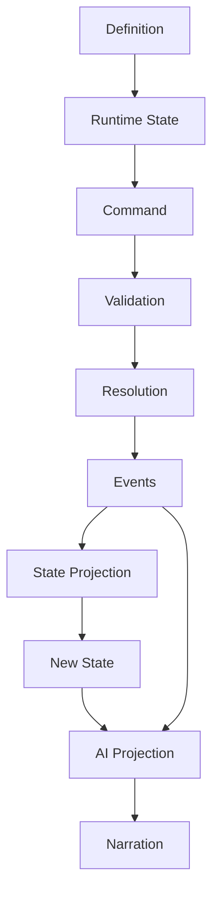

---

## 7. Архитектурная формула / Architecture Formula

Фундамент проекта:

```text
                    RULESET
                       │
                       ▼
                 DEFINITIONS
                       │
                       ▼
                    STATE
                       │
                       ▼
                   COMMAND
                       │
                       ▼
                  VALIDATION
                       │
                       ▼
                   RESOLVER
                       │
              ┌────────┼────────┐
              ▼        ▼        ▼
            RULES     DICE   MODIFIERS
              │        │        │
              └────────┼────────┘
                       ▼
                    EVENTS
                       │
                       ▼
                 STATE UPDATE
                       │
                       ▼
                  AI CONTEXT
                       │
                       ▼
                     AI DM
                       │
                       ▼
                  NARRATION
```

Это является базовым техническим контрактом проекта.

Все последующие модули — Combat, Magic, World, Quest, NPC AI и Web UI — должны встраиваться в этот pipeline, а не создавать альтернативный путь изменения игрового состояния.

## 8. Event Envelope

Event Envelope — единый транспортный формат для **всех фактов**, произошедших в игре.

Implementation status: **Implemented** для generic immutable `GameEvent` и
`EventSerializer`; runtime EventStore, ordered append и projection —
**Planned / Deferred**.

Event не является командой, запросом или намерением.

> **Event = неизменяемый факт, который уже произошёл.**

Например:

```text
AttackCommand
      │
      ▼
AttackResolved V1
  (hit / miss / critical_hit)
```

Это точная реализованная Attack event boundary (§3.17); damage остаётся
отдельной deferred mechanic.

Каждый Event должен иметь одинаковый внешний envelope, независимо от того, относится он к Combat, World, Quest, Inventory или AI.

---

### 8.1. Каноническая схема Event / Canonical Event Schema

```json
{
  "eventId": "event_000124",
  "commandId": "command_000001",
  "type": "DamageApplied",
  "version": 1,

  "campaignId": "campaign_001",

  "timestamp": "2026-08-20T18:42:10Z",

  "actorId": "character_001",

  "causedBy": "event_000123",

  "payload": {
    "targetId": "monster_001",
    "amount": 10,
    "damageType": "slashing"
  }
}
```

---

### 8.2. Поля Event Envelope / Event Envelope Fields

| Поле         | Тип              | Обязательное | Назначение                            |
| ------------ | ---------------- | -----------: | ------------------------------------- |
| `eventId`    | `string`         |           Да | Уникальный ID события                 |
| `commandId`  | `string`         |           Да | ID Command, породившей событие        |
| `type`       | `string`         |           Да | Тип события                           |
| `version`    | `integer`        |           Да | Версия схемы конкретного типа Event   |
| `campaignId` | `string`         |           Да | Кампания, в которой произошло событие |
| `timestamp`  | `datetime`       |           Да | Время создания события в системе      |
| `actorId`    | `string \| null` |          Нет | Сущность, инициировавшая действие     |
| `causedBy`   | `string \| null` |          Нет | Event, породивший это событие         |
| `payload`    | `object`         |           Да | Специфические данные события          |

---

### 8.3. `eventId`

Формат:

```text
event_000001
event_000002
event_000003
```

`eventId`:

* уникален;
* никогда не переиспользуется;
* не изменяется;
* не содержит игрового смысла;
* используется для трассировки и связи событий.

---

### 8.4. `type`

`type` определяет конкретный тип Event.

Например:

```text
AttackResolved
DamageApplied
HealingApplied

SpellCast
ConcentrationBroken

ItemAdded
ItemRemoved

QuestStarted
QuestCompleted

CreatureDefeated
WorldTimeAdvanced
```

`type` должен быть стабильным API/domain-контрактом.

Не следует использовать произвольные текстовые значения вроде:

```text
"goblin got hurt"
"something happened"
```

Используется строго типизированное событие:

```text
DamageApplied
```

---

### 8.5. `version`

`version` относится к **схеме конкретного Event**, а не к Ruleset.

Например:

```json
{
  "type": "DamageApplied",
  "version": 1
}
```

Если структура payload изменяется несовместимым образом:

```text
DamageApplied v1
        ↓
DamageApplied v2
```

Старые события не переписываются.

Это позволяет:

* читать старую историю;
* мигрировать события;
* воспроизводить старые кампании;
* поддерживать несколько версий сериализации.

---

### 8.6. `campaignId`

Каждый Event принадлежит ровно одной кампании.

```text
campaignId
     │
     ▼
Event Store
```

Event из другой кампании не может изменить State текущей кампании.

---

### 8.7. `timestamp`

`timestamp` описывает момент создания Event в системе.

В Domain это явно переданный timezone-aware UTC `datetime`. `GameEvent` не
вызывает системные часы; naive и non-UTC значения не принимаются. При
сериализации timestamp представляется как ISO 8601 UTC с каноническим суффиксом
`Z`.

Формат:

```text
ISO 8601 / UTC
```

Например:

```text
2026-08-19T16:42:10Z
```

Игровое время и системное время — разные понятия.

Например:

```json
{
  "timestamp": "2026-08-19T16:42:10Z",
  "payload": {
    "worldTime": {
      "day": 14,
      "hour": 18,
      "minute": 42
    }
  }
}
```

`timestamp` не заменяет `GameTime`.

Это wall-clock время создания Event, независимое от игрового/world time. Оно
также не является ключом порядка Event: порядок задаётся Event Store sequence
и монотонными Event ID согласно §12.11.

---

### 8.8. `actorId`

`actorId` — сущность, непосредственно инициировавшая действие.

Например:

```text
character_001
npc_003
monster_002
system
```

Если Event является автоматическим:

```json
{
  "actorId": null
}
```

или используется специальный системный actor, если это требуется конкретной подсистеме.

Канонический serializer всегда выводит `actorId`, используя JSON `null` для
Domain `None`. При десериализации отсутствующее поле и явный `null` означают
`None` только для этого nullable поля Event Envelope.

---

### 8.9. `causedBy`

`causedBy` хранит причинную связь между событиями.

Например:

```text
AttackResolved
        │
        ▼
DamageApplied
        │
        ▼
CreatureDroppedToZeroHP
        │
        ▼
CreatureDefeated
```

Конкретно:

```text
event_101 AttackResolved
       │
       └── causedBy: null

event_102 DamageApplied
       │
       └── causedBy: event_101

event_103 CreatureDefeated
       │
       └── causedBy: event_102
```

`DamageApplied` and subsequent events in this causation example are future
state-mutating mechanics; the implemented Attack slice currently emits only
`event_101 AttackResolved`.

Это позволяет восстановить цепочку причин.

Канонический serializer всегда выводит `causedBy`, используя JSON `null` для
Domain `None`. При десериализации отсутствующее поле и явный `null` означают
`None` только для этого nullable поля Event Envelope.

---

### 8.10. `payload`

`payload` содержит только данные, специфичные для конкретного Event.

Например:

```json
{
  "type": "DamageApplied",
  "version": 1,

  "payload": {
    "targetId": "monster_001",
    "amount": 10,
    "damageType": "slashing"
  }
}
```

Не следует помещать в payload общие поля Envelope:

```text
eventId
commandId
campaignId
timestamp
actorId
```

Они принадлежат Envelope.

Phase 1 сохраняет payload generic и не вводит типы payload для конкретных
gameplay Events. Domain payload имеет defensive recursively immutable
JSON-like semantics; преобразование неизменяемых mappings/tuples обратно в
обычные JSON objects/arrays выполняется только на serialization boundary.

---

### 8.11. Event lifecycle

Implementation status: **Planned / Deferred** для полного runtime lifecycle.
Текущий код создаёт и валидирует Events, но не предоставляет production
publish/persist/project pipeline.

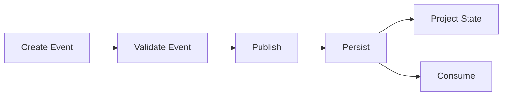

Событие проходит этапы:

```text
Create
   ↓
Validate
   ↓
Publish
   ↓
Persist
   ↓
Project
```

После `Publish` Event считается фактом и не должен редактироваться.

---

### 8.12. Immutable Event Rule

После публикации запрещено:

```text
UPDATE Event
DELETE Event
CHANGE Event
```

Если обнаружена ошибка, создаётся новое событие.

Например:

```text
DamageApplied
amount = 12
        │
        ▼
DamageCorrected
amount = -2
```

История сохраняется полностью.

---

### 8.13. Event naming convention

Используется:

```text
PascalCase + past tense
```

Хорошо:

```text
AttackResolved
DamageApplied
ItemAdded
SpellCast
QuestCompleted
```

Плохо:

```text
attack
doDamage
apply_damage
playerDidSomething
```

Название должно отвечать на вопрос:

> **Что произошло?**

---

### 8.14. Event должен быть domain fact / Domain Fact Rule

Event:

```text
DamageApplied
```

правильно.

Event:

```text
ApplyDamage
```

неправильно.

Первое — факт.

Второе — команда.

---

## 9. Command Envelope

Command Envelope — единый формат для всех **намерений выполнить действие**.

> **Command = просьба Engine выполнить действие.**

Command ещё не означает, что действие произойдёт.

---

### 9.1. Каноническая схема Command / Canonical Command Schema

```json
{
  "commandId": "command_000001",
  "type": "AttackCommand",

  "campaignId": "campaign_001",

  "actorId": "character_001",

  "payload": {
    "targetId": "monster_001"
  }
}
```

---

### 9.2. Поля Command Envelope / Command Envelope Fields

| Поле         | Тип      | Обязательное | Назначение                |
| ------------ | -------- | -----------: | ------------------------- |
| `commandId`  | `string` |           Да | Уникальный ID команды     |
| `type`       | `string` |           Да | Тип команды               |
| `campaignId` | `string` |           Да | Кампания                  |
| `actorId`    | `string` |           Да | Инициатор действия        |
| `payload`    | `object` |           Да | Данные конкретной команды |

---

### 9.3. `commandId`

Формат:

```text
command_000001
command_000002
command_000003
```

`commandId`:

* уникален;
* никогда не переиспользуется;
* не меняется;
* используется для idempotency;
* используется для debugging;
* используется для связывания Command и созданных Events.

---

### 9.4. `type`

Примеры:

```text
MoveCommand
AttackCommand
CastSpellCommand
UseItemCommand
EquipItemCommand
UnequipItemCommand

RestCommand
InteractCommand
TalkCommand
SearchCommand

HideCommand
HelpCommand
ReadyCommand
DashCommand
DisengageCommand
DodgeCommand
```

Команда называется как **намерение**, обычно в форме действия.

---

### 9.5. `actorId`

`actorId` определяет, кто пытается совершить действие.

Например:

```json
{
  "actorId": "character_001"
}
```

Engine использует `actorId` для получения State:

```text
actorId
   │
   ▼
CreatureState
   │
   ├── HP
   ├── abilities
   ├── conditions
   ├── resources
   ├── equipment
   └── position
```

---

### 9.6. `payload`

`payload` содержит только параметры конкретной команды.

На serialized boundary это JSON object. После validation он маппится в
concrete typed immutable payload соответствующей Python Command (§3.3), а не
передаётся в rule resolver как arbitrary `dict[str, Any]`.

Например:

```json
{
  "type": "MoveCommand",
  "actorId": "character_001",
  "payload": {
    "destination": {
      "x": 10,
      "y": 14
    }
  }
}
```

Для атаки:

```json
{
  "type": "AttackCommand",
  "actorId": "character_001",
  "payload": {
    "targetId": "monster_001"
  }
}
```

---

### 9.7. Command lifecycle

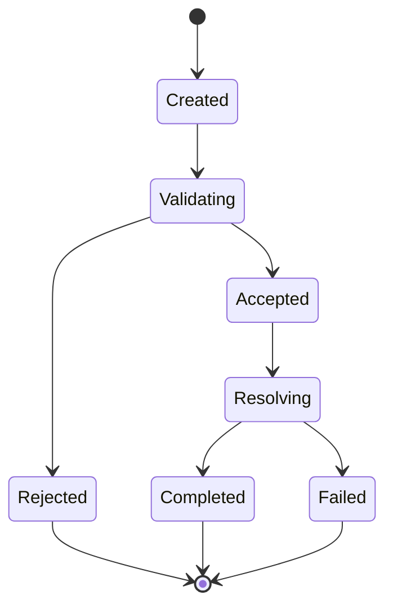

Смысл состояний:

#### `Created`

Команда сформирована AI, UI или другой системой.

#### `Validating`

Engine проверяет:

* существует ли actor;
* существует ли target;
* доступно ли действие;
* находится ли actor в правильном состоянии;
* соблюдаются ли prerequisites.

#### `Rejected`

Команда не может быть выполнена.

Например:

```text
ACTION_NOT_AVAILABLE
OUT_OF_RANGE
INVALID_TARGET
NOT_VISIBLE
RESOURCE_NOT_AVAILABLE
```

#### `Accepted`

Команда прошла initial validation.

#### `Resolving`

Engine вычисляет результат.

#### `Completed`

Команда успешно завершена и породила Events.

#### `Failed`

Команда была принята, но resolution завершился ошибкой доменного уровня.

---

### 9.8. Command ≠ Event

Это фундаментальное правило.

```text
Command:
"Я хочу атаковать."

Event:
"Атака попала."

```

Например:

```text
AttackCommand
       │
       ▼
AttackResolver
       │
       ▼
AttackResolved V1
  hit=false | hit=true
  criticalHit=false | true
```

В implemented slice это один Event для любого resolved gameplay outcome;
damage и State mutation не входят в этот flow (§3.17).

Одна Command может создать:

```text
0
1
2
N
```

Events.

---

### 9.9. Command не изменяет State напрямую / No Direct State Mutation

Запрещено:

```text
Command
   ↓
State mutation
```

Правильно:

```text
Command
   ↓
Validation
   ↓
Resolution
   ↓
Events
   ↓
State projection
```

Это сохраняет единый путь изменения состояния.

---

### 9.10. Idempotency

`commandId` используется как idempotency key.

Если одна и та же команда пришла дважды:

```text
command_000123
```

Engine не должен повторно выполнить действие.

Система должна определить:

```text
command_000123 already processed
```

и вернуть ранее сохранённый `ResolutionResult`.

Это особенно важно для:

* WebSocket reconnect;
* повторных HTTP requests;
* network retries;
* multiplayer;
* AI retries.

---

### 9.11. Command → Event correlation

Все Events, созданные одной Command, должны быть связаны с ней.

`commandId` — обязательное поле Event Envelope: оно сохраняется для всех
cascading Events, связывает их с одной logical Command transaction и
используется для tracing, replay и audit. Системные действия входят в тот же
authoritative pipeline через system/internal Command; бесхозные Events вне
Command lifecycle запрещены.

Канонический Event example:

```json
{
  "eventId": "event_000124",
  "commandId": "command_000001",
  "type": "DamageApplied",
  "version": 1,
  "campaignId": "campaign_001",
  "timestamp": "2026-08-20T18:42:10Z",
  "actorId": "character_001",
  "causedBy": "event_000123",
  "payload": {
    "targetId": "monster_001",
    "amount": 10,
    "damageType": "slashing"
  }
}
```

Таким образом:

```text
Command
   │
   ├── Event
   ├── Event
   └── Event
```

можно восстановить напрямую.

Все Events одной Command имеют одинаковый `commandId`. `causedBy` сохраняет
отдельную Event → Event causality и не заменяется `commandId`.

---

### 9.12. Full Command/Event chain

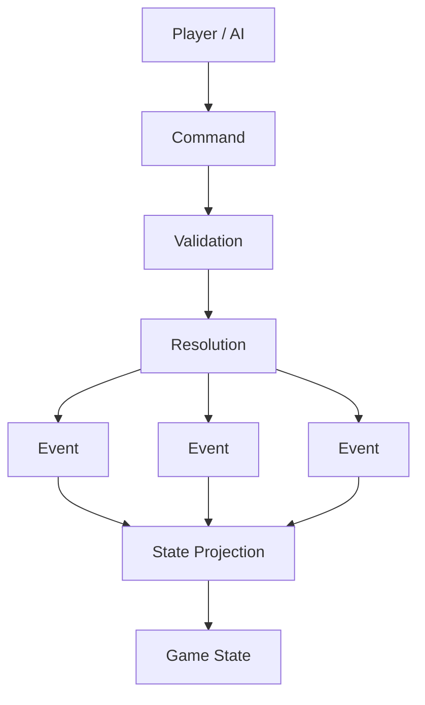

---

## 10. State Ownership

State Ownership определяет, **какая подсистема является владельцем конкретного состояния и кто имеет право его изменять**.

Главное правило:

> **У каждого изменяемого State должен быть один логический владелец.**

Другие подсистемы могут запрашивать данные, создавать Commands или реагировать на Events, но не должны напрямую менять чужой State.

---

### 10.1. Почему нужен State Ownership / Why State Ownership

Без ownership быстро возникает:

```text
CombatEngine ──► character.current_hp
QuestEngine  ──► character.current_hp
AI            ──► character.current_hp
API           ──► character.current_hp
NPC system   ──► character.current_hp
```

В итоге невозможно определить:

* кто изменил значение;
* почему оно изменилось;
* какое правило было применено;
* какое событие должно быть создано.

Вместо этого:

```text
DamageResolver
      │
      ▼
DamageApplied
      │
      ▼
Creature State Owner
      │
      ▼
HP updated
```

---

### 10.2. Ownership Model

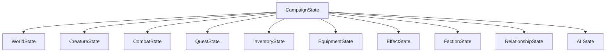

---

### 10.3. Campaign State Owner

**Owner: `CampaignEngine / CampaignStateManager`**

Отвечает за:

```text
campaign identity
ruleset reference
global campaign metadata
session state
campaign lifecycle
```

Другие системы могут изменять отдельные доменные агрегаты только через соответствующие механизмы.

---

### 10.4. Creature State Owner

**Owner: `Creature / CreatureDomain`**

Отвечает за:

```text
HP
abilities
skills
saving throws
resources
conditions
effects
movement
senses
position
life state
```

Но важно разделить **ownership** и **resolution**.

Например `DamageResolver` рассчитывает:

```text
10 damage
```

но не должен самовольно менять:

```text
creature.current_hp -= 10
```

Он создаёт:

```text
DamageApplied
```

После применения Event:

```text
CreatureState.current_hp
```

изменяется владельцем State.

---

### 10.5. Inventory State Owner

**Owner: `InventoryEngine`**

Отвечает за:

```text
items
quantities
containers
item ownership
item transfer
item creation/destruction
```

Примеры Commands:

```text
AddItemCommand
RemoveItemCommand
MoveItemCommand
SplitItemCommand
MergeItemCommand
```

Примеры Events:

```text
ItemAdded
ItemRemoved
ItemTransferred
ItemConsumed
```

---

### 10.6. Equipment State Owner

**Owner: `EquipmentEngine`**

Отвечает за:

```text
equipped weapon
equipped armor
shield
equipment slots
```

Например:

```text
EquipItemCommand
       ↓
EquipmentEngine
       ↓
ItemEquipped
       ↓
EquipmentState
```

Inventory Engine не должен самостоятельно решать, находится ли предмет в `mainHand`.

---

### 10.7. Combat State Owner

**Owner: `CombatEngine`**

Отвечает за:

```text
combat lifecycle
participants
initiative
round
turn
active combatant
turn resources
combat positions
combat-specific state
```

Например:

```text
CombatStarted
TurnStarted
TurnEnded
CombatEnded
```

Combat Engine может читать:

```text
CreatureState
```

но не должен напрямую владеть всем CreatureState.

---

### 10.8. Quest State Owner

**Owner: `QuestEngine`**

Отвечает за:

```text
quest status
objectives
objective progress
quest rewards
quest prerequisites
```

Quest Engine реагирует на события:

```text
CreatureDefeated
ItemCollected
LocationDiscovered
NPCInteractionCompleted
```

и создаёт:

```text
QuestObjectiveUpdated
QuestCompleted
```

---

### 10.9. World State Owner

**Owner: `WorldEngine`**

Отвечает за:

```text
locations
location state
doors
world flags
world/game time (the sole authoritative owner)
environment
discovery
world transitions
```

Например:

```text
DoorOpened
LocationDiscovered
WorldTimeAdvanced
```

---

### 10.10. Faction State Owner

**Owner: `FactionEngine`**

Отвечает за:

```text
faction state
territories
relations
reputation
resources
membership
```

Например:

```text
FactionRelationshipChanged
ReputationChanged
FactionMemberAdded
FactionMemberRemoved
```

---

### 10.11. Relationship State Owner

**Owner: `RelationshipEngine`**

Отвечает за отношения между сущностями:

```text
NPC → Character
NPC → NPC
Faction → Faction
Faction → Character
```

Например:

```json
{
  "sourceId": "npc_001",
  "targetId": "character_001",
  "trust": 70,
  "fear": 10,
  "respect": 50
}
```

Другие системы могут инициировать изменение через событие:

```text
NPCRelationshipChanged
```

---

### 10.12. AI State Owner

**Owner: `AI / Memory subsystem`**

AI State не является игровым источником истины.

Он содержит:

```text
NPC memories
known facts
narrative context
conversation context
AI summaries
planning data
```

Например:

```text
dm_memory.json
npc_memory.json
narrative_state.json
```

AI State может быть перестроен из игровых Events и State.

Это принципиально отличает его от Game State.

---

### 10.13. Owner Matrix

| State               | Owner               | Другие системы           |
| ------------------- | ------------------- | ------------------------ |
| `CampaignState`     | Campaign Engine     | read                     |
| `WorldState`        | World Engine        | read / commands / events |
| `CreatureState`     | Creature Domain     | read / commands / events |
| `CharacterState`    | Creature Domain     | read / commands / events |
| `InventoryState`    | Inventory Engine    | read / commands          |
| `EquipmentState`    | Equipment Engine    | read / commands          |
| `CombatState`       | Combat Engine       | read / commands          |
| `QuestState`        | Quest Engine        | read / events            |
| `FactionState`      | Faction Engine      | read / events            |
| `RelationshipState` | Relationship Engine | read / events            |
| `EffectState`       | Effect Engine       | read / events            |
| `AIState`           | AI subsystem        | read / rebuild           |

---

### 10.14. Read vs Write

Главное правило:

```text
                   OWNER
                     │
             ┌───────┴────────┐
             │                │
           READ              WRITE
             │                │
             ▼                ▼
     Other systems      Owner / Event
```

Другие системы могут читать состояние.

Но изменение должно идти через:

```text
Command
   ↓
Resolver
   ↓
Event
   ↓
Owner
```

---

### 10.15. Example: Damage

Неправильно:

```text
CombatEngine
    ↓
fighter.current_hp -= 10
```

Правильно:

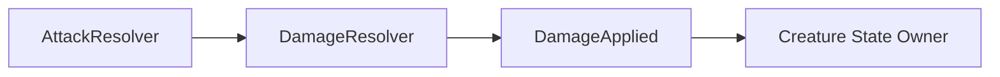

То есть:

```text
DamageResolver
```

отвечает:

> Сколько урона должно быть применено?

А:

```text
Creature State Owner
```

отвечает:

> Как это событие изменяет состояние существа?

---

### 10.16. Example: Quest Update

Неправильно:

```text
CombatEngine
    ↓
quest.objectives[0].current += 1
```

Правильно:

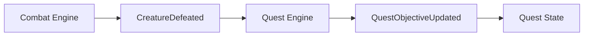

Combat не знает, какие именно квесты существуют.

---

### 10.17. Example: NPC Relationship

Неправильно:

```text
AI
   ↓
npc.relationship.trust += 10
```

Правильно:

```text
NPC interaction
      ↓
Domain Event
      ↓
Relationship Engine
      ↓
RelationshipChanged
      ↓
RelationshipState
```

AI может **предложить** действие или интерпретацию, но не изменяет состояние напрямую.

---

### 10.18. State Ownership Rule

Каждый State-объект должен отвечать на три вопроса:

```text
1. Кто им владеет?
2. Какие Commands могут его изменить?
3. Какие Events фиксируют его изменение?
```

Например:

```text
CreatureState
    │
    ├── Owner:
    │      Creature Domain
    │
    ├── Commands:
    │      Damage
    │      Heal
    │      Move
    │      ApplyEffect
    │
    └── Events:
           DamageApplied
           HealingApplied
           CreatureMoved
           EffectApplied
```

---

### 10.19. Полная схема Ownership

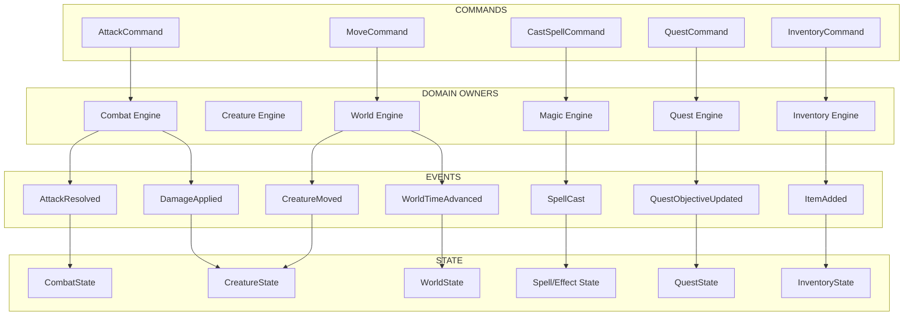

---

### 10.20. Главный принцип Ownership / Core Ownership Principle

В системе запрещён прямой cross-domain mutation:

```text
Domain A
   ✕
   └──► State Domain B
```

Вместо этого:

```text
Domain A
   │
   ▼
Event
   │
   ▼
Domain B
   │
   ▼
State B
```

Таким образом:

```text
Combat
Quest
World
Inventory
Faction
Relationship
AI
```

остаются слабо связанными между собой и взаимодействуют через **Commands, Events и строго определённые State boundaries**.

---

## 11. Канонический Command → Event → State цикл / Canonical Cycle

Все предыдущие контракты объединяются в единый pipeline:

Implementation status: **Implemented** для read-only Ability Check, Character
Saving Throw, Character Skill Check и minimal Character unarmed Attack Roll →
Monster до Event и result; Event persistence и authoritative Event → State
application — **Planned / Deferred**. Диаграмма
остаётся обязательным контрактом будущих mutating flows, а не заявлением о
существующем replay subsystem.

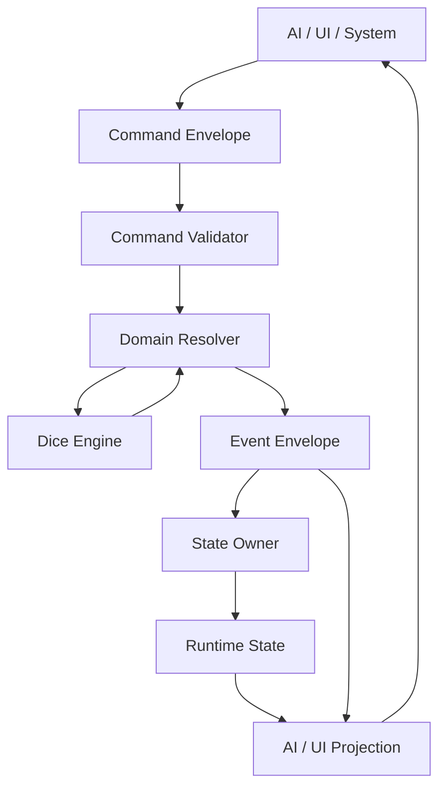

Канонический принцип:

```text
Command
   ↓
Validation
   ↓
Resolution
   ↓
Event
   ↓
State Owner
   ↓
State
   ↓
Projection
   ↓
AI / UI
```

**Ни AI, ни UI, ни случайная подсистема не могут обходить этот цикл и напрямую изменять игровой State.**

## 12. Serialization Rules

Serialization Rules определяют, как Domain Model превращается в JSON/JSONL и обратно.

Это важная часть Foundation, потому что:

```text
Python Object
     │
     ▼
Serialization
     │
     ▼
JSON / JSONL
     │
     ▼
Storage / API / Event Log
```

и обратно:

```text
JSON / JSONL
     │
     ▼
Deserialization
     │
     ▼
Validated Domain Object
```

Основной принцип:

> **JSON является форматом хранения и передачи данных. Domain Model остаётся источником семантики.**

---

### 12.1. Где разрешена сериализация / Where Serialization Is Allowed

Сериализация не должна находиться внутри Rule Engine.

Запрещено:

```python
class AttackResolver:

    def resolve(self):
        with open("state.json") as f:
            ...
```

Правильно:

```text
Infrastructure
      │
      ▼
Serializer / Repository
      │
      ▼
Domain Model
```

Архитектура:

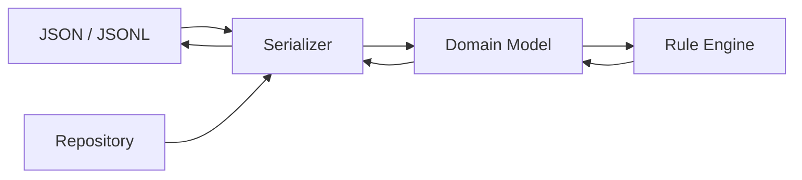

---

### 12.2. Канонические форматы / Canonical Formats

В проекте используются три основных формата.

#### JSON

Используется для:

```text
Definitions
State snapshots
Configuration
AI context
API DTO
```

Примеры:

```text
rules/dnd_5e/spells/fireball.json
campaigns/campaign_001/state.json
campaigns/campaign_001/config.json
```

---

#### JSONL

Используется для:

```text
Event Log
Command Log
длинных append-only потоков
```

Implementation status: **Planned / Deferred** для runtime Event/Command logs.
Канонический формат определён, но production JSONL append ещё не реализован.

Одна строка = один JSON object.

Пример:

```text
events/events.jsonl
```

```json
{"eventId":"event_000001","commandId":"command_000001","type":"CombatStarted",...}
{"eventId":"event_000002","commandId":"command_000001","type":"TurnStarted",...}
{"eventId":"event_000003","commandId":"command_000002","type":"AttackResolved",...}
{"eventId":"event_000004","commandId":"command_000002","type":"DamageApplied",...}
```

Преимущество JSONL:

* append-only;
* удобно читать потоково;
* не нужно переписывать весь файл;
* удобно восстанавливать историю.

---

### 12.3. YAML

YAML не является каноническим форматом Domain State.

Не использовать YAML для:

```text
State
Event Log
Command Log
Definitions
```

На текущем этапе основным форматом остаётся JSON.

---

### 12.4. Canonical JSON

JSON-файлы должны использовать UTF-8.

```text
Encoding:
UTF-8

Format:
JSON

Object keys:
camelCase
```

Пример:

```json
{
  "characterId": "character_001",
  "definitionId": "fighter",
  "currentHp": 24,
  "maxHp": 32
}
```

Python-имена:

```python
character_id
definition_id
current_hp
max_hp
```

JSON:

```json
characterId
definitionId
currentHp
maxHp
```

---

### 12.5. Имена полей / Field Naming

Используется:

```text
camelCase
```

для JSON.

Не использовать одновременно:

```text
character_id
characterId
characterID
```

В рамках одного контракта должна существовать только одна форма.

---

### 12.6. Python ↔ JSON

Domain Model:

```python
@dataclass
class CreatureState:
    id: str
    definition_id: str
    ability_scores: AbilityScores
    current_hp: int
    max_hp: int
```

JSON:

```json
{
  "id": "monster_001",
  "definitionId": "goblin",
  "abilityScores": {
    "strength": 8,
    "dexterity": 14,
    "constitution": 10,
    "intelligence": 10,
    "wisdom": 8,
    "charisma": 8
  },
  "currentHp": 12,
  "maxHp": 20
}
```

Преобразование выполняется Serializer.

```text
Python naming
snake_case
      │
      ▼
Serializer
      │
      ▼
JSON naming
camelCase
```

---

### 12.7. Pydantic как boundary validation

Pydantic используется на границах системы:

```text
API
Storage
JSON
Configuration
LLM structured output
```

Например:

```python
class AttackCommandDTO(BaseModel):
    commandId: str
    type: Literal["AttackCommand"]
    campaignId: str
    actorId: str
    payload: AttackPayload
```

После валидации DTO преобразуется в Domain Command:

```text
JSON
 ↓
Pydantic DTO
 ↓
Domain Command
```

Domain Engine не должен зависеть от HTTP request model.

---

### 12.8. Definition Serialization

Definition должен полностью восстанавливаться из JSON.

Пример:

```json
{
  "id": "longsword",
  "version": 1,
  "name": "Longsword",
  "damage": {
    "dice": "1d8",
    "type": "slashing"
  },
  "properties": [
    "versatile"
  ]
}
```

Правило:

```text
Definition JSON
      ↓
Validation
      ↓
Definition Object
```

Если Definition невалиден, он не должен попадать в DefinitionRegistry.

---

### 12.9. State Serialization

State snapshot должен быть достаточным для восстановления текущего состояния кампании без необходимости читать UI/API историю.

```text
state.json
     │
     ▼
StateSerializer
     │
     ▼
StateSnapshot
```

Phase 1 `StateStore` — snapshot-only Domain port:

```python
class StateStore(Protocol):
    def load(self, campaign_id: str) -> StateSnapshot: ...
    def save(self, snapshot: StateSnapshot) -> None: ...
```

Минимальная стабильная boundary error hierarchy:

```text
StateStoreError
├── StateNotFoundError
└── InvalidStateSnapshotError
```

`StateSerializer` является чистой Infrastructure-границей между
`StateSnapshot` и каноническим JSON-compatible mapping и не выполняет
filesystem I/O. Каноническая current V5 schema:

```json
{
  "schemaVersion": 5,
  "campaignId": "campaign_001",
  "state": {
    "campaign": {
      "id": "campaign_001",
      "rulesetId": "dnd_5e",
      "rulesetVersion": "5.1"
    },
    "creatures": [
      {
        "id": "character_001",
        "definitionId": "fighter",
        "abilityScores": {
          "strength": 16,
          "dexterity": 12,
          "constitution": 14,
          "intelligence": 10,
          "wisdom": 10,
          "charisma": 8
        },
        "currentHp": 28,
        "maxHp": 28,
        "conditions": []
      }
    ],
    "characters": [
      {
        "id": "character_001",
        "totalLevel": 5,
        "savingThrowProficiencies": [
          "constitution",
          "strength"
        ],
        "skillProficiencies": [
          "athletics",
          "perception"
        ]
      }
    ],
    "combat": null
  }
}
```

JSON использует camelCase. Writer всегда выпускает `schemaVersion: 5` и exact
V5 state fields `campaign`, `creatures`, `characters`, `combat`, включая
`"characters": []` для пустой collection, `"conditions": []` для пустого
Creature Condition membership (§3.21) и `"combat": null`, когда `StateSnapshot.
combat is None` (§3.25). Creatures и Characters сортируются по runtime ID,
`savingThrowProficiencies` — по `Ability.value`, `skillProficiencies` — по
`Skill.value`, а `conditions` — по `Condition.value`. Пустые membership
сериализуются как JSON arrays `[]`. Когда combat присутствует, `combat` —
object с exact fields `id`, `round`, `order` (JSON array Creature ID strings в
initiative-порядке) и `activeIndex`.

Reader принимает пять точных схем: legacy V1 с state fields `campaign` и
`creatures`, legacy V2 с обязательным дополнительным `characters`, legacy V3 с
обязательным дополнительным `skillProficiencies`, legacy V4 с обязательным
`conditions` (без `combat`), и current V5 с обязательным дополнительным
`combat`. Поле `characters` в V1 является unknown и запрещено. Успешное
чтение V1 создаёт `StateSnapshot.characters=()` и не придумывает level или
proficiency defaults. V2 Character entry сохраняет exact legacy fields `id`,
`totalLevel` и `savingThrowProficiencies`; reader мигрирует его в canonical
`CharacterState` с `skill_proficiencies=frozenset()`. V1–V3 Creature entries
не содержат поле `conditions` — оно unknown и запрещено для этих трёх версий;
успешное чтение любой из них создаёт `CreatureState.conditions ==
frozenset()` без выдумывания membership. V1–V4 не содержат `state.combat` —
оно unknown для этих четырёх версий; успешное чтение любой из них создаёт
`StateSnapshot.combat is None` без выдумывания Combat State.

Для всех пяти версий required fields и JSON primitive/container types точны;
unknown fields, defaults, type coercion, несовпадение outer `campaignId` с
`state.campaign.id`, невалидные Domain values и duplicate IDs запрещены. V2–V5
дополнительно требуют, чтобы каждый Character ID ссылался на существующий
Creature ID; V5 дополнительно требует, чтобы каждый `combat.order` ID
ссылался на существующий Creature ID. V3–V5 Character entry содержит
identical exact fields `id`, `totalLevel`, `savingThrowProficiencies` и
`skillProficiencies` — Character schema не менялась с V3; duplicate
serialized abilities и skills запрещены до преобразования списков в
соответствующие `frozenset`. V4 и V5 Creature entry дополнительно требует
`conditions`: JSON list точных строк, каждая — известное значение `Condition`,
без дубликатов; malformed non-list, unknown-value и duplicate-value payloads
отклоняются (§3.21).

Character decoding (включая ветку, читающую `skillProficiencies`) определяется
явным сравнением с `LEGACY_SCHEMA_V2_VERSION`, а не сравнением только с
текущим `SCHEMA_VERSION` — это защищает V3-чтение при будущих schema bump'ах.
Симметрично, V4/V5 Creature field set и `conditions` decoding определяются
сравнением с fixed-identity множеством `{SCHEMA_V4_VERSION,
SCHEMA_V5_VERSION}`, а не с мутируемым `SCHEMA_VERSION`: `SCHEMA_VERSION =
SCHEMA_V5_VERSION` сегодня, но эти имена не взаимозаменяемы — `SCHEMA_VERSION`
обозначает current writer и используется только при записи, тогда как
historical V4/V5 read semantics зафиксированы на своих собственных fixed
constants независимо от того, останется ли V5 current writer в будущем (§3.21
фиксирует эту regression-защиту как часть G6C1; §3.25 применяет тот же
constant-based discipline к своему V5 `combat` addition, G7).

`FilesystemStateStore` хранит snapshot в:

```text
<campaigns-root>/<campaign_id>/state.json
```

Adapter получает campaigns root как `Path`, использует UTF-8 и deterministic
JSON formatting с final newline. Save сначала полностью сериализует snapshot,
затем пишет temporary file в той же campaign directory, закрывает его и
атомарно заменяет `state.json` через `os.replace`; при ошибке temporary file
удаляется best-effort. Это single-file replacement, а не гарантия durability
для нескольких файлов или после любого crash.

Текущая реализация использует single-writer assumption. `schemaVersion`
описывает storage schema и не является State revision; optimistic locking,
revision fields и file/process/distributed locks отсутствуют.

`StateStore` не читает и не пишет `events/events.jsonl`, не использует
`EventSerializer`, не генерирует и не применяет Events и не выполняет replay.
EventStore, replay и transaction ordering между Event persistence и State
projection отложены до отдельного будущего решения.

Текущая V5 schema содержит `CampaignState`, collection `CreatureState`
(включая `conditions`, §3.21), character-specific collection `CharacterState`
и optional `CombatState` (§3.25). По мере появления следующих State domains
snapshot schema должна расширяться отдельным версионируемым контрактом, не
превращая `CampaignState` в God Object.

Snapshot не содержит:

```text
полную историю событий
LLM prompts или AI context
transient HTTP data
debug logs
```

---

### 12.10. Event Serialization

Implementation status: **Implemented** для immutable `GameEvent`, legacy
`AbilityCheckResolvedPayloadV1`/V1 builder, current
`AbilityCheckResolvedPayloadV2`/V2 builder,
`SavingThrowResolvedPayloadV1`/V1 builder,
`SkillCheckResolvedPayloadV1`/V1 builder и чистого `EventSerializer`.

Phase 1 `EventSerializer` является чистой границей между `GameEvent` и
каноническим JSON-совместимым Event Envelope: он не выполняет filesystem I/O,
не добавляет Event в лог и не применяет Event к State. Domain timestamp
сериализуется в ISO 8601 UTC с `Z`; nullable `actorId` и `causedBy` всегда
присутствуют в output и имеют значение `null` для Domain `None`.

Implementation status: **Planned / Deferred** для runtime EventStore,
authoritative ordering persistence, JSONL append, Event → State projection,
recovery и replay.

EventStore, выделение durable Event ID/sequence, JSONL append, replay и
применение Event к State остаются deferred и реализуются отдельными будущими
slices.

Generic `GameEvent` envelope остаётся общим Event contract.
`AbilityCheckResolvedPayloadV1` сохранён как immutable legacy NORMAL-only
schema; `AbilityCheckResolvedPayloadV2` является current canonical writer и
содержит effective d20 mode, ordered raw rolls и selected value. Runtime Event
persistence этим не реализована. `SavingThrowResolvedPayloadV1` является
current Saving Throw schema и содержит тот же `D20Roll` shape вместе с
раздельными `abilityModifier` и `proficiencyBonus` audit contributions,
описанными в §3.13. `SkillCheckResolvedPayloadV1` сохраняет explicit Skill и
actual Ability вместе с тем же d20 shape и раздельными contributions (§3.14).
Дополнительные gameplay Event contracts добавляются только вместе с
соответствующими mechanics.

Event Log является append-only.

Формат:

```text
event_000001
event_000002
event_000003
...
```

События не перезаписываются.

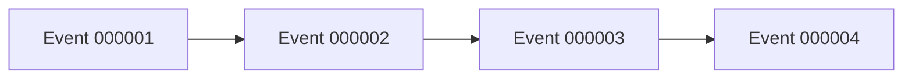

В MVP допускаются отдельные файлы:

```text
events/
├── 000001.json
├── 000002.json
└── 000003.json
```

Но каноническим потоковым форматом является:

```text
events/events.jsonl
```

---

### 12.11. Event Ordering

События в одной Campaign имеют строгий порядок.

Implementation status: **Planned / Deferred**. Правило порядка является
каноническим контрактом будущего EventStore; production ordering persistence
сейчас отсутствует.

Основным порядком считается:

```text
event sequence
```

то есть:

```text
event_000001
<
event_000002
<
event_000003
```

`timestamp` не используется как единственный источник ordering.

Причина:

```text
two events
same timestamp
```

могут иметь разные причинные отношения.

Поэтому:

```text
Sequence > Timestamp
```

для воспроизведения игрового состояния.

---

### 12.12. State Snapshot Version

Каждый State snapshot должен содержать свою версию schema.

Например:

```json
{
  "schemaVersion": 5,
  "campaignId": "campaign_001",
  "state": {
    ...
  }
}
```

Это отличается от:

```text
Ruleset version
```

и:

```text
Event version
```

Итого:

```text
Ruleset Version
State Schema Version
Event Schema Version
Command Schema Version
```

— четыре независимых механизма версионирования.

Current State schema — exact integer `schemaVersion = 5` (§3.25, G7: adds
top-level `state.combat`); writer выпускает только V5. Reader также принимает
exact legacy integer `schemaVersion = 1`, `schemaVersion = 2`,
`schemaVersion = 3` и `schemaVersion = 4`. Другие значения запрещены, а `bool`
не считается integer version. Это версия storage schema, а не revision
текущего State и не механизм concurrency control.

---

### 12.13. Принцип версионирования / Versioning Principle

Нельзя:

```text
state.json
```

менять структуру молча.

Если структура несовместимо изменяется:

```text
schemaVersion = 1
        ↓
schemaVersion = 2
        ↓
schemaVersion = 3
```

Появляется migration:

```text
State v1
   ↓
Migration
   ↓
State v2
   ↓
Migration
   ↓
State v3
```

Текущие explicit minimal migration paths читают exact legacy V1 как
`StateSnapshot(..., characters=())` без выведения character progression из
`definitionId` и exact legacy V2 с
`CharacterState.skill_proficiencies=frozenset()`. После следующего сохранения
writer выпускает только exact V3. Legacy wire schemas задним числом не
расширяются; generic migration registry или framework не вводится.

---

### 12.14. Optional Fields

Поле считается optional только тогда, когда оно действительно может отсутствовать.

Например:

```json
{
  "position": null
}
```

и:

```json
{}
```

не должны автоматически означать одно и то же.

Правило:

```text
missing field
≠
null
```

если конкретная схема явно не определяет обратное.

---

### 12.15. Default Values

Default значения применяются только Domain Model / Schema Layer.

Например:

```python
temp_hp: int = 0
```

Но serializer не должен молча придумывать игровые значения.

Например нельзя:

```text
missing maxHp
      ↓
serializer
      ↓
maxHp = 100
```

Если обязательное игровое поле отсутствует:

```text
ValidationError
```

---

### 12.16. Enum Serialization

Enums сериализуются строками.

Python:

```python
from dnd_engine.domain.value_objects.damage_type import DamageType


damage_type = DamageType.FIRE
serialized_value = damage_type.value  # "fire"
```

Канонический closed set `DamageType` определён в §3.1.1.

JSON:

```json
{
  "damageType": "fire"
}
```

Не использовать:

```json
{
  "damageType": 3
}
```

Это делает JSON читаемым и устойчивым.

---

### 12.17. Datetime Serialization

Все системные timestamps:

```text
ISO 8601
UTC
canonical Z suffix
```

Пример:

```text
2026-08-19T16:42:10Z
```

Игровое время хранится отдельно:

```json
{
  "timestamp": "2026-08-19T16:42:10Z",
  "worldTime": {
    "day": 14,
    "hour": 18,
    "minute": 42
  }
}
```

---

### 12.18. Decimal / Floating Point

Для игровых расчётов нельзя использовать floating point там, где требуется точность.

Основные игровые величины должны использовать:

```text
int
```

Например:

```text
HP
damage
ability score
gold
movement points
experience
```

Если понадобится дробное значение, его формат должен быть определён отдельно.

Не допускается случайное появление:

```text
12.0000000001
```

в State.

---

### 12.19. Random State

Состояние RNG не является обычным Domain State.

Если понадобится deterministic replay, отдельный RNG state может храниться в:

```text
session metadata
```

или:

```text
replay metadata
```

Но `DiceEngine` должен оставаться единственной точкой генерации случайности.

---

### 12.20. Serialization Boundary

Каноническая архитектура:

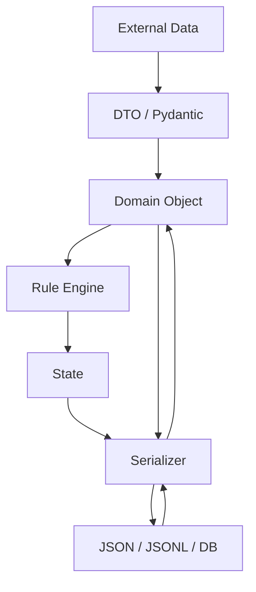

---

### 12.21. Запрещённые практики / Forbidden Practices

#### Direct JSON manipulation inside rules

Нельзя:

```python
state["characters"][id]["currentHp"] -= 10
```

в Rule Engine.

Используется:

```python
CreatureState
```

---

#### Arbitrary JSON fields

Нельзя:

```json
{
  "currentHp": 10,
  "randomCustomField": "hello"
}
```

если поле не входит в контракт.

---

#### Silent schema conversion

Нельзя незаметно преобразовывать неправильные данные:

```text
"10abc" → 10
```

Если значение невалидно:

```text
ValidationError
```

---

#### Missing required data

Не допускается автоматически создавать игровые данные:

```text
missing armor
    ↓
assume armor = none
```

только если конкретная schema явно предусматривает default.

---

### 12.22. Serialization Responsibility Matrix

| Объект     | Формат       | Serializer             |
| ---------- | ------------ | ---------------------- |
| Definition | JSON         | `DefinitionSerializer` |
| State      | JSON         | `StateSerializer`      |
| Command    | JSON         | `CommandSerializer`    |
| Event      | JSON / JSONL | `EventSerializer`      |
| API DTO    | JSON         | Pydantic               |
| AI Context | JSON         | `AIContextSerializer`  |
| Config     | JSON         | `ConfigSerializer`     |

---

### 12.23. Канонический Serialization Pipeline

Implementation status: State snapshot serialization и pure Event serialization
— **Implemented**; EventStore append и последующее Event → State application —
**Planned / Deferred**.

Для входящих данных:

```text
JSON
 ↓
Parse
 ↓
Schema Validation
 ↓
Domain Object
 ↓
Rule Engine
```

Для исходящих данных:

```text
Domain Object
 ↓
Domain Validation
 ↓
Serializer
 ↓
JSON
```

Для Events:

```text
Domain Event
 ↓
Event Validation
 ↓
Serialize
 ↓
Append to Event Store
```

---

### 12.24. Главный принцип сериализации / Core Serialization Principle

```text
              EXTERNAL WORLD
                    │
                    ▼
              JSON / HTTP
                    │
                    ▼
              VALIDATION
                    │
                    ▼
              DOMAIN MODEL
                    │
                    ▼
                ENGINE
                    │
                    ▼
              DOMAIN MODEL
                    │
                    ▼
              SERIALIZATION
                    │
                    ▼
              JSON / STORAGE
```

**JSON не определяет игровые правила. JSON только представляет Domain Model в переносимом виде.**

---

### 12.25. Runtime Validation Policy

Runtime validation разделена между untrusted boundaries и Domain по смыслу
проверяемого invariant.

#### Untrusted boundaries are strict

JSON persistence, future API DTO, future AI structured output, ruleset loading
и configuration обязаны проверять required и unknown fields, exact runtime
types без silent coercion, schema/version, format constraints и reference
validity в момент фактического dereference. Конкретный контракт может явно
разрешить normalization или default; без такого правила boundary не
преобразует вход молча.

#### Domain Value Objects own intrinsic invariants

Value Object сам защищает свойства, без которых перестаёт быть валидным
значением. Это уже относится, например, к `AbilityScores`, `DiceRoll` и
immutable metadata values вроде `EventMetadata`, где применимо. Domain object
не полагается на то, что serializer когда-то создал его корректно.

#### State and Definitions protect semantic in-memory invariants

Простые State/Definition dataclasses не обязаны копировать transport validation
целиком, но защищают intrinsic invariants, необходимые для существования
семантически валидного in-memory Domain object.

```text
unknown JSON field
→ serializer / loader concern

HP outside canonical domain range
→ Domain invariant

invalid JSON value type
→ boundary concern,
  но constructor не обязан позволять семантически невозможный Domain object
```

Serializer не «проверяет всё» вместо Domain. JSON/document shape и Domain
invariants — разные ответственности.

#### No validation duplication for symmetry

Проверка добавляется из-за конкретного invariant, а не только потому, что у
соседнего dataclass есть `__post_init__`. Новая policy не требует массового
добавления одинаковых constructor checks во все существующие Definitions и
State; конкретные пробелы исправляются в соответствующих slices.

#### No coercion inside Domain

Если canonical constructor contract ожидает typed Domain value, constructor не
преобразует автоматически `"1"` в `1`, `list` в `tuple` или string в enum.
Coercion и normalization принадлежат соответствующему boundary mapper/loader.

---

### 12.26. Packaged Ruleset Resources

Implementation status: **Implemented (G4a, §3.16).**

#### Single authoritative location

Ruleset Definition JSON — installed Python package resources, а не
repository-relative path. Каноническое дерево:

```text
src/dnd_engine/resources/
├── __init__.py
└── rulesets/
    └── <ruleset_id>/
        └── <ruleset_version>/
            ├── NOTICE.md            (attribution, где применимо)
            └── definitions/
                └── <definition_id>.json
```

Текущее фактическое содержимое:

```text
src/dnd_engine/resources/rulesets/dnd_5e/5.1/definitions/goblin.json
src/dnd_engine/resources/rulesets/dnd_5e/5.1/definitions/dagger.json
src/dnd_engine/resources/rulesets/dnd_5e/5.1/NOTICE.md
```

`dagger.json` — единственный production `weapon` Definition, добавлен вместе
с G4b (§1.7.1, §3.1.1, DEC-0030) как real consumer strict `NdM` invariant для
`WeaponDefinition.damage_dice`, decoded существующим `_decode_weapon()` без
изменения decoder dispatch.

Это единственная authoritative копия packaged Definition data. Прежний
top-level scaffold `rules/dnd_5e/` (только `.gitkeep` placeholders, без
реального содержимого) удалён; дублирующего authoritative dataset нет и не
вводится.

#### Resource file format

Один Definition — один JSON файл. JSON использует camelCase (§12.5),
соответствуя остальным Definition/State boundary contracts. Каждый файл
содержит explicit resource-level discriminator `type`, который **не**
становится полем самого Domain dataclass:

```json
{
  "type": "monster",
  "id": "goblin",
  "version": 1,
  "name": "Goblin",
  "abilityScores": {
    "strength": 8,
    "dexterity": 14,
    "constitution": 10,
    "intelligence": 10,
    "wisdom": 8,
    "charisma": 8
  },
  "armorClass": 15
}
```

Канонические значения `type`: `"monster"`, `"item"`, `"weapon"` — по одному
на каждый существующий конкретный Domain Definition kind (§3.1.1). YAML,
schema DSL или generic serialization framework не вводятся.

#### Strict loader validation

Packaged Definition JSON — untrusted boundary (§12.25). Adapter отклоняет:

```text
malformed JSON
non-object root
missing required fields
unknown fields
wrong primitive/container types (including bool vs int, "15" vs 15)
malformed abilityScores
unknown Definition type
invalid Domain values (e.g. invalid DamageType)
requested definition_id != payload id
```

Rejection не порождает silent coercion и не создаёт universal schema
framework: dispatch на конкретный decoder — небольшой deterministic
`if`/`elif`/`else` по `type`, а не registry/plugin architecture.

#### Actual type discrimination

Lookup не декодирует payload в тип, продиктованный caller'ом. Adapter читает
resource, читает actual `"type"`, декодирует в соответствующий concrete
Definition dataclass, и только затем проверяет
`isinstance(definition, expected_type)` (§3.16). `WeaponDefinition IS-A
ItemDefinition`, поэтому актуальный `WeaponDefinition` проходит проверку при
ожидаемом `ItemDefinition`.

#### Infrastructure/content corruption is distinct from lookup failures

`src/dnd_engine/infrastructure/definitions/packaged.py` определяет
`InvalidPackagedDefinitionError` — отдельный Infrastructure exception для
malformed/unsupported packaged content. Он не является подклассом
`DefinitionSourceError` (§3.16) и не преобразуется автоматически в
`DefinitionNotFoundError`: missing Definition (правильный ruleset/version,
отсутствующий `definition_id`) и broken/corrupt packaged content — разные,
различимые failures.

Это распространяется и на сам packaged resource root. Adapter отдельно
проверяет канонический top-level `<resources_root>/rulesets/`: если этот
каталог отсутствует или не является директорией (broken/incomplete wheel,
неправильно настроенный `resources_root`), это
`InvalidPackagedDefinitionError` — packaging/infrastructure failure, а не
lookup failure. Любой запрошенный, но unsupported scope **ниже** этого
корня (например, `dnd_5e / 9.9 / goblin`, где `rulesets/` существует, но
`9.9/` — нет) остаётся ordinary `DefinitionNotFoundError`: adapter не
вводит manifest или supported-ruleset registry только ради различения всех
возможных corruption variants ниже top-level root.

#### Resource path traversal prevention

`ruleset_id`, `ruleset_version` и `definition_id` — untrusted `str` values
на этой boundary. Прежде чем построить resource path через
`Traversable.joinpath(...)`, adapter проверяет каждое значение как ровно
один canonical resource path segment (`_require_resource_segment`,
до вызова `joinpath` на динамическом значении): `ruleset_id` и
`definition_id` — против существующего lowercase snake_case ID contract
(§4.1, §4.6); `ruleset_version` — как один path segment без `/`, `\` и без
`.`/`..` path semantics. Значение, не прошедшее эту проверку (например
`"../goblin"`, `"foo/bar"`, `"foo\\bar"`, `".."`, ведущий `.`), не может
разрешиться ни в один packaged Definition и обрабатывается как
`DefinitionNotFoundError` (§3.16) — отдельный exception type для этого не
вводится. Никакой generic path sanitizer или ID framework не добавляется:
это одна small locally-scoped проверка внутри
`infrastructure/definitions/packaged.py`.

#### Adapter mechanics

`PackagedDefinitionSource` — stateless production `DefinitionSource`. Он
получает опциональный `resources_root` (`importlib.resources.abc.Traversable`)
в конструкторе; по умолчанию — `importlib.resources.files("dnd_engine.resources")`.
Production/installed-wheel путь всегда использует этот default; тесты могут
передать альтернативный `Traversable`-совместимый root (например
`pathlib.Path` на временную test fixture directory) для изолированных
wrong-type/corruption сценариев без создания второго production dataset.
Adapter не использует `Path("rules/...")`, repository-relative path или
предположения о текущей рабочей директории.

#### Packaging configuration

`pyproject.toml` объявляет `[tool.setuptools.package-data]` для
`dnd_engine.resources`, включая packaged JSON/`NOTICE.md` в собираемый
wheel. Новая production dependency не добавляется; `importlib.resources` и
`json` — stdlib.

#### Installed-wheel requirement

Ruleset Definition loading должен работать после обычной установки
package/wheel, а не только из repository checkout. Обязательный regression
proof: build реального wheel, установка в изолированный venv (не
`pip install -e`), запуск child-процесса вне repository checkout, typed
lookup `ruleset_id="dnd_5e"`, `ruleset_version="5.1"`,
`definition_id="goblin"`, `expected_type=MonsterDefinition`, а с G4b (DEC-0030)
тем же процессом также `definition_id="dagger"`, `expected_type=WeaponDefinition`,
через production `PackagedDefinitionSource()` без явного `resources_root`, и
проверка `DefinitionNotFoundError` для отсутствующего Definition. Тест живёт
в `tests/packaging/`.
